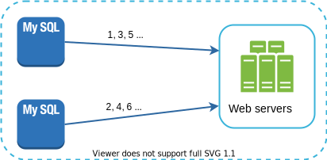
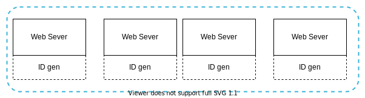
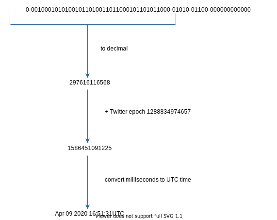

# 08 Design A Unique ID Generator In Distributed Systems

In this chapter, you are asked to design a unique ID generator in distributed systems. Your first thought might be to use a primary key with the *auto_increment* attribute in a traditional database. However, *auto_increment* does not work in a distributed environment because a single database server is not large enough and generating unique IDs across multiple databases with minimal delay is challenging.

Here are a few examples of unique IDs:

**Figure 1**

## Step 1 - Understand the problem and establish design scope

Asking clarification questions is the first step to tackle any system design interview question. Here is an example of candidate-interviewer interaction:

**Candidate:** What are the characteristics of unique IDs?

**Interviewer:** IDs must be unique and sortable.

**Candidate:** For each new record, does ID increment by 1?

**Interviewer:** The ID increments by time but not necessarily only increments by 1. IDs created in the evening are larger than those created in the morning on the same day.

**Candidate:** Do IDs only contain numerical values?

**Interviewer:** Yes, that is correct.

**Candidate:** What is the ID length requirement?

**Interviewer:** IDs should fit into 64-bit.

**Candidate:** What is the scale of the system?

**Interviewer:** The system should be able to generate 10,000 IDs per second.

Above are some of the sample questions that you can ask your interviewer. It is important to understand the requirements and clarify ambiguities. For this interview question, the requirements are listed as follows:

- IDs must be unique.
- IDs are numerical values only.
- IDs fit into 64-bit.
- IDs are ordered by date.
- Ability to generate over 10,000 unique IDs per second.

## Step 2 - Propose high-level design and get buy-in

Multiple options can be used to generate unique IDs in distributed systems. The options we considered are:

- Multi-master replication
- Universally unique identifier (UUID)
- Ticket server
- Twitter snowflake approach

Let us look at each of them, how they work, and the pros/cons of each option.

### Multi-master replication

As shown in Figure 2, the first approach is multi-master replication.

**Figure 2**

This approach uses the databases' *auto_increment* feature. Instead of increasing the next ID by 1, we increase it by *k*, where *k* is the number of database servers in use. As illustrated in Figure 2, next ID to be generated is equal to the previous ID in the same server plus 2. This solves some scalability issues because IDs can scale with the number of database servers. However, this strategy has some major drawbacks:

- Hard to scale with multiple data centers
- IDs do not go up with time across multiple servers.
- It does not scale well when a server is added or removed.

### UUID

A UUID is another easy way to obtain unique IDs. UUID is a 128-bit number used to identify information in computer systems. UUID has a very low probability of getting collusion. Quoted from Wikipedia, "after generating 1 billion UUIDs every second for approximately 100 years would the probability of creating a single duplicate reach 50%" [1].

Here is an example of UUID: *09c93e62-50b4-468d-bf8a-c07e1040bfb2*. UUIDs can be generated independently without coordination between servers. Figure 3 presents the UUIDs design.

**Figure 3**

In this design, each web server contains an ID generator, and a web server is responsible for generating IDs independently.

**Pros:**

- Generating UUID is simple. No coordination between servers is needed so there will not be any synchronization issues.
- The system is easy to scale because each web server is responsible for generating IDs they consume. ID generator can easily scale with web servers.

**Cons:**

- IDs are 128 bits long, but our requirement is 64 bits.
- IDs do not go up with time.
- IDs could be non-numeric.

### Ticket Server

Ticket servers are another interesting way to generate unique IDs. Flicker developed ticket servers to generate distributed primary keys [2]. It is worth mentioning how the system works.

**Figure 4**

The idea is to use a centralized *auto_increment* feature in a single database server (Ticket Server). To learn more about this, refer to flicker's engineering blog article [2].

**Pros:**

- Numeric IDs.
- It is easy to implement, and it works for small to medium-scale applications.

**Cons:**

- Single point of failure. Single ticket server means if the ticket server goes down, all systems that depend on it will face issues. To avoid a single point of failure, we can set up multiple ticket servers. However, this will introduce new challenges such as data synchronization.

### Twitter snowflake approach

Approaches mentioned above give us some ideas about how different ID generation systems work. However, none of them meet our specific requirements; thus, we need another approach. Twitter's unique ID generation system called "snowflake" [3] is inspiring and can satisfy our requirements.

Divide and conquer is our friend. Instead of generating an ID directly, we divide an ID into different sections. Figure 5 shows the layout of a 64-bit ID.

**Figure 5**

Each section is explained below.

- **Sign bit:** 1 bit. It will always be 0. This is reserved for future uses. It can potentially be used to distinguish between signed and unsigned numbers.

- **Timestamp:** 41 bits. Milliseconds since the epoch or custom epoch. We use Twitter snowflake default epoch 1288834974657, equivalent to Nov 04, 2010, 01:42:54 UTC.

- **Datacenter ID:** 5 bits, which gives us *2 ^ 5 = 32* datacenters.

- **Machine ID:** 5 bits, which gives us *2 ^ 5 = 32* machines per datacenter.

- **Sequence number:** 12 bits. For every ID generated on that machine/process, the sequence number is incremented by 1. The number is reset to 0 every millisecond.

## Step 3 - Design deep dive

In the high-level design, we discussed various options to design a unique ID generator in distributed systems. We settle on an approach that is based on the Twitter snowflake ID generator. Let us dive deep into the design. To refresh our memory, the design diagram is relisted below.

**Figure 6**

Datacenter IDs and machine IDs are chosen at the startup time, generally fixed once the system is up running. Any changes in datacenter IDs and machine IDs require careful review since an accidental change in those values can lead to ID conflicts. Timestamp and sequence numbers are generated when the ID generator is running.

### Timestamp

The most important 41 bits make up the timestamp section. As timestamps grow with time, IDs are sortable by time. Figure 7 shows an example of how binary representation is converted to UTC. You can also convert UTC back to binary representation using a similar method.

**Figure 7**

The maximum timestamp that can be represented in 41 bits is

*2 ^ 41 - 1 = 2199023255551* milliseconds (ms), which gives us: ~ 69 years = *2199023255551 ms / 1000 / 365 days / 24 hours/ 3600 seconds*. This means the ID generator will work for 69 years and having a custom epoch time close to today's date delays the overflow time. After 69 years, we will need a new epoch time or adopt other techniques to migrate IDs.

### Sequence number

Sequence number is 12 bits, which give us 2 ^ 12 = 4096 combinations. This field is 0 unless more than one ID is generated in a millisecond on the same server. In theory, a machine can support a maximum of 4096 new IDs per millisecond.

## Step 4 - Wrap up

In this chapter, we discussed different approaches to design a unique ID generator: multi-master replication, UUID, ticket server, and Twitter snowflake-like unique ID generator. We settle on snowflake as it supports all our use cases and is scalable in a distributed environment.

If there is extra time at the end of the interview, here are a few additional talking points:

- **Clock synchronization.** In our design, we assume ID generation servers have the same clock. This assumption might not be true when a server is running on multiple cores. The same challenge exists in multi-machine scenarios. Solutions to clock synchronization are out of the scope of this course; however, it is important to understand the problem exists. Network Time Protocol is the most popular solution to this problem. For interested readers, refer to the reference material [4].

- **Section length tuning.** For example, fewer sequence numbers but more timestamp bits are effective for low concurrency and long-term applications.

- **High availability.** Since an ID generator is a mission-critical system, it must be highly available.

Congratulations on getting this far! Now give yourself a pat on the back. Good job!

## Reference materials

[1] Universally unique identifier: https://en.wikipedia.org/wiki/Universally_unique_identifier

[2] Ticket Servers: Distributed Unique Primary Keys on the Cheap: https://code.flickr.net/2010/02/08/ticket-servers-distributed-unique-primary-keys-on-the-cheap/

[3] Announcing Snowflake: https://blog.twitter.com/engineering/en_us/a/2010/announcing-snowflake.html

[4] Network time protocol: https://en.wikipedia.org/wiki/Network_Time_Protocol

