# 14 Design A Search Autocomplete System

When searching on Google or shopping at Amazon, as you type in the search box, one or more matches for the search term are presented to you. This feature is referred to as autocomplete, typeahead, search-as-you-type, or incremental search. Figure 1 presents an example of a Google search showing a list of autocompleted results when "dinner" is typed into the search box. Search autocomplete is an important feature of many products. This leads us to the interview question: design a search autocomplete system, also called "design top k" or "design top k most searched queries".

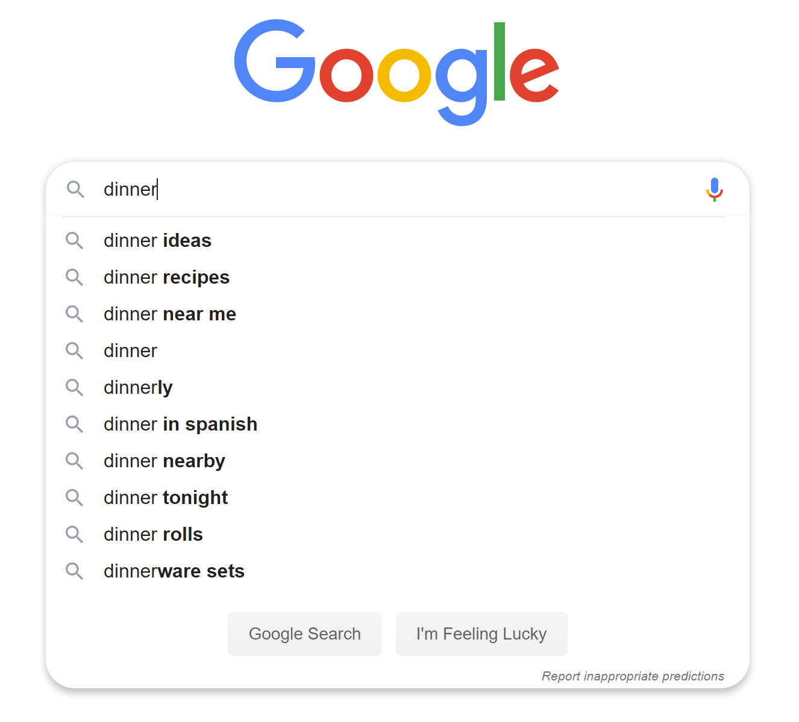

**Figure 1**

## Step 1 - Understand the problem and establish design scope

The first step to tackle any system design interview question is to ask enough questions to clarify requirements. Here is an example of candidate-interviewer interaction:

**Candidate:** Is the matching only supported at the beginning of a search query or in the middle as well?

**Interviewer:** Only at the beginning of a search query.

**Candidate:** How many autocomplete suggestions should the system return?

**Interviewer:** 5

**Candidate:** How does the system know which 5 suggestions to return?

**Interviewer:** This is determined by popularity, decided by the historical query frequency.

**Candidate:** Does the system support spell check?

**Interviewer:** No, spell check or autocorrect is not supported.

**Candidate:** Are search queries in English?

**Interviewer:** Yes. If time allows at the end, we can discuss multi-language support.

**Candidate:** Do we allow capitalization and special characters?

**Interviewer:** No, we assume all search queries have lowercase alphabetic characters.

**Candidate:** How many users use the product?

**Interviewer:** 10 million DAU.

### Requirements

Here is a summary of the requirements:

- **Fast response time:** As a user types a search query, autocomplete suggestions must show up fast enough. An article about Facebook's autocomplete system [1] reveals that the system needs to return results within 100 milliseconds. Otherwise it will cause stuttering.

- **Relevant:** Autocomplete suggestions should be relevant to the search term.

- **Sorted:** Results returned by the system must be sorted by popularity or other ranking models.

- **Scalable:** The system can handle high traffic volume.

- **Highly available:** The system should remain available and accessible when part of the system is offline, slows down, or experiences unexpected network errors.

### Back of the envelope estimation

- Assume 10 million daily active users (DAU).
- An average person performs 10 searches per day.
- 20 bytes of data per query string:
  - Assume we use ASCII character encoding. 1 character = 1 byte
  - Assume a query contains 4 words, and each word contains 5 characters on average.
  - That is 4 x 5 = 20 bytes per query.
- For every character entered into the search box, a client sends a request to the backend for autocomplete suggestions. On average, 20 requests are sent for each search query. For example, the following 6 requests are sent to the backend by the time you finish typing "dinner".
  - `search?q=d`
  - `search?q=di`
  - `search?q=din`
  - `search?q=dinn`
  - `search?q=dinne`
  - `search?q=dinner`
- ~24,000 query per second (QPS) = 10,000,000 users * 10 queries / day * 20 characters / 24 hours / 3600 seconds.
- **Peak QPS** = QPS * 2 = ~48,000
- Assume 20% of the daily queries are new. 10 million * 10 queries / day * 20 byte per query * 20% = 0.4 GB. This means 0.4GB of new data is added to storage daily.

## Step 2 - Propose high-level design and get buy-in

At the high-level, the system is broken down into two:

- **Data gathering service:** It gathers user input queries and aggregates them in real-time. Real-time processing is not practical for large data sets; however, it is a good starting point. We will explore a more realistic solution in deep dive.

- **Query service:** Given a search query or prefix, return 5 most frequently searched terms.

### Data gathering service

Let us use a simplified example to see how data gathering service works. Assume we have a frequency table that stores the query string and its frequency as shown in Figure 2. In the beginning, the frequency table is empty. Later, users enter queries "twitch", "twitter", "twitter," and "twillo" sequentially. Figure 2 shows how the frequency table is updated.

**Figure 2**

### Query service

Assume we have a frequency table as shown in Table 1. It has two fields.

- **Query:** it stores the query string.
- **Frequency:** it represents the number of times a query has been searched.

| Query | Frequency |
|-------|-----------|
| twitter | 35 |
| twitch | 29 |
| twilight | 25 |
| twin peak | 21 |
| twitch prime | 18 |
| twitter search | 14 |
| twillo | 10 |
| twin peak sf | 8 |

**Table 1**

When a user types "tw" in the search box, the following top 5 searched queries are displayed (Figure 3), assuming the frequency table is based on Table 1.

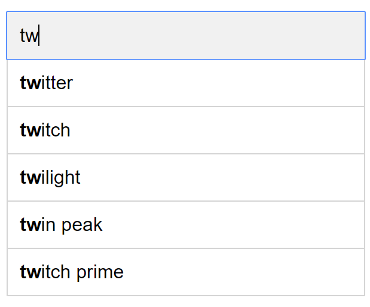

**Figure 3**

To get top 5 frequently searched queries, execute the following SQL query:

**Figure 4**

This is an acceptable solution when the data set is small. When it is large, accessing the database becomes a bottleneck. We will explore optimizations in deep dive.

## Step 3 - Design deep dive

In the high-level design, we discussed data gathering service and query service. The high-level design is not optimal, but it serves as a good starting point. In this section, we will dive deep into a few components and explore optimizations as follows:

- Trie data structure
- Data gathering service
- Query service
- Scale the storage
- Trie operations

### Trie data structure

Relational databases are used for storage in the high-level design. However, fetching the top 5 search queries from a relational database is inefficient. The data structure trie (prefix tree) is used to overcome the problem. As trie data structure is crucial for the system, we will dedicate significant time to design a customized trie. Please note that some of the ideas are from articles [2] and [3].

Understanding the basic trie data structure is essential for this interview question. However, this is more of a data structure question than a system design question. Besides, many online materials explain this concept. In this chapter, we will only discuss an overview of the trie data structure and focus on how to optimize the basic trie to improve response time.

Trie (pronounced "try") is a tree-like data structure that can compactly store strings. The name comes from the word retrieval, which indicates it is designed for string retrieval operations. The main idea of trie consists of the following:

- A trie is a tree-like data structure.
- The root represents an empty string.
- Each node stores a character and has 26 children, one for each possible character. To save space, we do not draw empty links.
- Each tree node represents a single word or a prefix string.

Figure 5 shows a trie with search queries "tree", "try", "true", "toy", "wish", "win". Search queries are highlighted with a thicker border.

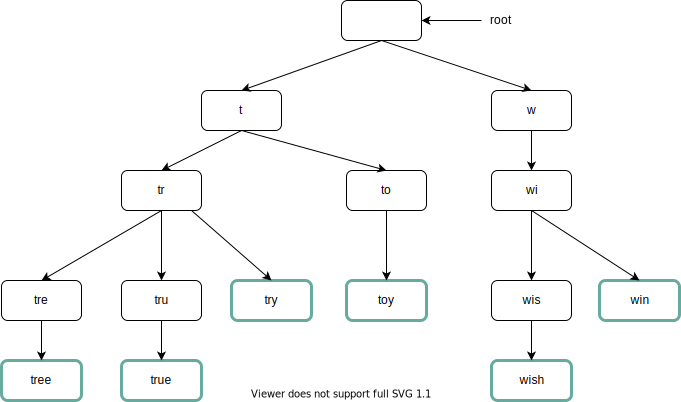

**Figure 5**

Basic trie data structure stores characters in nodes. To support sorting by frequency, frequency info needs to be included in nodes. Assume we have the following frequency table.

| Query | Frequency |
|-------|-----------|
| tree | 10 |
| try | 29 |
| true | 35 |
| toy | 14 |
| wish | 25 |
| win | 50 |

**Table 2**

After adding frequency info to nodes, updated trie data structure is shown in Figure 6.

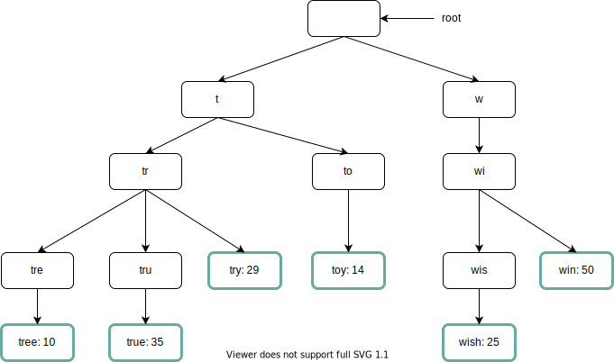

**Figure 6**

How does autocomplete work with trie? Before diving into the algorithm, let us define some terms.

- `p`: length of a prefix
- `n`: total number of nodes in a trie
- `c`: number of children of a given node

Steps to get top k most searched queries are listed below:

1. Find the prefix. Time complexity: O(p).

2. Traverse the subtree from the prefix node to get all valid children. A child is valid if it can form a valid query string. Time complexity: O(c)

3. Sort the children and get top k. Time complexity: O(clogc)

Let us use an example as shown in Figure 7 to explain the algorithm. Assume k equals to 2 and a user types "tr" in the search box. The algorithm works as follows:

**Step 1:** Find the prefix node "tr".

**Step 2:** Traverse the subtree to get all valid children. In this case, nodes [tree: 10], [true: 35], [try: 29] are valid.

**Step 3:** Sort the children and get top 2. [true: 35] and [try: 29] are the top 2 queries with prefix "tr".

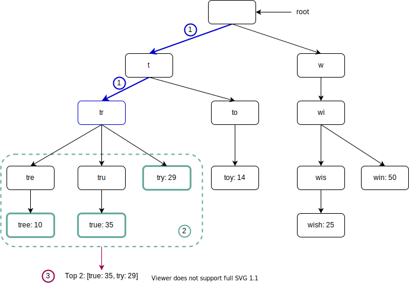

**Figure 7**

The time complexity of this algorithm is the sum of time spent on each step mentioned above: O(p) + O(c) + O(clogc)

The above algorithm is straightforward. However, it is too slow because we need to traverse the entire trie to get top k results in the worst-case scenario. Below are two optimizations:

1. Limit the max length of a prefix
2. Cache top search queries at each node

Let us look at these optimizations one by one.

#### Limit the max length of a prefix

Users rarely type a long search query into the search box. Thus, it is safe to say p is a small integer number, say 50. If we limit the length of a prefix, the time complexity for "Find the prefix" can be reduced from O(p) to O(small constant), aka O(1).

#### Cache top search queries at each node

To avoid traversing the whole trie, we store top k most frequently used queries at each node. Since 5 to 10 autocomplete suggestions are enough for users, k is a relatively small number. In our specific case, only the top 5 search queries are cached.

By caching top search queries at every node, we significantly reduce the time complexity to retrieve the top 5 queries. However, this design requires a lot of space to store top queries at every node. Trading space for time is well worth it as fast response time is very important.

Figure 8 shows the updated trie data structure. Top 5 queries are stored on each node. For example, the node with prefix "be" stores the following: [best: 35, bet: 29, bee: 20, be: 15, beer: 10].

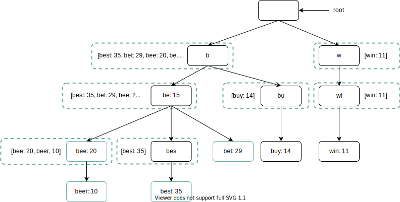

**Figure 8**

Let us revisit the time complexity of the algorithm after applying those two optimizations:

1. Find the prefix node. Time complexity: O(1)
2. Return top k. Since top k queries are cached, the time complexity for this step is O(1).

As the time complexity for each of the steps is reduced to O(1), our algorithm takes only O(1) to fetch top k queries.

### Data gathering service

In our previous design, whenever a user types a search query, data is updated in real-time. This approach is not practical for the following two reasons:

- Users may enter billions of queries per day. Updating the trie on every query significantly slows down the query service.
- Top suggestions may not change much once the trie is built. Thus, it is unnecessary to update the trie frequently.

To design a scalable data gathering service, we examine where data comes from and how data is used. Real-time applications like Twitter require up to date autocomplete suggestions. However, autocomplete suggestions for many Google keywords might not change much on a daily basis.

Despite the differences in use cases, the underlying foundation for data gathering service remains the same because data used to build the trie is usually from analytics or logging services.

Figure 9 shows the redesigned data gathering service. Each component is examined one by one.

**Figure 9**

- **Analytics Logs.** It stores raw data about search queries. Logs are append-only and are not indexed. Table 3 shows an example of the log file.

| query | time |
|-------|------|
| tree | 2019-10-01 22:01:01 |
| try | 2019-10-01 22:01:05 |
| tree | 2019-10-01 22:01:30 |
| toy | 2019-10-01 22:02:22 |
| tree | 2019-10-02 22:02:42 |
| try | 2019-10-03 22:03:03 |

**Table 3**

- **Aggregators.** The size of analytics logs is usually very large, and data is not in the right format. We need to aggregate data so it can be easily processed by our system.

Depending on the use case, we may aggregate data differently. For real-time applications such as Twitter, we aggregate data in a shorter time interval as real-time results are important. On the other hand, aggregating data less frequently, say once per week, might be good enough for many use cases. During an interview session, verify whether real-time results are important. We assume trie is rebuilt weekly.

- **Aggregated Data.**

Table 4 shows an example of aggregated weekly data. "time" field represents the start time of a week. "frequency" field is the sum of the occurrences for the corresponding query in that week.

| query | time | frequency |
|-------|------|-----------|
| tree | 2019-10-01 | 12000 |
| tree | 2019-10-08 | 15000 |
| tree | 2019-10-15 | 9000 |
| toy | 2019-10-01 | 8500 |
| toy | 2019-10-08 | 6256 |
| toy | 2019-10-15 | 8866 |

**Table 4**

- **Workers.** Workers are a set of servers that perform asynchronous jobs at regular intervals. They build the trie data structure and store it in Trie DB.

- **Trie Cache.** Trie Cache is a distributed cache system that keeps trie in memory for fast read. It takes a weekly snapshot of the DB.

- **Trie DB.** Trie DB is the persistent storage. Two options are available to store the data:

  1. **Document store:** Since a new trie is built weekly, we can periodically take a snapshot of it, serialize it, and store the serialized data in the database. Document stores like MongoDB [4] are good fits for serialized data.

  2. **Key-value store:** A trie can be represented in a hash table form [4] by applying the following logic:
     - Every prefix in the trie is mapped to a key in a hash table.
     - Data on each trie node is mapped to a value in a hash table.

Figure 10 shows the mapping between the trie and hash table.

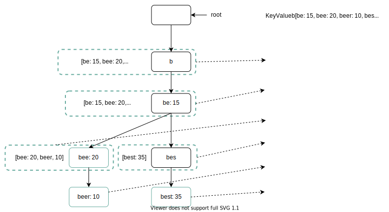

**Figure 10**

In Figure 10, each trie node on the left is mapped to the <key, value> pair on the right. If you are unclear how key-value stores work, refer to the "Design a key-value store" chapter.

### Query service

In the high-level design, query service calls the database directly to fetch the top 5 results. Figure 11 shows the improved design as previous design is inefficient.

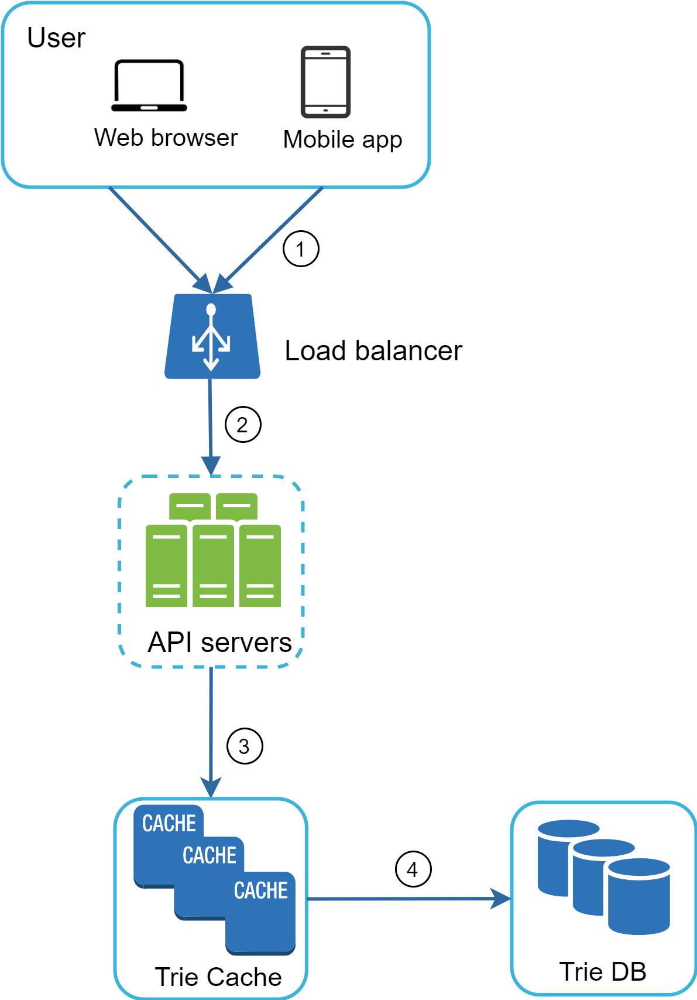

**Figure 11**

1. A search query is sent to the load balancer.

2. The load balancer routes the request to API servers.

3. API servers get trie data from Trie Cache and construct autocomplete suggestions for the client.

4. In case the data is not in Trie Cache, we replenish data back to the cache. This way, all subsequent requests for the same prefix are returned from the cache. A cache miss can happen when a cache server is out of memory or offline.

Query service requires lightning-fast speed. We propose the following optimizations:

- **AJAX request.** For web applications, browsers usually send AJAX requests to fetch autocomplete results. The main benefit of AJAX is that sending/receiving a request/response does not refresh the whole web page.

- **Browser caching.** For many applications, autocomplete search suggestions may not change much within a short time. Thus, autocomplete suggestions can be saved in browser cache to allow subsequent requests to get results from the cache directly. Google search engine uses the same cache mechanism. Figure 12 shows the response header when you type "system design interview" on the Google search engine. As you can see, Google caches the results in the browser for 1 hour. Please note: "private" in cache-control means results are intended for a single user and must not be cached by a shared cache. "max-age=3600" means the cache is valid for 3600 seconds, aka, an hour.

**Figure 12**

- **Data sampling:** For a large-scale system, logging every search query requires a lot of processing power and storage. Data sampling is important. For instance, only 1 out of every N requests is logged by the system.

### Trie operations

Trie is a core component of the autocomplete system. Let us look at how trie operations (create, update, and delete) work.

#### Create

Trie is created by workers using aggregated data. The source of data is from Analytics Log/DB.

#### Update

There are two ways to update the trie.

**Option 1:** Update the trie weekly. Once a new trie is created, the new trie replaces the old one.

**Option 2:** Update individual trie node directly. We try to avoid this operation because it is slow. However, if the size of the trie is small, it is an acceptable solution. When we update a trie node, its ancestors all the way up to the root must be updated because ancestors store top queries of children. Figure 13 shows an example of how the update operation works. On the left side, the search query "beer" has the original value 10. On the right side, it is updated to 30. As you can see, the node and its ancestors have the "beer" value updated to 30.

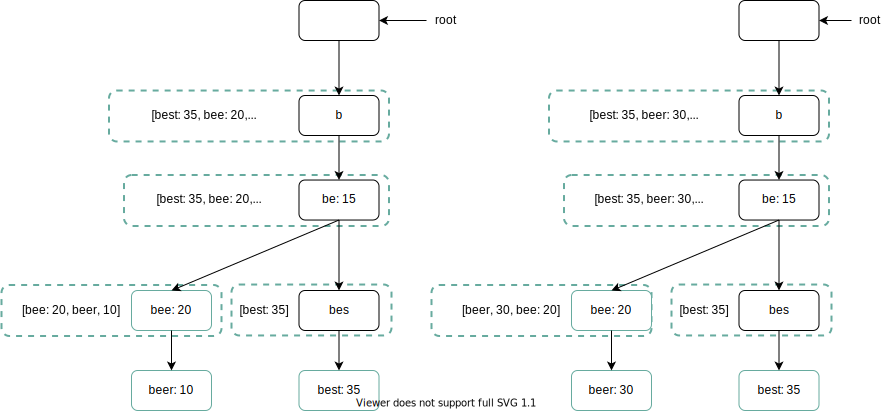

**Figure 13**

#### Delete

We have to remove hateful, violent, sexually explicit, or dangerous autocomplete suggestions. We add a filter layer (Figure 14) in front of the Trie Cache to filter out unwanted suggestions. Having a filter layer gives us the flexibility of removing results based on different filter rules. Unwanted suggestions are removed physically from the database asynchronically so the correct data set will be used to build trie in the next update cycle.

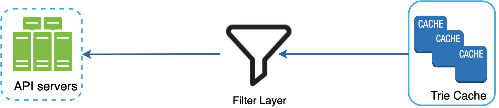

**Figure 14**

### Scale the storage

Now that we have developed a system to bring autocomplete queries to users, it is time to solve the scalability issue when the trie grows too large to fit in one server.

Since English is the only supported language, a naive way to shard is based on the first character. Here are some examples.

- If we need two servers for storage, we can store queries starting with 'a' to 'm' on the first server, and 'n' to 'z' on the second server.
- If we need three servers, we can split queries into 'a' to 'i', 'j' to 'r' and 's' to 'z'.

Following this logic, we can split queries up to 26 servers because there are 26 alphabetic characters in English. Let us define sharding based on the first character as first level sharding. To store data beyond 26 servers, we can shard on the second or even at the third level. For example, data queries that start with 'a' can be split into 4 servers: 'aa-ag', 'ah-an', 'ao-au', and 'av-az'.

At the first glance this approach seems reasonable, until you realize that there are a lot more words that start with the letter 'c' than 'x'. This creates uneven distribution.

To mitigate the data imbalance problem, we analyze historical data distribution pattern and apply smarter sharding logic as shown in Figure 15. The shard map manager maintains a lookup database for identifying where rows should be stored. For example, if there are a similar number of historical queries for 's' and for 'u', 'v', 'w', 'x', 'y' and 'z' combined, we can maintain two shards: one for 's' and one for 'u' to 'z'.

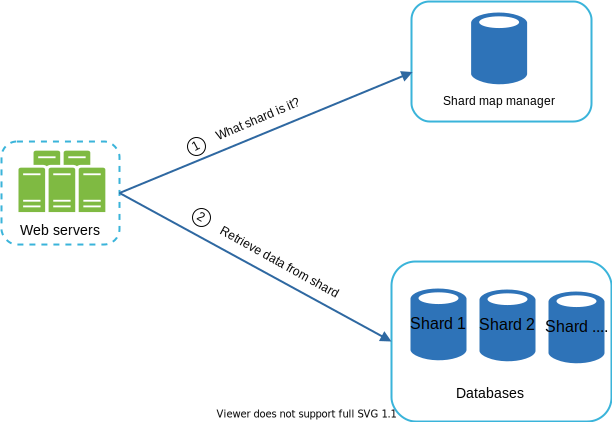

**Figure 15**

## Step 4 - Wrap up

After you finish the deep dive, your interviewer might ask you some follow up questions.

**Interviewer:** How do you extend your design to support multiple languages?

To support other non-English queries, we store Unicode characters in trie nodes. If you are not familiar with Unicode, here is the definition: "an encoding standard covers all the characters for all the writing systems of the world, modern and ancient" [5].

**Interviewer:** What if top search queries in one country are different from others?

In this case, we might build different tries for different countries. To improve the response time, we can store tries in CDNs.

**Interviewer:** How can we support the trending (real-time) search queries?

Assuming a news event breaks out, a search query suddenly becomes popular. Our original design will not work because:

- Offline workers are not scheduled to update the trie yet because this is scheduled to run on weekly basis.
- Even if it is scheduled, it takes too long to build the trie.

Building a real-time search autocomplete is complicated and is beyond the scope of this course so we will only give a few ideas:

- Reduce the working data set by sharding.
- Change the ranking model and assign more weight to recent search queries.
- Data may come as streams, so we do not have access to all the data at once. Streaming data means data is generated continuously. Stream processing requires a different set of systems: Apache Hadoop MapReduce [6], Apache Spark Streaming [7], Apache Storm [8], Apache Kafka [9], etc. Because all those topics require specific domain knowledge, we are not going into detail here.

Congratulations on getting this far! Now give yourself a pat on the back. Good job!

## Reference materials

[1] The Life of a Typeahead Query: https://www.facebook.com/notes/facebook-engineering/the-life-of-a-typeahead-query/389105248919/

[2] How We Built Prefixy: A Scalable Prefix Search Service for Powering Autocomplete: https://medium.com/@prefixyteam/how-we-built-prefixy-a-scalable-prefix-search-service-for-powering-autocomplete-c20f98e2eff1

[3] Prefix Hash Tree An Indexing Data Structure over Distributed Hash Tables: https://people.eecs.berkeley.edu/~sylvia/papers/pht.pdf

[4] MongoDB wikipedia: https://en.wikipedia.org/wiki/MongoDB

[5] Unicode frequently asked questions: https://www.unicode.org/faq/basic_q.html

[6] Apache hadoop: https://hadoop.apache.org/

[7] Spark streaming: https://spark.apache.org/streaming/

[8] Apache storm: https://storm.apache.org/

[9] Apache kafka: https://kafka.apache.org/documentation/

