# 17 - Proximity Service

In this chapter, we design a proximity service. A proximity service is used to discover nearby places such as restaurants, hotels, theaters, museums, etc., and is a core component that powers features like finding the best restaurants nearby on Yelp or finding k-nearest gas stations on Google Maps. Figure 1 shows the user interface via which you can search for nearby restaurants on Yelp [1]. Note the map tiles used in this chapter are from Stamen Design [2] and data are from OpenStreetMap [3].

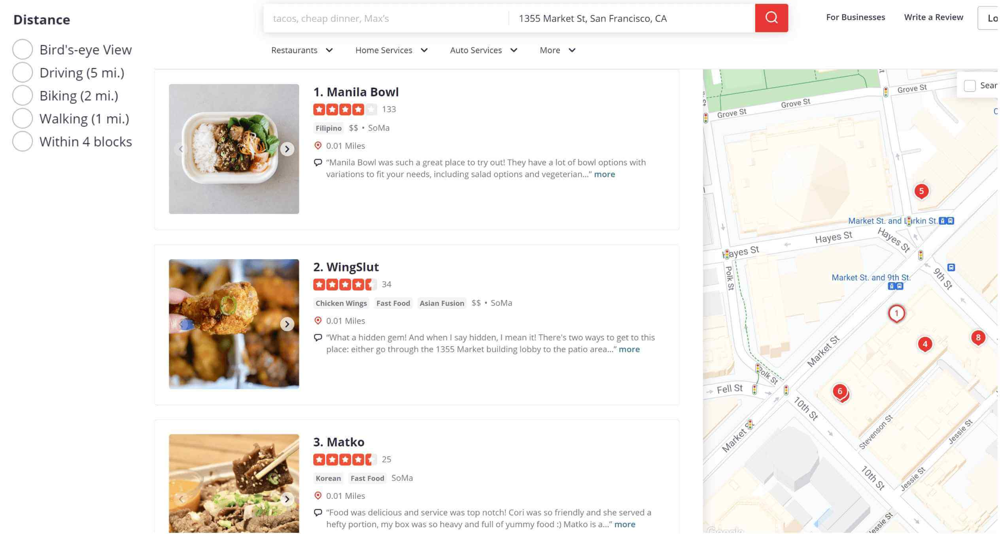

*Figure 1: Nearby search on Yelp (Source: [1])*

## Step 1 - Understand the Problem and Establish Design Scope

Yelp supports many features and it is not feasible to design all of them in an interview session, so it's important to narrow down the scope by asking questions. The interactions between the interviewer and the candidate could look like this:

**Candidate:** Can a user specify the search radius? If there are not enough businesses within the search radius, does the system expand the search?

**Interviewer:** That's a great question. Let's assume we only care about businesses within a specified radius. If time allows, we can then discuss how to expand the search if there are not enough businesses within the radius.

**Candidate:** What's the maximal radius allowed? Can I assume it's 20 km (12.5 miles)?

**Interviewer:** That's a reasonable assumption.

**Candidate:** Can a user change the search radius on the UI?

**Interviewer:** Yes, we have the following options: 0.5km (0.31 mile), 1km (0.62 mile), 2km (1.24 mile), 5km (3.1 mile), and 20km (12.42 mile).

**Candidate:** How does business information get added, deleted, or updated? Do we need to reflect these operations in real-time?

**Interviewer:** Business owners can add, delete or update a business. Assume we have a business agreement upfront that newly added/updated businesses will be effective the next day.

**Candidate:** A user might be moving while using the app/website, so the search results could be slightly different after a while. Do we need to refresh the page to keep the results up to date?

**Interviewer:** Let's assume a user's moving speed is slow and we don't need to constantly refresh the page.

### Functional requirements

Based on this conversation, we focus on 3 key features:

1. Return all businesses based on a user's location (latitude and longitude pair) and radius.
2. Business owners can add, delete or update a business, but this information doesn't need to be reflected in real-time.
3. Customers can view detailed information about a business.

### Non-functional requirements

From the business requirements, we can infer a list of non-functional requirements. You should also check these with the interviewer.

- **Low latency.** Users should be able to see nearby businesses quickly.
- **Data privacy.** Location info is sensitive data. When we design a location-based service (LBS), we should always take user privacy into consideration. We need to comply with data privacy laws like General Data Protection Regulation (GDPR) [4] and California Consumer Privacy Act (CCPA) [5], etc.
- **High availability and scalability requirements.** We should ensure our system can handle the spike in traffic during peak hours in densely populated areas.

## Back-of-the-envelope estimation

Let's take a look at some back-of-the-envelope calculations to determine the potential scale and challenges our solution will need to address. Assume we have 100 million daily active users and 200 million businesses.

### Calculate QPS

Seconds in a day = 24 * 60 * 60 = 86,400. We can round it up to 10^5 for easier calculation. 10^5 is used throughout this book to represent seconds in a day.

Assume a user makes 5 search queries per day.

**Search QPS = 100 million * 5 / 10^5 = 5,000**

## Step 2 - Propose High-Level Design and Get Buy-In

In this section, we discuss the following:

- API design
- High-level design
- Algorithms to find nearby businesses
- Data model

### API Design

We use the RESTful API convention to design a simplified version of the APIs.

#### GET /v1/search/nearby

This endpoint returns businesses based on certain search criteria. In real-life applications, search results are usually paginated. Pagination [6] is not the focus of this chapter but is worth mentioning during an interview.

**Request Parameters:**

| Field | Description | Type |
|-------|-------------|------|
| latitude | Latitude of a given location | decimal |
| longitude | Longitude of a given location | decimal |
| radius | Optional. Default is 5000 meters (about 3 miles) | int |

*Table 1: Request parameters*

**Response Body:**

```json
{
  "total": 10,
  "businesses": [{business object}]
}
```

The business object contains everything needed to render the search result page, but we may still need additional attributes such as pictures, reviews, star rating, etc., to render the business detail page. Therefore, when a user clicks on the business detail page, a new endpoint call to fetch the detailed information of a business is usually required.

#### APIs for a business

The APIs related to a business object are shown in the table below.

| API | Detail |
|-----|--------|
| GET /v1/businesses/{:id} | Return detailed information about a business |
| POST /v1/businesses | Add a business |
| PUT /v1/businesses/{:id} | Update details of a business |
| DELETE /v1/businesses/{:id} | Delete a business |

*Table 2: APIs for a business*

If you are interested in real-world APIs for place/business search, two examples are Google Places API [7] and Yelp Reservation API [8].

### Data model

In this section, we discuss the read/write ratio and the schema design. The scalability of the database is covered in deep dive.

#### Read/write ratio

Read volume is high because the following two features are very commonly used:

- Search for nearby businesses.
- View the detailed information of a business.

On the other hand, the write volume is low because adding, removing, and editing business info are infrequent operations.

For a read-heavy system, a relational database such as MySQL can be a good fit. Let's take a closer look at the schema design.

#### Data schema

The key database tables are the business table and the geospatial (geo) index table.

**Business table**

The business table contains detailed information about a business. It is shown in Table 3 and the primary key is business_id.

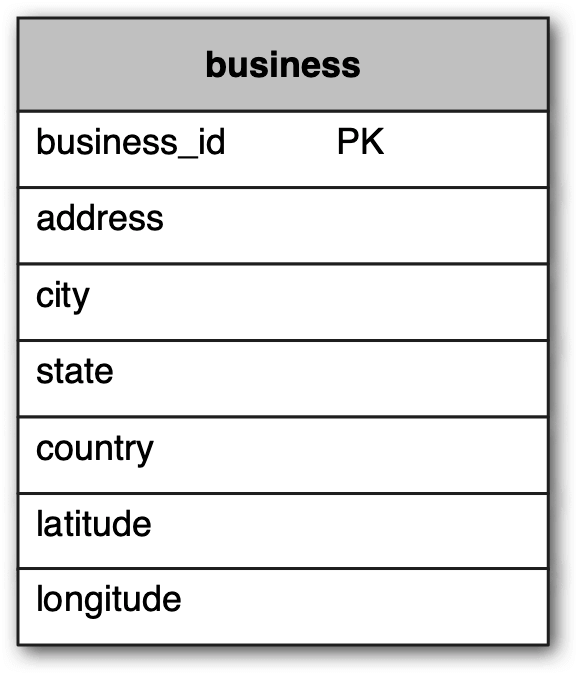

*Table 3: Business table*

**Geo index table**

A geo index table is used for the efficient processing of spatial operations. Since this table requires some knowledge about geohash, we will discuss it in the "Scale the database" section in deep dive.

### High-level design

The high-level design diagram is shown in Figure 2. The system comprises two parts: location-based service (LBS) and business-related service. Let's take a look at each component of the system.

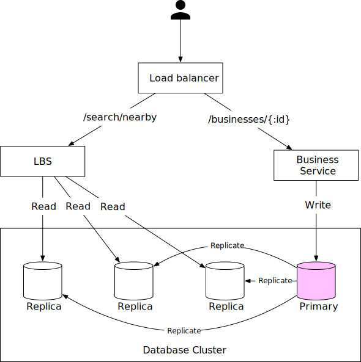

*Figure 2: High-level design*

- **Load balancer:** The load balancer automatically distributes incoming traffic across multiple services. Normally, a company provides a single DNS entry point and internally routes the API calls to the appropriate services based on the URL paths.

- **Location-based service (LBS):** The LBS service is the core part of the system which finds nearby businesses for a given radius and location. The LBS has the following characteristics:
  - It is a read-heavy service with no write requests.
  - QPS is high, especially during peak hours in dense areas.
  - This service is stateless so it's easy to scale horizontally.

- **Business service:** Business service mainly deals with two types of requests:
  - Business owners create, update, or delete businesses. Those requests are mainly write operations, and the QPS is not high.
  - Customers view detailed information about a business. QPS is high during peak hours.

- **Database cluster:** The database cluster can use the primary-secondary setup. In this setup, the primary database handles all the write operations, and multiple replicas are used for read operations. Data is saved to the primary database first and then replicated to replicas. Due to the replication delay, there might be some discrepancy between data read by the LBS and the data written to the primary database. This inconsistency is usually not an issue because business information doesn't need to be updated in real-time.

**Scalability of business service and LBS**

Both the business service and LBS are stateless services, so it's easy to automatically add more servers to accommodate peak traffic (e.g. mealtime) and remove servers during off-peak hours (e.g. sleep time). If the system operates on the cloud, we can set up different regions and availability zones to further improve availability [9]. We discuss this more in the deep dive.

### Algorithms to fetch nearby businesses

In real life, companies might use existing geospatial databases such as Geohash in Redis [10] or Postgres with PostGIS extension [11]. You are not expected to know the internals of those geospatial databases during an interview. It's better to demonstrate your problem-solving skills and technical knowledge by explaining how the geospatial index works, rather than to simply throw out database names.

The next step is to explore different options for fetching nearby businesses. We will list a few options, go over the thought process, and discuss trade-offs.

#### Option 1: Two-dimensional search

The most intuitive but naive way to get nearby businesses is to draw a circle with the predefined radius and find all the businesses within the circle as shown in Figure 3.

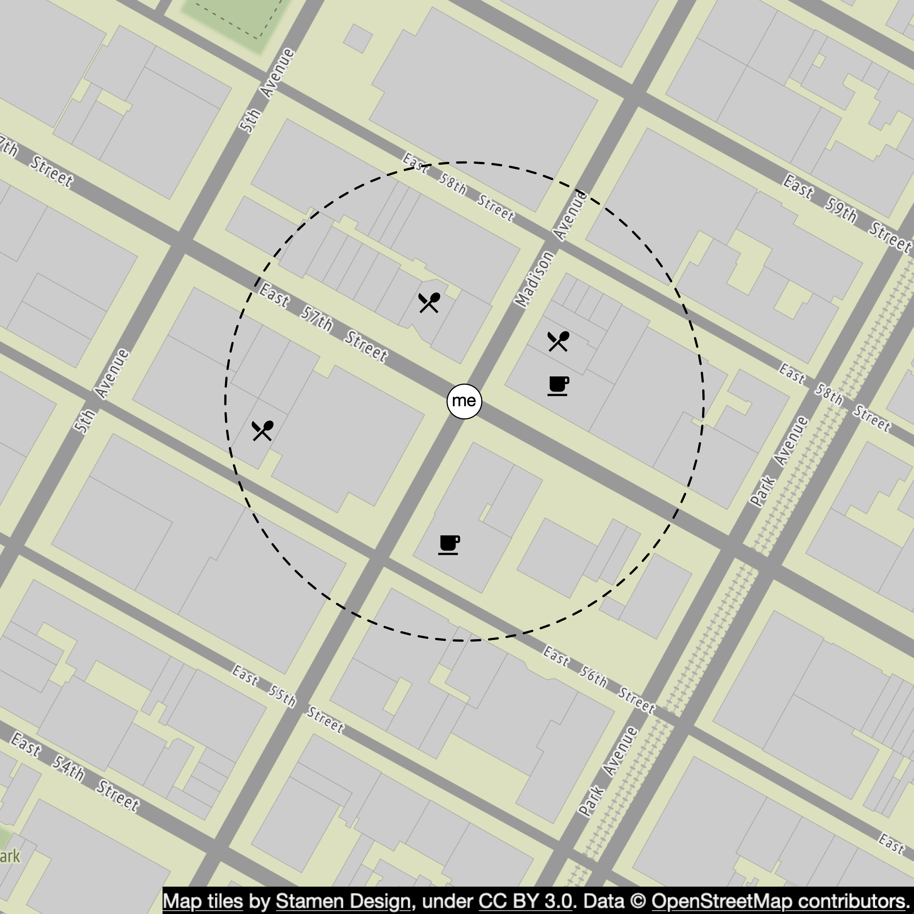

*Figure 3: Two dimensional search*

This process can be translated into the following pseudo SQL query:

```sql
SELECT business_id, latitude, longitude,
FROM business
WHERE (latitude BETWEEN {:my_lat} - radius AND {:my_lat} + radius) AND
      (longitude BETWEEN {:my_long} - radius AND {:my_long} + radius)
```

This query is not efficient because we need to scan the whole table. What if we build indexes on longitude and latitude columns? Would this improve the efficiency? The answer is not by much. The problem is that we have two-dimensional data and the dataset returned from each dimension could still be huge. For example, as shown in Figure 4, we can quickly retrieve dataset 1 and dataset 2, thanks to indexes on longitude and latitude columns. But to fetch businesses within the radius, we need to perform an intersect operation on those two datasets. This is not efficient because each dataset contains lots of data.

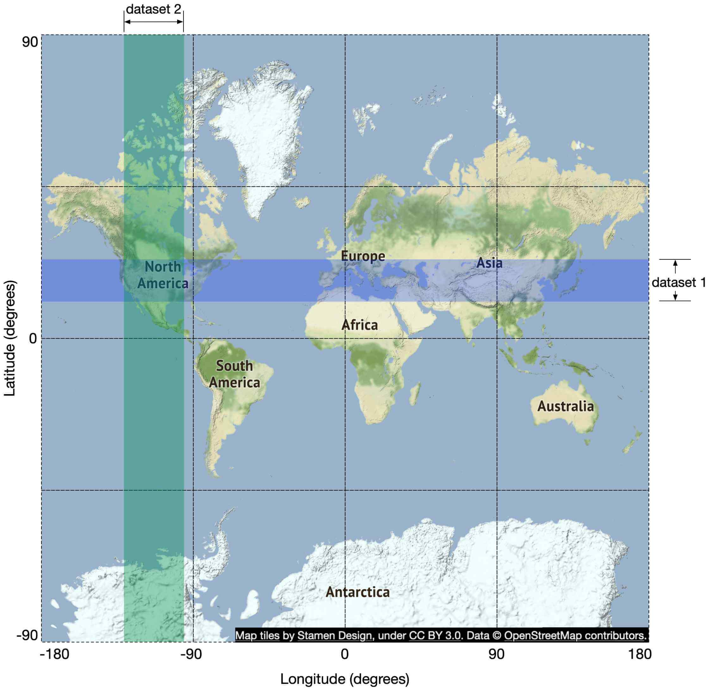

*Figure 4: Intersect two datasets*

The problem with the previous approach is that the database index can only improve search speed in one dimension. So naturally, the follow-up question is, can we map two-dimensional data to one dimension? The answer is yes.

Before we dive into the answers, let's take a look at different types of indexing methods. In a broad sense, there are two types of geospatial indexing approaches, as shown in Figure 5. The highlighted ones are the algorithms we discuss in detail because they are commonly used in the industry.

- **Hash:** even grid, geohash, cartesian tiers [12], etc.
- **Tree:** quadtree, Google S2, RTree [13], etc.

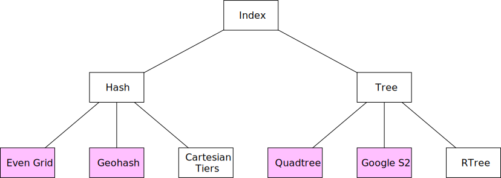

*Figure 5: Different types of geospatial indexes*

Even though the underlying implementations of those approaches are different, the high-level idea is the same, that is, to divide the map into smaller areas and build indexes for fast search. Among those, geohash, quadtree, and Google S2 are most widely used in real-world applications. Let's take a look at them one by one.

> **Reminder:** In a real interview, you usually don't need to explain the implementation details of indexing options. However, it is important to have some basic understanding of the need for geospatial indexing, how it works at a high level and also its limitations.

#### Option 2: Evenly divided grid

One simple approach is to evenly divide the world into small grids (Figure 6). This way, one grid could have multiple businesses, and each business on the map belongs to one grid.

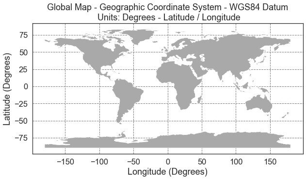

*Figure 6: Global map (source: [14])*

This approach works to some extent, but it has one major issue: the distribution of businesses is not even. There could be lots of businesses in downtown New York, while other grids in deserts or oceans have no business at all. By dividing the world into even grids, we produce a very uneven data distribution. Ideally, we want to use more granular grids for dense areas and large grids in sparse areas. Another potential challenge is to find neighboring grids of a fixed grid.

#### Option 3: Geohash

Geohash is better than the evenly divided grid option. It works by reducing the two-dimensional longitude and latitude data into a one-dimensional string of letters and digits. Geohash algorithms work by recursively dividing the world into smaller and smaller grids with each additional bit. Let's go over how geohash works at a high level.

First, divide the planet into four quadrants along with the prime meridian and equator.

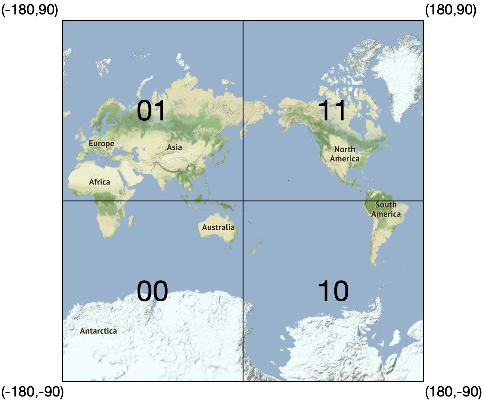

*Figure 7: Geohash*

- Latitude range [-90, 0] is represented by 0
- Latitude range [0, 90] is represented by 1
- Longitude range [-180, 0] is represented by 0
- Longitude range [0, 180] is represented by 1

Second, divide each grid into four smaller grids. Each grid can be represented by alternating between longitude bit and latitude bit.

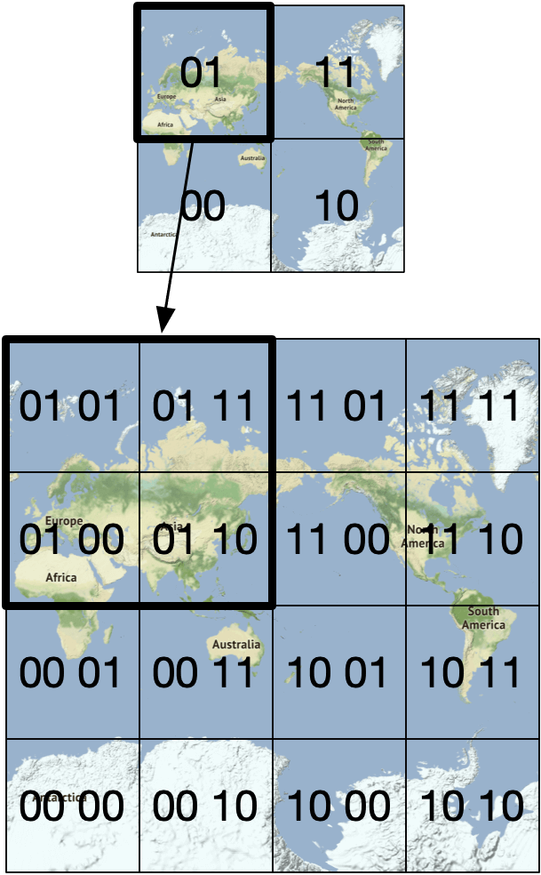

*Figure 8: Divide grid*

Repeat this subdivision until the grid size is within the precision desired. Geohash usually uses base32 representation [15]. Let's take a look at two examples.

- **Geohash of the Google headquarter (length = 6):**
  - `1001 10110 01001 10000 11011 11010` (base32 in binary) → `9q9hvu` (base32)

- **Geohash of the Facebook headquarter (length = 6):**
  - `1001 10110 01001 10001 10000 10111` (base32 in binary) → `9q9jhr` (base32)

Geohash has 12 precisions (also called levels) as shown in Table 4. The precision factor determines the size of the grid. We are only interested in geohashes with lengths between 4 and 6. This is because when it's longer than 6, the grid size is too small, while if it is smaller than 4, the grid size is too large (see Table 4).

| Geohash length | Grid width x height |
|----------------|---------------------|
| 1 | 5,009.4km x 4,992.6km (the size of the planet) |
| 2 | 1,252.3km x 624.1km |
| 3 | 156.5km x 156km |
| 4 | 39.1km x 19.5km |
| 5 | 4.9km x 4.9km |
| 6 | 1.2km x 609.4m |
| 7 | 152.9m x 152.4m |
| 8 | 38.2m x 19m |
| 9 | 4.8m x 4.8m |
| 10 | 1.2m x 59.5cm |
| 11 | 14.9cm x 14.9cm |
| 12 | 3.7cm x 1.9cm |

*Table 4: Geohash length to grid size mapping (source: [16])*

How do we choose the right precision? We want to find the minimal geohash length that covers the whole circle drawn by the user-defined radius. The corresponding relationship between the radius and the length of geohash is shown in the table below.

| Radius (Kilometers) | Geohash length |
|---------------------|----------------|
| 0.5 km (0.31 mile) | 6 |
| 1 km (0.62 mile) | 5 |
| 2 km (1.24 mile) | 5 |
| 5 km (3.1 mile) | 4 |
| 20 km (12.42 mile) | 4 |

*Table 5: Radius to geohash mapping*

This approach works great most of the time, but there are some edge cases with how the geohash boundary is handled that we should discuss with the interviewer.

**Boundary issues**

Geohashing guarantees that the longer a shared prefix is between two geohashes, the closer they are. As shown in Figure 9, all the grids have a shared prefix: 9q8zn.

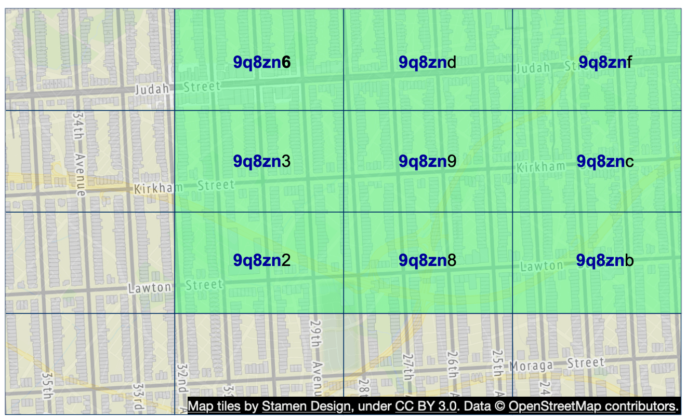

*Figure 9: Shared prefix*

**Boundary issue 1**

However, the reverse is not true: two locations can be very close but have no shared prefix at all. This is because two close locations on either side of the equator or prime meridian belong to different 'halves' of the world. For example, in France, La Roche-Chalais (geohash: u000) is just 30km from Pomerol (geohash: ezzz) but their geohashes have no shared prefix at all [17].

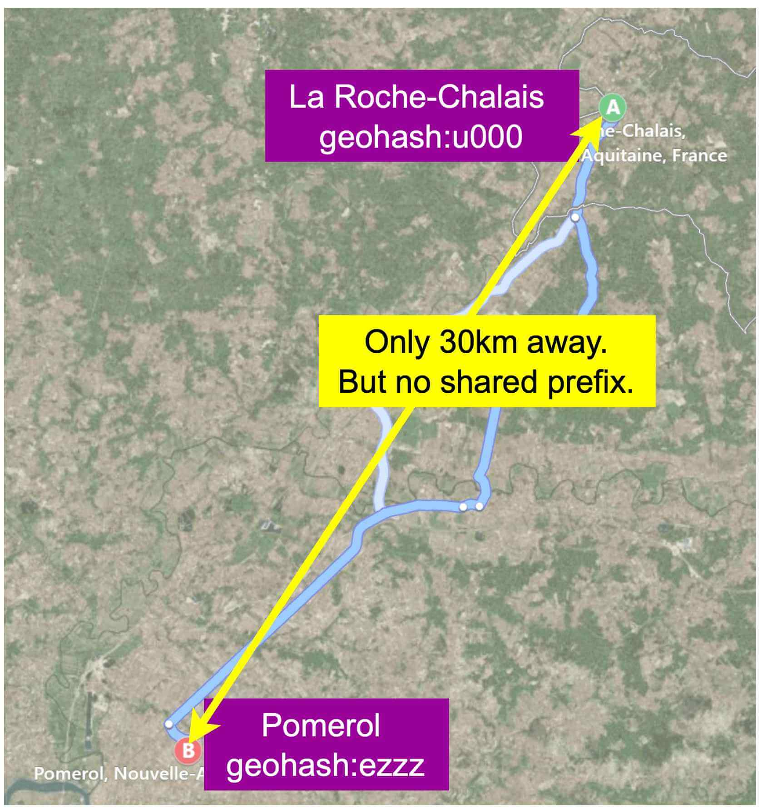

*Figure 10: No shared prefix*

Because of this boundary issue, a simple prefix SQL query below would fail to fetch all nearby businesses.

```sql
SELECT * FROM geohash_index WHERE geohash LIKE `9q8zn%`
```

**Boundary issue 2**

Another boundary issue is that two positions can have a long shared prefix, but they belong to different geohashes as shown in Figure 11.

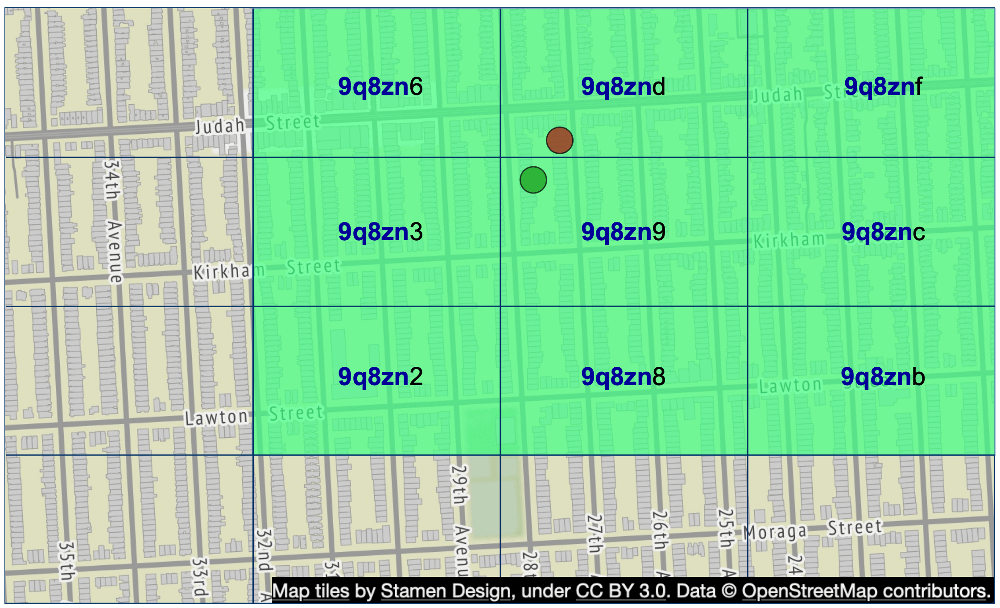

*Figure 11: Boundary issue*

A common solution is to fetch all businesses not only within the current grid but also from its neighbors. The geohashes of neighbors can be calculated in constant time and more details about this can be found here [17].

**Not enough businesses**

Now let's tackle the bonus question. What should we do if there are not enough businesses returned from the current grid and all the neighbors combined?

- **Option 1:** only return businesses within the radius. This option is easy to implement, but the drawback is obvious. It doesn't return enough results to satisfy a user's needs.

- **Option 2:** increase the search radius. We can remove the last digit of the geohash and use the new geohash to fetch nearby businesses. If there are not enough businesses, we continue to expand the scope by removing another digit. This way, the grid size is gradually expanded until the result is greater than the desired number of results. Figure 12 shows the conceptual diagram of the expanding search process.

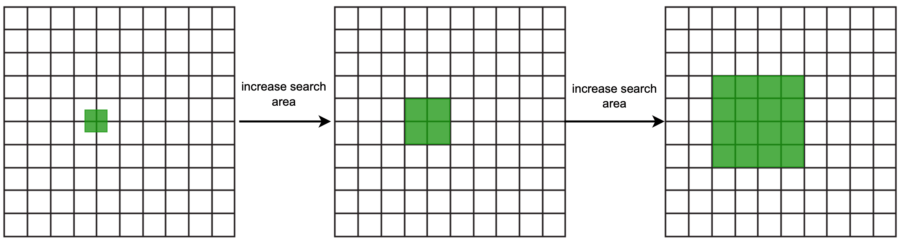

*Figure 12: Expand the search process*

#### Option 4: Quadtree

Another popular solution is quadtree. A quadtree [18] is a data structure that is commonly used to partition a two-dimensional space by recursively subdividing it into four quadrants (grids) until the contents of the grids meet certain criteria. For example, the criterion can be to keep subdividing until the number of businesses in the grid is not more than 100. This number is arbitrary as the actual number can be determined by business needs. With a quadtree, we build an in-memory tree structure to answer queries. Note that quadtree is an in-memory data structure and it is not a database solution. It runs on each LBS server, and the data structure is built at server start-up time.

The following figure visualizes the conceptual process of subdividing the world into a quadtree. Let's assume the world contains 200m (million) businesses.

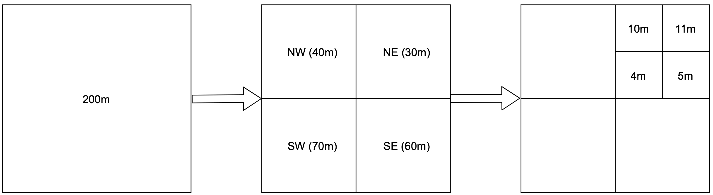

*Figure 13: Quadtree*

Figure 14 explains the quadtree building process in more detail. The root node represents the whole world map. The root node is recursively broken down into 4 quadrants until no nodes are left with more than 100 businesses.

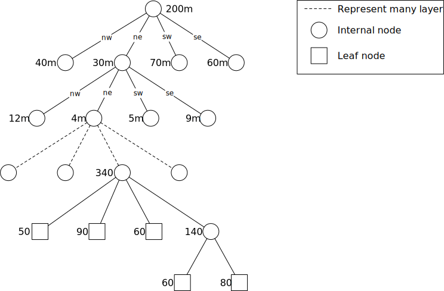

*Figure 14: Build quadtree*

The pseudocode for building quadtree is shown below:

```java
public void buildQuadtree(TreeNode node) {
    if (countNumberOfBusinessesInCurrentGrid(node) > 100) {
        node.subdivide();
        for (TreeNode child : node.getChildren()) {
            buildQuadtree(child);
        }
    }
}
```

To answer this question, we need to know what kind of data is stored.

**Data on a leaf node**

| Name | Size |
|------|------|
| Top left coordinates and bottom-right coordinates to identify the grid | 32 bytes (8 bytes * 4) |
| List of business IDs in the grid | 8 bytes per ID * 100 (maximal number of businesses allowed in one grid) |
| Total | 832 bytes |

*Table 6: Leaf node*

**Data on internal node**

| Name | Size |
|------|------|
| Top left coordinates and bottom-right coordinates to identify the grid | 32 bytes (8 bytes * 4) |
| Pointers to 4 children | 32 bytes (8 bytes * 4) |
| Total | 64 bytes |

*Table 7: Internal node*

Even though the tree-building process depends on the number of businesses within a grid, this number does not need to be stored in the quadtree node because it can be inferred from records in the database.

Now that we know the data structure for each node, let's take a look at the memory usage.

- Each grid can store a maximal of 100 businesses
- Number of leaf nodes = ~200 million / 100 = ~2 million
- Number of internal nodes = 2 million * 1/3 = ~0.67 million. If you do not know why the number of internal nodes is one-third of the leaf nodes, please read the reference material [19].
- Total memory requirement = 2 million * 832 bytes + 0.67 million * 64 bytes = ~1.71 GB. Even if we add some overhead to build the tree, the memory requirement to build the tree is quite small.

In a real interview, we shouldn't need such detailed calculations. The key takeaway here is that the quadtree index doesn't take too much memory and can easily fit in one server. Does it mean we should use only one server to store the quadtree index? The answer is no. Depending on the read volume, a single quadtree server might not have enough CPU or network bandwidth to serve all read requests. If that is the case, it will be necessary to spread the read load among multiple quadtree servers.

**How long does it take to build the whole quadtree?**

Each leaf node contains approximately 100 business IDs. The time complexity to build the tree is (N/100) lg(N/100), where N is the total number of businesses. It might take a few minutes to build the whole quadtree with 200 million businesses.

**How to get nearby businesses with quadtree?**

1. Build the quadtree in memory.
2. After the quadtree is built, start searching from the root and traverse the tree, until we find the leaf node where the search origin is. If that leaf node has 100 businesses, return the node. Otherwise, add businesses from its neighbors until enough businesses are returned.

**Operational considerations for quadtree**

As mentioned above, it may take a few minutes to build a quadtree with 200 million businesses at the server start-up time. It is important to consider the operational implications of such a long server start-up time. While the quadtree is being built, the server cannot serve traffic. Therefore, we should roll out a new release of the server incrementally to a small subset of servers at a time. This avoids taking a large swath of the server cluster offline and causes service brownout. Blue/green deployment [20] can also be used, but an entire cluster of new servers fetching 200 million businesses at the same time from the database service can put a lot of strain on the system. This can be done, but it may complicate the design and you should mention that in the interview.

Another operational consideration is how to update the quadtree as businesses are added and removed over time. The easiest approach would be to incrementally rebuild the quadtree, a small subset of servers at a time, across the entire cluster. But this would mean some servers would return stale data for a short period of time. However, this is generally an acceptable compromise based on the requirements. This can be further mitigated by setting up a business agreement that newly added/updated businesses will only be effective the next day. This means we can update the cache using a nightly job. One potential problem with this approach is that tons of keys will be invalidated at the same time, causing heavy load on cache servers.

It's also possible to update the quadtree on the fly as businesses are added and removed. This certainly complicates the design, especially if the quadtree data structure could be accessed by multiple threads. This will require some locking mechanism which could dramatically complicate the quadtree implementation.

**Real-world quadtree example**

Yext provided an image (Figure 15) that shows a constructed quadtree near Denver. We want smaller, more granular grids for dense areas and larger grids for sparse areas.

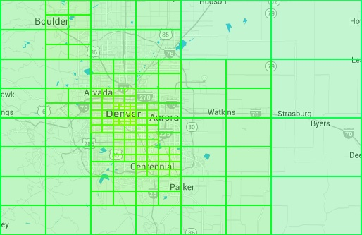

*Figure 15: Real-world example of a quadtree*

#### Option 5: Google S2

Google S2 geometry library [22] is another big player in this field. Similar to Quadtree, it is an in-memory solution. It maps a sphere to a 1D index based on the Hilbert curve (a space-filling curve) [23]. The Hilbert curve has a very important property: two points that are close to each other on the Hilbert curve are close in 1D space (Figure 16). Search on 1D space is much more efficient than on 2D. Interested readers can play with an online tool [24] for the Hilbert curve.

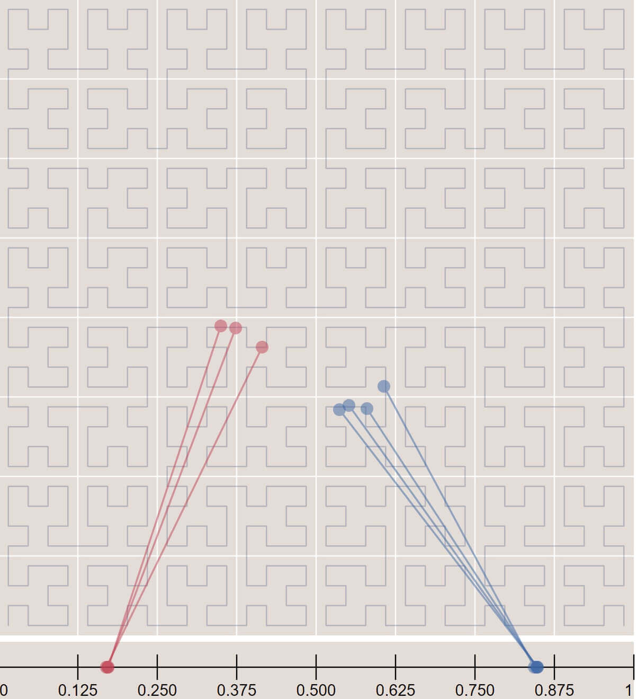

*Figure 16: Hilbert curve (source: [24])*

S2 is a complicated library and you are not expected to explain its internals during an interview. But because it's widely used in companies such as Google, Tinder, etc., we will briefly cover its advantages.

S2 is great for geofencing because it can cover arbitrary areas with varying levels (Figure 17). According to Wikipedia, "A geofence is a virtual perimeter for a real-world geographic area. A geo-fence could be dynamically generated—as in a radius around a point location, or a geo-fence can be a predefined set of boundaries (such as school zones or neighborhood boundaries)" [25].

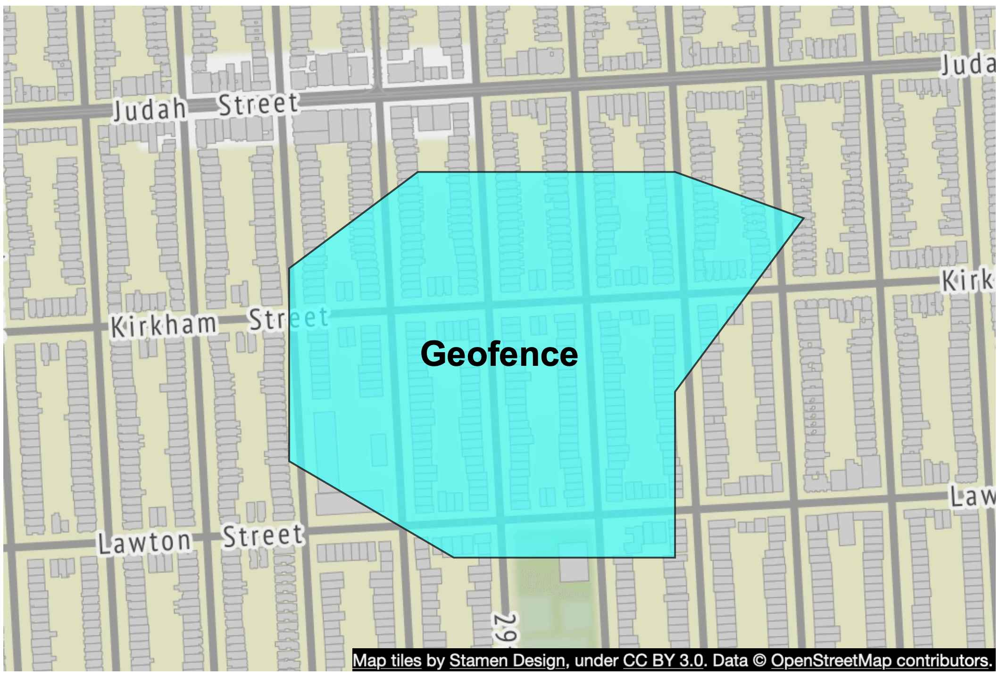

*Figure 17: Geofence*

Geofencing allows us to define perimeters that surround the areas of interest and to send notifications to users who are out of the areas. This can provide richer functionalities than just returning nearby businesses.

Another advantage of S2 is its Region Cover algorithm [26]. Instead of having a fixed level (precision) as in geohash, we can specify min level, max level, and max cells in S2. The result returned by S2 is more granular because the cell sizes are flexible. If you want to learn more, take a look at the S2 tool [26].

### Recommendation

To find nearby businesses efficiently, we have discussed a few options: geohash, quadtree and S2. As you can see from Table 8, different companies or technologies adopt different options.

| Geo Index | Companies |
|-----------|-----------|
| Geohash | Bing map [27], Redis [10], MongoDB [28], Lyft [29] |
| Quadtree | Yext [21] |
| Both Geohash and Quadtree | Elasticsearch [30] |
| S2 | Google Maps, Tinder [31] |

*Table 8: Different types of geo indexes*

During an interview, we suggest choosing geohash or quadtree because S2 is more complicated to explain clearly in an interview.

### Geohash vs quadtree

Before we conclude this section, let's do a quick comparison between geohash and quadtree.

**Geohash**

- Easy to use and implement. No need to build a tree.
- Supports returning businesses within a specified radius.
- When the precision (level) of geohash is fixed, the size of the grid is fixed as well. It cannot dynamically adjust the grid size, based on population density. More complex logic is needed to support this.
- Updating the index is easy. For example, to remove a business from the index, we just need to remove it from the corresponding row with the same geohash and business_id. See Figure 18 for a concrete example.

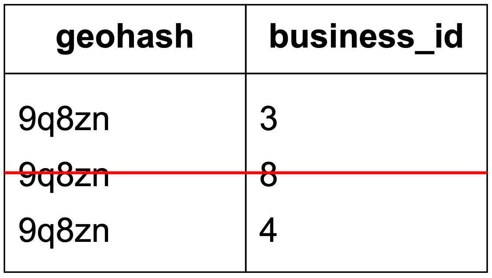

*Figure 18: Remove a business*

**Quadtree**

- Slightly harder to implement because it needs to build the tree.
- Supports fetching k-nearest businesses. Sometimes we just want to return k-nearest businesses and don't care if businesses are within a specified radius. For example, when you are traveling and your car is low on gas, you just want to find the nearest k gas stations. These gas stations may not be near you, but the app needs to return the nearest k results. For this type of query, a quadtree is a good fit because its subdividing process is based on the number k and it can automatically adjust the query range until it returns k results.
- It can dynamically adjust the grid size based on population density (see the Denver example in Figure 15).
- Updating the index is more complicated than geohash. A quadtree is a tree structure. If a business is removed, we need to traverse from the root to the leaf node, to remove the business. For example, if we want to remove the business with ID = 2, we have to travel from the root all the way down to the leaf node, as shown in Figure 19. Updating the index takes O(logn), but the implementation is complicated if the data structure is accessed by a multi-threaded program, as locking is required. Also, rebalancing the tree can be complicated. Rebalancing is necessary if, for example, a leaf node has no room for a new addition. A possible fix is to over-allocate the ranges.

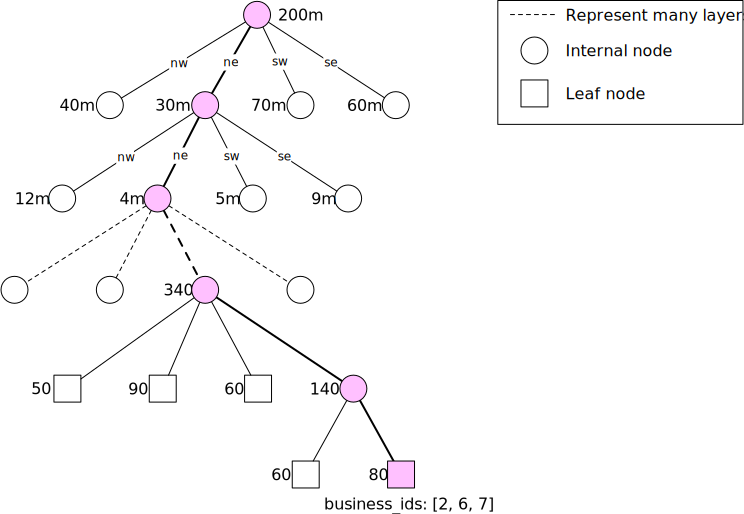

*Figure 19: Update quadtree*

## Step 3 - Design Deep Dive

By now you should have a good picture of what the overall system looks like. Now let's dive deeper into a few areas.

- Scale the database
- Caching
- Region and availability zones
- Filter results by time or business type
- Final architecture diagram

### Scale the database

We will discuss how to scale two of the most important tables: the business table and the geospatial index table.

#### Business table

The data for the business table may not all fit in one server, so it is a good candidate for sharding. The easiest approach is to shard everything by business ID. This sharding scheme ensures that load is evenly distributed among all the shards, and operationally it is easy to maintain.

#### Geospatial index table

Both geohash and quadtree are widely used. Due to geohash's simplicity, we use it as an example. There are two ways to structure the table.

**Option 1:** For each geohash key, there is a JSON array of business IDs in a single row. This means all business IDs within a geohash are stored in one row.

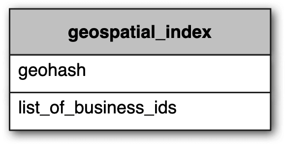

*Table 9: list_of_business_ids is a JSON array*

**Option 2:** If there are multiple businesses in the same geohash, there will be multiple rows, one for each business. This means different business IDs within a geohash are stored in different rows.

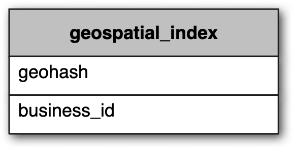

*Table 10: business_id is a single ID*

Here are some sample rows for option 2.

| geohash | business_id |
|---------|-------------|
| 32feac | 343 |
| 32feac | 347 |
| f3lcad | 112 |
| f3lcad | 113 |

*Table 11: Sample rows of the geospatial index table*

**Recommendation:** we recommend option 2 because of the following reasons:

- For option 1, to update a business, we need to fetch the array of business_ids and scan the whole array to find the business to update. When inserting a new business, we have to scan the entire array to make sure there is no duplicate. We also need to lock the row to prevent concurrent updates. There are a lot of edge cases to handle.
- For option 2, if we have two columns with a compound key of (geohash, business_id), the addition and removal of a business are very simple. There would be no need to lock anything.

**Scale the geospatial index**

One common mistake about scaling the geospatial index is to quickly jump to a sharding scheme without considering the actual data size of the table. In our case, the full dataset for the geospatial index table is not large (quadtree index only takes 1.71G memory and storage requirement for geohash index is similar). The whole geospatial index can easily fit in the working set of a modern database server. However, depending on the read volume, a single database server might not have enough CPU or network bandwidth to handle all read requests. If that is the case, it is necessary to spread the read load among multiple database servers.

There are two general approaches for spreading the load of a relational database server. We can add read replicas, or shard the database.

Many engineers like to talk about sharding during interviews. However, it might not be a good fit for the geohash table as sharding is complicated. For instance, the sharding logic has to be added to the application layer. Sometimes, sharding is the only option. In this case, though, everything can fit in the working set of a database server, so there is no strong technical reason to shard the data among multiple servers.

A better approach, in this case, is to have a series of read replicas to help with the read load. This method is much simpler to develop and maintain. For this reason, scaling the geospatial index table through replicas is recommended.

### Caching

Before introducing a cache layer we have to ask ourselves, do we really need a cache layer?

It is not immediately obvious that caching is a solid win:

- The workload is read-heavy, and the dataset is relatively small. The data could fit in the working set of any modern database server. Therefore, the queries are not I/O bound and they should run almost as fast as an in-memory cache.
- If read performance is a bottleneck, we can add database read replicas to improve the read throughput.

Be mindful when discussing caching with the interviewer, as it will require careful benchmarking and cost analysis. If you find out that caching does fit the business requirements, then you can proceed with discussions about caching strategy.

#### Cache key

The most straightforward cache key choice is the location coordinates (latitude and longitude) of the user. However, this choice has a few issues:

- Location coordinates returned from mobile phones are not accurate as they are just the best estimation [32]. Even if you don't move, the results might be slightly different each time you fetch coordinates on your phone.
- A user can move from one location to another, causing location coordinates to change slightly. For most applications, this change is not meaningful.

Therefore, location coordinates are not a good cache key. Ideally, small changes in location should still map to the same cache key. The geohash/quadtree solution mentioned earlier handles this problem well because all businesses within a grid map to the same geohash.

#### Types of data to cache

As shown in Table 12, there are two types of data that can be cached to improve the overall performance of the system:

| Key | Value |
|-----|-------|
| geohash | List of business IDs in the grid |
| business_id | Business object |

*Table 12: Key-value pairs in cache*

**List of business IDs in a grid**

Since business data is relatively stable, we precompute the list of business IDs for a given geohash and store it in a key-value store such as Redis. Let's take a look at a concrete example of getting nearby businesses with caching enabled.

1. Get the list of business IDs for a given geohash.

```sql
SELECT business_id FROM geohash_index WHERE geohash LIKE `{:geohash}%`
```

2. Store the result in the Redis cache if cache misses.

```java
public List<String> getNearbyBusinessIds(String geohash) {
    String cacheKey = hash(geohash);
    List<String> listOfBusinessIds = Redis.get(cacheKey);
    if (listOfBusinessIDs == null) {
        listOfBusinessIds = Run the select SQL query above;
        Cache.set(cacheKey, listOfBusinessIds, "1d");
    }
    return listOfBusinessIds;
}
```

When a new business is added, edited, or deleted, the database is updated and the cache invalidated. Since the volume of those operations is relatively small and no locking mechanism is needed for the geohash approach, update operations are easy to deal with.

According to the requirements, a user can choose the following 4 radii on the client: 500m, 1km, 2km, and 5km. Those radii are mapped to geohash lengths of 4, 5, 5, and 6, respectively. To quickly fetch nearby businesses for different radii, we cache data in Redis on all three precisions (geohash_4, geohash_5, and geohash_6).

As mentioned earlier, we have 200 million businesses and each business belongs to 1 grid in a given precision. Therefore the total memory required is:

- Storage for Redis values: 8 bytes * 200 million * 3 precisions = ~5 GB
- Storage for Redis keys: negligible
- Total memory required: ~5 GB

We can get away with one modern Redis server from the memory usage perspective, but to ensure high availability and reduce cross continent latency, we deploy the Redis cluster across the globe. Given the estimated data size, we can have the same copy of cache data deployed globally. We call this Redis cache "Geohash" in our final architecture diagram (Figure 21).

**Business data needed to render pages on the client**

This type of data is quite straightforward to cache. The key is the business_id and the value is the business object which contains the business name, address, image URLs, etc. We call this Redis cache "Business info" in our final architecture diagram (Figure 21).

### Region and availability zones

We deploy a location-based service to multiple regions and availability zones as shown in Figure 20. This has a few advantages:

- Makes users physically "closer" to the system. Users from the US West are connected to the data centers in that region, and users from Europe are connected with data centers in Europe.
- Gives us the flexibility to spread the traffic evenly across the population. Some regions such as Japan and Korea have high population densities. It might be wise to put them in separate regions, or even deploy location-based services in multiple availability zones to spread the load.
- Privacy laws. Some countries may require user data to be used and stored locally. In this case, we could set up a region in that country and employ DNS routing to restrict all requests from the country to only that region.

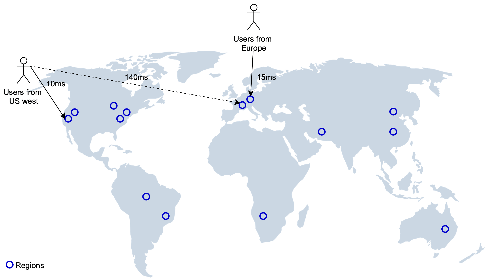

*Figure 20: Deploy LBS closer to the user*

### Follow-up question: filter results by time or business type

The interviewer might ask a follow-up question: how to return businesses that are open now, or only return businesses that are restaurants?

**Candidate:** When the world is divided into small grids with geohash or quadtree, the number of businesses returned from the search result is relatively small. Therefore, it is acceptable to return business IDs first, hydrate business objects, and filter them based on opening time or business type. This solution assumes opening time and business type are stored in the business table.

### Final design diagram

Putting everything together, we come up with the following design diagram.

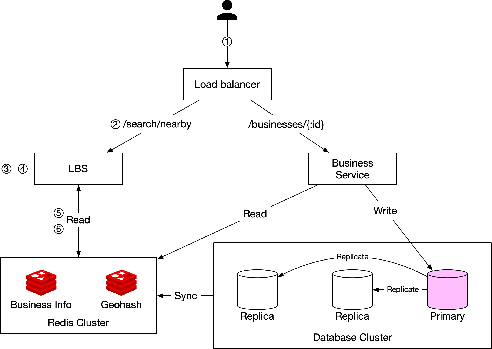

*Figure 21: Design diagram*

**Get nearby businesses**

1. You try to find restaurants within 500 meters on Yelp. The client sends the user location (latitude = 37.776720, longitude = -122.416730) and radius (500m) to the load balancer.
2. The load balancer forwards the request to the LBS.
3. Based on the user location and radius info, the LBS finds the geohash length that matches the search. By checking Table 5, 500m map to geohash length = 6.
4. LBS calculates neighboring geohashes and adds them to the list. The result looks like this: list_of_geohashes = [my_geohash, neighbor1_geohash, neighbor2_geohash, …, neighbor8_geohash].
5. For each geohash in list_of_geohashes, LBS calls the "Geohash" Redis server to fetch corresponding business IDs. Calls to fetch business IDs for each geohash can be made in parallel to reduce latency.
6. Based on the list of business IDs returned, LBS fetches fully hydrated business information from the "Business info" Redis server, then calculates distances between a user and businesses, ranks them, and returns the result to the client.

**View, update, add or delete a business**

All business-related APIs are separated from the LBS. To view the detailed information about a business, the business service first checks if the data is stored in the "Business info" Redis cache. If it is, cached data will be returned to the client. If not, data is fetched from the database cluster and then stored in the Redis cache, allowing subsequent requests to get results from the cache directly.

Since we have an upfront business agreement that newly added/updated businesses will be effective the next day, cached business data is updated by a nightly job.

## Step 4 - Wrap Up

In this chapter, we have presented the design for proximity service. The system is a typical LBS that leverages geospatial indexing. We discussed several indexing options:

- Two-dimensional search
- Evenly divided grid
- Geohash
- Quadtree
- Google S2

Geohash, quadtree, and S2 are widely used by different tech companies. We choose geohash as an example to show how a geospatial index works.

In the deep dive, we discussed why caching is effective in reducing the latency, what should be cached and how to use cache to retrieve nearby businesses fast. We also discussed how to scale the database with replication and sharding.

We then looked at deploying LBS in different regions and availability zones to improve availability, to make users physically closer to the servers, and to comply better with local privacy laws.

Congratulations on getting this far! Now give yourself a pat on the back. Good job!

## Reference Materials

[1] Yelp: https://www.yelp.com/

[2] Map tiles by Stamen Design: http://maps.stamen.com/

[3] OpenStreetMap: https://www.openstreetmap.org

[4] GDPR: https://en.wikipedia.org/wiki/General_Data_Protection_Regulation

[5] CCPA: https://en.wikipedia.org/wiki/California_Consumer_Privacy_Act

[6] Pagination in the REST API: https://developer.atlassian.com/server/confluence/pagination-in-the-rest-api/

[7] Google places API: https://developers.google.com/maps/documentation/places/web-service/search

[8] Yelp reservation API: https://docs.developer.yelp.com/docs/reservation

[9] Regions and Zones: https://docs.aws.amazon.com/AWSEC2/latest/UserGuide/using-regions-availability-zones.html

[10] Redis GEOHASH: https://redis.io/commands/GEOHASH

[11] POSTGIS: https://postgis.net/

[12] Cartesian tiers: http://www.nsshutdown.com/projects/lucene/whitepaper/locallucene_v2.html

[13] R-tree: https://en.wikipedia.org/wiki/R-tree

[14] Global map in a Geographic Coordinate Reference System: https://bit.ly/3DsjAwg

[15] Base32: https://en.wikipedia.org/wiki/Base32

[16] Geohash grid aggregation: https://bit.ly/3kKl4e6

[17] Geohash: https://www.movable-type.co.uk/scripts/geohash.html

[18] Quadtree: https://en.wikipedia.org/wiki/Quadtree

[19] How many leaves has a quadtree: https://stackoverflow.com/questions/35976444/how-many-leaves-has-a-quadtree

[20] Blue green deployment: https://martinfowler.com/bliki/BlueGreenDeployment.html

[21] Yext: Maps and Location Support: https://www.yext.com/platform/features/maps-and-location-support

[22] S2: http://s2geometry.io/

[23] Hilbert curve: https://en.wikipedia.org/wiki/Hilbert_curve

[24] Hilbert mapping: http://bit-player.org/extras/hilbert/hilbert-mapping.html

[25] Geo-fence: https://en.wikipedia.org/wiki/Geo-fence

[26] Region cover: http://s2geometry.io/devguide/s2cell_hierarchy

[27] Bing map: https://bit.ly/30ytSfG

[28] MongoDB: https://docs.mongodb.com/manual/tutorial/build-a-2d-index/

[29] Geospatial Indexing: The 10 Million QPS Redis Architecture Powering Lyft: https://www.youtube.com/watch?v=cSFWlF96Sds&t=2155s

[30] Geo Shape Type: https://www.elastic.co/guide/en/elasticsearch/reference/1.6/mapping-geo-shape-type.html

[31] Geosharded Recommendations Part 1: Sharding Approach: https://medium.com/tinder-engineering/geosharded-recommendations-part-1-sharding-approach-d5d54e0ec77a

[32] Get the last known location: https://developer.android.com/training/location/retrieve-current#Challenges

