# 19 - Google Maps

In this chapter, we design a simple version of Google Maps. Before we proceed to the system design, let's learn a bit about Google Maps. Google started Project Google Maps in 2005 and developed a web mapping service. It provides many services such as satellite imagery, street maps, real-time traffic conditions, and route planning [1].

Google Maps helps users find directions and navigate to their destination. As of March 2021, Google Maps had one billion daily active users, 99% coverage of the world, and 25 million updates daily of accurate and real-time location information [2]. Given the enormous complexity of Google Maps, it is important to nail down which features our version of it supports. Note the map tiles used in this chapter are from Stamen Design [3] and data are from OpenStreetMap [4].

## Step 1 - Understand the Problem and Establish Design Scope

The interaction between the interviewer and the candidate could look like this:

**Candidate:** How many daily active users are we expecting?

**Interviewer:** 1 billion DAU.

**Candidate:** Which features should we focus on? Direction, navigation, and estimated time of arrival (ETA)?

**Interviewer:** Let's focus on location update, navigation, ETA, and map rendering.

**Candidate:** How large is the road data? Can we assume we have access to it?

**Interviewer:** Great questions. Yes, let's assume we obtained the road data from different sources. It is terabytes (TBs) of raw data.

**Candidate:** Should our system take traffic conditions into consideration?

**Interviewer:** Yes, traffic conditions are very important for accurate time estimation.

**Candidate:** How about different travel modes such as driving, walking, bus, etc?

**Interviewer:** We should be able to support different travel modes.

**Candidate:** Should it support multi-stop directions?

**Interviewer:** It is good to allow a user to define multiple stops, but let's not focus on it.

**Candidate:** How about business places and photos? How many photos are we expecting?

**Interviewer:** I am happy you asked and considered these. We do not need to design those.

In the rest of the chapter, we focus on three key features. The main devices that we need to support are mobile phones.

1. User location update.
2. Navigation service, including ETA service.
3. Map rendering.

### Non-functional requirements and constraints

- **Accuracy:** Users should not be given the wrong directions.
- **Smooth navigation:** On the client-side, users should experience very smooth map rendering.
- **Data and battery usage:** The client should use as little data and battery as possible. This is very important for mobile devices.
- **General availability and scalability requirements.**

Before jumping into the design, we will briefly introduce some basic concepts and terminologies that are helpful in designing Google Maps.

## Map 101

### Positioning system

The world is a sphere that rotates on its axis. At the very top, there is the north pole, and the very bottom is the south pole.

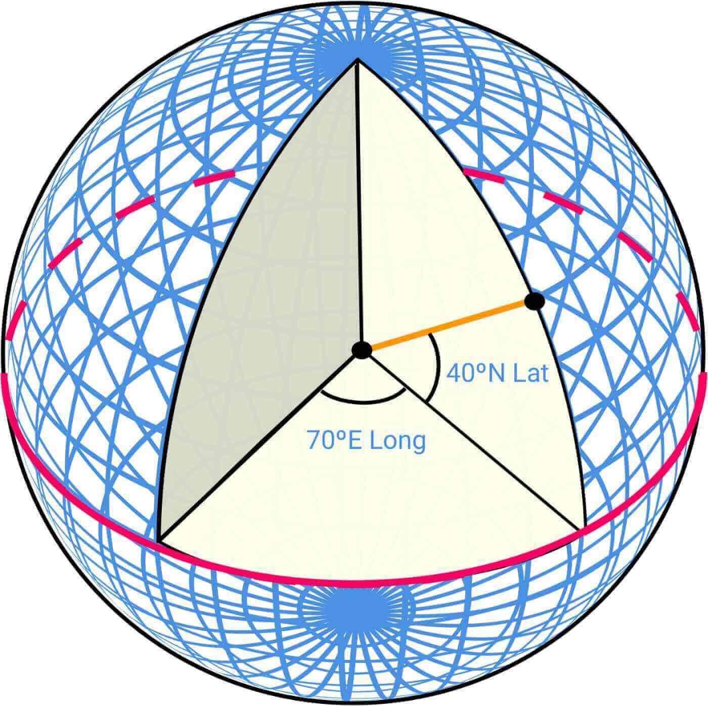

*Figure 1: Latitude and Longitude (source: [5])*

- **Lat (Latitude):** denotes how far north or south we are
- **Long (Longitude):** denotes how far east or west we are

### Going from 3D to 2D

The process of translating the points from a 3D globe to a 2D plane is called "Map Projection".

There are different ways to do map projection, and each comes with its own strengths and limitations. Almost all of them distort the actual geometry. Below we can see some examples.

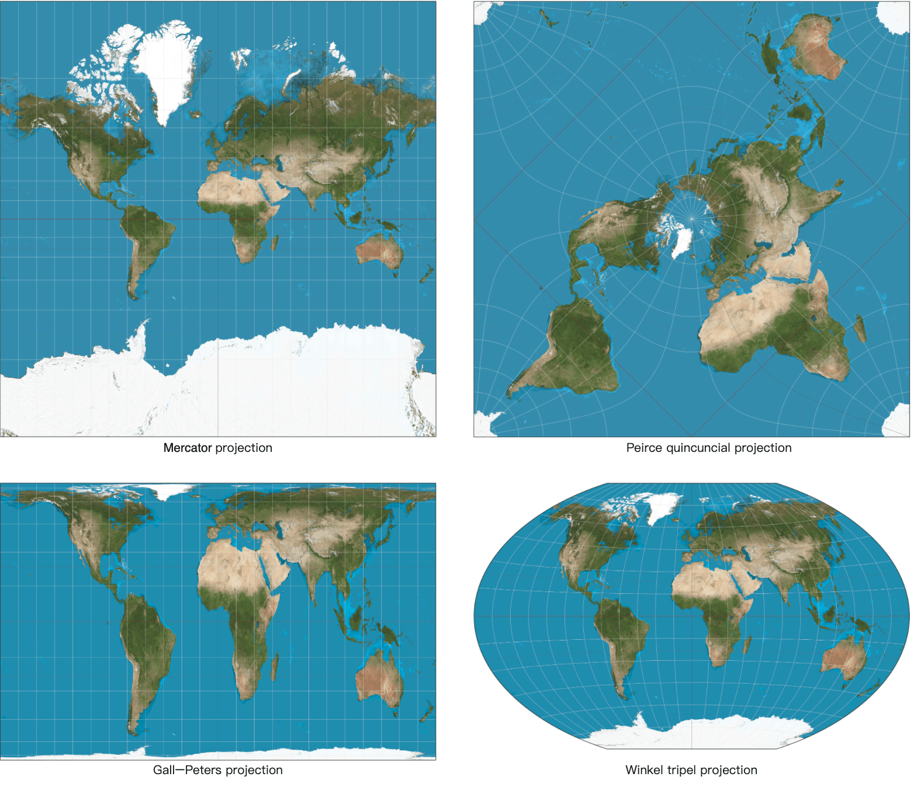

*Figure 2: Map projections (source: Wikipedia [6] [7] [8] [9])*

Google Maps selected a modified version of Mercator projection called Web Mercator. For more details on positioning systems and projections, please refer to [5].

### Geocoding

Geocoding is the process of converting addresses to geographic coordinates. For instance, "1600 Amphitheatre Parkway, Mountain View, CA" is geocoded to a latitude/longitude pair of (latitude 37.423021, longitude -122.083739).

In the other direction, the conversion from the latitude/longitude pair to the actual human-readable address is called reverse geocoding.

One way to geocode is interpolation [10]. This method leverages the data from different sources such as geographic information systems (GIS) where the street network is mapped to the geographic coordinate space.

### Geohashing

Geohashing is an encoding system that encodes a geographic area into a short string of letters and digits. At its core, it depicts the earth as a flattened surface and recursively divides the grids into sub-grids, which can be square or rectangular. We represent each grid with a string of numbers between 0 to 3 that are created recursively.

Let's assume the initial flattened surface is of size 20,000 km * 10,000 km. After the first division, we would have 4 grids of size 10,000 km * 5,000 km. We represent them as 00, 01, 10, and 11 as shown in Figure 3. We further divide each grid into 4 grids and use the same naming strategy. Each sub-grid is now of size 5,000 km*2,500 km. We recursively divide the grids until each grid reaches a certain size threshold.


*Figure 3: Geohashing*

Geohashing has many uses. In our design, we use geohashing for map tiling. For more details on geohashing and its benefits, please refer to [11].

### Map rendering

We won't go into a lot of detail about map rendering here, but it is worth mentioning the basics. One foundational concept in map rendering is tiling. Instead of rendering the entire map as one large custom image, the world is broken up into smaller tiles. The client only downloads the relevant tiles for the area the user is in and stitches them together like a mosaic for display.

There are distinct sets of tiles at different zoom levels. The client chooses the set of tiles appropriate for the zoom level of the map viewport on the client. This provides the right level of map details without consuming excess bandwidth. To illustrate with an extreme example, when the client is zoomed all the way out to show the entire world, we don't want to have to download hundreds of thousands of tiles for a very high zoom level. All the details would go to waste. Instead, the client would download one tile at the lowest zoom level, which represents the entire world with a single 256x256 pixel image.

### Road data processing for navigation algorithms

Most routing algorithms are variations of Dijkstra's or A* pathfinding algorithms. The exact algorithm choice is a complex topic and we won't go into much detail in this chapter. What is important to note is that all these algorithms operate on a graph data structure, where intersections are nodes and roads are edges of the graph. See Figure 4 for an example:

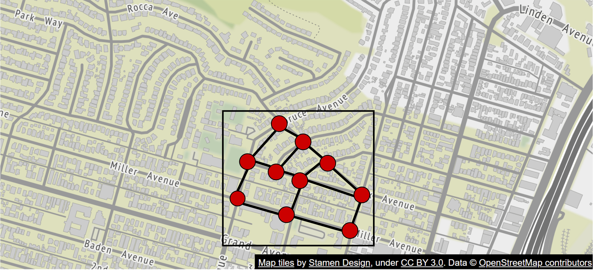

*Figure 4: Map as a graph*

The pathfinding performance for most of these algorithms is extremely sensitive to the size of the graph. Representing the entire world of road networks as a single graph would consume too much memory and is likely too large for any of these algorithms to run efficiently. The graph needs to be broken up into manageable units for these algorithms to work at our design scale.

One way to break up road networks around the world is very similar to the tiling concept we discussed for map rendering. By employing a similar subdivision technique as geohashing, we divide the world into small grids. For each grid, we convert the roads within the grid into a small graph data structure that consists of the nodes (intersections) and edges (roads) inside the geographical area covered by the grid. We call these grids routing tiles. Each routing tile holds references to all the other tiles it connects to. This is how the routing algorithms can stitch together a bigger road graph as it traverses these interconnected routing tiles.

By breaking up road networks into routing tiles that can be loaded on demand, the routing algorithms can significantly reduce memory consumption and improve pathfinding performance by only consuming a small subset of the routing tiles at a time, and only loading additional tiles as needed.

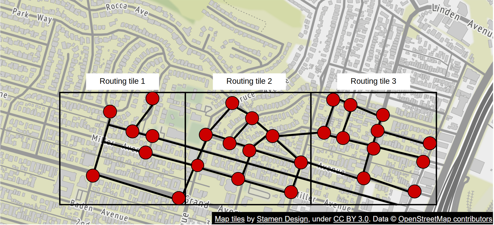

*Figure 5: Routing tiles*

**Reminder**

In Figure 5, we call these grids routing tiles. Routing tiles are similar to map tiles in that both are grids covering certain geographical areas. Map tiles are PNG images, while routing tiles are binary files of road data for the area covered by the tiles.

### Hierarchical routing tiles

Efficient navigation routing also requires having road data at the right level of detail. For example, for cross country routing, it would be slow to run the routing algorithm against a highly detailed set of street-level routing tiles. The graph stitched together from these detailed routing tiles would likely be too large and consume too much memory.

There are typically three sets of routing tiles with different levels of detail. At the most detailed level, the routing tiles are small and contain only local roads. At the next level, the tiles are bigger and contain only arterial roads connecting districts together. At the lowest level of detail, the tiles cover large areas and contain only major highways connecting cities and states together. At each level, there could be edges connecting to tiles at a different zoom level. For example, for a freeway entrance from local street A to freeway F, there would be a reference from the node (street A) in the small tile to the node (freeway F) in the big tile. See Figure 6 for an example of routing tiles of varying sizes.


*Figure 6: Routing tiles of varying sizes*

## Back-of-the-envelope estimation

Now that we understand the basics, let's do a back-of-the-envelope estimation. Since the focus of the design is mobile, data usage and battery consumption are two important factors to consider.

Before we dive into the estimation, here are some imperial/metric conversions for reference.

- 1 foot = 0.3048 meters
- 1 kilometer (km) = 0.6214 miles
- 1 km = 1,000 meters

### Storage usage

We need to store three types of data.

1. **Map of the world:** A detailed calculation is shown below.
2. **Metadata:** Given that the metadata for each map tile could be negligible in size, we can skip the metadata in our computation.
3. **Road info:** The interviewer told us there are TBs of road data from external sources. We transform this dataset into routing tiles, which are also likely to be terabytes in size.

### Map of the world

We discussed the concept of map tiling in the Map 101 section. There are many sets of map tiles, with one at each zoom level. To get an idea of the storage requirement for the entire collection of map tile images, it would be informative to estimate the size of the largest tile set at the highest zoom level first. At zoom level 21, there are about 4.3 trillion tiles (Table 1). Let's assume that each tile is a 256 * 256 pixel compressed PNG image, with the image size of about 100 KB. The entire set at the highest zoom level would need about 4.4 trillion * 100 KB = 440 PB.

In Table 1, we show the progression of tile counts at every zoom level.

| Zoom | Number of Tiles |
|------|----------------|
| 0    | 1              |
| 1    | 4              |
| 2    | 16             |
| 3    | 64             |
| 4    | 256            |
| 5    | 1,024          |
| 6    | 4,096          |
| 7    | 16,384         |
| 8    | 65,536         |
| 9    | 262,144        |
| 10   | 1,048,576      |
| 11   | 4,194,304      |
| 12   | 16,777,216     |
| 13   | 67,108,864     |
| 14   | 268,435,456    |
| 15   | 1,073,741,824  |
| 16   | 4,294,967,296  |
| 17   | 17,179,869,184 |
| 18   | 68,719,476,736 |
| 19   | 274,877,906,944|
| 20   | 1,099,511,627,776|
| 21   | 4,398,046,511,104|

*Table 1: Zoom levels*

However, keep in mind that about 90% of the world's surface is natural and mostly uninhabited areas like oceans, deserts, lakes, and mountains. Since these areas are highly compressible as images, we could conservatively reduce the storage estimate by 80-90%. That would reduce the storage size to a range of 44 to 88 PB. Let's pick a simple round number of 50 PB.

Next, let's estimate how much storage each subsequent lower zoom level would take. At each lower zoom level, the number of tiles for both north-south and east-west directions drops by half. This results in a total reduction of the number of tiles by 4x, which drops the storage size for the zoom level also by 4x. With the storage size reduced by 4x at each lower zoom level, the math for the total size is a series: 50 + 50/4 + 50/16 + 50/64 + … = ~67 PB. This is just a rough estimate. It is good enough to know that we need roughly about 100 PB to store all the map tiles at varying levels of detail.

### Server throughput

To estimate the server throughput, let's review the types of requests we need to support. There are two main types of requests. The first is navigation requests. These are sent by the clients to initiate a navigation session. The second is location update requests. These are sent by the client as the user moves around during a navigation session. The location data is used by downstream services in many different ways. For example, location data is one of the inputs for live traffic data. We will cover the use cases of location data in the design deep dive section.

Now we can analyze the server throughput for navigation requests. Let's assume we have 1 billion DAU, and each user uses navigation for a total of 35 minutes per week. This translates to 35 billion minutes per week or 5 billion minutes per day.

One simple approach would be to send GPS coordinates every second, which results in 300 billion (5 billion minutes * 60) requests per day, or 3 million QPS (300 billion requests / 10^5 = 3 million). However, the client may not need to send a GPS update every second. We can batch these on the client and send them at a much lower frequency (for example, every 15 seconds or 30 seconds) to reduce the write QPS. The actual frequency could depend on factors such as how fast the user moves. If they are stuck in traffic, a client can slow down the GPS updates. In our design, we assume GPS updates are batched and then sent to the server every 15 seconds. With this batched approach, the QPS is reduced to 200,000 (3 million / 15).

Assume peak QPS is five times the average. Peak QPS for location updates = 200,000 * 5 = 1 million.

## Step 2 - Propose High-Level Design and Get Buy-In

Now that we have more knowledge about Google Maps, we are ready to propose a high-level design (Figure 7).

### High-level design

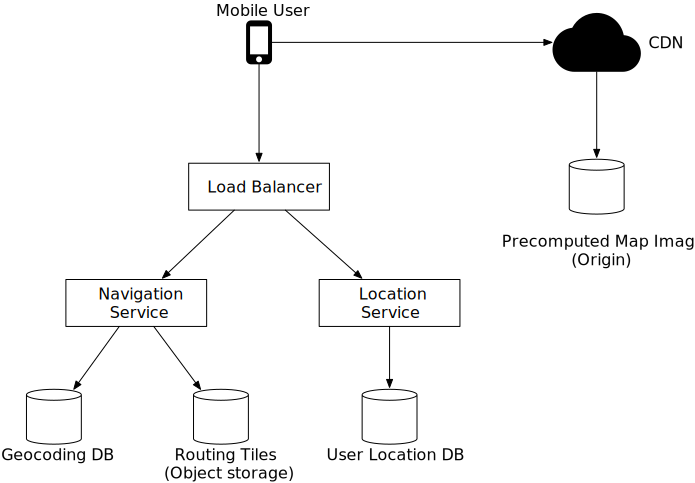

*Figure 7: High-level design*

The high-level design supports three features. Let's take a look at them one by one.

1. Location service
2. Navigation service
3. Map rendering

### Location service

The location service is responsible for recording a user's location update. The architecture is shown in Figure 8.


*Figure 8: Location service*

The basic design calls for the clients to send location updates every t seconds, where t is a configurable interval. The periodic updates have several benefits. First, we can leverage the streams of location data to improve our system over time. We can use the data to monitor live traffic, detect new or closed roads, and analyze user behavior to enable personalization, for example. Second, we can leverage the location data in near real-time to provide more accurate ETA estimates to the users and to reroute around traffic, if necessary.

But do we really need to send every location update to the server immediately? The answer is probably no. Location history can be buffered on the client and sent in batch to the server at a much lower frequency. For example, as shown in Figure 9, the location updates are recorded every second, but are only sent to the server as part of a batch every 15 seconds. This significantly reduces the total update traffic sent by all the clients.

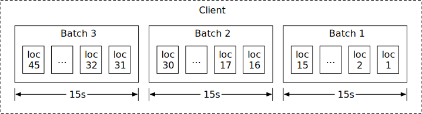

*Figure 9: Batch requests*

For a system like Google Maps, even when location updates are batched, the write volume is still very high. We need a database that is optimized for high write volume and is highly scalable, such as Cassandra. We may also need to log location data using a stream processing engine such as Kafka for further processing. We discuss this in detail in the deep dive section.

What communication protocol might be a good fit here? HTTP with the keep-alive option [12] is a good choice because it is very efficient. The HTTP request might look like this:

```
POST /v1/locations
Parameters
  locs: JSON encoded array of (latitude, longitude, timestamp) tuples.
```

### Navigation service

This component is responsible for finding a reasonably fast route from point A to point B. We can tolerate a little bit of latency. The calculated route does not have to be the fastest, but accuracy is critical.

As shown in Figure 8, the user sends an HTTP request to the navigation service through a load balancer. The request includes origin and destination as the parameters. The API might look like this:

```
GET /v1/nav?origin=1355+market+street,SF&destination=Disneyland
```

Here is an example of what the navigation result could look like:

```json
{
  'distance': {'text':'0.2 mi', 'value': 259},
  'duration': {'text': '1 min', 'value': 83},
  'end_location': {'lat': 37.4038943, 'lng': -121.9410454},
  'html_instructions': 'Head <b>northeast</b> on <b>Brandon St</b> toward <b>Lumin Way</b><div style="font-size:0.9em">Restricted usage road</div>',
  'polyline': {'points': '_fhcFjbhgVuAwDsCal'},
  'start_location': {'lat': 37.4027165, 'lng': -121.9435809},
  'geocoded_waypoints': [
    {
       "geocoder_status" : "OK",
       "partial_match" : true,
       "place_id" : "ChIJwZNMti1fawwRO2aVVVX2yKg",
       "types" : [ "locality", "political" ]
    },
    {
       "geocoder_status" : "OK",
       "partial_match" : true,
       "place_id" : "ChIJ3aPgQGtXawwRLYeiBMUi7bM",
       "types" : [ "locality", "political" ]
    }
  ],
  'travel_mode': 'DRIVING'
}
```

Please refer to [13] for more details on Google Maps' official APIs.

So far we have not taken reroute and traffic changes into consideration. Those problems are tackled by the Adaptive ETA service in the deep dive section.

### Map rendering

As we discussed in the back-of-the-envelope estimation, the entire collection of map tiles at various zoom levels is about a hundred petabytes in size. It is not practical to hold the entire dataset on the client. The map tiles must be fetched on-demand from the server based on the client's location and the zoom level of the client viewport.

When should the client fetch new map tiles from the server? Here are some scenarios:

1. The user is zooming and panning the map viewpoint on the client to explore their surroundings.
2. During navigation, the user moves out of the current map tile into a nearby tile.

We are dealing with a lot of data. Let's see how we could serve these map tiles from the server efficiently.

**Option 1**

The server builds the map tiles on the fly, based on the client location and zoom level of the client viewport. Considering that there is an infinite number of location and zoom level combinations, generating map tiles dynamically has a few severe disadvantages:

- It puts a huge load on the server cluster to generate every map tile dynamically.
- Since the map tiles are dynamically generated, it is hard to take advantage of caching.

**Option 2**

Another option is to serve a pre-generated set of map tiles at each zoom level. The map tiles are static, with each tile covering a fixed rectangular grid using a subdivision scheme like geohashing. Each tile is therefore represented by its geohash. In other words, there is a unique geohash associated with each grid. When a client needs a map tile, it first determines the map tile collection to use based on its zoom level. It then computes the map tile URL by converting its location to the geohash at the appropriate zoom level.

These static, pre-generated images are served by a CDN as shown in Figure 10.


*Figure 10: CDN*

In the diagram above, the mobile user makes an HTTP request to fetch a tile from the CDN. If the CDN has not yet served that specific tile before, it fetches a copy from the origin server, caches it locally, and returns it to the user. On subsequent requests, even if those requests are from different users, the CDN returns a cached copy without contacting the origin server.

This approach is more scalable and performant because the map tiles are served from the nearest point of presence (POP) to the client, as shown in Figure 11. The static nature of the map tiles makes them highly cacheable.

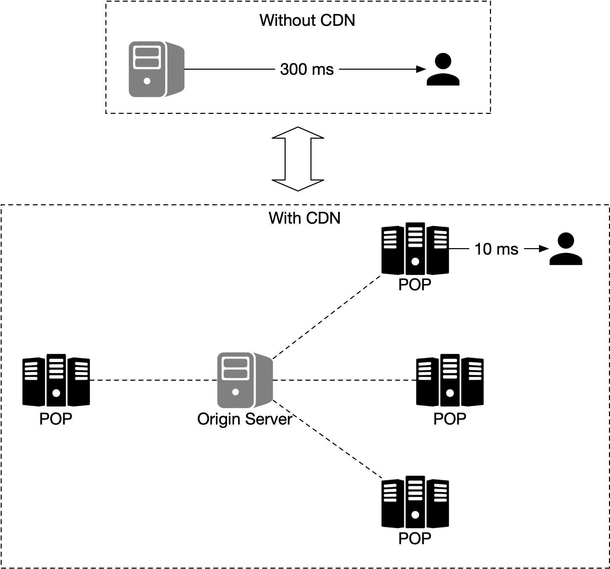

*Figure 11: Without CDN vs with CDN*

It is important to keep mobile data usage low. Let's calculate the amount of data the client needs to load during a typical navigation session. Note the following calculations don't take client-side caching into consideration. Since the routes a user takes could be similar each day, the data usage is likely to be a lot lower with client-side caching.

**Data usage**

Let's assume a user moves at 30 km/h, and at a zoom level where each image covers a block of 200m*200m (a block can be represented by a 256-pixel by 256-pixel image and the average image size is 100KB). For an area of 1km*1km, we need 25 images or 2.5 MB (25 * 100KB) of data. Therefore, if the speed is 30 km/h, we need 75MB (30 * 2.5MB) of data per hour or 1.25 MB of data per minute.

| Metric | Value |
|--------|-------|
| Speed | 30 km/h |
| Area per image | 200m * 200m |
| Images per 1km² | 25 |
| Data per 1km² | 2.5 MB |
| Data per hour | 75 MB |
| Data per minute | 1.25 MB |

*Table 2: Data usage*

Next, we estimate the CDN data usage. At our scale, the cost is an important factor to consider.

**Traffic through CDN**

As mentioned earlier, we serve 5 billion minutes of navigation per day. This translates to 5 billion * 1.25 MB = 6.25 billion MB per day. Hence, we serve 62,500 MB (6.25 billion / 10^5 seconds in a day) of map data per second. With a CDN, these map images are going to be served from the POPs all over the world. Let's assume there are 200 POPs. Each POP would only need to serve a few hundred MBs (62,500 / 200) per second.

| Metric | Value |
|--------|-------|
| Navigation minutes per day | 5 billion |
| Data per minute | 1.25 MB |
| Total data per day | 6.25 billion MB |
| Data per second | 62,500 MB |
| Number of POPs | 200 |
| Data per POP per second | ~313 MB |

*Table 3: Traffic through CDN*

There is one final detail in the map rendering design we have only briefly touched on. How does the client know which URLs to use to fetch the map tiles from the CDN? Keep in mind that we are using option 2 as discussed above. With that option, the map tiles are static and pre-generated based on fixed sets of grids, with each set representing a discrete zoom level.

Since we encode the grids in geohash, and there is one unique geohash per grid, computationally it is very efficient to go from the client's location (in latitude and longitude) and zoom level to the geohash, for the map tile. This calculation can be done on the client and we can fetch any static image tile from the CDN. For example, the URL for the image tile of Google headquarter could look like this:

```
https://cdn.map-provider.com/tiles/9q9hvu.png
```

Refer to the Proximity Service chapter for a more detailed discussion of geohash encoding.

Calculating geohash on the client should work well. However, keep in mind that this algorithm is hardcoded in all the clients on all different platforms. Shipping changes to mobile apps is a time-consuming and somewhat risky process. We have to be sure that geohashing is the method we plan to use long-term to encode the collection of map tiles and that it is unlikely to change. If we need to switch to another encoding method for some reason, it will take a lot of effort and the risk is not low.

Here is another option worth considering. Instead of using a hardcoded client-side algorithm to convert a latitude/longitude (lat/lng) pair and zoom level to a tile URL, we could introduce a service as an intermediary whose job is to construct the tile URLs based on the same inputs mentioned above. This is a very simple service. The added operational flexibility might be worth it. This is a very interesting tradeoff discussion we could have with the interviewer. The alternative map rendering flow is shown in Figure 12.

When a user moves to a new location or to a new zoom level, the map tile service determines which tiles are needed and translates that information into a set of tile URLs to retrieve.

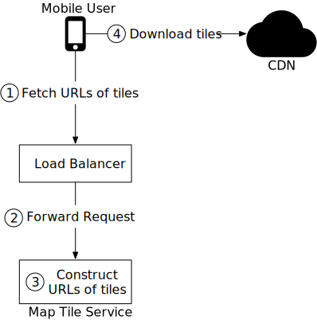

*Figure 12: Map rendering*

1. A mobile user calls the map tile service to fetch the tile URLs. The request is sent to the load balancer.
2. The load balancer forwards the request to the map tile service.
3. The map tile service takes the client's location and zoom level as inputs and returns 9 URLs of the tiles to the client. These tiles include the tile to render and the eight surrounding tiles.
4. The mobile client downloads the tiles from the CDN.

We will go into more detail on the precomputed map tiles in the design deep dive section.

## Step 3 - Design Deep Dive

In this section, we first have a discussion about the data model. Then we talk about location service, navigation service, and map rendering in more detail.

### Data model

We are dealing with four types of data: routing tiles, user location data, geocoding data, and precomputed map tiles of the world.

#### Routing tiles

As mentioned previously, the initial road dataset is obtained from different sources and authorities. It contains terabytes of data. The dataset is improved over time by the location data the application continuously collects from the users as they use the application.

This dataset contains a large number of roads and associated metadata such as names, county, longitude, and latitude. This data is not organized as graph data structures and is not usable by most routing algorithms. We run a periodic offline processing pipeline, called routing tile processing service, to transform this dataset into the routing tiles we introduced. The service runs periodically to capture new changes to the road data.

The output of the routing tile processing service is routing tiles. There are three sets of these tiles at different resolutions, as described in the Map 101 section. Each tile contains a list of graph nodes and edges representing the intersections and roads within the area covered by the tile. It also contains references to other tiles its roads connect to. These tiles together form an interconnected network of roads that the routing algorithms can consume incrementally.

Where should the routing tile processing service store these tiles? Most graph data is represented as adjacency lists [14] in memory. There are too many tiles to keep the entire set of adjacency lists in memory. We could store the nodes and edges as rows in a database, but we would only be using the database as storage, and it seems an expensive way to store bits of data. We also don't need any database features for routing tiles.

The more efficient way to store these tiles is in object storage like S3 and cache it aggressively on the routing service that uses those tiles. There are many high-performance software packages we could use to serialize the adjacency lists to a binary file. We could organize these tiles by their geohashes in object storage. This provides a fast lookup mechanism to locate a tile by lat/lng pair.

We discuss how the shortest path service uses these routing tiles shortly.

#### User location data

User location data is valuable. We use it to update our road data and routing tiles. We also use it to build a database of live and historical traffic data. This location data is also consumed by multiple data stream processing services to update the map data.

For user location data, we need a database that can handle the write-heavy workload well and can be horizontally scaled. Cassandra could be a good candidate.

Here is what a single row could look like:

| user_id | timestamp | user_mode | driving_mode | location |
|---------|-----------|-----------|--------------|----------|
| 101     | 1635740977| active    | driving      | (20.0, 30.5) |

*Table 4: Location table*

#### Geocoding database

This database stores places and their corresponding lat/lng pair. We can use a key-value database such as Redis for fast reads, since we have frequent reads and infrequent writes. We use it to convert an origin or destination to a lat/lng pair before passing it to the route planner service.

#### Precomputed images of the world map

When a device asks for a map of a particular area, we need to get nearby roads and compute an image that represents that area with all the roads and related details. These computations would be heavy and redundant, so it could be helpful to compute them once and then cache the images. We precompute images at different zoom levels and store them on a CDN, which is backed by cloud storage such as Amazon S3. Here is an example of such an image:

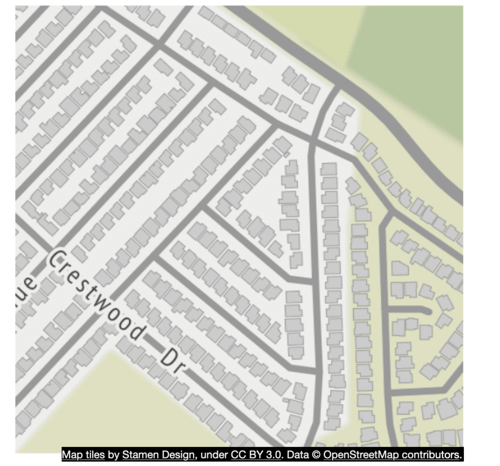

*Figure 13: Precomputed tiles*

### Services

Now that we have discussed the data model, let's take a close look at some of the most important services: location service, map rendering service, and navigation service.

#### Location service

In the high-level design, we discussed how location service works. In this section, we focus on the database design for this service and also how user location is used in detail.

In Figure 14, the key-value store is used to store user location data. Let's take a close look.


*Figure 14: User location database*

Given the fact we have 1 million location updates every second, we need to have a database that supports fast writes. A No-SQL key-value database or column-oriented database would be a good choice here. In addition, a user's location is continuously changing and becomes stale as soon as a new update arrives. Therefore, we can prioritize availability over consistency. The CAP theorem [15] states that we could choose two attributes among consistency, availability, and partition tolerance. Given our constraints, we would go with availability and partition tolerance. One database that is a good fit is Cassandra. It can handle our scale with a strong availability guarantee.

The key is the combination of (user_id, timestamp) and the value is a lat/lng pair. In this setup, user_id is the primary key and timestamp is the clustering key. The advantage of using user_id as the partition key is that we can quickly read the latest position of a specific user. All the data with the same partition key are stored together, sorted by timestamp. With this arrangement, the retrieval of the location data for a specific user within a time range is very efficient.

Below is an example of what the table may look like.

| key (user_id) | timestamp | lat | long | user_mode | navigation_mode |
|---------------|-----------|-----|------|-----------|-----------------|
| 51            | 132053000 | 21.9| 89.8 | active    | driving         |

*Table 5: Location data*

**How do we use the user location data?**

User location data is essential. It supports many use cases. We use the data to detect new and recently closed roads. We use it as one of the inputs to improve the accuracy of our map over time. It is also an input for live traffic data.

To support these use cases, in addition to writing current user locations in our database, we log this information into a message queue, such as Kafka. Kafka is a unified low-latency, high-throughput data streaming platform designed for real-time data feeds. Figure 15 shows how Kafka is used in the improved design.

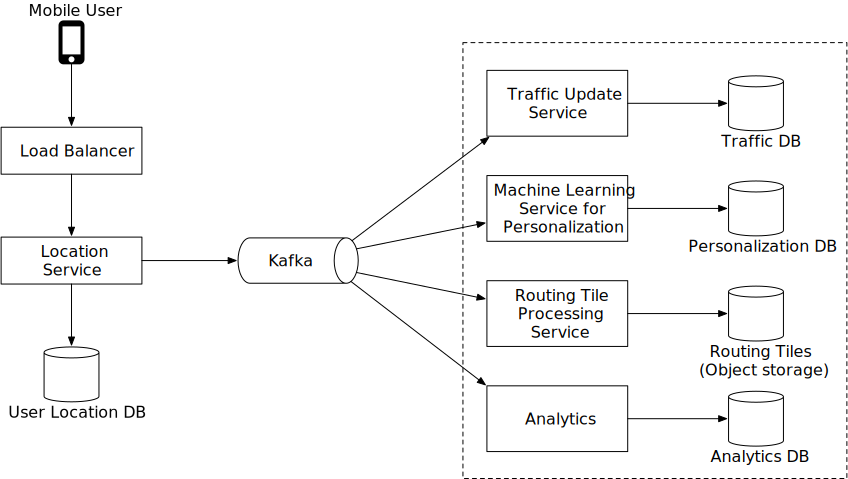

*Figure 15: Location data is used by other services*

Other services consume the location data stream from Kafka for various use cases. For instance, the live traffic service digests the output stream and updates the live traffic database. The routing tile processing service improves the map of the world by detecting new or closed roads and updating the affected routing tiles in object storage. Other services can also tap into the stream for different purposes.

#### Rendering map

In this section, we dive deep into precomputed map tiles and map rendering optimization. They are primarily inspired by the work of Google Design [5].

**Precomputed tiles**

As mentioned previously, there are different sets of precomputed map tiles at various distinct zoom levels to provide the appropriate level of map detail to the user, based on the client's viewport size and zoom level. Google Maps uses 21 zoom levels (Table 1). This is what we use, as well.

- Level 0 is the most zoomed-out level. The entire map is represented by a single tile of size 256 * 256 pixels.
- With each increment of the zoom level, the number of map tiles doubles in both north-south and east-west directions, while each tile stays at 256 * 256 pixels. As shown in Figure 16, at zoom level 1, there are 2 x 2 tiles, with a total combined resolution of 512 * 512 pixels. At zoom level 2, there are 4 x 4 tiles, with a total combined resolution of 1024 * 1024 pixels. With each increment, the entire set of tiles has 4x as many pixels as the previous level. The increased pixel count provides an increasing level of detail to the user. This allows the client to render the map at the best granularities depending on the client's zoom level, without consuming excessive bandwidth to download tiles in excessive detail.

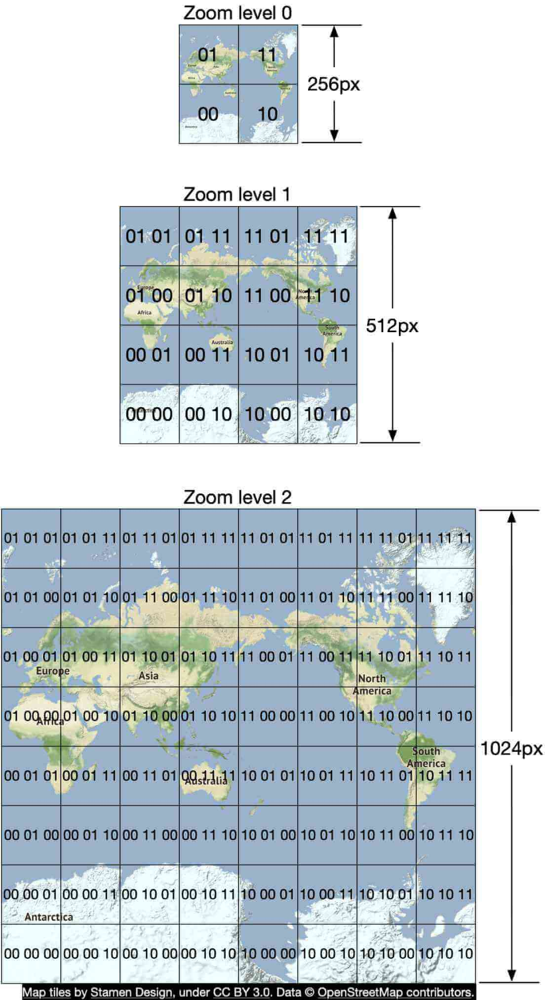

*Figure 16: Zoom levels*

**Optimization: use vectors**

With the development and implementation of WebGL, one potential improvement is to change the design from sending the images over the network, to sending the vector information (paths and polygons) instead. The client draws the paths and polygons from the vector information.

One obvious advantage of vector tiles is that vector data compresses much better than images do. The bandwidth saving is substantial.

A less obvious benefit is that vector tiles provide a much better zooming experience. With rasterized images, as the client zooms in from one level to another, everything gets stretched and looks pixelated. The visual effect is pretty jarring. With vectorized images, the client can scale each element appropriately, providing a much smoother zooming experience.

#### Navigation service

Next, let's deep dive into the navigation service. This service is responsible for finding the fastest routes. The design diagram is shown in Figure 17.

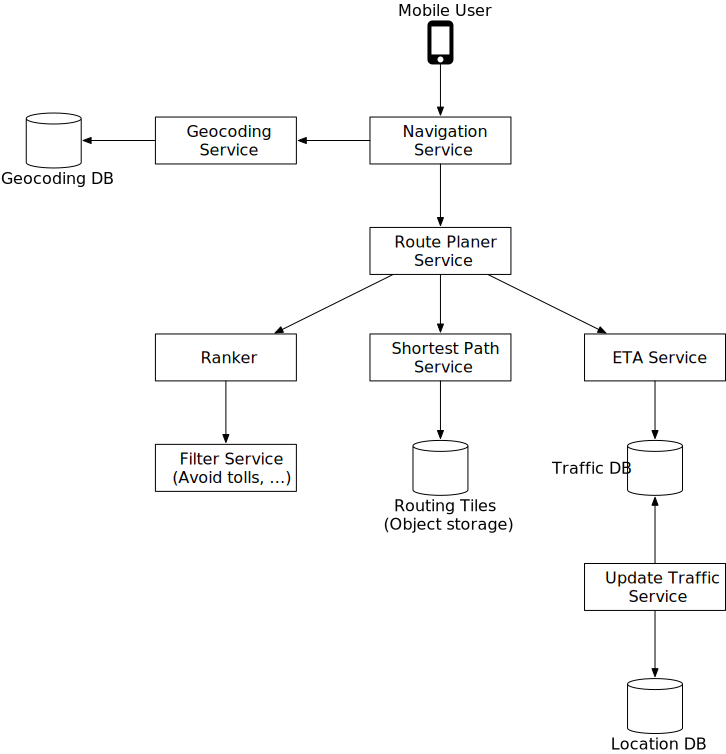

*Figure 17: Navigation service*

Let's go over each component in the system.

**Geocoding service**

First, we need to have a service to resolve an address to a location of a latitude and longitude pair. An address could be in different formats, for example, it could be the name of a place or a textual address.

Here is an example request and response from Google's geocoding API.

**Request:**

```
https://maps.googleapis.com/maps/api/geocode/json?address=1600+Amphitheatre+Parkway,+Mountain+View,+CA
```

**JSON response:**

```json
{
   "results" : [
      {
         "formatted_address" : "1600 Amphitheatre Parkway, Mountain View, CA 94043, USA",
         "geometry" : {
            "location" : {
               "lat" : 37.4224764,
               "lng" : -122.0842499
            },
            "location_type" : "ROOFTOP",
            "viewport" : {
               "northeast" : {
                  "lat" : 37.4238253802915,
                  "lng" : -122.0829009197085
               },
               "southwest" : {
                  "lat" : 37.4211274197085,
                  "lng" : -122.0855988802915
               }
            }
         },
         "place_id" : "ChIJ2eUgeAK6j4ARbn5u_wAGqWA",
         "plus_code": {
            "compound_code": "CWC8+W5 Mountain View, California, United States",
            "global_code": "849VCWC8+W5"
         },
         "types" : [ "street_address" ]
      }
   ],
   "status" : "OK"
}
```

The navigation service calls this service to geocode the origin and the destination before passing the latitude/longitude pairs downstream to find the routes.

**Route planner service**

This service computes a suggested route that is optimized for travel time according to current traffic and road conditions. It interacts with several services which are discussed next.

**Shortest-path service**

The shortest-path service receives the origin and the destination in lat/lng pairs and returns the top-k shortest paths without considering traffic or current conditions. This computation only depends on the structure of the roads. Here, caching the routes could be beneficial because the graph rarely changes.

The shortest-path service runs a variation of A* pathfinding algorithms against the routing tiles in object storage. Here is an overview:

1. The algorithm receives the origin and destination in lat/lng pairs. The lat/lng pairs are converted to geohashes which are then used to load the start and end-points of routing tiles.
2. The algorithm starts from the origin routing tile, traverses the graph data structure, and hydrates additional neighboring tiles from the object store (or its local cache if it has loaded it before) as it expands the search area. It's worth noting that there are connections from one level of tile to another covering the same area. This is how the algorithm could "enter" the bigger tiles containing only highways, for example. The algorithm continues to expand its search by hydrating more neighboring tiles (or tiles at different resolutions) as needed until a set of best routes is found.

Figure 18 gives a conceptual overview of the tiles used in the graph traversal.

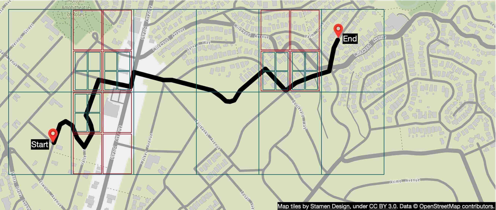

*Figure 18: Graph traversal*

**ETA service**

Once the route planner receives a list of possible shortest paths, it calls the ETA service for each possible route and gets a time estimate. For this, the ETA service uses machine learning to predict the ETAs based on the current traffic and historical data.

One of the challenges here is that we not only need to have real-time traffic data but also to predict how the traffic will look like in 10 or 20 minutes. These kinds of challenges need to be addressed at an algorithmic level and will not be discussed in this section. If you are interested, refer to [16] and [17].

**Ranker service**

Finally, after the route planner obtains the ETA predictions, it passes this info to the ranker to apply possible filters as defined by the user. Some example filters include options to avoid toll roads or to avoid freeways. The ranker service then ranks the possible routes from fastest to slowest and returns top-k results to the navigation service.

**Updater services**

These services tap into the Kafka location update stream and asynchronously update some of the important databases to keep them up-to-date. The traffic database and the routing tiles are some examples.

The routing tile processing service is responsible for transforming the road dataset with newly found roads and road closures into a continuously updated set of routing tiles. This helps the shortest path service to be more accurate.

The traffic update service extracts traffic conditions from the streams of location updates sent by the active users. This insight is fed into the live traffic database. This enables the ETA service to provide more accurate estimates.

**Improvement: adaptive ETA and rerouting**

The current design does not support adaptive ETA and rerouting. To address this, the server needs to keep track of all the active navigating users and update them on ETA continuously, whenever traffic conditions change. Here we need to answer a few important questions:

1. How do we track actively navigating users?
2. How do we store the data, so that we can efficiently locate the users affected by traffic changes among millions of navigation routes?

Let's start with a naive solution. In Figure 19, user_1's navigation route is represented by routing tiles r_1, r_2, r_3, …, r_7.

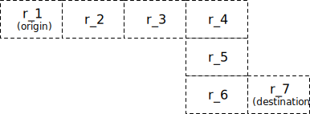

*Figure 19: Navigation route*

The database stores actively navigating users and routes information which might look like this:

```
user_1: r_1, r_2, r_3, …, r_k
user_2: r_4, r_6, r_9, …, r_n
user_3: r_2, r_8, r_9, …, r_m
…
user_n: r_2, r_10, r21, ..., r_l
```

Let's say there is a traffic incident in routing tile 2 (r_2). To figure out which users are affected, we scan through each row and check if routing tile 2 is in our list of routing tiles (see example below).

```
user_1: r_1, r_2, r_3, …, r_k
user_2: r_4, r_6, r_9, …, r_n
user_3: r_2, r_8, r_9, …, r_m
…
user_n: r_2, r_10, r_21, ..., r_l
```

Assume the number of rows in the table is n and the average length of the navigation route is m. The time complexity to find all users affected by the traffic change is O(n * m).

Can we make this process faster? Let's explore a different approach. For each actively navigating user, we keep the current routing tile, the routing tile at the next resolution level that contains it, and recursively find the routing tile at the next resolution level until we find the user's destination in the tile as well (Figure 20). By doing this, we can get a row of the database table like this.

```
user_1, r_1, super(r_1), super(super(r_1)), …
```

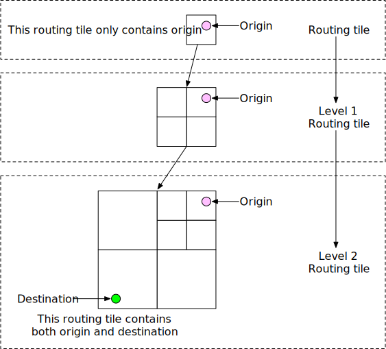

*Figure 20: Build routing tiles*

To find out if a user is affected by the traffic change, we need only check if a routing tile is inside the last routing tile of a row in the database. If not, the user is not impacted. If it is, the user is affected. By doing this, we can quickly filter out many users.

This approach doesn't specify what happens when traffic clears. For example, if routing tile 2 clears and users can go back to the old route, how do users know rerouting is available? One idea is to keep track of all possible routes for a navigating user, recalculate the ETAs regularly and notify the user if a new route with a shorter ETA is found.

**Delivery protocols**

It is a reality that during navigation, route conditions can change and the server needs a reliable way to push data to mobile clients. For delivery protocol from the server to the client, our options include mobile push notification, long polling, WebSocket, and Server-Sent Events (SSE).

- Mobile push notification is not a great option because the payload size is very limited (4,096 bytes for iOS) and it doesn't support web applications.
- WebSocket is generally considered to be a better option than long polling because it has a very light footprint on servers.
- Since we have ruled out the mobile push notification and long polling, the choice is mainly between WebSocket and SSE. Even though both can work, we lean towards WebSocket because it supports bi-directional communication and features such as last-mile delivery might require bi-directional real-time communication.

For more details about ETA and rerouting, please refer to [16].

Now we have every piece of the design together. Please see the updated design in Figure 21.

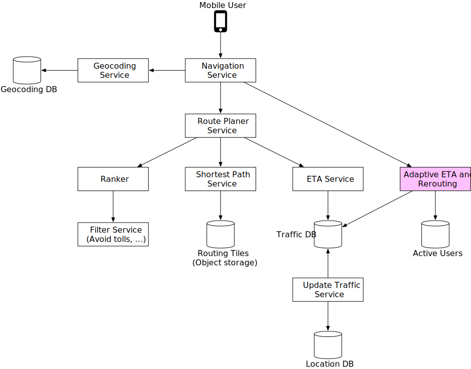

*Figure 21: Final design*

## Step 4 - Wrap Up

In this chapter, we designed a simplified Google Maps application with key features such as location update, ETAs, route planning, and map rendering. If you are interested in expanding the system, one potential improvement would be to provide multi-stop navigation capability for enterprise customers. For example, for a given set of destinations, we have to find the optimal order in which to visit them all and provide proper navigation, based on live traffic conditions. This could be helpful for delivery services such as Door dash, Uber, Lyft, etc.

Congratulations on getting this far! Now give yourself a pat on the back. Good job!

## Reference Materials

[1] Google Maps: https://developers.google.com/maps?hl=en_US

[2] Google Maps Platform: https://cloud.google.com/maps-platform/

[3] Stamen Design: http://maps.stamen.com

[4] OpenStreetMap: https://www.openstreetmap.org

[5] Prototyping a Smoother Map: https://medium.com/google-design/google-maps-cb0326d165f5

[6] Mercator projection: https://en.wikipedia.org/wiki/Mercator_projection

[7] Peirce quincuncial projection: https://en.wikipedia.org/wiki/Peirce_quincuncial_projection

[8] Gall–Peters projection: https://en.wikipedia.org/wiki/Gall–Peters_projection

[9] Winkel tripel projection: https://en.wikipedia.org/wiki/Winkel_tripel_projection

[10] Address geocoding: https://en.wikipedia.org/wiki/Address_geocoding

[11] Geohashing: https://kousiknath.medium.com/system-design-design-a-geo-spatial-index-for-real-time-location-search-10968fe62b9c

[12] HTTP keep-alive: https://en.wikipedia.org/wiki/HTTP_persistent_connection

[13] Directions API: https://developers.google.com/maps/documentation/directions/start?hl=en_US

[14] Adjacency list: https://en.wikipedia.org/wiki/Adjacency_list

[15] CAP theorem: https://en.wikipedia.org/wiki/CAP_theorem

[16] ETAs with GNNs: https://deepmind.com/blog/article/traffic-prediction-with-advanced-graph-neural-networks

[17] Google Maps 101: How AI helps predict traffic and determine routes: https://blog.google/products/maps/google-maps-101-how-ai-helps-predict-traffic-and-determine-routes/

