# 21 - Metrics Monitoring and Alerting System

In this chapter, we explore the design of a scalable metrics monitoring and alerting system. A well-designed monitoring and alerting system plays a key role in providing clear visibility into the health of the infrastructure to ensure high availability and reliability.

Figure 1 shows some of the most popular metrics monitoring and alerting services in the marketplace. In this chapter, we design a similar service that can be used internally by a large company.

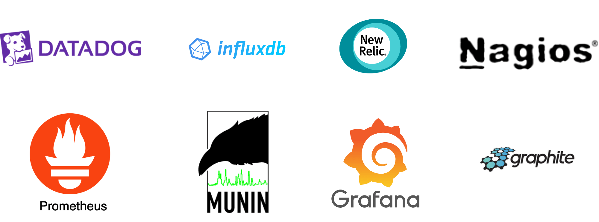

*Figure 1: Popular metrics monitoring and alerting services*

## Step 1 - Understand the Problem and Establish Design Scope

A metrics monitoring and alerting system can mean many different things to different companies, so it is essential to nail down the exact requirements first with the interviewer. For example, you do not want to design a system that focuses on logs such as web server error or access logs if the interviewer has only infrastructure metrics in mind.

Let's first fully understand the problem and establish the scope of the design before diving into the details.

**Candidate:** Who are we building the system for? Are we building an in-house system for a large corporation like Facebook or Google, or are we designing a SaaS service like Datadog [1], Splunk [2], etc?

**Interviewer:** That's a great question. We are building it for internal use only.

**Candidate:** Which metrics do we want to collect?

**Interviewer:** We want to collect operational system metrics. These can be low-level usage data of the operating system, such as CPU load, memory usage, and disk space consumption. They can also be high-level concepts such as requests per second of a service or the running server count of a web pool. Business metrics are not in the scope of this design.

**Candidate:** What is the scale of the infrastructure we are monitoring with this system?

**Interviewer:** 100 million daily active users, 1,000 server pools, and 100 machines per pool.

**Candidate:** How long should we keep the data?

**Interviewer:** Let's assume we want 1-year retention.

**Candidate:** May we reduce the resolution of the metrics data for long-term storage?

**Interviewer:** That's a great question. We would like to be able to keep newly received data for 7 days. After 7 days, you may roll them up to a 1-minute resolution for 30 days. After 30 days, you may further roll them up at a 1-hour resolution.

**Candidate:** What are the supported alert channels?

**Interviewer:** Email, phone, PagerDuty, or webhooks (HTTP endpoints).

**Candidate:** Do we need to collect logs, such as error log or access log?

**Interviewer:** No.

**Candidate:** Do we need to support distributed system tracing?

**Interviewer:** No.

### High-level requirements and assumptions

Now you have finished gathering requirements from the interviewer and have a clear scope of the design. The requirements are:

- The infrastructure being monitored is large-scale.
  - 100 million daily active users
  - Assume we have 1,000 server pools, 100 machines per pool, 100 metrics per machine => ~10 million metrics
- 1-year data retention
  - Data retention policy: raw form for 7 days, 1-minute resolution for 30 days, 1-hour resolution for 1 year.
- A variety of metrics can be monitored, for example:
  - CPU usage
  - Request count
  - Memory usage
  - Message count in message queues

### Non-functional requirements

- **Scalability.** The system should be scalable to accommodate growing metrics and alert volume.
- **Low latency.** The system needs to have low query latency for dashboards and alerts.
- **Reliability.** The system should be highly reliable to avoid missing critical alerts.
- **Flexibility.** Technology keeps changing, so the pipeline should be flexible enough to easily integrate new technologies in the future.

### Which requirements are out of scope?

- **Log monitoring.** The Elasticsearch, Logstash, Kibana (ELK) stack is very popular for collecting and monitoring logs [3].
- **Distributed system tracing [4] [5].** Distributed tracing refers to a tracing solution that tracks service requests as they flow through distributed systems. It collects data as requests go from one service to another.

## Step 2 - Propose High-Level Design and Get Buy-In

In this section, we discuss some fundamentals of building the system, the data model, and the high-level design.

### Fundamentals

A metrics monitoring and alerting system generally contains five components, as illustrated in Figure 2.

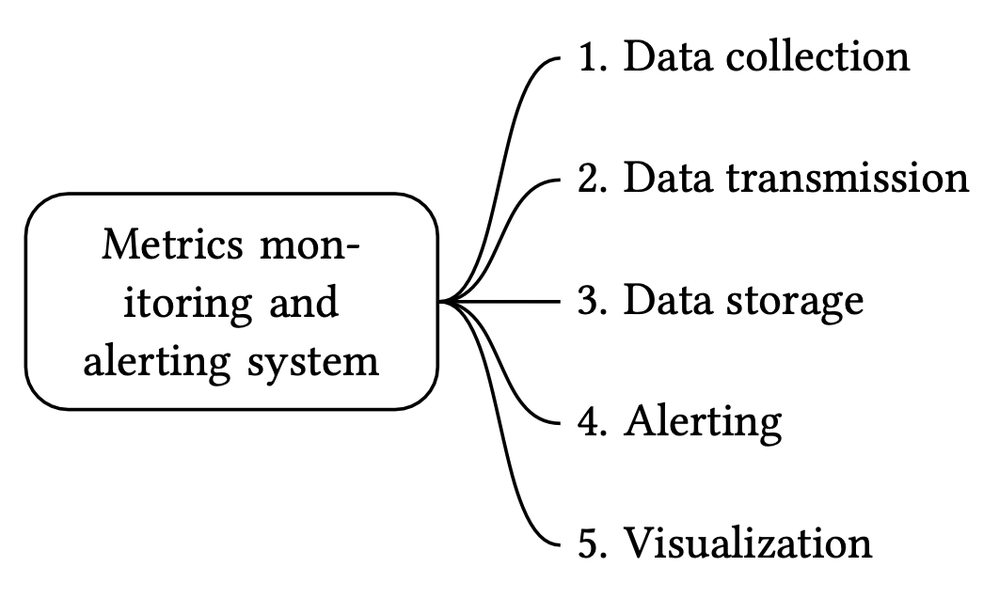

*Figure 2: Five components of the system*

1. **Data collection:** collect metric data from different sources.
2. **Data transmission:** transfer data from sources to the metrics monitoring system.
3. **Data storage:** organize and store incoming data.
4. **Alerting:** analyze incoming data, detect anomalies, and generate alerts. The system must be able to send alerts to different communication channels.
5. **Visualization:** present data in graphs, charts, etc. Engineers are better at identifying patterns, trends, or problems when data is presented visually, so we need visualization functionality.

### Data model

Metrics data is usually recorded as a time series that contains a set of values with their associated timestamps. The series itself can be uniquely identified by its name, and optionally by a set of labels.

Let's take a look at two examples.

**Example 1:** What is the CPU load on production server instance i631 at 20:00?

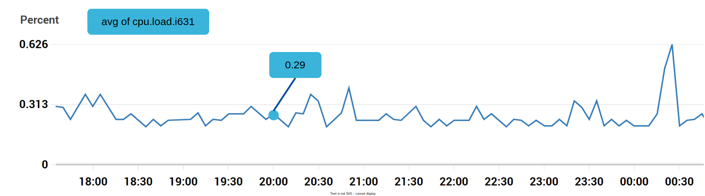

*Figure 3: CPU load*

The data point highlighted in Figure 3 can be represented by Table 1.

| metric_name | cpu.load |
|-------------|----------|
| labels      | host:i631,env:prod |
| timestamp   | 1613707265 |
| value       | 0.29 |

*Table 1: The data point represented by a table*

In this example, the time series is represented by the metric name, the labels (host:i631,env:prod), and a single point value at a specific time.

**Example 2:** What is the average CPU load across all web servers in the us-west region for the last 10 minutes? Conceptually, we would pull up something like this from storage where the metric name is "CPU.load" and the region label is "us-west":

```
CPU.load host=webserver01,region=us-west 1613707265 50
CPU.load host=webserver01,region=us-west 1613707265 62
CPU.load host=webserver02,region=us-west 1613707265 43
CPU.load host=webserver02,region=us-west 1613707265 53
...
CPU.load host=webserver01,region=us-west 1613707265 76
CPU.load host=webserver01,region=us-west 1613707265 83
```

The average CPU load could be computed by averaging the values at the end of each line. The format of the lines in the above example is called the line protocol. It is a common input format for many monitoring software in the market. Prometheus [6] and OpenTSDB [7] are two examples.

Every time series consists of the following [8]:

| Name | Type |
|------|------|
| A metric name | String |
| A set of tags/labels | List of <key:value> pairs |
| An array of values and their timestamps | An array of <value, timestamp> pairs |

*Table 2: Time series*

### Data access pattern

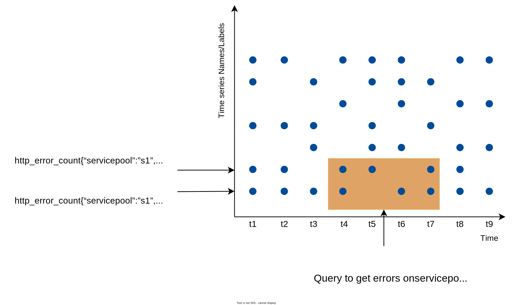

*Figure 4: Data access pattern*

In Figure 4, each label on the y-axis represents a time series (uniquely identified by the names and labels) while the x-axis represents time.

The write load is heavy. As you can see, there can be many time-series data points written at any moment. As we mentioned in the "High-level requirements" section, about 10 million operational metrics are written per day, and many metrics are collected at high frequency, so the traffic is undoubtedly write-heavy.

At the same time, the read load is spiky. Both visualization and alerting services send queries to the database, and depending on the access patterns of the graphs and alerts, the read volume could be bursty.

In other words, the system is under constant heavy write load, while the read load is spiky.

### Data storage system

The data storage system is the heart of the design. It's not recommended to build your own storage system or use a general-purpose storage system (for example, MySQL) for this job.

A general-purpose database, in theory, could support time-series data, but it would require expert-level tuning to make it work at our scale. Specifically, a relational database is not optimized for operations you would commonly perform against time-series data. For example, computing the moving average in a rolling time window requires complicated SQL that is difficult to read (there is an example of this in the deep dive section). Besides, to support tagging/labeling data, we need to add an index for each tag. Moreover, a general-purpose relational database does not perform well under constant heavy write load. At our scale, we would need to expend significant effort in tuning the database, and even then, it might not perform well.

How about NoSQL? In theory, a few NoSQL databases on the market could handle time-series data effectively. For example, Cassandra and Bigtable [9] can both be used for time series data. However, this would require deep knowledge of the internal workings of each NoSQL to devise a scalable schema for effectively storing and querying time-series data. With industrial-scale time-series databases readily available, using a general-purpose NoSQL database is not appealing.

There are many storage systems available that are optimized for time-series data. The optimization lets us use far fewer servers to handle the same volume of data. Many of these databases also have custom query interfaces specially designed for the analysis of time-series data that are much easier to use than SQL. Some even provide features to manage data retention and data aggregation. Here are a few examples of time-series databases.

OpenTSDB is a distributed time-series database, but since it is based on Hadoop and HBase, running a Hadoop/HBase cluster adds complexity. Twitter uses MetricsDB [10], and Amazon offers Timestream as a time-series database [11]. According to DB-engines [12], the two most popular time-series databases are InfluxDB [13] and Prometheus, which are designed to store large volumes of time-series data and quickly perform real-time analysis on that data. Both of them primarily rely on an in-memory cache and on-disk storage. And they both handle durability and performance quite well. As shown in Figure 5, an InfluxDB with 8 cores and 32GB RAM can handle over 250,000 writes per second.

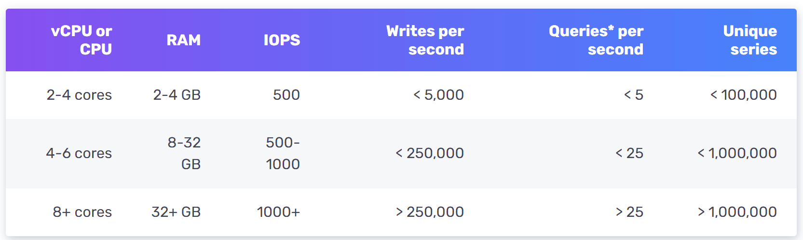

*Figure 5: InfluxDb benchmarking*

Since a time-series database is a specialized database, you are not expected to understand the internals in an interview unless you explicitly mentioned it in your resume. For the purpose of an interview, it's important to understand the metrics data are time-series in nature and we can select time-series databases such as InfluxDB for storage to store them.

Another feature of a strong time-series database is efficient aggregation and analysis of a large amount of time-series data by labels, also known as tags in some databases. For example, InfluxDB builds indexes on labels to facilitate the fast lookup of time-series by labels [13]. It provides clear best-practice guidelines on how to use labels, without overloading the database. The key is to make sure each label is of low cardinality (having a small set of possible values). This feature is critical for visualization, and it would take a lot of effort to build this with a general-purpose database.

### High-level design

The high-level design diagram is shown in Figure 6.

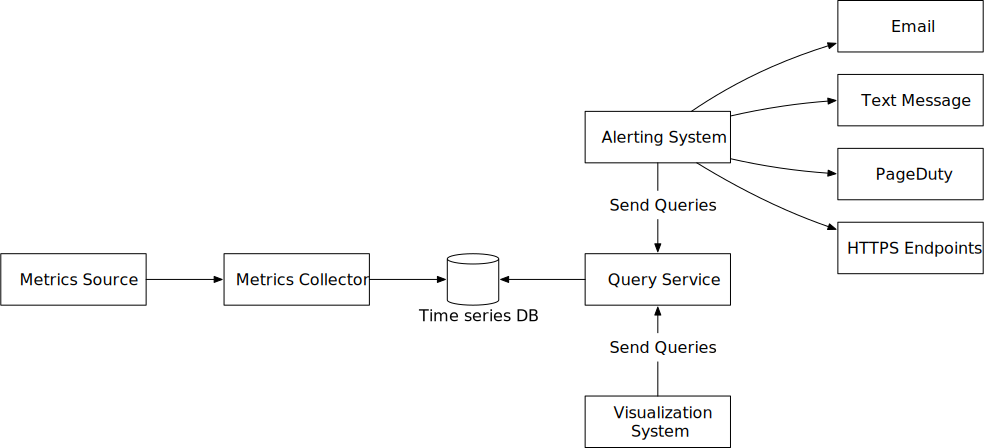

*Figure 6: High-level design*

- **Metrics source.** This can be application servers, SQL databases, message queues, etc.
- **Metrics collector.** It gathers metrics data and writes data into the time-series database.
- **Time-series database.** This stores metrics data as time series. It usually provides a custom query interface for analyzing and summarizing a large amount of time-series data. It maintains indexes on labels to facilitate the fast lookup of time-series data by labels.
- **Query service.** The query service makes it easy to query and retrieve data from the time-series database. This should be a very thin wrapper if we choose a good time-series database. It could also be entirely replaced by the time-series database's own query interface.
- **Alerting system.** This sends alert notifications to various alerting destinations.
- **Visualization system.** This shows metrics in the form of various graphs/charts.

## Step 3 - Design Deep Dive

In a system design interview, candidates are expected to dive deep into a few key components or flows. In this section, we investigate the following topics in detail:

- Metrics collection
- Scaling the metrics transmission pipeline
- Query service
- Storage layer
- Alerting system
- Visualization system

### Metrics collection

For metrics collection like counters or CPU usage, occasional data loss is not the end of the world. It's acceptable for clients to fire and forget. Now let's take a look at the metrics collection flow. This part of the system is inside the dashed box (Figure 7).

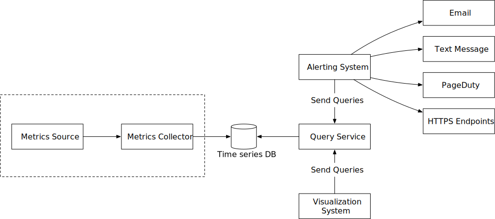

*Figure 7: Metrics collection flow*

#### Pull vs push models

There are two ways metrics data can be collected, pull or push. It is a routine debate as to which one is better and there is no clear answer. Let's take a close look.

**Pull model**

Figure 8 shows data collection with a pull model over HTTP. We have dedicated metric collectors which pull metrics values from the running applications periodically.

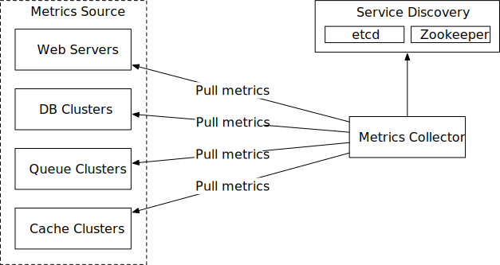

*Figure 8: Pull model*

In this approach, the metrics collector needs to know the complete list of service endpoints to pull data from. One naive approach is to use a file to hold DNS/IP information for every service endpoint on the "metric collector" servers. While the idea is simple, this approach is hard to maintain in a large-scale environment where servers are added or removed frequently, and we want to ensure that metric collectors don't miss out on collecting metrics from any new servers. The good news is that we have a reliable, scalable, and maintainable solution available through Service Discovery, provided by etcd [14], Zookeeper [15], etc., wherein services register their availability and the metrics collector can be notified by the Service Discovery component whenever the list of service endpoints changes.

Service discovery contains configuration rules about when and where to collect metrics as shown in Figure 9.

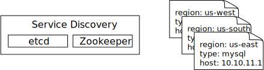

*Figure 9: Service discovery*

Figure 10 explains the pull model in detail.

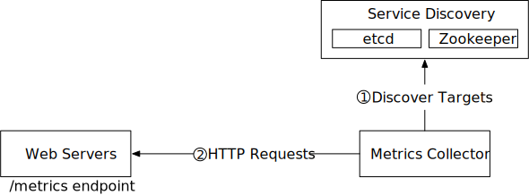

*Figure 10: Pull model in detail*

1. The metrics collector fetches configuration metadata of service endpoints from Service Discovery. Metadata include pulling interval, IP addresses, timeout and retry parameters, etc.
2. The metrics collector pulls metrics data via a pre-defined HTTP endpoint (for example, /metrics). To expose the endpoint, a client library usually needs to be added to the service. In Figure 10, the service is Web Servers.
3. Optionally, the metrics collector registers a change event notification with Service Discovery to receive an update whenever the service endpoints change. Alternatively, the metrics collector can poll for endpoint changes periodically.

At our scale, a single metrics collector will not be able to handle thousands of servers. We must use a pool of metrics collectors to handle the demand. One common problem when there are multiple collectors is that multiple instances might try to pull data from the same resource and produce duplicate data. There must exist some coordination scheme among the instances to avoid this.

One potential approach is to designate each collector to a range in a consistent hash ring, and then map every single server being monitored by its unique name in the hash ring. This ensures one metrics source server is handled by one collector only. Let's take a look at an example.

As shown in Figure 11, there are four collectors and six metrics source servers. Each collector is responsible for collecting metrics from a distinct set of servers. Collector 2 is responsible for collecting metrics from server 1 and server 5.

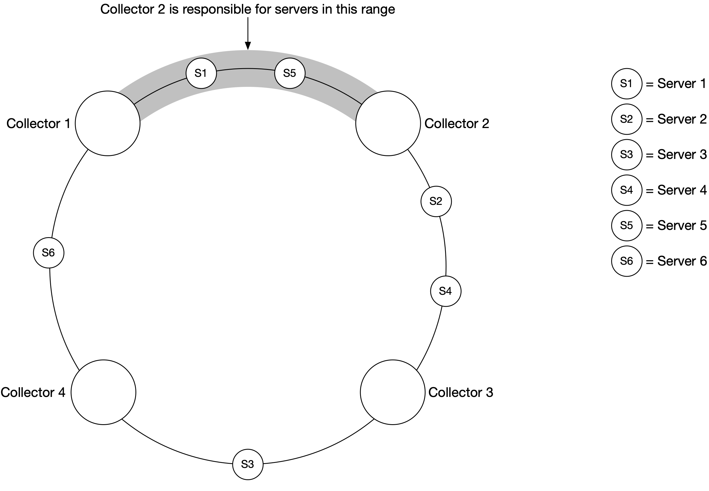

*Figure 11: Consistent hashing*

**Push model**

As shown in Figure 12, in a push model various metrics sources, such as web servers, database servers, etc., directly send metrics to the metrics collector.

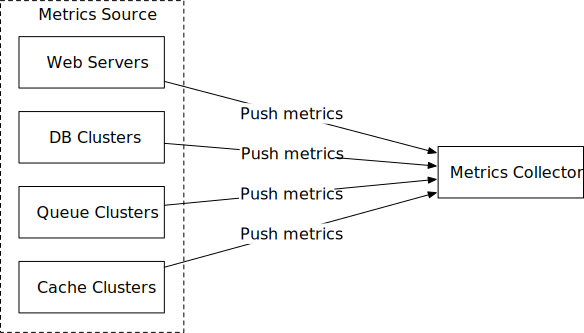

*Figure 12: Push model*

In a push model, a collection agent is commonly installed on every server being monitored. A collection agent is a piece of long-running software that collects metrics from the services running on the server and pushes those metrics periodically to the metrics collector. The collection agent may also aggregate metrics (especially a simple counter) locally, before sending them to metric collectors.

Aggregation is an effective way to reduce the volume of data sent to the metrics collector. If the push traffic is high and the metrics collector rejects the push with an error, the agent could keep a small buffer of data locally (possibly by storing them locally on disk), and resend them later. However, if the servers are in an auto-scaling group where they are rotated out frequently, then holding data locally (even temporarily) might result in data loss when the metrics collector falls behind.

To prevent the metrics collector from falling behind in a push model, the metrics collector should be in an auto-scaling cluster with a load balancer in front of it (Figure 13). The cluster should scale up and down based on the CPU load of the metric collector servers.

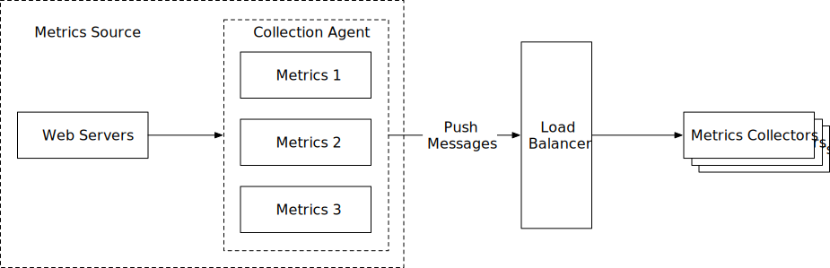

*Figure 13: Load balancer*

**Pull or push?**

So, which one is the better choice for us? Just like many things in life, there is no clear answer. Both sides have widely adopted real-world use cases.

- Examples of pull architectures include Prometheus.
- Examples of push architectures include Amazon CloudWatch [16] and Graphite [17].

Knowing the advantages and disadvantages of each approach is more important than picking a winner during an interview. Table 3 compares the pros and cons of push and pull architectures [18] [19] [20] [21].

| | Pull | Push |
|---|---|---|
| **Easy debugging** | The /metrics endpoint on application servers used for pulling metrics can be used to view metrics at any time. You can even do this on your laptop. Pull wins. | If the metrics collector doesn't receive metrics, the problem might be caused by network issues. |
| **Health check** | If an application server doesn't respond to the pull, you can quickly figure out if an application server is down. Pull wins. | If the metrics collector doesn't receive metrics, the problem might be caused by network issues. |
| **Short-lived jobs** | | Some of the batch jobs might be short-lived and don't last long enough to be pulled. Push wins. This can be fixed by introducing push gateways for the pull model [22]. |
| **Firewall or complicated network setups** | Having servers pulling metrics requires all metric endpoints to be reachable. This is potentially problematic in multiple data center setups. It might require a more elaborate network infrastructure. | If the metrics collector is set up with a load balancer and an auto-scaling group, it is possible to receive data from anywhere. Push wins. |
| **Performance** | Pull methods typically use TCP. | Push methods typically use UDP. This means the push method provides lower-latency transports of metrics. The counterargument here is that the effort of establishing a TCP connection is small compared to sending the metrics payload. |
| **Data authenticity** | Application servers to collect metrics from are defined in config files in advance. Metrics gathered from those servers are guaranteed to be authentic. | Any kind of client can push metrics to the metrics collector. This can be fixed by whitelisting servers from which to accept metrics, or by requiring authentication. |

*Table 3: Pull vs push*

As mentioned above, pull vs push is a routine debate topic and there is no clear answer. A large organization probably needs to support both, especially with the popularity of serverless [23] these days. There might not be a way to install an agent from which to push data in the first place.

### Scale the metrics transmission pipeline

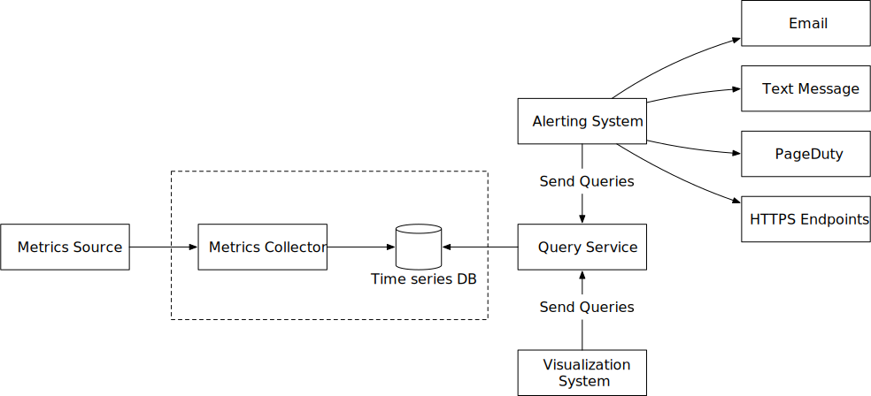

*Figure 14: Metrics transmission pipeline*

Let's zoom in on the metrics collector and time-series databases. Whether you use the push or pull model, the metrics collector is a cluster of servers, and the cluster receives enormous amounts of data. For either push or pull, the metrics collector cluster is set up for auto-scaling, to ensure that there are an adequate number of collector instances to handle the demand.

However, there is a risk of data loss if the time-series database is unavailable. To mitigate this problem, we introduce a queueing component as shown in Figure 15.

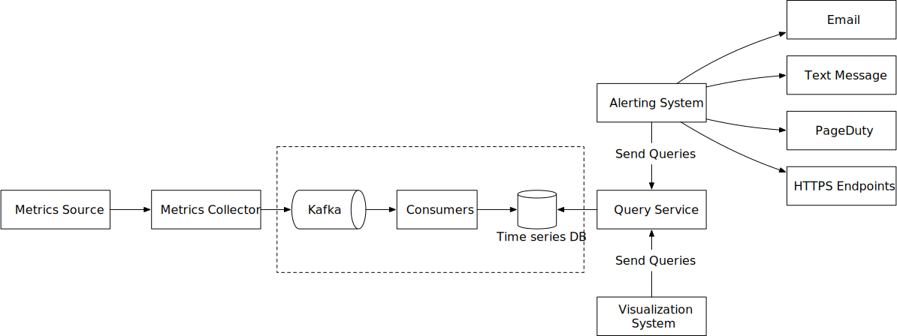

*Figure 15: Add queues*

In this design, the metrics collector sends metrics data to queuing systems like Kafka. Then consumers or streaming processing services such as Apache Storm, Flink, and Spark, process and push data to the time-series database. This approach has several advantages:

- Kafka is used as a highly reliable and scalable distributed messaging platform.
- It decouples the data collection and data processing services from each other.
- It can easily prevent data loss when the database is unavailable, by retaining the data in Kafka.

**Scale through Kafka**

There are a couple of ways that we can leverage Kafka's built-in partition mechanism to scale our system.

- Configure the number of partitions based on throughput requirements.
- Partition metrics data by metric names, so consumers can aggregate data by metrics names.

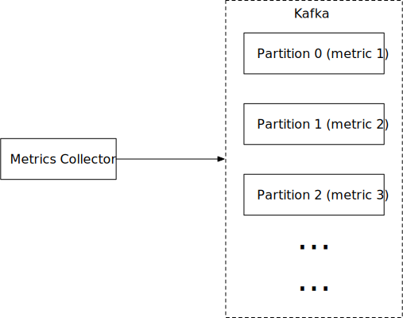

*Figure 16: Kafka partition*

- Further partition metrics data with tags/labels.
- Categorize and prioritize metrics so that important metrics can be processed first.

**Alternative to Kafka**

Maintaining a production-scale Kafka system is no small undertaking. You might get pushback from the interviewer about this. There are large-scale monitoring ingestion systems in use without using an intermediate queue. Facebook's Gorilla [24] in-memory time-series database is a prime example; it is designed to remain highly available for writes, even when there is a partial network failure. It could be argued that such a design is as reliable as having an intermediate queue like Kafka.

**Where aggregations can happen**

Metrics can be aggregated in different places; in the collection agent (on the client-side), the ingestion pipeline (before writing to storage), and the query side (after writing to storage). Let's take a closer look at each of them.

- **Collection agent.** The collection agent installed on the client-side only supports simple aggregation logic. For example, aggregate a counter every minute before it is sent to the metrics collector.
- **Ingestion pipeline.** To aggregate data before writing to the storage, we usually need stream processing engines such as Flink. The write volume will be significantly reduced since only the calculated result is written to the database. However, handling late-arriving events could be a challenge and another downside is that we lose data precision and some flexibility because we no longer store the raw data.
- **Query side.** Raw data can be aggregated over a given time period at query time. There is no data loss with this approach, but the query speed might be slower because the query result is computed at query time and is run against the whole dataset.

### Query service

The query service comprises a cluster of query servers, which access the time-series databases and handle requests from the visualization or alerting systems. Having a dedicated set of query servers decouples time-series databases from the clients (visualization and alerting systems). And this gives us the flexibility to change the time-series database or the visualization and alerting systems, whenever needed.

**Cache layer**

To reduce the load of the time-series database and make query service more performant, cache servers are added to store query results, as shown in Figure 17.

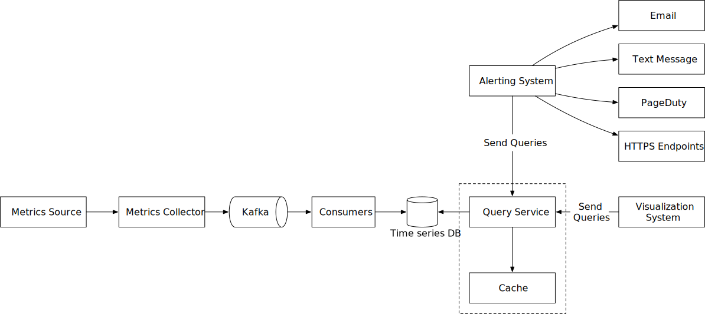

*Figure 17: Cache layer*

**The case against query service**

There might not be a pressing need to introduce our own abstraction (a query service) because most industrial-scale visual and alerting systems have powerful plugins to interface with well-known time-series databases on the market. And with a well-chosen time-series database, there is no need to add our own caching, either.

**Time-series database query language**

Most popular metrics monitoring systems like Prometheus and InfluxDB don't use SQL and have their own query languages. One major reason for this is that it is hard to build SQL queries to query time-series data. For example, as mentioned here [25], computing an exponential moving average might look like this in SQL:

```sql
select id,
       temp,
       avg(temp) over (partition by group_nr order by time_read) as rolling_avg
from (
  select id,
         temp,
         time_read,
         interval_group,
         id - row_number() over (partition by interval_group order by time_read) as group_nr
  from (
    select id,
    time_read,
    "epoch"::timestamp + "900 seconds"::interval * (extract(epoch from time_read)::int4 / 900) as interval_group,
    temp
    from readings
  ) t1
) t2
order by time_read;
```

While in Flux, a language that's optimized for time-series analysis (used in InfluxDB), it looks like this. As you can see, it's much easier to understand.

```flux
from(db:"telegraf")
  |> range(start:-1h)
  |> filter(fn: (r) => r._measurement == "foo")
  |> exponentialMovingAverage(size:-10s)
```

### Storage layer

Now let's dive into the storage layer.

**Choose a time-series database carefully**

According to a research paper published by Facebook [24], at least 85% of all queries to the operational data store were for data collected in the past 26 hours. If we use a time-series database that harnesses this property, it could have a significant impact on overall system performance. If you are interested in the design of the storage engine, please refer to the design document of the Influx DB storage engine [26].

**Space optimization**

As explained in high-level requirements, the amount of metric data to store is enormous. Here are a few strategies for tackling this.

**Data encoding and compression**

Data encoding and compression can significantly reduce the size of data. Those features are usually built into a good time-series database. Here is a simple example.


*Figure 18: Data encoding*

As you can see in the image above, 1610087371 and 1610087381 differ by only 10 seconds, which takes only 4 bits to represent, instead of the full timestamp of 32 bits. So, rather than storing absolute values, the delta of the values can be stored along with one base value like: 1610087371, 10, 10, 9, 11

**Downsampling**

Downsampling is the process of converting high-resolution data to low-resolution to reduce overall disk usage. Since our data retention is 1 year, we can downsample old data. For example, we can let engineers and data scientists define rules for different metrics. Here is an example:

- Retention: 7 days, no sampling
- Retention: 30 days, downsample to 1-minute resolution
- Retention: 1 year, downsample to 1-hour resolution

Let's take a look at another concrete example. It aggregates 10-second resolution data to 30-second resolution data.

| metric | timestamp | hostname | Metric_value |
|--------|-----------|----------|--------------|
| cpu | 2021-10-24T19:00:00Z | host-a | 10 |
| cpu | 2021-10-24T19:00:10Z | host-a | 16 |
| cpu | 2021-10-24T19:00:20Z | host-a | 20 |
| cpu | 2021-10-24T19:00:30Z | host-a | 30 |
| cpu | 2021-10-24T19:00:40Z | host-a | 20 |
| cpu | 2021-10-24T19:00:50Z | host-a | 30 |

*Table 4: 10-second resolution data*

Rollup from 10-second resolution data to 30-second resolution data.

| metric | timestamp | hostname | Metric_value (avg) |
|--------|-----------|----------|-------------------|
| cpu | 2021-10-24T19:00:00Z | host-a | 19 |
| cpu | 2021-10-24T19:00:30Z | host-a | 25 |

*Table 5: 30-second resolution data*

**Cold storage**

Cold storage is the storage of inactive data that is rarely used. The financial cost for cold storage is much lower.

In a nutshell, we should probably use third-party visualization and alerting systems, instead of building our own.

### Alerting system

For the purpose of the interview, let's look at the alerting system, shown in Figure 19 below.

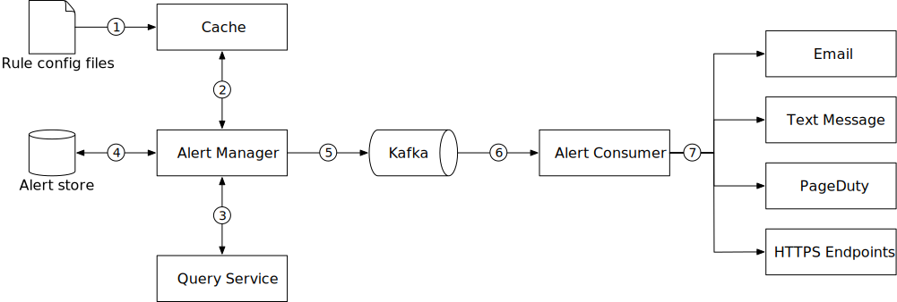

*Figure 19: Alerting system*

The alert flow works as follows:

1. Load config files to cache servers. Rules are defined as config files on the disk. YAML [27] is a commonly used format to define rules. Here is an example of alert rules:

```yaml
- name: instance_down
  rules:
  # Alert for any instance that is unreachable for >5 minutes.
  - alert: instance_down
    expr: up == 0
    for: 5m
    labels:
      severity: page
```

2. The alert manager fetches alert configs from the cache.

3. Based on config rules, the alert manager calls the query service at a predefined interval. If the value violates the threshold, an alert event is created. The alert manager is responsible for the following:

   - Filter, merge, and dedupe alerts. Here is an example of merging alerts that are triggered within one instance within a short amount of time (instance1) (Figure 20).

   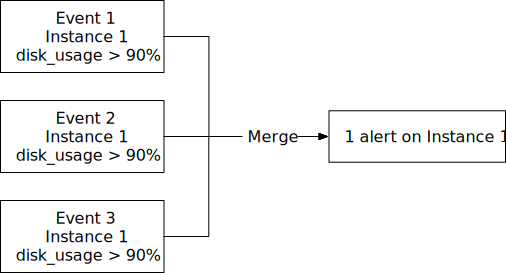

   *Figure 20: Merge alerts*

   - Access control. To avoid human error and keep the system secure, it is essential to restrict access to certain alert management operations to authorized individuals only.
   - Retry. The alert manager checks alert states and ensures a notification is sent at least once.

4. The alert store is a key-value database, such as Cassandra, that keeps the state (inactive, pending, firing, resolved) of all alerts. It ensures a notification is sent at least once.

5. Eligible alerts are inserted into Kafka.

6. Alert consumers pull alert events from Kafka.

7. Alert consumers process alert events from Kafka and send notifications over to different channels such as email, text message, PagerDuty, or HTTP endpoints.

**Alerting system - build vs buy**

There are many industrial-scale alerting systems available off-the-shelf, and most provide tight integration with the popular time-series databases. Many of these alerting systems integrate well with existing notification channels, such as email and PagerDuty. In the real world, it is a tough call to justify building your own alerting system. In interview settings, especially for a senior position, be ready to justify your decision.

### Visualization system

Visualization is built on top of the data layer. Metrics can be shown on the metrics dashboard over various time scales and alerts can be shown on the alerts dashboard. Figure 21 shows a dashboard that displays some of the metrics like the current server requests, memory/CPU utilization, page load time, traffic, and login information [28].

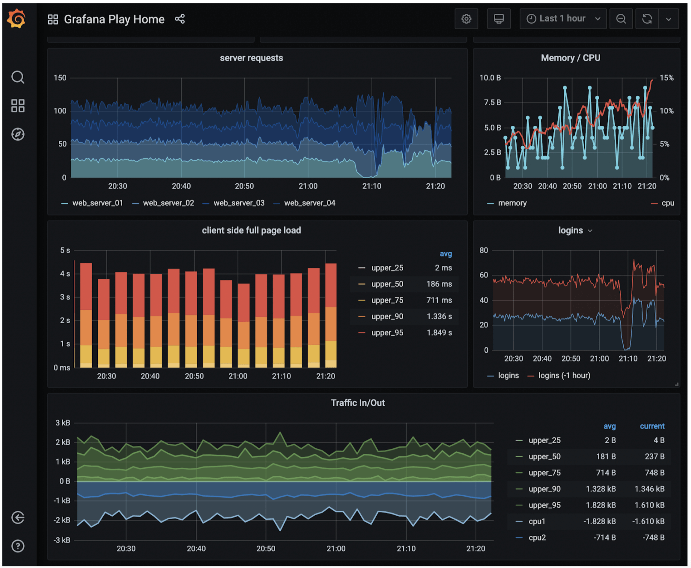

*Figure 21: Grafana UI*

A high-quality visualization system is hard to build. The argument for using an off-the-shelf system is very strong. For example, Grafana can be a very good system for this purpose. It integrates well with many popular time-series databases which you can buy.

## Step 4 - Wrap Up

In this chapter, we presented the design for a metrics monitoring and alerting system. At a high level, we talked about data collection, time-series database, alerts, and visualization. Then we went in-depth into some of the most important techniques/components:

- Pull vs push model for collecting metrics data.
- Utilize Kafka to scale the system.
- Choose the right time-series database.
- Use downsampling to reduce data size.
- Build vs buy options for alerting and visualization systems.

We went through a few iterations to refine the design, and our final design looks like this:

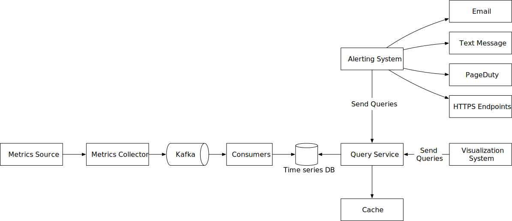

*Figure 22: Final design*

Congratulations on getting this far! Now give yourself a pat on the back. Good job!

## Reference Materials

[1] Datadog: https://www.datadoghq.com/

[2] Splunk: https://www.splunk.com/

[3] Elastic stack: https://www.elastic.co/elastic-stack

[4] Dapper, a Large-Scale Distributed Systems Tracing Infrastructure: https://research.google/pubs/pub36356/

[5] Distributed Systems Tracing with Zipkin: https://blog.twitter.com/engineering/en_us/a/2012/distributed-systems-tracing-with-zipkin.html

[6] Prometheus: https://prometheus.io/docs/introduction/overview/

[7] OpenTSDB - A Distributed, Scalable Monitoring System: http://opentsdb.net/

[8] Data model: https://prometheus.io/docs/concepts/data_model/

[9] Schema design for time-series data | Cloud Bigtable Documentation: https://cloud.google.com/bigtable/docs/schema-design-time-series

[10] MetricsDB: TimeSeries Database for storing metrics at Twitter: https://blog.twitter.com/engineering/en_us/topics/infrastructure/2019/metricsdb.html

[11] Amazon Timestream: https://aws.amazon.com/timestream/

[12] DB-Engines Ranking of time-series DBMS: https://db-engines.com/en/ranking/time+series+dbms

[13] InfluxDB: https://www.influxdata.com/

[14] etcd: https://etcd.io

[15] Service Discovery with Zookeeper: https://cloud.spring.io/spring-cloud-zookeeper/1.2.x/multi/multi_spring-cloud-zookeeper-discovery.html

[16] Amazon CloudWatch: https://aws.amazon.com/cloudwatch/

[17] Graphite: https://graphiteapp.org/

[18] Push vs Pull: http://bit.ly/3aJEPxE

[19] Pull doesn't scale - or does it?: https://prometheus.io/blog/2016/07/23/pull-does-not-scale-or-does-it/

[20] Monitoring Architecture: https://developer.lightbend.com/guides/monitoring-at-scale/monitoring-architecture/architecture.html

[21] Push vs Pull in Monitoring Systems: https://giedrius.blog/2019/05/11/push-vs-pull-in-monitoring-systems/

[22] Pushgateway: https://github.com/prometheus/pushgateway

[23] Building Applications with Serverless Architectures: https://aws.amazon.com/lambda/serverless-architectures-learn-more/

[24] Gorilla: A Fast, Scalable, In-Memory Time Series Database: http://www.vldb.org/pvldb/vol8/p1816-teller.pdf

[25] Why We're Building Flux, a New Data Scripting and Query Language: https://www.influxdata.com/blog/why-were-building-flux-a-new-data-scripting-and-query-language/

[26] InfluxDB storage engine: https://docs.influxdata.com/influxdb/v2.0/reference/internals/storage-engine/

[27] YAML: https://en.wikipedia.org/wiki/YAML

[28] Grafana Demo: https://play.grafana.org/

