# 24 - Distributed Email Service

In this chapter we design a large-scale email service, such as Gmail, Outlook, or Yahoo Mail. The growth of the internet has led to an explosion in the volume of emails. In 2020, Gmail had over 1.8 billion active users and Outlook had over 400 million users worldwide [1] [2].


*Figure 1: Popular email providers*

## Step 1 - Understand the Problem and Establish Design Scope

Over the years, email services have changed significantly in complexity and scale. A modern email service is a complex system with many features. There is no way we can design a real-world system in 45 minutes. So before jumping into the design, we definitely want to ask clarifying questions to narrow down the scope.

**Candidate:** How many people use the product?

**Interviewer:** One billion users.

**Candidate:** I think the following features are important:

- Authentication.
- Send and receive emails.
- Fetch all emails.
- Filter emails by read and unread status.
- Search emails by subject, sender, and body.
- Anti-spam and anti-virus.

**Interviewer:** That's a good list. We don't need to worry about authentication. Let's focus on the other features you mentioned.

**Candidate:** How do users connect with mail servers?

**Interviewer:** Traditionally, users connect with mail servers through native clients that use SMTP, POP, IMAP, and vendor-specific protocols. Those protocols are legacy to some extent, yet still very popular. For this interview, let's assume HTTP is used for client and server communication.

**Candidate:** Can emails have attachments?

**Interviewer:** Yes.

### Non-functional requirements

Next, let's go over the most important non-functional requirements.

- **Reliability.** We should not lose email data.
- **Availability.** Email and user data should be automatically replicated across multiple nodes to ensure availability. Besides, the system should continue to function despite partial system failures.
- **Scalability.** As the number of users grows, the system should be able to handle the increasing number of users and emails. The performance of the system should not degrade with more users or emails.
- **Flexibility and extensibility.** A flexible/extensible system allows us to add new features or improve performance easily by adding new components. Traditional email protocols such as POP and IMAP have very limited functionality (more on this in high-level design). Therefore, we may need custom protocols to satisfy the flexibility and extensibility requirements.

### Back-of-the-envelope estimation

Let's do a back-of-the-envelope calculation to determine the scale and to discover some challenges our solution will need to address. By design, emails are storage heavy applications.

- 1 billion users.
- Assume the average number of emails a person sends per day is 10. QPS for sending emails = 10^9 * 10 / (10^5) = 100,000.
- Assume the average number of emails a person receives in a day is 40 [3] and the average size of email metadata is 50KB. Metadata refers to everything related to an email, excluding attachment files.
- Assume metadata is stored in a database. Storage requirement for maintaining metadata in 1 year: 1 billion users * 40 emails / day * 365 days * 50 KB = 730 PB.
- Assume 20% of emails contain an attachment and the average attachment size is 500 KB.
- Storage for attachments in 1 year is: 1 billion users * 40 emails / day * 365 days * 20% * 500 KB = 1,460 PB

From this back-of-the-envelope calculation, it's clear we would deal with a lot of data. So, it's likely that we need a distributed database solution.

## Step 2 - Propose High-Level Design and Get Buy-In

In this section, we first discuss some basics about email servers and how email servers evolve over time. Then we look at the high-level design of distributed email servers. The content is structured as follows:

- Email knowledge 101
- Traditional mail servers
- Distributed mail servers

### Email knowledge 101

There are various email protocols that are used to send and receive emails. Historically, most mail servers use email protocols such as POP, IMAP, and SMTP.

**Email protocols**

- **SMTP:** Simple Mail Transfer Protocol (SMTP) is the standard protocol for sending emails from one mail server to another.
- The most popular protocols for retrieving emails are known as Post Office Protocol (POP) and the Internet Mail Access Protocol (IMAP).
- **POP** is a standard mail protocol to receive and download emails from a remote mail server to a local email client. Once emails are downloaded to your computer or phone, they are deleted from the email server, which means you can only access emails on one computer or phone. The details of POP are covered in RFC 1939 [4]. POP requires mail clients to download the entire email. This can take a long time if an email contains a large attachment.
- **IMAP** is also a standard mail protocol for receiving emails for a local email client. When you read an email, you are connected to an external mail server, and data is transferred to your local device. IMAP only downloads a message when you click it, and emails are not deleted from mail servers, meaning that you can access emails from multiple devices. IMAP is the most widely used protocol for individual email accounts. It works well when the connection is slow because only the email header information is downloaded until opened.
- **HTTPS** is not technically a mail protocol, but it can be used to access your mailbox, particularly for web-based email. For example, it's common for Microsoft Outlook to talk to mobile devices over HTTPS, on a custom-made protocol called ActiveSync [5].

**Domain name service (DNS)**

A DNS server is used to look up the mail exchanger record (MX record) for the recipient's domain. If you run DNS lookup for gmail.com from the command line, you may get MX records as shown in Figure 2.

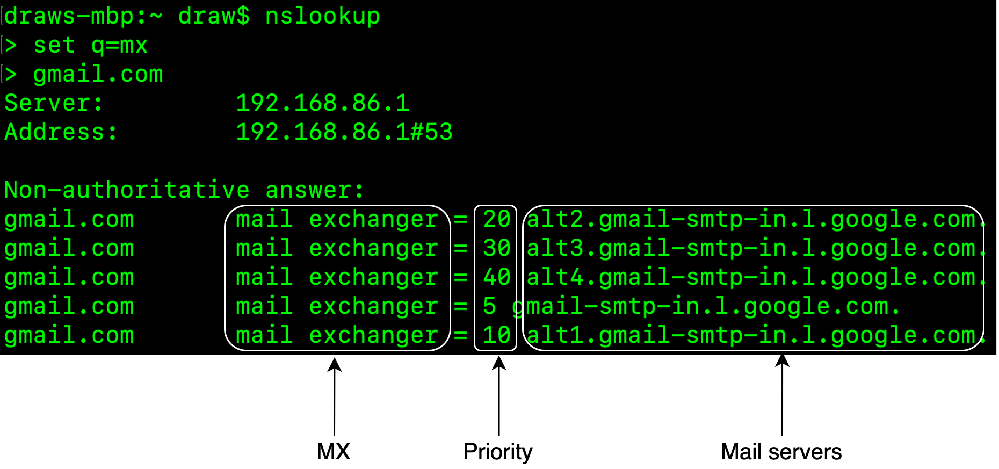

*Figure 2: MX records*

The priority numbers indicate preferences, where the mail server with a lower priority number is more preferred. In Figure 2, gmail-smtp-in.l.google.com is used first (priority 5). A sending mail server will attempt to connect and send messages to this mail server first. If the connection fails, the sending mail server will attempt to connect to the mail server with the next lowest priority, which is alt1.gmail-smtp-in.l.google.com (priority 10).

**Attachment**

An email attachment is sent along with an email message, commonly with Base64 encoding [6]. There is usually a size limit for an email attachment. For example, Outlook and Gmail limit the size of attachments to 20MB and 25MB respectively as of June 2021. This number is highly configurable and varies from individual to corporate accounts. Multipurpose Internet Mail Extension (MIME) [7] is a specification that allows the attachment to be sent over the internet.

### Traditional mail servers

Before we dive into distributed mail servers, let's dig a little bit through the history and see how traditional mail servers work, as doing so provides good lessons about how to scale an email server system. You can consider a traditional mail server as a system that works when there are limited email users, usually on a single server.

**Traditional mail server architecture**

Figure 3 describes what happens when Alice sends an email to Bob, using traditional email servers.

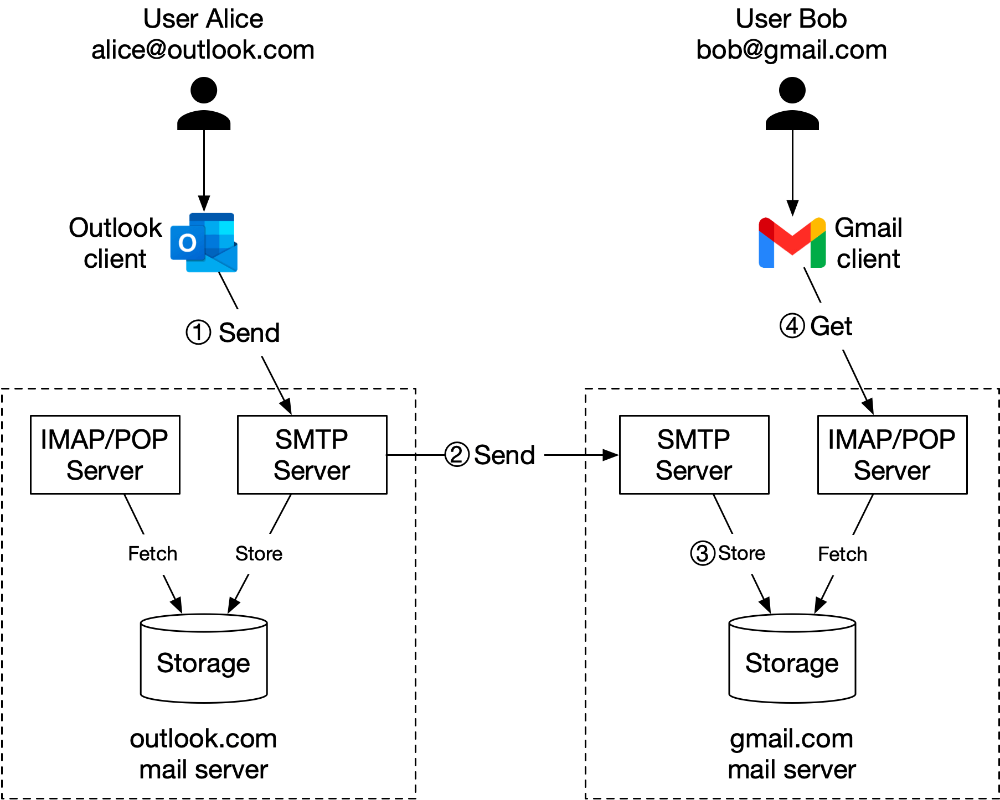

*Figure 3: Traditional mail servers*

The process consists of 4 steps:

1. Alice logs in to her Outlook client, composes an email, and presses the "send" button. The email is sent to the Outlook mail server. The communication protocol between the Outlook client and the mail server is SMTP.

2. Outlook mail server queries the DNS (not shown in the diagram) to find the address of the recipient's SMTP server. In this case, it is Gmail's SMTP server. Next, it transfers the email to the Gmail mail server. The communication protocol between the mail servers is SMTP.

3. The Gmail server stores the email and makes it available to Bob, the recipient.

4. Gmail client fetches new emails through the IMAP/POP server when Bob logs in to Gmail.

**Storage**

In a traditional mail server, emails were stored in local file directories and each email was stored in a separate file with a unique name. Each user maintained a user directory to store configuration data and mailboxes. Maildir was a popular way to store email messages on the mail server (Figure 4).

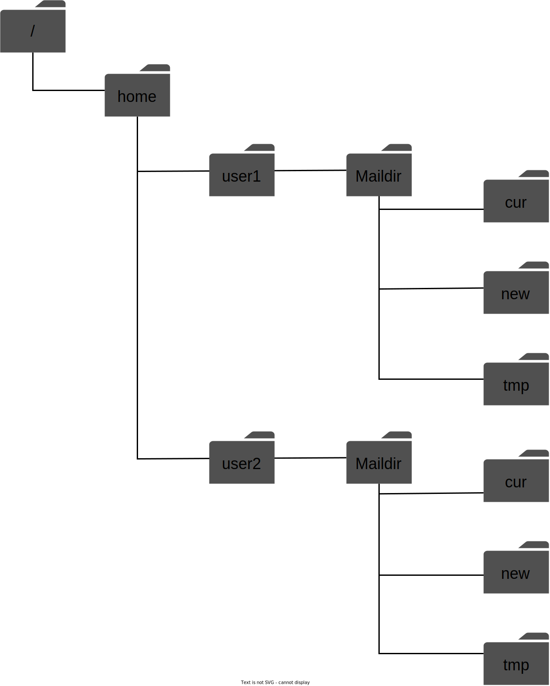

*Figure 4: Maildir*

File directories worked well when the user base was small, but it was challenging to retrieve and backup billions of emails. As the email volume grew and the file structure became more complex, disk I/O became a bottleneck. The local directories also don't satisfy our high availability and reliability requirements. The disk can be damaged and servers can go down. We need a more reliable distributed storage layer.

Email functionality has come a long way since it was invented in the 1960s, from text-based format to rich features such as multimedia, threading [8], search, labels, and more. But email protocols (POP, IMAP, and SMTP) were invented a long time ago and they were not designed to support these new features, nor were they scalable to support billions of users.

### Distributed mail servers

Distributed mail servers are designed to support modern use cases and solve the problems of scale and resiliency. This section covers email APIs, distributed email server architecture, email sending, and email receiving flows.

**Email APIs**

Email APIs can mean very different things for different mail clients, or at different stages of an email's life cycle. For example;

- SMTP/POP/IMAP APIs for native mobile clients.
- SMTP communications between sender and receiver mail servers.
- RESTful API over HTTP for full-featured and interactive web-based email applications.

Due to the length limitations of this book, we cover only some of the most important APIs for webmail. A common way for webmail to communicate is through the HTTP protocol.

1. **Endpoint: POST /v1/messages**

   Sends a message to the recipients in the To, Cc, and Bcc headers.

2. **Endpoint: GET /v1/folders**

   Returns all folders of an email account.

   Response:

   ```json
   [{
     id: string,        // Unique folder identifier.
     name: string,      // Name of the folder.
                        // According to RFC6154 [9], the default folders can be one of
                        // the following: All, Archive, Drafts, Flagged, Junk, Sent,
                        // and Trash.
     user_id: string    // Reference to the account owner
   }]
   ```

3. **Endpoint: GET /v1/folders/{:folder_id}/messages**

   Returns all messages under a folder. Keep in mind this is a highly simplified API. In reality, this needs to support pagination.

   Response:

   List of message objects.

4. **Endpoint: GET /v1/messages/{:message_id}**

   Gets all information about a specific message. Messages are core building blocks for an email application, containing information about the sender, recipients, message subject, body, attachments, etc.

   Response:

   A message's object.

   ```json
   {
     user_id: string,                      // Reference to the account owner.
     from: {name: string, email: string},  // <name, email> pair of the sender.
     to: [{name: string, email: string}],   // A list of <name, email> pairs
     subject: string,                        // Subject of an email
     body: string,                           // Message body
     is_read: boolean                        // Indicate if a message is read or not.
   }
   ```

**Distributed mail server architecture**

While it is easy to set up an email server that handles a small number of users, it is difficult to scale beyond one server. This is mainly because traditional email servers were designed to work with a single server only. Synchronizing data across servers can be difficult, and keeping emails from being misclassified as spam by recipients' mail servers is very challenging. In this section, we explore how to leverage cloud technologies to make it easier. The high-level design is shown in Figure 5.


*Figure 5: High-level design*

Let us take a close look at each component.

- **Webmail.** Users use web browsers to receive and send emails.
- **Web servers.** Web servers are public-facing request/response services, used to manage features such as login, signup, user profile, etc. In our design, all email API requests, such as sending an email, loading mail folders, loading all mails in a folder, etc., go through web servers.
- **Real-time servers.** Real-time servers are responsible for pushing new email updates to clients in real-time. Real-time servers are stateful servers because they need to maintain persistent connections. To support real-time communication we have a few options, such as long polling and WebSocket. WebSocket is a more elegant solution, but one drawback of it is browser compatibility. A possible solution is to establish a WebSocket connection whenever possible and to use long-polling as a fallback.

  Here is an example of a real-world mail server (Apache James [10]) that implements the JSON Meta Application Protocol (JMAP) subprotocol over WebSocket [11].
- **Metadata database.** This database stores mail metadata including mail subject, body, from user, to users, etc. We discuss the database choice in the deep dive section.
- **Attachment store.** We choose object stores such as Amazon Simple Storage Service (S3) as the attachment store. S3 is a scalable storage infrastructure that's suitable for storing large files such as images, videos, files, etc. Attachments can take up to 25MB in size. NoSQL column-family databases like Cassandra might not be a good fit for the following two reasons:
  - Even though Cassandra supports blob data type and its maximum theoretical size for a blob is 2GB, the practical limit is less than 1MB [12].
  - Another problem with putting attachments in Cassandra is that we can't use a row cache as attachments take too much memory space.
- **Distributed cache.** Since the most recent emails are repeatedly loaded by a client, caching recent emails in memory significantly improves the load time. We can use Redis here because it offers rich features such as lists and it is easy to scale.
- **Search store.** The search store is a distributed document store. It uses a data structure called inverted index [13] that supports very fast full-text searches. We will discuss this in more detail in the deep dive section.

Now that we have discussed some of the most important components to build distributed mail servers, let's assemble together two main workflows.

- Email sending flow.
- Email receiving flow.

**Email sending flow**

The email sending flow is shown in Figure 6.

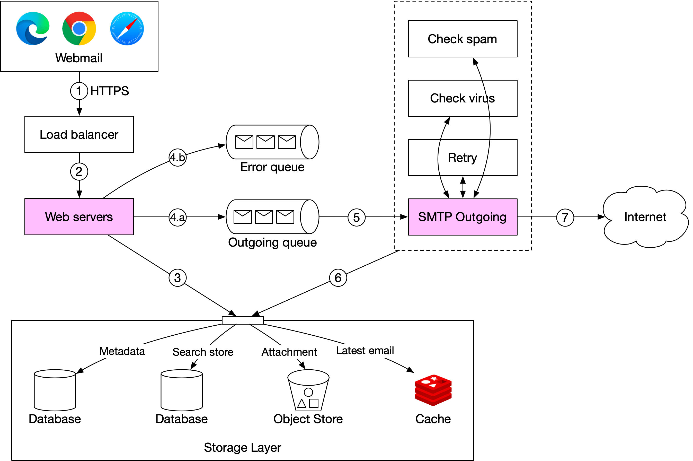

*Figure 6: Email sending flow*

1. A user writes an email on webmail and presses the "send" button. The request is sent to the load balancer.

2. The load balancer makes sure it doesn't exceed the rate limit and routes traffic to web servers.

3. Web servers are responsible for:

   3a. Basic email validation. Each incoming email is checked against pre-defined rules such as email size limit.

   3b. Checking if the domain of the recipient's email address is the same as the sender. If it is the same, the web server ensures the email data is spam and virus free. If so, email data is inserted into the sender's "Sent Folder" and recipient's "Inbox Folder". The recipient can fetch the email directly via the RESTful API. There is no need to go to step 4.

4. Message queues.

   4a. If basic email validation succeeds, the email data is passed to the outgoing queue. If the attachment is too large to fit in the queue, we could store the attachment in the object store and save the object reference in the queued message.

   4b. If basic email validation fails, the email is put in the error queue.

5. SMTP outgoing workers pull messages from the outgoing queue and make sure emails are spam and virus free.

6. The outgoing email is stored in the "Sent Folder" of the storage layer.

7. SMTP outgoing workers send the email to the recipient mail server.

Each message in the outgoing queue contains all the metadata required to create an email. A distributed message queue is a critical component that allows asynchronous mail processing. By decoupling SMTP outgoing workers from the web servers, we can scale SMTP outgoing workers independently.

We monitor the size of the outgoing queue very closely. If there are many emails stuck in the queue, we need to analyze the cause of the issue. Here are some possibilities:

- The recipient's mail server is unavailable. In this case, we need to retry sending the email at a later time. Exponential backoff [14] might be a good retry strategy.
- Not enough consumers to send emails. In this case, we may need more consumers to reduce the processing time.

**Email receiving flow**

The following diagram demonstrates the email receiving flow.

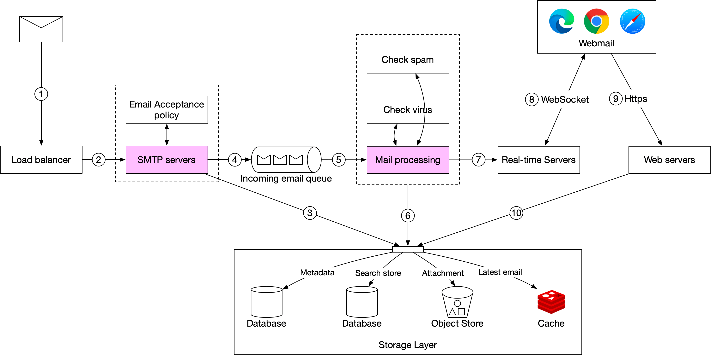

*Figure 7: Email receiving flow*

1. Incoming emails arrive at the SMTP load balancer.

2. The load balancer distributes traffic among SMTP servers. Email acceptance policy can be configured and applied at the SMTP-connection level. For example, invalid emails are bounced to avoid unnecessary email processing.

3. If the attachment of an email is too large to put into the queue, we can put it into the attachment store (s3).

4. Emails are put in the incoming email queue. The queue decouples mail processing workers from SMTP servers so they can be scaled independently. Moreover, the queue serves as a buffer in case the email volume surges.

5. Mail processing workers are responsible for a lot of tasks, including filtering out spam mails, stopping viruses, etc. The following steps assume an email passed the validation.

6. The email is stored in the mail storage, cache, and object data store.

7. If the receiver is currently online, the email is pushed to real-time servers.

8. Real-time servers are WebSocket servers that allow clients to receive new emails in real-time.

9. For offline users, emails are stored in the storage layer. When a user comes back online, the webmail client connects to web servers via RESTful API.

10. Web servers pull new emails from the storage layer and return them to the client.

## Step 3 - Design Deep Dive

Now that we have talked about all the parts of the email server, let's go deeper into some key components and examine how to scale the system.

- Metadata database
- Search
- Deliverability
- Scalability

### Metadata database

In this section, we discuss the characteristics of email metadata, choosing the right database, data model, and conversation threads (bonus point).

**Characteristics of email metadata**

- Email headers are usually small and frequently accessed.
- Email body sizes can range from small to big but are infrequently accessed. You normally only read an email once.
- Most of the mail operations, such as fetching mails, marking an email as read, and searching are isolated to an individual user. In other words, mails owned by a user are only accessible by that user and all the mail operations are performed by the same user.
- Data recency impacts data usage. Users usually only read the most recent emails. 82% of read queries are for data younger than 16 days [15].
- Data has high-reliability requirements. Data loss is not acceptable.

**Choosing the right database**

At Gmail or Outlook scale, the database system is usually custom-made to reduce input/output operations per second (IOPS) [16], as this can easily become a major constraint in the system. Choosing the right database is not easy. It is helpful to consider all the options we have on the table before deciding the most suitable one.

- **Relational database.** The main motivation behind this is to search through emails efficiently. We can build indexes for email header and body. With indexes, simple search queries are fast. However, relational databases are typically optimized for small chunks of data entries and are not ideal for large ones. A typical email is usually larger than a few KB and can easily be over 100KB when HTML is involved. You might argue that the BLOB data type is designed to support large data entries. However, search queries over unstructured BLOB data type are not efficient. So relational databases such as MySQL or PostgreSQL are not good fits.
- **Distributed object storage.** Another potential solution is to store raw emails in cloud storage such as Amazon S3, which can be a good option for backup storage, but it's hard to efficiently support features such as marking emails as read, searching emails based on keywords, threading emails, etc.
- **NoSQL databases.** Google Bigtable is used by Gmail, so it's definitely a viable solution. However, Bigtable is not open sourced and how email search is implemented remains a mystery. Cassandra might be a good option as well, but we haven't seen any large email providers use it yet.

Based on the above analysis, very few existing solutions seem to fit our needs perfectly. Large email service providers tend to build their own highly customized databases. However, in an interview setting, we won't have time to design a new distributed database, but it's important to explain the following characteristics that the database should have.

- A single column can be a single-digit of MB.
- Strong data consistency.
- Designed to reduce disk I/O.
- It should be highly available and fault-tolerant.
- It should be easy to create incremental backups.

**Data model**

One way to store the data is to use user_id as a partition key so data for one user is stored on a single shard. One limitation of this data model is that messages are not shared among multiple users. Since this is not a requirement for us in this interview, it's not something we need to worry about.

Now let us define the tables. The primary key contains two components, the partition key, and the clustering key.

- **Partition key:** responsible for distributing data across nodes. As a general rule, we want to spread the data evenly.
- **Clustering key:** responsible for sorting data within a partition.

At a high level, an email service needs to support the following queries at the data layer:

- The first query is to get all folders for a user.
- The second query is to display all emails for a specific folder.
- The third query is to create/delete/get a specific email.
- The fourth query is to fetch all read or unread emails.
- Bonus point: get conversation threads.

Let's take a look at them one by one.

**Query 1: get all folders for a user.**

As shown in Table 1, user_id is the partition key, so folders owned by the same user are located in one partition.


*Table 1: Folders by user*

**Query 2: display all emails for a specific folder.**

When a user loads their inbox, emails are usually sorted by timestamp, showing the most recent at the top. In order to store all emails for the same folder in one partition, composite partition key <user_id, folder_id> is used. Another column to note is email_id. Its data type is TIMEUUID [17], and it is the clustering key used to sort emails in chronological order.

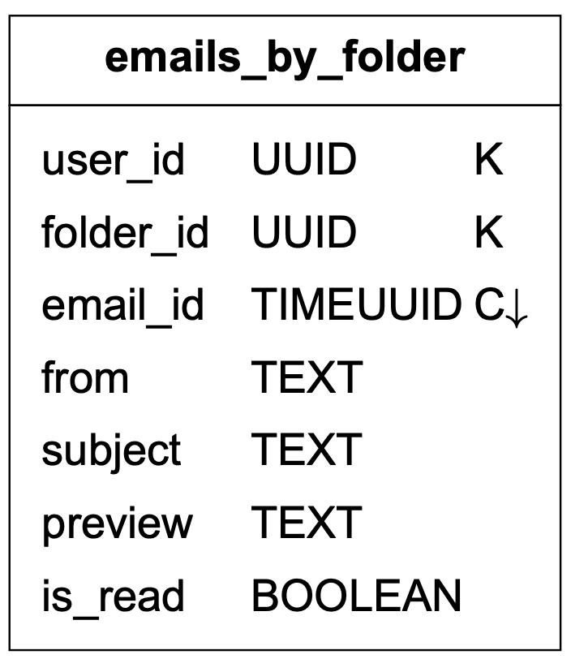

*Table 2: Emails by folder*

**Query 3: create/delete/get an email**

Due to space limitations, we only explain how to get detailed information about an email. The two tables in Table 3 are designed to support this query. The simple query looks like this:

```sql
SELECT * FROM emails_by_user WHERE email_id = 123;
```

An email can have multiple attachments, and these can be retrieved by the combination of email_id and filename fields.

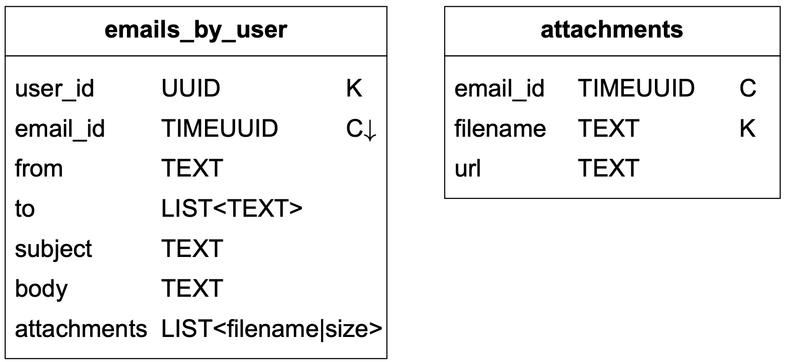

*Table 3: Emails by user*

**Query 4: fetch all read or unread emails**

If our domain model was for a relational database, the query to fetch all read emails would look like this:

```sql
SELECT * FROM emails_by_folder
WHERE user_id = <user_id> and folder_id = <folder_id> and is_read = true
ORDER BY email_id;
```

The query to fetch all unread emails would look very similar. We just need to change 'is_read = true' to 'is_read = false' in the above query.

Our data model, however, is designed for NoSQL. A NoSQL database normally only supports queries on partition and cluster keys. Since is_read in the emails_by_folder table is neither of those, most NoSQL databases will reject this query.

One way to get around this limitation is to fetch the entire folder for a user and perform the filtering in the application. This could work for a small email service, but at our design scale this does not work well.

This problem is commonly solved with denormalization in NoSQL. To support the read/unread queries, we denormalize the emails_by_folder data into two tables as shown in Table 4.

- **read_emails:** it stores all emails that are in read status.
- **unread_emails:** it stores all emails that are in unread status.

To mark an UNREAD email as READ, the email is deleted from unread_emails and then inserted to read_emails.

To fetch all unread emails for a specific folder, we can run a query like this:

```sql
SELECT * FROM unread_emails
WHERE user_id = <user_id> and folder_id = <folder_id>
ORDER BY email_id;
```

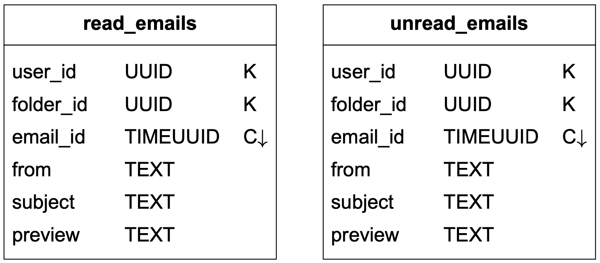

*Table 4: Read and unread emails*

Denormalization as shown above is a common practice. It makes the application code more complicated and harder to maintain, but it improves the read performance of these queries at scale.

**Bonus point: conversation threads**

Threads are a feature supported by many email clients. It groups email replies with their original message [8]. This allows users to retrieve all emails associated with one conversation. Traditionally, a thread is implemented using algorithms such as JWZ algorithm [18]. We will not go into detail about the algorithm, but just explain the core idea behind it. An email header generally contains the following three fields:

```json
{
  "headers": {
     "Message-Id": "<7BA04B2A-430C-4D12-8B57-862103C34501@gmail.com>",
     "In-Reply-To": "<CAEWTXuPfN=LzECjDJtgY9Vu03kgFvJnJUSHTt6TW@gmail.com>",
     "References": ["<7BA04B2A-430C-4D12-8B57-862103C34501@gmail.com>"]
  }
}
```

| Field | Description |
|-------|-------------|
| Message-Id | The value of a message ID. It is generated by a client while sending a message. |
| In-Reply-To | The parent Message-Id to which the message replies. |
| References | A list of message IDs related to a thread. |

*Table 5: Email header*

With these fields, an email client can reconstruct mail conversations from messages, if all messages in the reply chain are preloaded.

**Consistency trade-off**

Distributed databases that rely on replication for high availability must make a fundamental trade-off between consistency and availability. Correctness is very important for email systems, so by design we want to have a single primary for any given mailbox. In the event of a failover, the mailbox isn't accessible by clients, so their sync/update operation is paused until failover ends. It trades availability in favor of consistency.

### Email deliverability

It is easy to set up a mail server and start sending emails. The hard part is to get emails actually delivered to a user's inbox. If an email ends up in the spam folder, it means there is a very high chance a recipient won't read it. Email spam is a huge issue. According to research done by Statista [19], more than 50% of all emails sent are spam. If we set up a new mail server, most likely our emails will end up in the spam folder because a new email server has no reputation. There are a couple of factors to consider to improve email deliverability.

- **Dedicated IPs.** It is recommended to have dedicated IP addresses for sending emails. Email providers are less likely to accept emails from new IP addresses that have no history.
- **Classify emails.** Send different categories of emails from different IP addresses. For example, you may want to avoid sending marketing and important emails from the same servers because it might make ISPs mark all emails as promotional.
- **Email sender reputation.** Warm up new email server IP addresses slowly to build a good reputation, so big providers such as Office365, Gmail, Yahoo Mail, etc. are less likely to put our emails in the spam folder. According to Amazon Simple Email Service [20], it takes about 2 to 6 weeks to warm up a new IP address.
- **Ban spammers quickly.** Spammers should be banned quickly before they have a significant impact on the server's reputation.
- **Feedback processing.** It's very important to set up feedback loops with ISPs so we can keep the complaint rate low and ban spam accounts quickly. If an email fails to deliver or a user complains, one of the following outcomes occurs:
  - **Hard bounce.** This means an email is rejected by an ISP because the recipient's email address is invalid.
  - **Soft bounce.** A soft bounce indicates an email failed to deliver due to temporary conditions, such as ISPs being too busy.
  - **Complaint.** This means a recipient clicks the "report spam" button.

Figure 8 shows the process of collecting and processing bounces/complaints. We use separate queues for soft bounces, hard bounces, and complaints so they can be managed separately.

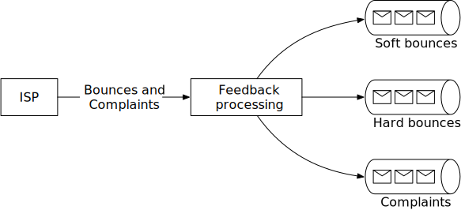

*Figure 8: Handle feedback loop*

**Email authentication.** According to the 2018 data breach investigation report provided by Verizon, phishing and pretexting represent 93% of breaches [21]. Some of the common techniques to combat phishing are: Sender Policy Framework (SPF) [22], DomainKeys Identified Mail (DKIM) [23], and Domain-based Message Authentication, Reporting and Conformance (DMARC) [24].

Figure 9 shows an example header of a Gmail message. As you can see, the sender @info6.citi.com is authenticated by SPF, DKIM, and DMARC.

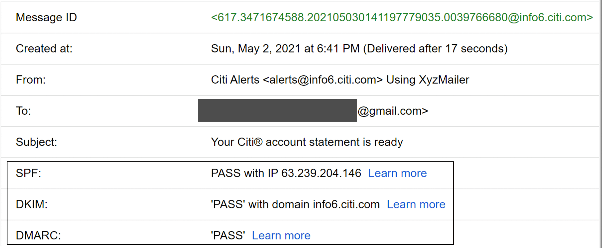

*Figure 9: An example of a Gmail header*

You don't need to remember all those terms. The important thing to keep in mind is that getting emails to work as intended is hard. It requires not only domain knowledge, but good relationships with ISPs.

### Search

Basic mail search refers to searching for emails that contain any of the entered keywords in the subject or body. More advanced features include filtering by "From", "Subject", "Unread", or other attributes. On one hand, whenever an email is sent, received, or deleted, we need to perform reindexing. On the other hand, a search query is only run when a user presses the "search" button. This means the search feature in email systems has a lot more writes than reads. By comparison with Google search, email search has quite different characteristics, as shown in Table 6.

| | Scope | Sorting | Accuracy |
|---|---|---|---|
| **Google search** | The whole internet | Sort by relevance | Indexing generally takes time, so some items may not show in the search result immediately. |
| **Email search** | User's own email box | Sort by attributes such as time, has attachment, date within, is unread, etc. | Indexing should be near real-time, and the result has to be accurate. |

*Table 6: Google search vs email search*

To support search functionality, we compare two approaches: Elasticsearch and native search embedded in the datastore.

**Option 1: Elasticsearch**

The high-level design for email search using Elasticsearch is shown in Figure 10. Because queries are mostly performed on the user's own email server, we can group underlying documents to the same node using user_id as the partition key.

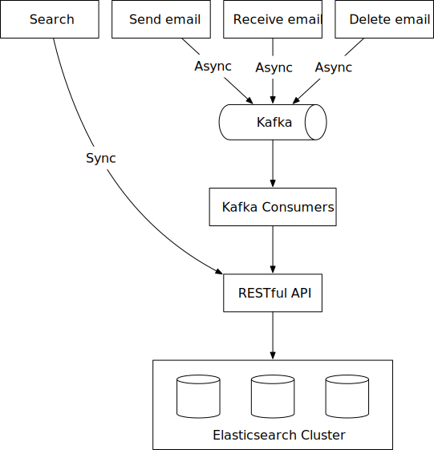

*Figure 10: Elasticsearch*

When a user clicks the "search" button, the user waits until the search response is received. A search request is synchronous. When events such as "send email", "receive email" or "delete email" are triggered, nothing related to search needs to be returned to the client. Reindexing is needed and it can be done with offline jobs. Kafka is used in the design to decouple services that trigger reindexing, from services that actually perform reindexing.

Elasticsearch is the most popular search-engine database as of June 2021 [25] and it supports full-text search of emails very well. One challenge of adding Elasticsearch is to keep our primary email store in sync with it. One of the largest email providers in China, Tencent QQ Email, uses Elasticsearch [26].

**Option 2: Custom search solution**

Large-scale email providers usually develop their own custom search engines to meet their specific requirements. Designing an email search engine is a very complicated task and is out of the scope of this chapter. Here we only briefly touch on the disk I/O bottleneck, a primary challenge we will face for a custom search engine.

As shown in the back-of-the-envelope calculation, the size of the metadata and attachments added daily is at the petabyte (PB) level. Meanwhile, an email account can easily have over half a million emails. The main bottleneck of the index server is usually disk I/O.

Since the process of building the index is write-heavy, a good strategy might be to use Log-Structured Merge-Tree (LSM) [27] to structure the index data on disk (Figure 11). The write path is optimized by only performing sequential writes. LSM trees are the core data structure behind databases such as BigTable, Cassandra, and RocksDB. When a new email arrives, it is first added to level 0 in-memory cache, and when data size in memory reaches the predefined threshold, data is merged to the next level. Another reason to use LSM is to separate data that change frequently from those that don't. For example, email data usually doesn't change, but folder information tends to change more often due to different filter rules. In this case, we can separate them into two different sections, so that if a request is related to a folder change, we change only the folder and leave the email data alone.

If you are interested in reading more about email search, it is highly recommended you take a look at how search works in Microsoft Exchange servers [28].

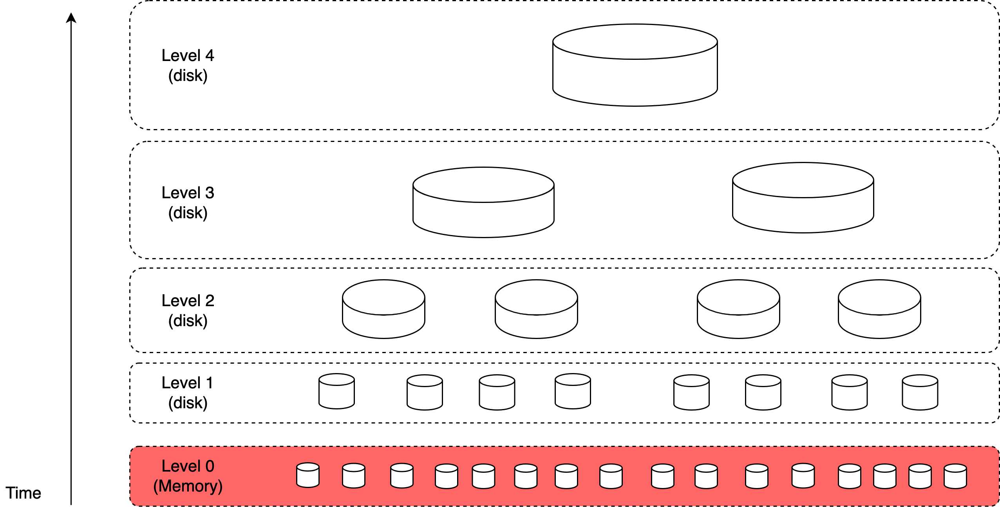

*Figure 11: LSM tree*

Each approach has pros and cons:

| Feature | Elasticsearch | Custom search engine |
|---|---|---|
| **Scalability** | Scalable to some extent. | Easier to scale as we can optimize the system for the email use case. |
| **System complexity** | Need to maintain two different systems: datastore and Elasticsearch. | One system. |
| **Data consistency** | Two copies of data. One in the metadata datastore, and the other in Elasticsearch. Data consistency is hard to maintain. | A single copy of data in the metadata datastore. |
| **Data loss possible** | No. Can rebuild the Elasticsearch index from the primary storage, in case of failure. | No. |
| **Development effort** | Easy to integrate. To support large scale email search, a dedicated Elasticsearch team might be needed. | Significant engineering effort is needed to develop a custom email search engine. |

*Table 7: Elastic search vs custom search engine*

A general rule of thumb is that for a smaller scale email system, Elasticsearch is a good option as it's easy to integrate and doesn't require significant engineering effort. For a larger scale, Elasticsearch might work, but we may need a dedicated team to develop and maintain the email search infrastructure. To support an email system at Gmail or Outlook scale, it might be a good idea to have a native search embedded in the database as opposed to the separate indexing approach.

### Scalability and availability

Since data access patterns of individual users are independent of one another, we expect most components in the system are horizontally scalable.

For better availability, data is replicated across multiple data centers. Users communicate with a mail server that is physically closer to them in the network topology. During a network partition, users can access messages from other data centers (Figure 12).

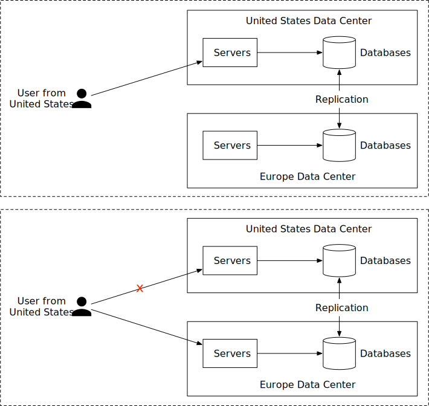

*Figure 12: Multi-data center setup*

## Step 4 - Wrap Up

In this chapter, we have presented a design for building large-scale email servers. We started by gathering requirements and doing some back-of-the-envelope calculations to get a good idea of the scale. In the high-level design, we discussed how traditional email servers were designed and why they cannot satisfy modern use cases. We also discussed email APIs and high-level designs for sending and receiving flows. Finally, we dived deep into metadata database design, email deliverability, search, and scalability.

If there is extra time at the end of the interview, here are a few additional talking points:

- **Fault tolerance.** Many parts of the system can fail, and you can talk about how to handle node failures, network issues, event delays, etc.
- **Compliance.** Email service works all around the world and there are legal regulations to comply with. For instance, we need to handle and store personally identifiable information (PII) from Europe in a way that complies with General Data Protection Regulation (GDPR) [29]. Legal intercept is another typical feature in this area [30].
- **Security.** Email security is important because emails contain sensitive information. Gmail provides safety features such as phishing protections, safe browsing, proactive alerts, account safety, confidential mode, and email encryption [31].
- **Optimizations.** Sometimes, the same email is sent to multiple recipients, and the same email attachment is stored several times in the object store (S3) in the group emails. One optimization we could do is to check the existence of the attachment in storage, before performing the expensive save operation.

Congratulations on getting this far! Now give yourself a pat on the back. Good job!

## Reference Materials

[1] Number of Active Gmail Users: https://financesonline.com/number-of-active-gmail-users/

[2] Outlook: https://en.wikipedia.org/wiki/Outlook.com

[3] How Many Emails Are Sent Per Day in 2021?: https://review42.com/resources/how-many-emails-are-sent-per-day/

[4] RFC 1939 - Post Office Protocol - Version 3: http://www.faqs.org/rfcs/rfc1939.html

[5] ActiveSync: https://en.wikipedia.org/wiki/ActiveSync

[6] Email attachment: https://en.wikipedia.org/wiki/Email_attachment

[7] MIME: https://en.wikipedia.org/wiki/MIME

[8] Threading: https://en.wikipedia.org/wiki/Conversation_threading

[9] IMAP LIST Extension for Special-Use Mailboxes: https://datatracker.ietf.org/doc/html/rfc6154

[10] Apache James: https://james.apache.org/

[11] A JSON Meta Application Protocol (JMAP) Subprotocol for WebSocket: https://datatracker.ietf.org/doc/rfc8887/

[12] Cassandra Limitations: https://cwiki.apache.org/confluence/display/CASSANDRA2/CassandraLimitations

[13] Inverted index: https://en.wikipedia.org/wiki/Inverted_index

[14] Exponential backoff: https://en.wikipedia.org/wiki/Exponential_backoff

[15] QQ Email System Optimization (in Chinese): https://www.slideshare.net/areyouok/06-qq-5431919

[16] IOPS: https://en.wikipedia.org/wiki/IOPS

[17] UUID and timeuuid types: https://docs.datastax.com/en/cql-oss/3.3/cql/cql_reference/uuid_type_r.html

[18] Message threading: https://www.jwz.org/doc/threading.html

[19] Global spam volume: https://www.statista.com/statistics/420391/spam-email-traffic-share/

[20] Warming up dedicated IP addresses: https://docs.aws.amazon.com/ses/latest/dg/dedicated-ip-warming.html

[21] 2018 Data Breach Investigations Report: https://enterprise.verizon.com/resources/reports/DBIR_2018_Report.pdf

[22] Sender Policy Framework: https://en.wikipedia.org/wiki/Sender_Policy_Framework

[23] DomainKeys Identified Mail: https://en.wikipedia.org/wiki/DomainKeys_Identified_Mail

[24] Domain-based Message Authentication, Reporting & Conformance: https://dmarc.org/

[25] DB-Engines Ranking of Search Engines: https://db-engines.com/en/ranking/search+engine

[26] Refactoring practice: build full-text search of QQ mailbox based on Tencent Cloud Elasticsearch: https://www.programmersought.com/article/24097547237/

[27] Log-structured merge-tree: https://en.wikipedia.org/wiki/Log-structured_merge-tree

[28] Microsoft Exchange Conference 2014 Search in Exchange: https://www.youtube.com/watch?v=5EXGCSzzQak&t=2173s

[29] General Data Protection Regulation: https://en.wikipedia.org/wiki/General_Data_Protection_Regulation

[30] Lawful interception: https://en.wikipedia.org/wiki/Lawful_interception

[31] Email safety: https://safety.google/intl/en_us/gmail/

