# 25 - S3-like Object Storage

In this chapter, we design an object storage service similar to Amazon Simple Storage Service (S3). S3 is a service offered by Amazon Web Services (AWS) that provides object storage through a RESTful API-based interface. Here are some facts about AWS S3:

- Launched in June 2006.
- S3 added versioning, bucket policy, and multipart upload support in 2010.
- S3 added server-side encryption, multi-object delete, and object expiration in 2011.
- Amazon reported 2 trillion objects stored in S3 by 2013.
- Life cycle policy, event notification, and cross-region replication support were introduced in 2014 and 2015.
- Amazon reported over 100 trillion objects stored in S3 by 2021.

Before we dig into object storage, let's first review storage systems in general and define some terminologies.

## Storage System 101

At a high-level, storage systems fall into three broad categories:

- Block storage
- File storage
- Object storage

### Block storage

Block storage came first, in the 1960s. Common storage devices like hard disk drives (HDD) and solid-state drives (SSD) that are physically attached to servers are all considered as block storage.

Block storage presents the raw blocks to the server as a volume. This is the most flexible and versatile form of storage. The server can format the raw blocks and use them as a file system, or it can hand control of those blocks to an application. Some applications like a database or a virtual machine engine manage these blocks directly in order to squeeze every drop of performance out of them.

Block storage is not limited to physically attached storage. Block storage could be connected to a server over a high-speed network or over industry-standard connectivity protocols like Fibre Channel (FC) [1] and iSCSI [2]. Conceptually, the network-attached block storage still presents raw blocks. To the servers, it works the same as physically attached block storage.

### File storage

File storage is built on top of block storage. It provides a higher-level abstraction to make it easier to handle files and directories. Data is stored as files under a hierarchical directory structure. File storage is the most common general-purpose storage solution. File storage could be made accessible by a large number of servers using common file-level network protocols like SMB/CIFS [3] and NFS [4]. The servers accessing file storage do not need to deal with the complexity of managing the blocks, formatting volume, etc. The simplicity of file storage makes it a great solution for sharing a large number of files and folders within an organization.

### Object storage

Object storage is new. It makes a very deliberate tradeoff to sacrifice performance for high durability, vast scale, and low cost. It targets relatively "cold" data and is mainly used for archival and backup. Object storage stores all data as objects in a flat structure. There is no hierarchical directory structure. Data access is normally provided via a RESTful API. It is relatively slow compared to other storage types. Most public cloud service providers have an object storage offering, such as AWS S3, Google object storage, and Azure blob storage.

### Comparison

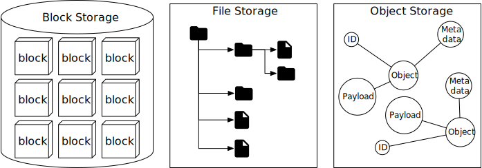

*Figure 1: Three different storage options*

Table 1 compares block storage, file storage, and object storage.

| | Block storage | File storage | Object storage |
|---|---|---|---|
| **Mutable Content** | Y | Y | N (object versioning is supported, in-place update is not) |
| **Cost** | High | Medium to high | Low |
| **Performance** | Medium to high, very high | Medium to high | Low to medium |
| **Consistency** | Strong consistency | Strong consistency | Strong consistency [5] |
| **Data access** | SAS [6]/iSCSI/FC | Standard file access, CIFS/SMB, and NFS | RESTful API |
| **Scalability** | Medium scalability | High scalability | Vast scalability |
| **Good for** | Virtual machines (VM), high-performance applications like database | General-purpose file system access | Binary data, unstructured data |

*Table 1: Storage options*

### Terminology

To design S3-like object storage, we need to understand some core object storage concepts first. This section provides an overview of the terms that apply to object storage.

- **Bucket.** A logical container for objects. The bucket name is globally unique. To upload data to S3, we must first create a bucket.
- **Object.** An object is an individual piece of data we store in a bucket. It contains object data (also called payload) and metadata. Object data can be any sequence of bytes we want to store. The metadata is a set of name-value pairs that describe the object.
- **Versioning.** A feature that keeps multiple variants of an object in the same bucket. It is enabled at bucket-level. This feature enables users to recover objects that are deleted or overwritten by accident.
- **Uniform Resource Identifier (URI).** The object storage provides RESTful APIs to access its resources, namely, buckets and objects. Each resource is uniquely identified by its URI.
- **Service-level agreement (SLA).** A service-level agreement is a contract between a service provider and a client. For example, the Amazon S3 Standard-Infrequent Access storage class provides the following SLA [7]:
  - Designed for durability of 99.999999999% of objects across multiple Availability Zones.
  - Data is resilient in the event of one entire Availability Zone destruction.
  - Designed for 99.9% availability.

## Step 1 - Understand the Problem and Establish Design Scope

The following questions help to clarify the requirements and narrow down the scope.

**Candidate:** Which features should be included in the design?

**Interviewer:** We would like you to design an S3-like object storage system with the following functionalities:

- Bucket creation.
- Object uploading and downloading.
- Object versioning.
- Listing objects in a bucket. It's similar to the "aws s3 ls" command [8].

**Candidate:** What is the typical data size?

**Interviewer:** We need to store both massive objects (a few GBs or more) and a large number of small objects (tens of KBs,) efficiently.

**Candidate:** How much data do we need to store in one year?

**Interviewer:** 100 petabytes (PB).

**Candidate:** Can we assume data durability is 6 nines (99.9999%) and service availability is 4 nines (99.99%)?

**Interviewer:** Yes, that sounds reasonable.

### Non-functional requirements

- 100 PB of data
- Data durability is 6 nines
- Service availability is 4 nines
- Storage efficiency. Reduce storage costs while maintaining a high degree of reliability and performance.

### Back-of-the-envelope estimation

Object storage is likely to have bottlenecks in either disk capacity or disk IO per second (IOPS). Let's take a look.

- **Disk capacity.** Let's assume objects follow the distribution listed below:
  - 20% of all objects are small objects (less than 1MB).
  - 60% of objects are medium-sized objects (1MB ~ 64MB).
  - 20% are large objects (larger than 64MB).
- **IOPS.** Let's assume one hard disk (SATA interface, 7200 rpm) is capable of doing 100~150 random seeks per second (100-150 IOPS).

With those assumptions, we can estimate the total number of objects the system can persist. To simplify the calculation, let's use the median size for each object type (0.5MB for small objects, 32MB for medium objects, and 200MB for large objects). A 40% storage usage ratio gives us:

100 PB = 100*1000*1000*1000 MB = 10^11 MB

10^11*0.4/( 0.2*0.5MB + 0.6 *32MB + 0.2*200MB) = 0.68 billion objects.

If we assume the metadata of an object is about 1KB in size, we need 0.68 TB space to store all metadata information.

Even though we may not use those numbers, it's good to have a general idea about the scale and constraint of the system.

## Step 2 - Propose High-Level Design and Get Buy-In

Before diving into the design, let's explore a few interesting properties of object storage, as they may influence it.

- **Object immutability.** One of the main differences between object storage and the other two types of storage systems is that the objects stored inside of object storage are immutable. We may delete them or replace them entirely with a new version, but we cannot make incremental changes.
- **Key-value store.** We could use object URI to retrieve object data (Listing 1). The object URI is the key and object data is the value.

  **Request:**
  ```
  GET /bucket1/object1.txt HTTP/1.1
  ```

  **Response:**
  ```
  HTTP/1.1 200 OK
  Content-Length: 4567

  [4567 bytes of object data]
  ```

  *Listing 1: Use object URI to retrieve object data*

- **Write once, read many times.** The data access pattern for object data is written once and read many times. According to the research done by LinkedIn, 95% of requests are read operations [9].
- **Support both small and large objects.** Object size may vary and we need to support both.

The design philosophy of object storage is very similar to that of the UNIX file system. In UNIX, when we save a file in the local file system, it does not save the filename and file data together. Instead, the filename is stored in a data structure called "inode" [10], and the file data is stored in different disk locations. The inode contains a list of file block pointers that point to the disk locations of the file data. When we access a local file, we first fetch the metadata in the inode. We then read the file data by following the file block pointers to the actual disk locations.

The object storage works similarly. The inode becomes the metadata store that stores all the object metadata. The hard disk becomes the data store that stores the object data. In the UNIX file system, the inode uses the file block pointer to record the location of data on the hard disk. In object storage, the metadata store uses the ID of the object to find the corresponding object data in the data store, via a network request. Figure 2 shows the UNIX file system and the object storage.

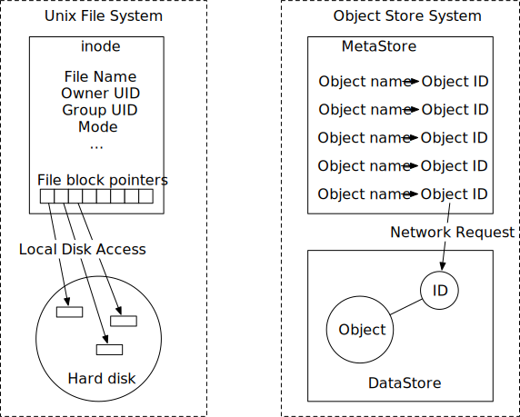

*Figure 2: Unix file system and object store*

Separating metadata and object data simplifies the design. The data store contains immutable data while the metadata store contains mutable data. This separation enables us to implement and optimize these two components independently. Figure 3 shows what the bucket and object look like.

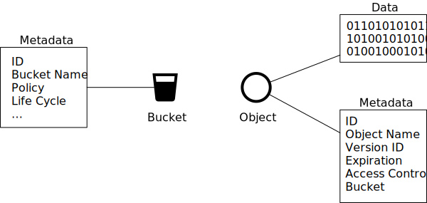

*Figure 3: Bucket & object*

### High-level design

Figure 4 shows the high-level design.

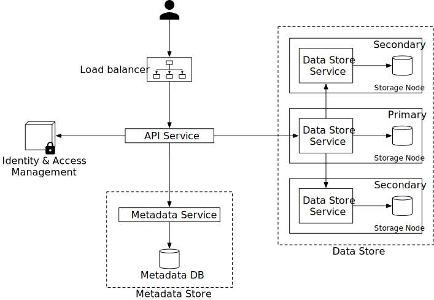

*Figure 4: High-level design*

Let's go over the components one by one.

- **Load balancer.** Distributes RESTful API requests across a number of API servers.
- **API service.** Orchestrates remote procedure calls to the identity and access management service, metadata service, and storage stores. This service is stateless so it can be horizontally scaled.
- **Identity and access management (IAM).** The central place to handle authentication, authorization, and access control. Authentication verifies who you are, and authorization validates what operations you could perform based on who you are.
- **Data store.** Stores and retrieves the actual data. All data-related operations are based on object ID (UUID).
- **Metadata store.** Stores the metadata of the objects.

Note that the metadata and data stores are just logical components, and there are different ways to implement them. For example, in Ceph's Rados Gateway [11], there is no standalone metadata store. Everything, including the object bucket, is persisted as one or multiple Rados objects.

Now we have a basic understanding of the high-level design, let's explore some of the most important workflows in object storage.

- Uploading an object.
- Downloading an object.
- Object versioning and listing objects in a bucket. They will be explained in the "Deep Dive" section.

### Uploading an object

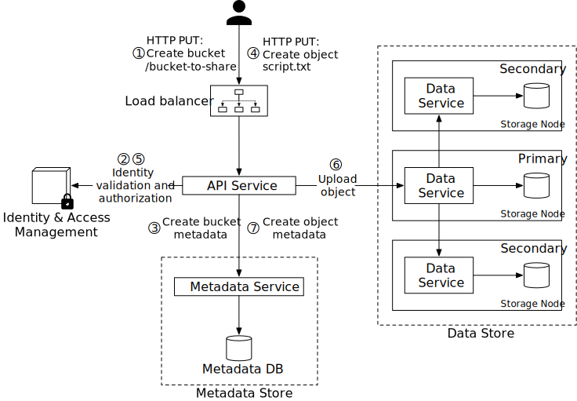

*Figure 5: Uploading an object*

An object has to reside in a bucket. In this example, we first create a bucket named "bucket-to-share" and then upload a file named "script.txt" to the bucket. Figure 5 explains how this flow works in 7 steps.

1. The client sends an HTTP PUT request to create a bucket named "bucket-to-share." The request is forwarded to the API service.

2. The API service calls the IAM to ensure the user is authorized and has WRITE permission.

3. The API service calls the metadata store to create an entry with the bucket info in the metadata database. Once the entry is created, a success message is returned to the client.

4. After the bucket is created, the client sends an HTTP PUT request to create an object named "script.txt".

5. The API service verifies the user's identity and ensures the user has WRITE permission on the bucket.

6. Once validation succeeds, the API service sends the object data in the HTTP PUT payload to the data store. The data store persists the payload as an object and returns the UUID of the object.

7. The API service calls the metadata store to create a new entry in the metadata database. It contains important metadata such as the object_id (UUID), bucket_id (which bucket the object belongs to), object_name, etc. A sample entry is shown in Table 2.

| object_name | object_id | bucket_id |
|---|---|---|
| script.txt | 239D5866-0052-00F6-014E-C914E61ED42B | 82AA1B2E-F599-4590-B5E4-1F51AAE5F7E4 |

*Table 2: Sample entry*

The API to upload an object could look like this:

```
PUT /bucket-to-share/script.txt HTTP/1.1
Host: foo.s3example.org
Date: Sun, 12 Sept 2021 17:51:00 GMT
Authorization: authorization string
Content-Type: text/plain
Content-Length: 4567
x-amz-meta-author: Alex

[4567 bytes of object data]
```

*Listing 2: Uploading an object*

### Downloading an object

A bucket has no directory hierarchy. However, we can create a logical hierarchy by concatenating the bucket name and the object name to simulate a folder structure. For example, we name the object "bucket-to-share/script.txt" instead of "script.txt". To get an object, we specify the object name in the GET request. The API to download an object looks like this:

```
GET /bucket-to-share/script.txt HTTP/1.1
Host: foo.s3example.org
Date: Sun, 12 Sept 2021 18:30:01 GMT
Authorization: authorization string
```

*Listing 3: Downloading an object*

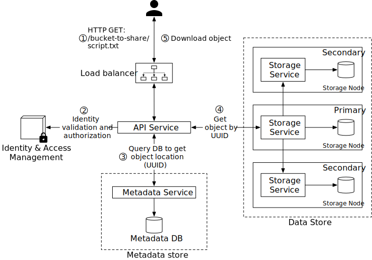

*Figure 6: Downloading an object*

As mentioned earlier, the data store does not store the name of the object and it only supports object operations via object_id (UUID). In order to download the object, we first map the object name to the UUID. The workflow of downloading an object is shown below:

1. The client sends an HTTP GET request to the load balancer: GET /bucket-to-share/script.txt

2. The API service queries the IAM to verify that the user has READ access to the bucket.

3. Once validated, the API service fetches the corresponding object's UUID from the metadata store.

4. Next, the API service fetches the object data from the data store by its UUID.

5. The API service returns the object data to the client in HTTP GET response.

## Step 3 - Design Deep Dive

In this section, we dive deep into a few areas:

- Data store
- Metadata data model
- Listing objects in a bucket
- Object versioning
- Optimizing uploads of large files
- Garbage collection

### Data store

Let's take a closer look at the design of the data store. As discussed previously, the API service handles external requests from users and calls different internal services to fulfill those requests. To persist or retrieve an object, the API service calls the data store. Figure 7 shows the interactions between the API service and the data store for uploading and downloading an object.

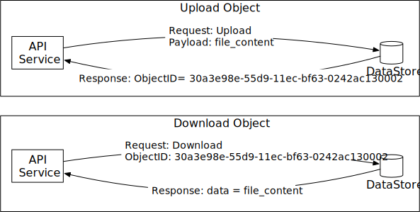

*Figure 7: Upload and download an object*

**High-level design for the data store**

The data store has three main components as shown in Figure 8.

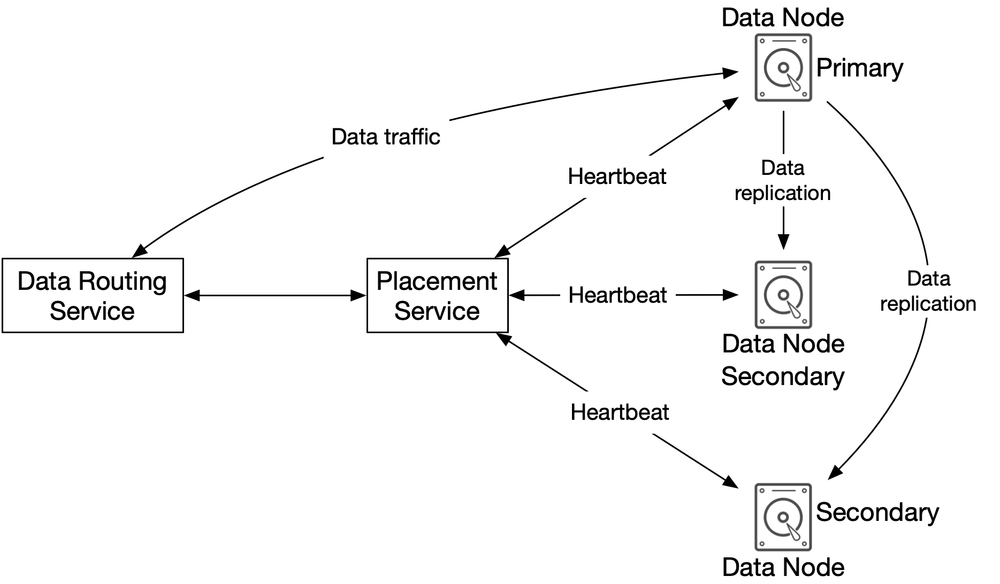

*Figure 8: Data store components*

**Data routing service**

The data routing service provides RESTful or gRPC [12] APIs to access the data node cluster. It is a stateless service that can scale by adding more servers. This service has the following responsibilities:

- Query the placement service to get the best data node to store data.
- Read data from data nodes and return it to the API service.
- Write data to data nodes.

**Placement service**

The placement service determines which data nodes (primary and replicas) should be chosen to store an object. It maintains a virtual cluster map, which provides the physical topology of the cluster. The virtual cluster map contains location information for each data node which the placement service uses to make sure the replicas are physically separated. This separation is key to high durability. See the "Durability" section below for details. An example of the virtual cluster map is shown in Figure 9.

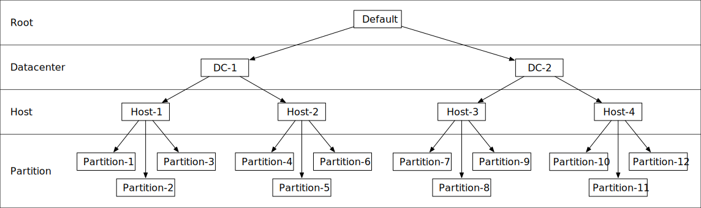

*Figure 9: Virtual cluster map*

The placement service continuously monitors all data nodes through heartbeats. If a data node doesn't send a heartbeat within a configurable 15-second grace period, the placement service marks the node as "down" in the virtual cluster map.

This is a critical service, so we suggest building a cluster of 5 or 7 placement service nodes with Paxos [13] or Raft [14] consensus protocol. The consensus protocol ensures that as long as more than half of the nodes are healthy, the service as a whole continues to work. For example, if the placement service cluster has 7 nodes, it can tolerate a 3-node failure. To learn more about consensus protocols, refer to the reference materials [13] [14].

**Data node**

The data node stores the actual object data. It ensures reliability and durability by replicating data to multiple data nodes, also called a replication group.

Each data node has a data service daemon running on it. The data service daemon continuously sends heartbeats to the placement service. The heartbeat message includes the following essential information:

- How many disk drives (HDD or SSD) does the data node manage?
- How much data is stored on each drive?

When the placement service receives the heartbeat for the first time, it assigns an ID for this data node, adds it to the virtual cluster map, and returns the following information:

- a unique ID of the data node
- the virtual cluster map
- where to replicate data

**Data persistence flow**

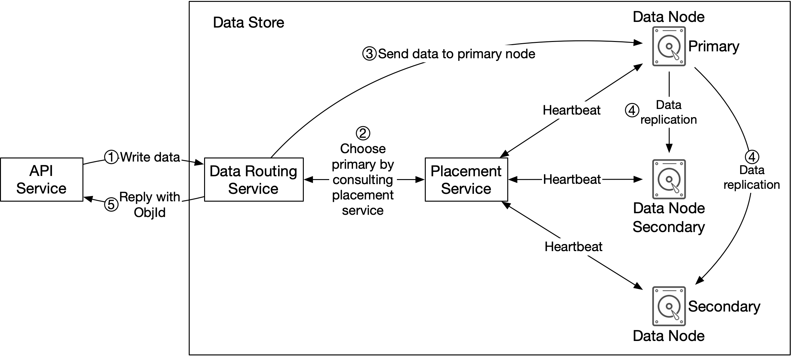

*Figure 10: Data persistence flow*

Now let's take a look at how data is persisted in the data node.

1. The API service forwards the object data to the data store.

2. The data routing service generates a UUID for this object and queries the placement service for the data node to store this object. The placement service checks the virtual cluster map and returns the primary data node.

3. The data routing service sends data directly to the primary data node, together with its UUID.

4. The primary data node saves the data locally and replicates it to two secondary data nodes. The primary node responds to the data routing service when data is successfully replicated to all secondary nodes.

5. The UUID of the object (ObjId) is returned to the API service.

In step 2, given a UUID for the object as an input, the placement service returns the replication group for the object. How does the placement service do this? Keep in mind that this lookup needs to be deterministic, and it must survive the addition or removal of replication groups. Consistent hashing is a common implementation of such a lookup function. Refer to [15] for more information.

In step 4, the primary data node replicates data to all secondary nodes before it returns a response. This makes data strongly consistent among all data nodes. This consistency comes with latency costs because we have to wait until the slowest replica finishes. Figure 11 shows the trade-offs between consistency and latency.

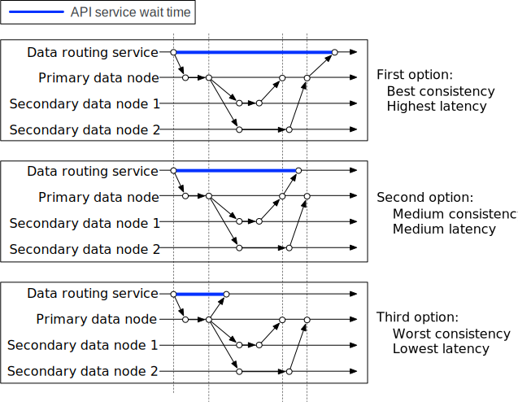

*Figure 11: Trade-off between consistency and latency*

1. Data is considered as successfully saved after all three nodes store the data. This approach has the best consistency but the highest latency.

2. Data is considered as successfully saved after the primary and one of the secondaries store the data. This approach has a medium consistency and medium latency.

3. Data is considered as successfully saved after the primary persists the data. This approach has the worst consistency but the lowest latency.

Both 2 and 3 are forms of eventual consistency.

**How data is organized**

Now let's take a look at how each data node manages the data. A simple solution is to store each object in a stand-alone file. This works, but the performance suffers when there are many small files. Two issues arise when having too many small files on a file system. First, it wastes many data blocks. A file system stores files in discrete disk blocks. Disk blocks have the same size, and the size is fixed when the volume is initialized. The typical block size is around 4 KB. For a file smaller than 4 KB, it would still consume the entire disk block. If the file system holds a lot of small files, it wastes a lot of disk blocks, with each one only lightly filled with a small file.

Second, it could exceed the system's inode capacity. The file system stores the location and other information about a file in a special type of block called inode. For most file systems, the number of inodes is fixed when the disk is initialized. With millions of small files, it runs the risk of consuming all inodes. Also, the operating system does not handle a large number of inodes very well, even with aggressive caching of file system metadata. For these reasons, storing small objects as individual files does not work well in practice.

To address these issues, we can merge many small objects into a larger file. It works conceptually like a write-ahead log (WAL). When we save an object, it is appended to an existing read-write file. When the read-write file reaches its capacity threshold – usually set to a few GBs – the read-write file is marked as read-only, and a new read-write file is created to receive new objects. Once a file is marked as read-only, it can only serve read requests. Figure 12 explains how this process works.

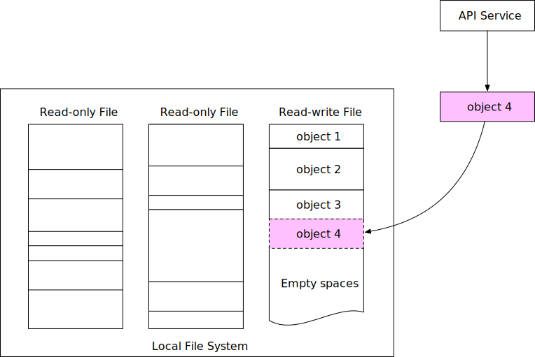

*Figure 12: Store multiple small objects in one big file*

Note that write access to the read-write file must be serialized. As shown in Figure 12, objects are stored in order, one after the other, in the read-write file. To maintain this on-disk layout, multiple cores processing incoming write requests in parallel must take their turns to write to the read-write file. For a modern server with a large number of cores processing many incoming requests in parallel, this seriously restricts write throughput. To fix this, we could provide dedicated read-write files, one for each core processing incoming requests.

**Object lookup**

With each data file holding many small objects, how does the data node locate an object by UUID? The data node needs the following information:

- The data file that contains the object
- The starting offset of the object in the data file
- The size of the object

The database schema to support this lookup is shown in Table 3.

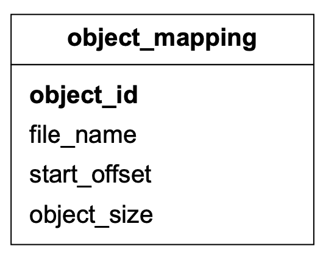

*Table 3: Object_mapping table*

| Field | Description |
|---|---|
| object_id | UUID of the object |
| file_name | The name of the file that contains the object |
| start_offset | Beginning address of the object in the file |
| object_size | The number of bytes in the object |

*Table 4: Object_mapping fields*

We considered two options for storing this mapping: a file-based key-value store such as RocksDB [16] or a relational database. RocksDB is based on SSTable [17], and it is fast for writes but slower for reads. A relational database usually uses a B+ tree [18] based storage engine, and it is fast for reads but slower for writes. As mentioned earlier, the data access pattern is write once and read multiple times. Since a relational database provides better read performance, it is a better choice than RocksDB.

How should we deploy this relational database? At our scale, the data volume for the mapping table is massive. Deploying a single large cluster to support all data nodes could work, but is difficult to manage. Note that this mapping data is isolated within each data node. There is no need to share this across data nodes. To take advantage of this property, we could simply deploy a simple relational database on each data node. SQLite [19] is a good choice here. It is a file-based relational database with a solid reputation.

**Updated data persistence flow**

Since we have made quite a few changes to the data node, let's revisit how to save a new object in the data node (Figure 13).

1. The API service sends a request to save a new object named "object 4".

2. The data node service appends the object named "object 4" at the end of the read-write file named "/data/c".

3. A new record of "object 4" is inserted into the object_mapping table.

4. The data node service returns the UUID to the API service.

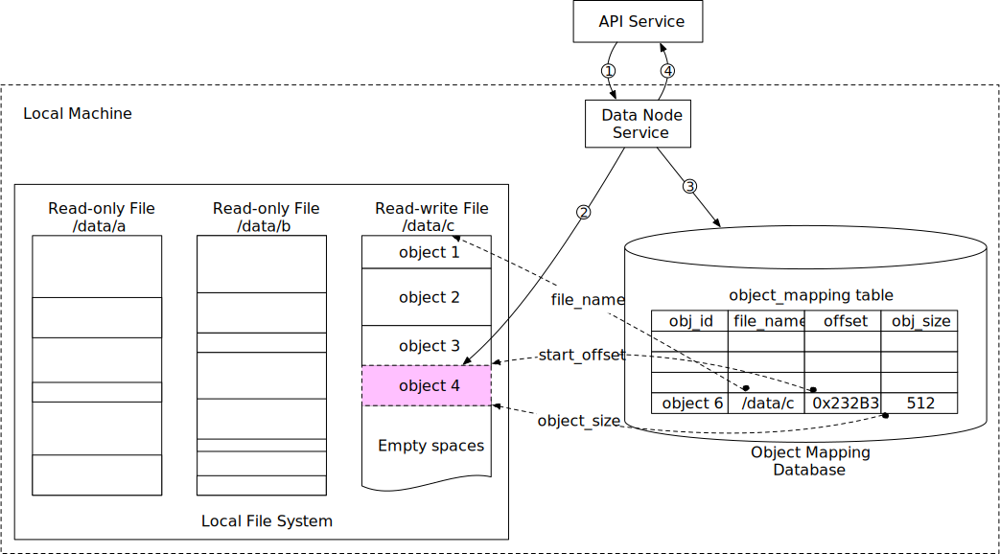

*Figure 13: Updated data persistence flow*

### Durability

Data reliability is extremely important for data storage systems. How can we create a storage system that offers six nines of durability? Each failure case has to be carefully considered and data needs to be properly replicated.

**Hardware failure and failure domain**

Hard drive failures are inevitable no matter which media we use. Some storage media may have better durability than others, but we cannot rely on a single hard drive to achieve our durability objective. A proven way to increase durability is to replicate data to multiple hard drives, so a single disk failure does not impact the data availability, as a whole. In our design, we replicate data three times.

Let's assume the spinning hard drive has an annual failure rate of 0.81% [20]. This number highly depends on the model and make. Making 3 copies of data gives us 1-(0.0081)^3=~0.999999 reliability. This is a very rough estimate. For more sophisticated calculations, please read [20].

For a complete durability evaluation, we also need to consider the impacts of different failure domains. A failure domain is a physical or logical section of the environment that is negatively affected when a critical service experiences problems. In a modern data center, a server is usually put into a rack [21], and the racks are grouped into rows/floors/rooms. Since each rack shares network switches and power, all the servers in a rack are in a rack-level failure domain. A modern server shares components like the motherboard, processors, power supply, HDD drives, etc. The components in a server are in a node-level failure domain.

Here is a good example of a large-scale failure domain isolation. Typically, data centers divide infrastructure that shares nothing into different Availability Zones (AZs). We replicate our data to different AZs to minimize the failure impact (Figure 14). Note that the choice of failure domain level doesn't directly increase the durability of data, but it will result in better reliability in extreme cases, such as large-scale power outages, cooling system failures, natural disasters, etc.

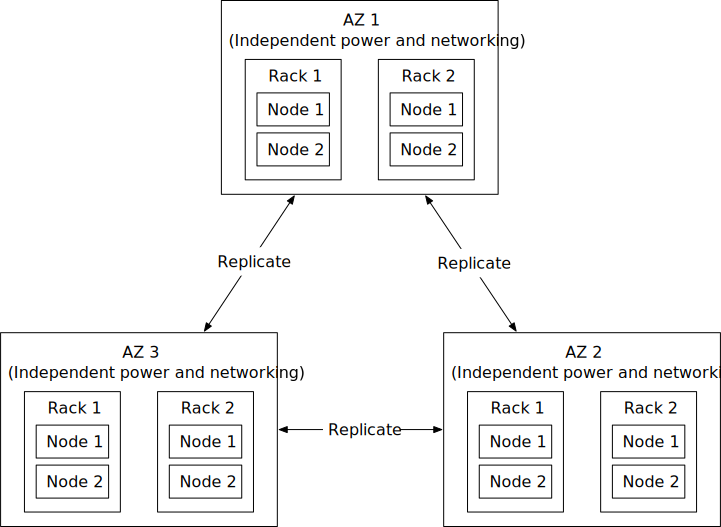

*Figure 14: Multi-datacenter replication*

**Erasure coding**

Making three full copies of data gives us roughly 6 nines of data durability. Are there other options to further increase durability? Yes, erasure coding is one option. Erasure coding [22] deals with data durability differently. It chunks data into smaller pieces (placed on different servers) and creates parities for redundancy. In the event of failures, we can use chunk data and parities to reconstruct the data. Let's take a look at a concrete example (4 + 2 erasure coding) as shown in Figure 15.

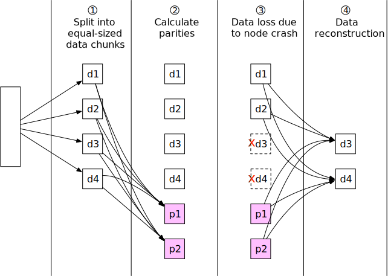

*Figure 15: Erasure coding*

1. Data is broken up into four even-sized data chunks d1, d2, d3, and d4.

2. The mathematical formula [23] is used to calculate the parities p1 and p2. To give a much simplified example, p1 = d1 + 2*d2 - d3 + 4*d4 and p2 = -d1 + 5*d2 + d3 - 3*d4 [24].

3. Data d3 and d4 are lost due to node crashes.

4. The mathematical formula is used to reconstruct lost data d3 and d4, using the known values of d1, d2, p1, and p2.

Let's take a look at another example as shown in Figure 16 to better understand how erasure coding works with failure domains. An (8+4) erasure coding setup breaks up the original data evenly into 8 chunks and calculates 4 parities. All 12 pieces of data have the same size. All 12 chunks of data are distributed across 12 different failure domains. The mathematics behind erasure coding ensures that the original data can be reconstructed when at most 4 nodes are down.

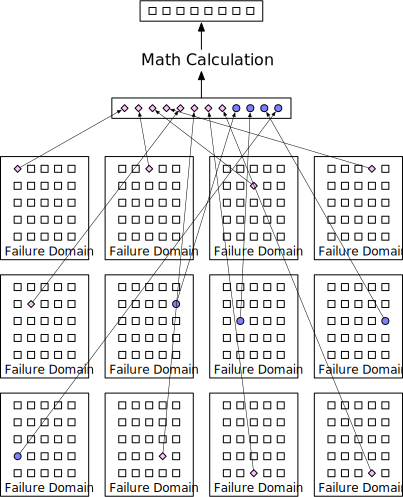

*Figure 16: (8+4) erasure coding*

Compared to replication where the data router only needs to read data for an object from one healthy node, in erasure coding the data router has to read data from at least 8 healthy nodes. This is an architectural design tradeoff. We use a more complex solution with a slower access speed, in exchange for higher durability and lower storage cost. For object storage where the main cost is storage, this tradeoff might be worth it.

How much extra space does erasure coding need? For every two chunks of data, we need one parity block, so the storage overhead is 50% (Figure 17). While in 3-copy replication, the storage overhead is 200% (Figure 17).

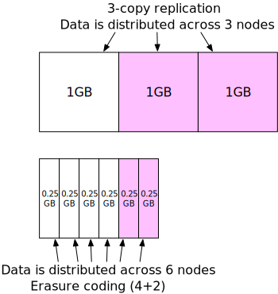

*Figure 17: Extra space for replication and erasure coding*

Does erasure coding increase data durability? Let's assume a node has a 0.81% annual failure rate. According to the calculation done by Backblaze [20], erasure coding can achieve 11 nines durability. The calculation requires complicated math. If you're interested, refer to [20] for details.

Table 5 compares the pros and cons of replication and erasure coding.

| | Replication | Erasure coding |
|---|---|---|
| **durability** | 6 nines of durability (data copied 3 times) | 11 nines of durability (8+4 erasure coding). Erasure coding wins. |
| **Storage efficiency** | 200% storage overhead. | 50% storage overhead. Erasure coding wins. |
| **Compute resource** | No computation. Replication wins. | Higher usage of computation resources to calculate parities. |
| **Write performance** | Replicating data to multiple nodes. No calculation is needed. Replication wins. | Increased write latency because we need to calculate parities before data is written to disk. |
| **Read performance** | In normal operation, reads are served from the same replica. Reads under a failure mode are not impacted because reads can be served from a non-fault replica. Replication wins. | In normal operation, every read has to come from multiple nodes in the cluster. Reads under a failure mode are slower because the missing data must be reconstructed first. |

*Table 5: Replication vs erasure coding*

In summary, replication is widely adopted in latency-sensitive applications while erasure coding is often used to minimize storage cost. Erasure coding is attractive for its cost efficiency and durability, but it greatly complicates the data node design. Therefore, for this design, we mainly focus on replication.

**Correctness verification**

Erasure coding increases data durability at comparable storage costs. Now we can move on to solve another hard challenge: data corruption.

If a disk fails completely and the failure can be detected, it can be treated as a data node failure. In this case, we can reconstruct data using erasure coding. However, in-memory data corruption is a regular occurrence in large-scale systems.

This problem can be addressed by verifying checksums [25] between process boundaries. A checksum is a small-sized block of data that is used to detect data errors. Figure 18 illustrates how the checksum is generated.

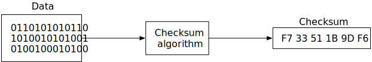

*Figure 18: Generate checksum*

If we know the checksum of the original data, we can compute the checksum of the data after transmission:

- If they are different, data is corrupted.
- If they are the same, there is a very high probability the data is not corrupted. The probability is not 100%, but in practice, we could assume they are the same.

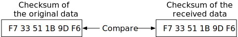

*Figure 19: Compare checksums*

There are many checksum algorithms, such as MD5 [26], SHA1[27], HMAC [28], etc. A good checksum algorithm usually outputs a significantly different value even for a small change made to the input. For this chapter, we choose a simple checksum algorithm such as MD5.

In our design, we append the checksum at the end of each object. Before a file is marked as read-only, we add a checksum of the entire file at the end. Figure 20 shows the layout.

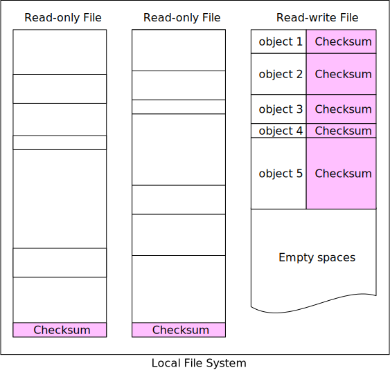

*Figure 20: Add checksum to data node*

With (8+4) erasure coding and checksum verification, this is what happens when we read data:

1. Fetch the object data and the checksum.

2. Compute the checksum against the data received.

   (a). If the two checksums match, the data is error-free.

   (b). If the checksums are different, the data is corrupted. We will try to recover by reading the data from other failure domains.

3. Repeat steps 1 and 2 until all 8 pieces of data are returned. We then reconstruct the data and send it back to the client.

### Metadata data model

In this section, we first discuss the database schema and then dive into scaling the database.

**Schema**

The database schema needs to support the following 3 queries:

- Query 1: Find the object ID by object name.
- Query 2: Insert and delete an object based on the object name.
- Query 3: List objects in a bucket sharing the same prefix.

Figure 21 shows the schema design. We need two database tables: bucket and object.

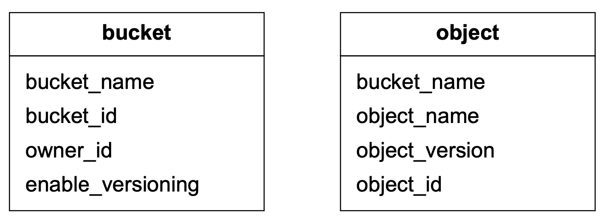

*Figure 21: Database tables*

**Scale the bucket table**

Since there is usually a limit on the number of buckets a user can create, the size of the bucket table is small. Let's assume we have 1 million customers, each customer owns 10 buckets and each record takes 1 KB. That means we need 10 GB (1 million * 10 * 1KB) of storage space. The whole table can easily fit in a modern database server. However, a single database server might not have enough CPU or network bandwidth to handle all read requests. If so, we can spread the read load among multiple database replicas.

**Scale the object table**

The object table holds the object metadata. The dataset at our design scale will likely not fit in a single database instance. We can scale the object table by sharding.

One option is to shard by the bucket_id so all the objects under the same bucket are stored in one shard. This doesn't work because it causes hotspot shards as a bucket might contain billions of objects.

Another option is to shard by object_id. The benefit of this sharding scheme is that it evenly distributes the load. But we will not be able to execute query 1 and query 2 efficiently because those two queries are based on the URI.

We choose to shard by a combination of bucket_name and object_name. This is because most of the metadata operations are based on the object URI, for example, finding the object ID by URI or uploading an object via URI. To evenly distribute the data, we can use the hash of the (bucket_name, object_name) as the sharding key.

With this sharding scheme, it is straightforward to support the first two queries, but the last query is less obvious. Let's take a look.

### Listing objects in a bucket

The object store arranges files in a flat structure instead of a hierarchy, like in a file system. An object can be accessed using a path in this format, s3://bucket-name/object-name. For example, s3://mybucket/abc/d/e/f/file.txt contains:

- Bucket name: mybucket
- Object name: abc/d/e/f/file.txt

To help users organize their objects in a bucket, S3 introduces a concept called 'prefixes.' A prefix is a string at the beginning of the object name. S3 uses prefixes to organize the data in a way similar to directories. However, prefixes are not directories. Listing a bucket by prefix limits the results to only those object names that begin with the prefix.

In the example above with the path s3://mybucket/abc/d/e/f/file.txt, the prefix is abc/d/e/f/.

The AWS S3 listing command has 3 typical uses:

1. List all buckets owned by a user. The command looks like this:

   ```
   aws s3 list-buckets
   ```

2. List all objects in a bucket that are at the same level as the specified prefix. The command looks like this:

   ```
   aws s3 ls s3://mybucket/abc/
   ```

   In this mode, objects with more slashes in the name after the prefix are rolled up into a common prefix. For example, with these objects in the bucket:

   ```
   CA/cities/losangeles.txt
   CA/cities/sanfrancisco.txt
   NY/cities/ny.txt
   federal.txt
   ```

   Listing the bucket with the '/' prefix would return these results, with everything under CA/ and NY/ rolled up into them:

   ```
   CA/
   NY/
   federal.txt
   ```

3. Recursively list all objects in a bucket that shares the same prefix. The command looks like this:

   ```
   aws s3 ls s3://mybucket/abc/ --recursive
   ```

   Using the same example as above, listing the bucket with the CA/ prefix would return these results:

   ```
   CA/cities/losangeles.txt
   CA/cities/sanfrancisco.txt
   ```

**Single database**

Let's first explore how we would support the listing command with a single database. To list all buckets owned by a user, we run the following query:

```sql
SELECT * FROM bucket WHERE owner_id={id}
```

To list all objects in a bucket that share the same prefix, we run a query like this.

```sql
SELECT * FROM object WHERE bucket_id = "123" AND object_name LIKE `abc/%`
```

In this example, we find all objects with bucket_id equals to "123" that share the prefix "abc/". Any objects with more slashes in their names after the specified prefix are rolled up in the application code as stated earlier in use case 2.

The same query would support the recursive listing mode, as stated in use case 3 previously. The application code would list every object sharing the same prefix, without performing any rollups.

**Distributed databases**

When the metadata table is sharded, it's difficult to implement the listing function because we don't know which shards contain the data. The most obvious solution is to run a search query on all shards and then aggregate the results. To achieve this, we can do the following:

1. The metadata service queries every shard by running the following query:

   ```sql
   SELECT * FROM object WHERE bucket_id = "123" AND object_name LIKE `a/b/%`
   ```

2. The metadata service aggregates all objects returned from each shard and returns the result to the caller.

This solution works, but implementing pagination for this is a bit complicated. Before we explain why, let's review how pagination works for a simple case with a single database. To return pages of listing with 10 objects for each page, the SELECT query would start with this:

```sql
SELECT * FROM object WHERE
bucket_id = "123" AND object_name LIKE `a/b/%`
ORDER BY object_name OFFSET 0 LIMIT 10
```

The OFFSET and LIMIT would restrict the results to the first 10 objects. In the next call, the user sends the request with a hint to the server, so it knows to construct the query for the second page with an OFFSET of 10. This hint is usually done with a cursor that the server returns with each page to the client. The offset information is encoded in the cursor. The client would include the cursor in the request for the next page. The server decodes the cursor and uses the offset information embedded in it to construct the query for the next page. To continue with the example above, the query for the second page looks like this:

```sql
SELECT * FROM metadata
WHERE bucket_id = "123" AND object_name LIKE `a/b/%`
ORDER BY object_name OFFSET 10 LIMIT 10
```

This client-server request loop continues until the server returns a special cursor that marks the end of the entire listing.

Now, let's explore why it's complicated to support pagination for sharded databases. Since the objects are distributed across shards, the shards would likely return a varying number of results. Some shards would contain a full page of 10 objects, while others would be partial or empty. The application code would receive results from every shard, aggregate and sort them, and return only a page of 10 in our example. The objects that don't get included in the current round must be considered again for the next round. This means that each shard would likely have a different offset. The server must track the offsets for all the shards and associate those offsets with the cursor. If there are hundreds of shards, there will be hundreds of offsets to track.

We have a solution that can solve the problem, but there are some tradeoffs. Since object storage is tuned for vast scale and high durability, object listing performance is rarely a priority. In fact, all commercial object storage supports object listing with sub-optimal performance. To take advantage of this, we could denormalize the listing data into a separate table sharded by bucket ID. This table is only used for listing objects. With this setup, even buckets with billions of objects would offer acceptable performance. This isolates the listing query to a single database which greatly simplifies the implementation.

### Object versioning

Versioning is a feature that keeps multiple versions of an object in a bucket. With versioning, we can restore objects that are accidentally deleted or overwritten. For example, we may modify a document and save it under the same name, inside the same bucket. Without versioning, the old version of the document metadata is replaced by the new version in the metadata store. The old version of the document is marked as deleted, so its storage space will be reclaimed by the garbage collector. With versioning, the object storage keeps all previous versions of the document in the metadata store, and the old versions of the document are never marked as deleted in the object store.

Figure 22 explains how to upload a versioned object. For this to work, we first need to enable versioning on the bucket.


*Figure 22: Object versioning*

1. The client sends an HTTP PUT request to upload an object named "script.txt".

2. The API service verifies the user's identity and ensures that the user has WRITE permission on the bucket.

3. Once verified, the API service uploads the data to the data store. The data store persists the data as a new object and returns a new UUID to the API service.

4. The API service calls the metadata store to store the metadata information of this object.

To support versioning, the object table for the metadata store has a column called object_version that is only used if versioning is enabled. Instead of overwriting the existing record, a new record is inserted with the same bucket_id and object_name as the old record, but with a new object_id and object_version. The object_id is the UUID for the new object returned in step 3. The object_version is a TIMEUUID [29] generated when the new row is inserted. No matter which database we choose for the metadata store, it should be efficient to look up the current version of an object. The current version has the largest TIMEUUID of all the entries with the same object_name. See Figure 23 for an illustration of how we store versioned metadata.

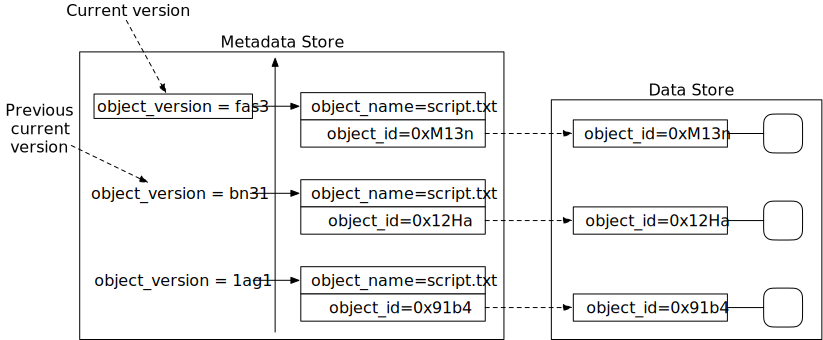

*Figure 23: Versioned metadata*

In addition to uploading a versioned object, it can also be deleted. Let's take a look.

When we delete an object, all versions remain in the bucket and we insert a delete marker, as shown in Figure 24.

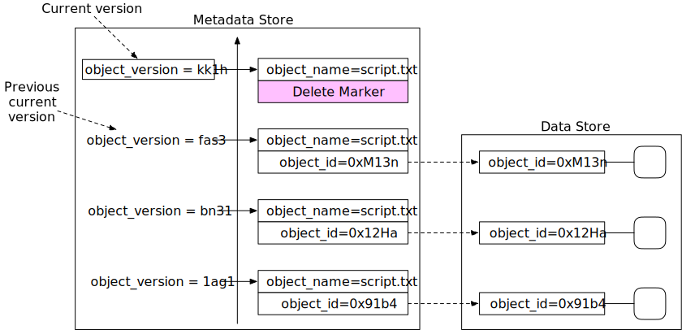

*Figure 24: Delete object by inserting a delete marker*

A delete marker is a new version of the object, and it becomes the current version of the object once inserted. Performing a GET request when the current version of the object is a delete marker returns a 404 Object Not Found error.

### Optimizing uploads of large files

In the back-of-the-envelope estimation, we estimated that 20% of the objects are large. Some might be larger than a few GBs. It is possible to upload such a large object file directly, but it could take a long time. If the network connection fails in the middle of the upload, we have to start over. A better solution is to slice a large object into smaller parts and upload them independently. After all the parts are uploaded, the object store re-assembles the object from the parts. This process is called multipart upload.

Figure 25 illustrates how multipart upload works:

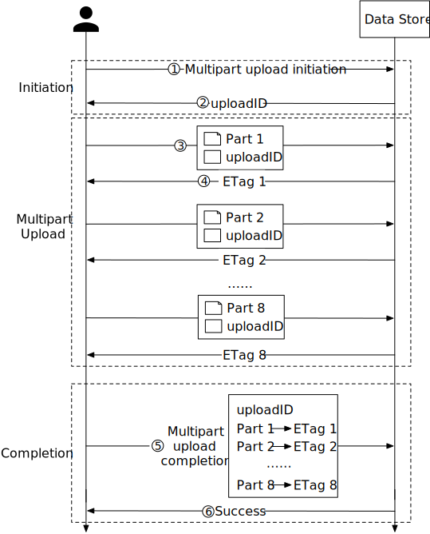

*Figure 25: Multipart upload*

1. The client calls the object storage to initiate a multipart upload.

2. The data store returns an uploadID, which uniquely identifies the upload.

3. The client splits the large file into small objects and starts uploading. Let's assume the size of the file is 1.6GB and the client splits it into 8 parts, so each part is 200 MB in size. The client uploads the first part to the data store together with the uploadID it received in step 2.

4. When a part is uploaded, the data store returns an ETag, which is essentially the md5 checksum of that part. It is used to verify multipart uploads.

5. After all parts are uploaded, the client sends a complete multipart upload request, which includes the uploadID, part numbers, and ETags.

6. The data store reassembles the object from its parts based on the part number. Since the object is really large, this process may take a few minutes. After reassembly is complete, it returns a success message to the client.

One potential problem with this approach is that old parts are no longer useful after the object has been reassembled from them. To solve this problem, we can introduce a garbage collection service responsible for freeing up space from parts that are no longer needed.

### Garbage collection

Garbage collection is the process of automatically reclaiming storage space that is no longer used. There are a few ways that data might become garbage:

- Lazy object deletion. An object is marked as deleted at delete time without actually being deleted.
- Orphan data. For example, half uploaded data or abandoned multipart uploads.
- Corrupted data. Data that failed the checksum verification.

The garbage collector does not remove objects from the data store, right away. Deleted objects will be periodically cleaned up with a compaction mechanism.

The garbage collector is also responsible for reclaiming unused space in replicas. For replication, we delete the object from both primary and backup nodes. For erasure coding, if we use (8+4) setup, we delete the object from all 12 nodes.

Figure 26 shows an example of how compaction works.

1. The garbage collector copies objects from "/data/b" to a new file named "/data/d". Note the garbage collector skips "Object 2" and "Object 5" because the delete flag is set to true for both of them.

2. After all objects are copied, the garbage collector updates the object_mapping table. For example, the obj_id and object_size fields of "Object 3" remain the same, but file_name and start_offset are updated to reflect its new location. To ensure data consistency, it's a good idea to wrap the update operations to file_name and start_offset in a database transaction.

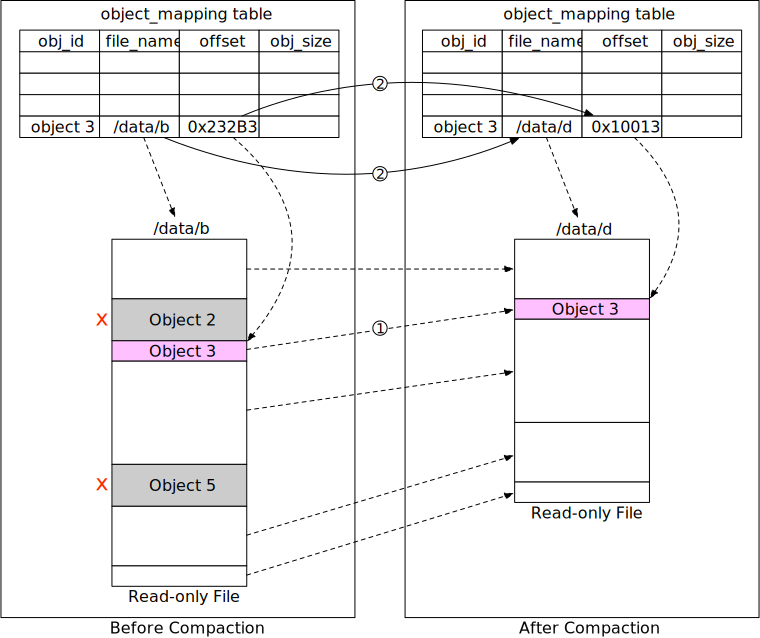

*Figure 26: Compaction*

As we can see from Figure 26, the size of the new file after compaction is smaller than the old file. To avoid creating a lot of small files, the garbage collector usually waits until there are a large number of read-only files to compact, and the compaction process appends objects from many read-only files into a few large new files.

## Step 4 - Wrap Up

In this chapter, we described the high-level design for S3-like object storage. We compared the differences between block storage, file storage, and object storage.

The focus of this interview is on the design of object storage, so we listed how the uploading, downloading, listing objects in a bucket, and versioning of objects are typically done in object storage.

Then we dived deeper into the design. Object storage is composed of a data store and a metadata store. We explained how the data is persisted into the data store and discussed two methods for increasing reliability and durability: replication and erasure coding. For the metadata store, we explained how the multipart upload is executed and how to design the database schema to support typical use cases. Lastly, we explained how to shard the metadata store to support even larger data volume.

Congratulations on getting this far! Now give yourself a pat on the back. Good job!

## Reference Material

[1] Fibre channel: https://en.wikipedia.org/wiki/Fibre_Channel

[2] iSCSI: https://en.wikipedia.org/wiki/ISCSI

[3] Server Message Block: https://en.wikipedia.org/wiki/Server_Message_Block

[4] Network File System: https://en.wikipedia.org/wiki/Network_File_System

[5] Amazon S3 Strong Consistency: https://aws.amazon.com/s3/consistency/

[6] Serial Attached SCSI: https://en.wikipedia.org/wiki/Serial_Attached_SCSI

[7] AWS CLI ls command: https://docs.aws.amazon.com/cli/latest/reference/s3/ls.html

[8] Amazon S3 Service Level Agreement: https://aws.amazon.com/s3/sla/

[9] Ambry: LinkedIn's Scalable Geo-Distributed Object Store: https://assured-cloud-computing.illinois.edu/files/2014/03/Ambry-LinkedIns-Scalable-GeoDistributed-Object-Store.pdf

[10] inode: https://en.wikipedia.org/wiki/Inode

[11] Ceph's Rados Gateway: https://docs.ceph.com/en/pacific/radosgw/index.html

[12] grpc: https://grpc.io/

[13] Paxos: https://en.wikipedia.org/wiki/Paxos_(computer_science)

[14] Raft: https://raft.github.io/

[15] Consistent hashing: https://www.toptal.com/big-data/consistent-hashing

[16] RocksDB: https://github.com/facebook/rocksdb

[17] SSTable: https://www.igvita.com/2012/02/06/sstable-and-log-structured-storage-leveldb/

[18] B+ tree: https://en.wikipedia.org/wiki/B%2B_tree

[19] SQLite: https://www.sqlite.org/index.html

[20] Data Durability Calculation: https://www.backblaze.com/blog/cloud-storage-durability/

[21] Rack: https://en.wikipedia.org/wiki/19-inch_rack

[22] Erasure Coding: https://en.wikipedia.org/wiki/Erasure_code

[23] Reed–Solomon error correction: https://en.wikipedia.org/wiki/Reed%E2%80%93Solomon_error_correction

[24] Erasure Coding Demystified: https://www.youtube.com/watch?v=Q5kVuM7zEUI

[25] Checksum: https://en.wikipedia.org/wiki/Checksum

[26] Md5: https://en.wikipedia.org/wiki/MD5

[27] Sha1: https://en.wikipedia.org/wiki/SHA-1

[28] Hmac: https://en.wikipedia.org/wiki/HMAC

[29] TIMEUUID: https://docs.datastax.com/en/cql-oss/3.3/cql/cql_reference/timeuuid_functions_r.html

