# 26 - Real-time Gaming Leaderboard

In this chapter, we are going to walk through the challenge of designing a leaderboard for an online mobile game.

What is a leaderboard? Leaderboards are common in gaming and elsewhere to show who is leading a particular tournament or competition. Users are assigned points for completing tasks or challenges, and whoever has the most points is at the top of the leaderboard. Figure 1 shows an example of a mobile game leaderboard. The leaderboard shows the ranking of the leading competitors and also displays the position of the user on it.

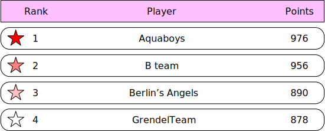

*Figure 1: Leaderboard*

## Step 1 - Understand the Problem and Establish Design Scope

Leaderboards can be pretty straightforward, but there are a number of different matters that can add complexity. We should clarify the requirements.

**Candidate:** How is the score calculated for the leaderboard?

**Interviewer:** The user gets a point when they win a match. We can go with a simple point system in which each user has a score associated with them. Each time the user wins a match, we should add a point to their total score.

**Candidate:** Are all players included in the leaderboard?

**Interviewer:** Yes.

**Candidate:** Is there a time segment associated with the leaderboard?

**Interviewer:** Each month, a new tournament kicks off which starts a new leaderboard.

**Candidate:** Can we assume we only care about the top 10 users?

**Interviewer:** We want to display the top 10 users as well as the position of a specific user on the leaderboard. If time allows, let's also discuss how to return users who are four places above and below a specific user.

**Candidate:** How many users are in a tournament?

**Interviewer:** Average of 5 million daily active users (DAU) and 25 million monthly active users (MAU).

**Candidate:** How many matches are played on average during a tournament?

**Interviewer:** Each player plays 10 matches per day on average.

**Candidate:** How do we determine the rank if two players have the same score?

**Interviewer:** In this case, their ranks are the same. If time allows, we can talk about ways to break ties.

**Candidate:** Does the leaderboard need to be real-time?

**Interviewer:** Yes, we want to present real-time results, or as close as possible. It is not okay to present a batched history of results.

Now that we've gathered all the requirements, let's list the functional requirements.

- Display top 10 players on the leaderboard.
- Show a user's specific rank.
- Display players who are four places above and below the desired user (bonus).

Other than clarifying functional requirements, it's important to understand non-functional requirements.

### Non-functional requirements

- Real-time update on scores.
- Score update is reflected on the leaderboard in real-time.
- General scalability, availability, and reliability requirements.

### Back-of-the-envelope estimation

Let's take a look at some back-of-the-envelope calculations to determine the potential scale and challenges our solution will need to address.

With 5 million DAU, if the game had an even distribution of players during a 24-hour period, we would have an average of 50 users per second (5,000,000 DAU / 10^5 seconds = ~50). However, we know that usages most likely aren't evenly distributed, and potentially there are peaks during evenings when many people across different time zones have time to play. To account for this, we could assume that peak load would be 5 times the average. Therefore we'd want to allow for a peak load of 250 users per second.

- **QPS for users scoring a point:** if a user plays 10 games per day on average, the QPS for users scoring a point is: 50 * 10 = ~500. Peak QPS is 5x of the average: 500 * 5 = 2,500.
- **QPS for fetching the top 10 leaderboard:** assume a user opens the game once a day and the top 10 leaderboard is loaded only when a user first opens the game. The QPS for this is around 50.

## Step 2 - Propose High-Level Design and Get Buy-In

In this section, we will discuss API design, high-level architecture, and data models.

### API design

At a high level, we need the following three APIs:

**POST /v1/scores**

Update a user's position on the leaderboard when a user wins a game. The request parameters are listed below. This should be an internal API that can only be called by the game servers. The client should not be able to update the leaderboard score directly.

| Field | Description |
|---|---|
| user_id | The user who wins a game. |
| points | The number of points a user gained by winning a game. |

*Table 1*

Response:

| Name | Description |
|---|---|
| 200 OK | Successfully updated a user's score. |
| 400 Bad Request | Failed to update a user's score. |

*Table 2*

**GET /v1/scores**

Fetch the top 10 players from the leaderboard.

Sample response:

```json
{
  "data": [
    {
      "user_id": "user_id1",
      "user_name": "alice",
      "rank": 1,
      "score": 12543
    },
    {
      "user_id": "user_id2",
      "user_name": "bob",
      "rank": 2,
      "score": 11500
    }
  ],
  ...
  "total": 10
}
```

**GET /v1/scores/{:user_id}**

Fetch the rank of a specific user.

| Field | Description |
|---|---|
| user_id | The ID of the user whose rank we would like to fetch. |

*Table 3*

Sample response:

```json
{
    "user_info": {
        "user_id": "user5",
        "score": 1000,
        "rank": 6,
    }
}
```

### High-level architecture

The high-level design diagram is shown in Figure 2. There are two services in this design. The game service allows users to play the game and the leaderboard service creates and displays a leaderboard.

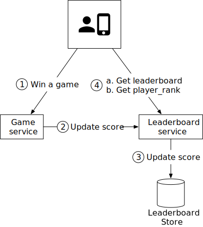

*Figure 2: High-level design*

1. When a player wins a game, the client sends a request to the game service.

2. The game service ensures the win is valid and calls the leaderboard service to update the score.

3. The leaderboard service updates the user's score in the leaderboard store.

4. A player makes a call to the leaderboard service directly to fetch leaderboard data, including:

   a. top 10 leaderboard.

   b. the rank of the player on the leaderboard.

Before settling on this design, we considered a few alternatives and decided against them. It might be helpful to go through the thought process of this and to compare different options.

**Should the client talk to the leaderboard service directly?**

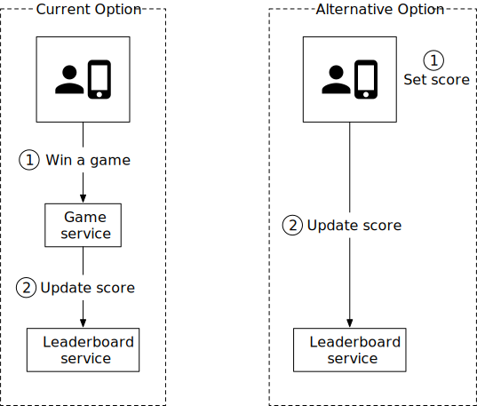

*Figure 3: Who sets the leaderboard score*

In the alternative design, the score is set by the client. This option is not secure because it is subject to man-in-the-middle attack [x], where players can put in a proxy and change scores at will. Therefore, we need the score to be set on the server-side.

Note that for server authoritative games such as online poker, the client may not need to call the game server explicitly to set scores. The game server handles all game logic, and it knows when the game finishes and could set the score without any client intervention.

**Do we need a message queue between the game service and the leaderboard service?**

The answer to this question highly depends on how the game scores are used. If the data is used in other places or supports multiple functionalities, then it might make sense to put data in Kafka as shown in Figure 4. This way, the same data can be consumed by multiple consumers, such as leaderboard service, analytics service, push notification service, etc. This is especially true when the game is a turn-based or multi-player game in which we need to notify other players about the score update. As this is not an explicit requirement based on the conversation with the interviewer, we do not use a message queue in our design.

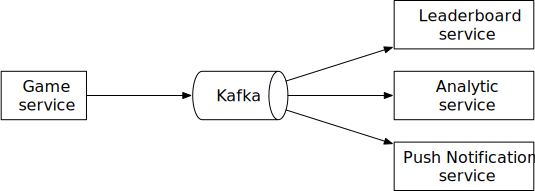

*Figure 4: Game scores are used by multiple services*

### Data models

One of the key components in the system is the leaderboard store. We will discuss three potential solutions: relational database, Redis, and NoSQL (NoSQL solution is explained in deep dive).

**Relational database solution**

First, let's take a step back and start with the simplest solution. What if the scale doesn't matter and we have only a few users?

We would most likely opt to have a simple leaderboard solution using a relational database system (RDS). Each monthly leaderboard could be represented as a database table containing user id and score columns. When the user wins a match, either award the user 1 point if they are new, or increase their existing score by 1 point. To determine a user's ranking on the leaderboard, we would sort the table by the score in descending order. The details are explained below.

**Leaderboard DB table:**

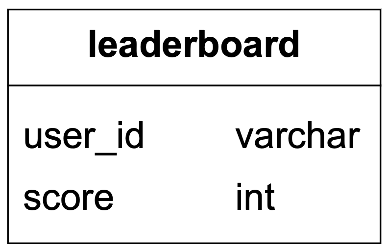

*Figure 5: Leaderboard table*

In reality, the leaderboard table has additional information, such as a game_id, a timestamp, etc. However, the underlying logic of how to query and update the leaderboard remains the same. For simplicity, we assume only the current month's leaderboard data is stored in the leaderboard table.

**A user wins a point:**


*Figure 6: A user wins a point*

Assume every score update would be an increment of 1. If a user doesn't yet have an entry in the leaderboard for the month, the first insert would be:

```sql
INSERT INTO leaderboard (user_id, score) VALUES ('mary1934', 1);
```

An update to the user's score would be:

```sql
UPDATE leaderboard set score=score + 1 where user_id='mary1934';
```

**Find a user's leaderboard position:**


*Figure 7: Find a user's leaderboard position*

To fetch the user rank, we would sort the leaderboard table and rank by the score:

```sql
SELECT (@rownum := @rownum + 1) AS rank, user_id, score
FROM leaderboard
ORDER BY score DESC;
```

The result of the SQL query looks like this:

| rank | user_id | score |
|---|---|---|
| 1 | happy_tomato | 987 |
| 2 | mallow | 902 |
| 3 | smith | 870 |
| 4 | mary1934 | 850 |

*Table 4: Result sorted by score*

This solution works when the data set is small, but the query becomes very slow when there are millions of rows. Let's take a look at why.

To figure out the rank of a user, we need to sort every single player into their correct spot on the leaderboard so we can determine exactly what the correct rank is. Remember that there can be duplicate scores as well, so the rank isn't just the position of the user in the list.

SQL databases are not performant when we have to process large amounts of continuously changing information. Attempting to do a rank operation over millions of rows is going to take 10s of seconds, which is not acceptable for the desired real-time approach. Since the data is constantly changing, it is also not feasible to consider a cache.

A relational database is not designed to handle the high load of read queries this implementation would require. An RDS could be used successfully if done as a batch operation, but that would not align with the requirement to return a real-time position for the user on the leaderboard.

One optimization we can do is to add an index and limit the number of pages to scan with the LIMIT clause. The query looks like this:

```sql
SELECT (@rownum := @rownum + 1) AS rank, user_id, score
FROM leaderboard
ORDER BY score DESC
LIMIT 10
```

However, this approach doesn't scale well. First, finding a user's rank is not performant because it essentially requires a table scan to determine the rank. Second, this approach doesn't provide a straightforward solution for determining the rank of a user who is not at the top of the leaderboard.

**Redis solution**

We want to find a solution that gives us predictable performance even for millions of users and allows us to have easy access to common leaderboard operations, without needing to fall back on complex DB queries.

Redis provides a potential solution to our problem. Redis is an in-memory data store supporting key-value pairs. Since it works in memory, it allows for fast reads and writes. Redis has a specific data type called sorted sets that are ideal for solving leaderboard system design problems.

**What are sorted sets?**

A sorted set is a data type similar to a set. Each member of a sorted set is associated with a score. The members of a set must be unique, but scores may repeat. The score is used to rank the sorted set in ascending order.

Our leaderboard use case maps perfectly to sorted sets. Internally, a sorted set is implemented by two data structures: a hash table and a skip list [1]. The hash table maps users to scores and the skip list maps scores to users. In sorted sets, users are sorted by scores. A good way to understand a sorted set is to picture it as a table with score and member columns as shown in Figure 8. The table is sorted by score in descending order.

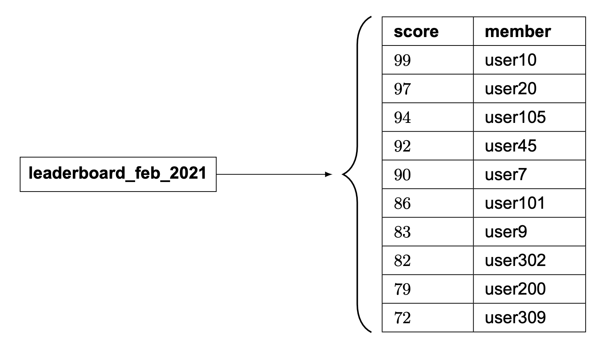

*Figure 8: February leaderboard is represented by the sorted set*

In this chapter, we don't go into the full detail of the sorted set implementation, but we do go over the high-level ideas.

A skip list is a list structure that allows for fast search. It consists of a base sorted linked list and multi-level indexes. Let's take a look at an example. In Figure 9, the base list is a sorted singly-linked list. The time complexity of insertion, removal, and search operations is O(n).

How can we make those operations faster? One idea is to get to the middle quickly, as the binary search algorithm does. To achieve that, we add a level 1 index that skips every other node, and then a level 2 index that skips every other node of the level 1 indexes. We keep introducing additional levels, with each new level skipping every other nodes of the previous level. We stop this addition when the distance between nodes is n/2 - 1, where n is the total number of nodes. As shown in Figure 9, searching for number 45 is a lot faster when we have multi-level indexes.

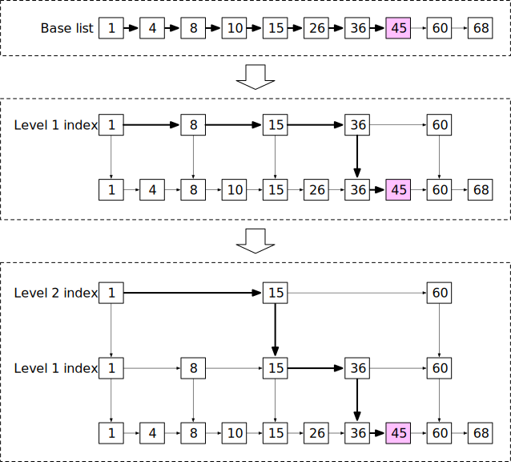

*Figure 9: Skip list*

When the data set is small, the speed improvement using the skip list isn't obvious. Figure 10 shows an example of a skip list with 5 levels of indexes. In the base linked list, it needs to travel 62 nodes to reach the correct node. In the skip list, it only needs to traverse 11 nodes [2].

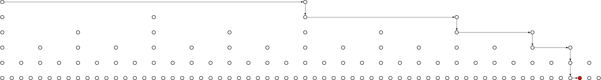

*Figure 10: Skip list with 5 levels of indexes*

Sorted sets are more performant than a relational database because each element is automatically positioned in the right order during insert or update, as well as the fact that the complexity of an add or find operation in a sorted set is logarithmic: O(logn).

In contrast, to calculate the rank of a specific user in a relational database, we need to run nested queries:

```sql
SELECT *,(SELECT COUNT(*) FROM leaderboard lb2
WHERE lb2.score >= lb1.score) RANK
FROM leaderboard lb1
WHERE lb1.user_id = {:user_id};
```

**Implementation using Redis sorted sets**

Now that we know sorted sets are fast, let's take a look at the Redis operations we will use to build our leaderboard [3] [4] [5] [6]:

- **ZADD:** insert the user into the set if they don't yet exist. Otherwise, update the score for the user. It takes O(log(n)) to execute.
- **ZINCRBY:** increment the score of the user by the specified increment. If the user doesn't exist in the set, then it assumes the score starts at 0. It takes O(log(n)) to execute.
- **ZRANGE/ZREVRANGE:** fetch a range of users sorted by the score. We can specify the order (range vs. revrange), the number of entries, and the position to start from. This takes O(log(n)+m) to execute, where m is the number of entries to fetch (which is usually small in our case), and n is the number of entries in the sorted set.
- **ZRANK/ZREVRANK:** Fetch the position of any user sorting in ascending/descending order in logarithmic time.

**Workflow with sorted sets**

**1. A user scores a point**


*Figure 11: A user scores a point*

Every month we create a new leaderboard sorted set and the previous ones are moved to historical data storage. When a user wins a match, they score 1 point; so we call ZINCRBY to increment the user's score by 1 in that month's leaderboard, or add the user to the leaderboard set if they weren't already there. The syntax for ZINCRBY is:

```
ZINCRBY <key> <increment> <user>
```

The following command adds a point to user 'mary1934' after they win a match.

```
ZINCRBY leaderboard_feb_2021 1 'mary1934'
```

**2. A user fetches the top 10 global leaderboard**


*Figure 12: Fetch top 10 global leaderboard*

We will call ZREVRANGE to obtain the members in descending order because we want the highest scores, and pass the 'WITHSCORES' attribute to ensure that it also returns the total score for each user, as well as the set of users with the highest scores. The following command fetches the top 10 players on the Feb-2021 leaderboard.

```
ZREVRANGE leaderboard_feb_2021 0 9 WITHSCORES
```

This returns a list like this:

```
[(user2,score2),(user1,score1),(user5,score5)...]
```

**3. A user wants to fetch their leaderboard position**


*Figure 13: Fetch a user's leaderboard position*

To fetch the position of a user in the leaderboard, we will call ZREVRANK to retrieve their rank on the leaderboard. Again, we call the rev version of the command because we want to rank scores from high to low.

```
ZREVRANK leaderboard_feb_2021 'mary1934'
```

**4. Fetch the relative position in the leaderboard for a user. An example is shown in Figure 14.**

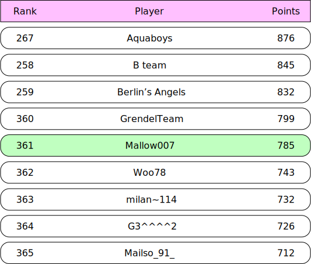

*Figure 14: Fetch 4 players above and below*

While not an explicit requirement, we can easily fetch the relative position for a user by leveraging ZREVRANGE with the number of results above and below the desired player. For example, if user Mallow007's rank is 361 and we want to fetch 4 players above and below them, we would run the following command.

```
ZREVRANGE leaderboard_feb_2021 357 365
```

**Storage requirement**

At a minimum, we need to store the user id and score. The worst-case scenario is that all 25 million monthly active users have won at least one game, and they all have entries in the leaderboard for the month. Assuming the id is a 24-character string and the score is a 16-bit integer (or 2 bytes), we need 26 bytes of storage per leaderboard entry. Given the worst-case scenario of one leaderboard entry per MAU, we would need 26 bytes * 25 million = 650 million bytes or ~650 MB for leaderboard storage in the Redis cache. Even if we double the memory usage to account for the overhead of the skip list and the hash for the sorted set, one modern Redis server is more than enough to hold the data.

Another related factor to consider is CPU and I/O usage. Our peak QPS from the back-of-the-envelope estimation is 2500 updates/sec. This is well within the performance envelope of a single Redis server.

One concern about the Redis cache is persistence, as a Redis node might fail. Luckily, Redis does support persistence, but restarting a large Redis instance from disk is slow. Usually, Redis is configured with a read replica, and when the main instance fails, the read replica is promoted, and a new read replica is attached.

Besides, we need to have 2 supporting tables (user and point) in a relational database like MySQL. The user table would store the user ID and user's display name (in a real-world application, this would contain a lot more data). The point table would contain the user id, score, and timestamp when they won a game. This can be leveraged for other game functions such as play history, and can also be used to recreate the Redis leaderboard in the event of an infrastructure failure.

As a small performance optimization, it may make sense to create an additional cache of the user details, potentially for the top 10 players since they are retrieved most frequently. However, this doesn't amount to a large amount of data.

## Step 3 - Design Deep Dive

Now that we've discussed the high-level design, let's dive into the following:

- Whether or not to use a cloud provider
- Scaling Redis
- Alternative solution: NoSQL
- Other considerations

### To use a cloud provider or not

Depending on the existing infrastructure, we generally have two options for deploying our solution. Let's take a look at each of them.

**Manage our own services**

In this approach, we will create a leaderboard sorted set each month to store the leaderboard data for that period. The sorted set stores member and score information. The rest of the details about the user, such as their name and profile image, are stored in MySQL databases. When fetching the leaderboard, besides the leaderboard data, API servers also query the database to fetch corresponding users' names and profile images to display on the leaderboard. If this becomes too inefficient in the long term, we can leverage a user profile cache to store users' details for the top 10 players. The design is shown in Figure 15.

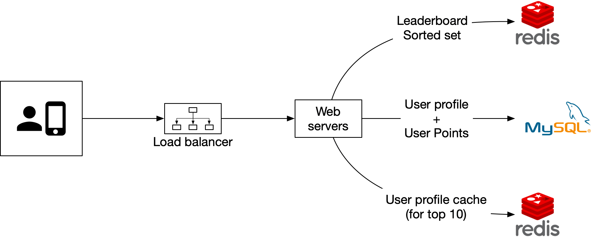

*Figure 15: Manage our own services*

**Build on the cloud**

The second approach is to leverage cloud infrastructures. In this section, we assume our existing infrastructure is built on AWS and that it's a natural fit to build the leaderboard on the cloud. We will use two major AWS technologies in this design: Amazon API Gateway and AWS Lambda function [7]. The Amazon API gateway provides a way to define the HTTP endpoints of a RESTful API and connect it to any backend services. We use it to connect to our AWS lambda functions. The mapping between Restful APIs and lambda functions is shown in Table 5.

| APIs | Lambda function |
|---|---|
| GET /v1/scores | LeaderboardFetchTop10 |
| GET /v1/scores/{:user_id} | LeaderboardFetchPlayerRank |
| POST /v1/scores | LeaderboardUpdateScore |

*Table 5: Lambda functions*

AWS Lambda is one of the most popular serverless computing platforms. It allows us to run code without having to provision or manage the servers ourselves. It runs only when needed and will scale automatically based on traffic. Serverless is one of the hottest topics in cloud services and is supported by all major cloud service providers. For example, Google Cloud has Google Cloud Functions [8] and Microsoft has named its offering Microsoft Azure Functions [9].

At a high level, our game calls the Amazon API Gateway, which in turn invokes the appropriate lambda functions. We will use AWS Lambda functions to invoke the appropriate commands on the storage layer (both Redis and MySQL), return the results back to the API Gateway, and then to the application.

We can leverage Lambda functions to perform the queries we need without having to spin up a server instance. AWS provides support for Redis clients that can be called from the Lambda functions. This also allows for auto-scaling as needed with DAU growth. Design diagrams for a user scoring a point and retrieving the leaderboard are shown below:

**Use case 1: scoring a point**


*Figure 16: Score a point*

**Use Case 2: retrieving leaderboard**

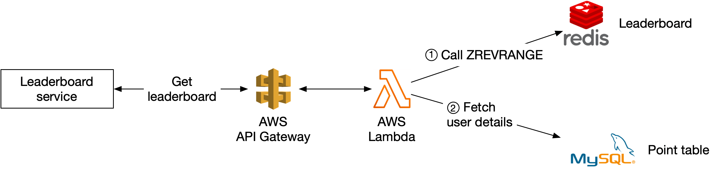

*Figure 17: Retrieve leaderboard*

Lambdas are great because they are a serverless approach, and the infrastructure will take care of auto-scaling the function as needed. This means we don't need to manage the scaling and environment setup and maintenance. Given this, we recommend going with a serverless approach if we build the game from the ground up.

### Scaling Redis

With 5 million DAU, we can get away with one Redis cache from both a storage and QPS perspective. However, let's imagine we have 500 million DAU, which is 100 times our original scale. Now our worst-case scenario for the size of the leaderboard goes up to 65 GB (650 MB *100), and our QPS goes up to 250,000 (2,500 * 100) queries per second. This calls for a sharding solution.

**Data sharding**

We consider sharding in one of the following two ways: fixed or hash partitions.

**Fixed partition**

One way to understand fixed partitions is to look at the overall range of points on the leaderboard. Let's say that the number of points won in one month ranges from 1 to 1000, and we break up the data by range. For example, we could have 10 shards and each shard would have a range of 100 scores (For example, 1-100, 101-200, 201-300, ...) as shown in Figure 18.


*Figure 18: Fixed partition*

For this to work, we want to ensure there is an even distribution of scores across the leaderboard. Otherwise, we need to adjust the score range in each shard to make sure of a relatively even distribution. In this approach, we shard the data ourselves in the application code.

When we are inserting or updating the score for a user, we need to know which shard they are in. We could do this by calculating the user's current score from the MySQL database. This can work, but a more performant option is to create a secondary cache to store the mapping from user ID to score. We need to be careful when a user increases their score and moves between shards. In this case, we need to remove the user from their current shard and move them to the new shard.

To fetch the top 10 players in the leaderboard, we would fetch the top 10 players from the shard (sorted set) with the highest scores. In Figure 18, the last shard with scores [901, 1000] contains the top 10 players.

To fetch the rank of a user, we would need to calculate the rank within their current shard (local rank), as well as the total number of players with higher scores in all of the shards. Note that the total number of players in a shard can be retrieved by running the "info keyspace" command in O(1) [10].

**Hash partition**

A second approach is to use the Redis cluster, which is desirable if the scores are very clustered or clumped. Redis cluster provides a way to shard data automatically across multiple Redis nodes. It doesn't use consistent hashing but a different form of sharding, where every key is part of a hash slot. There are 16384 hash slots [11] and we can compute the hash slot of a given key by doing CRC16(key) % 16384 [12]. This allows us to add and remove nodes in the cluster easily without redistributing all the keys. In Figure 19, we have 3 nodes, where:

- The first node contains hash slots [0, 5500].
- The second node contains hash slots [5501, 11000].
- The third node contains hash slots [11001, 16383].

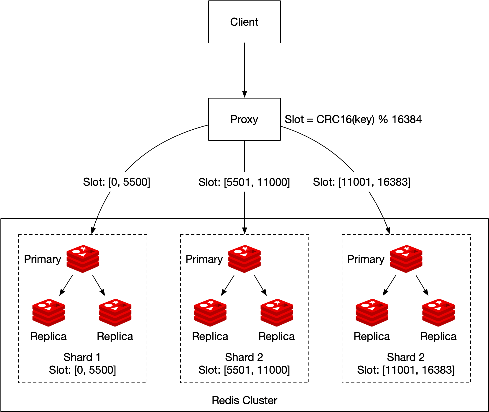

*Figure 19: Hash partition*

An update would simply change the score of the user in the corresponding shard (determined by CRC16(key)%16384). Retrieving the top 10 players on the leaderboard is more complicated. We need to gather the top 10 players from each shard and have the application sort the data. A concrete example is shown in Figure 20. Those queries can be parallelized to reduce latency.

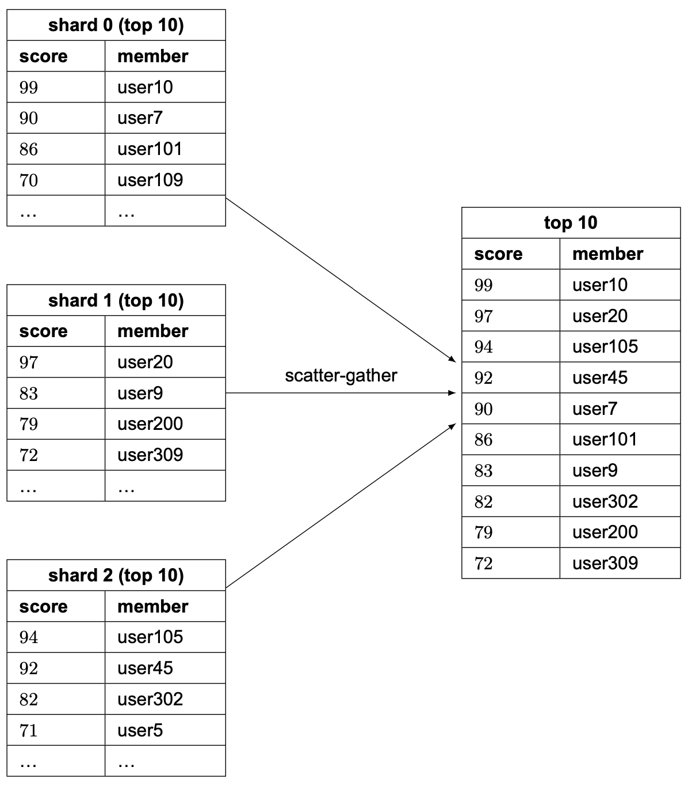

*Figure 20: Scatter-gather*

This approach has a few limitations:

- When we need to return top K results (where K is a very large number) on the leaderboard, the latency is high because a lot of entries are returned from each shard and need to be sorted.
- Latency is high if we have lots of partitions because the query has to wait for the slowest partition.
- Another issue with this approach is that it doesn't provide a straightforward solution for determining the rank of a specific user.

Therefore, we lean towards the first proposal: fixed partition.

**Sizing a Redis node**

There are multiple things to consider when sizing the Redis nodes [13]. Write-heavy applications require much more available memory, since we need to be able to accommodate all of the writes to create the snapshot in case of a failure. To be safe, allocate twice the amount of memory for write-heavy applications.

Redis provides a tool called Redis-benchmark that allows us to benchmark the performance of the Redis setup, by simulating multiple clients executing multiple queries and returning the number of requests per second for the given hardware. To learn more about Redis-benchmark, see [14].

### Alternative solution: NoSQL

An alternative solution to consider is NoSQL databases. What kind of NoSQL should we use? Ideally, we want to choose a NoSQL that has the following properties:

- Optimized for writes.
- Efficiently sort items within the same partition by score.

NoSQL databases such as Amazon's DynamoDB [15], Cassandra, or MongoDB can be a good fit. In this chapter, we use DynamoDB as an example. DynamoDB is a fully managed NoSQL database that offers reliable performance and great scalability. To allow efficient access to data with attributes other than the primary key, we can leverage global secondary indexes [16] in DynamoDB. A global secondary index contains a selection of attributes from the parent table, but they are organized using a different primary key. Let's take a look at an example.

The updated system diagram is shown in Figure 21. Redis and MySQL are replaced with DynamoDB.


*Figure 21: DynamoDB solution*

Assume we design the leaderboard for a chess game and our initial table is shown in Figure 22. It is a denormalized view of the leaderboard and user tables and contains everything needed to render a leaderboard.

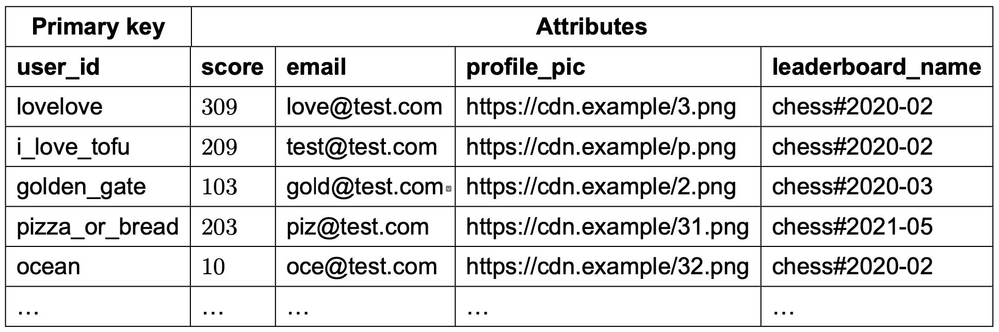

*Figure 22: Denormalized view of the leaderboard and user tables*

This table scheme works, but it doesn't scale well. As more rows are added, we have to scan the entire table to find the top scores.

To avoid a linear scan, we need to add indexes. Our first attempt is to use "game_name#{year-month}" as the partition key and the score as the sort key, as shown in Figure 23.

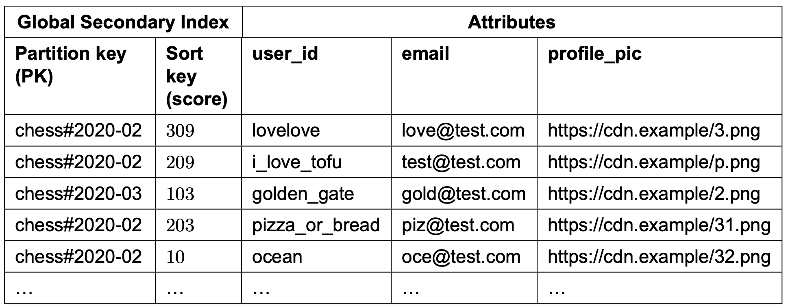

*Figure 23: Partition key and sort key*

This works, but it runs into issues at a high load. DynamoDB splits data across multiple nodes using consistent hashing. Each item lives in a corresponding node based on its partition key. We want to structure the data so that data is evenly distributed across partitions. In our table design (Figure 23), all the data for the most recent month would be stored in one partition and that partition becomes a hot partition. How can we solve this problem?

We can split data into N partitions and append a partition number (user_id % number_of_partitions) to the partition key. This pattern is called write sharding. Write sharding adds complexity for both read and write operations, so we should consider the trade-offs carefully.

The second question we need to answer is, how many partitions should we have? It can be based on write volume or DAU. The important thing to remember is that there is a trade-off between load on partitions and read complexity. Because data for the same month is spread evenly across multiple partitions, the load for a single partition is much lighter. However, to read items for a given month, we have to query all the partitions and merge the results, which adds read complexity.

The partition key looks something like this: "game_name#{year-month}#p{partition_number}". Figure 24 shows the updated schema table.

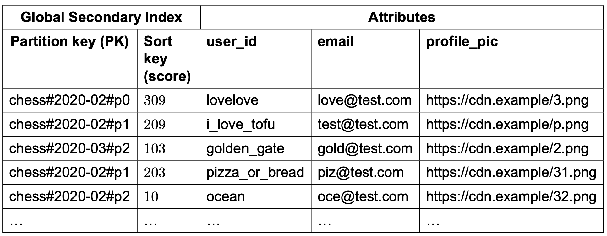

*Figure 24: Updated partition key*

The global secondary index uses "game_name#{year-month}#p{partition_number}" as the partition key and the score as the sort key. What we end up with are N partitions that are all sorted within their own partition (locally sorted). If we assume we had 3 partitions, then in order to fetch the top 10 leaderboard, we would use the approach called "scatter-gather" mentioned earlier. We would fetch the top 10 results in each of the partitions (this is the "scatter" portion), and then we would allow the application to sort the results among all the partitions (this is the "gather" portion). An example is shown in Figure 25.

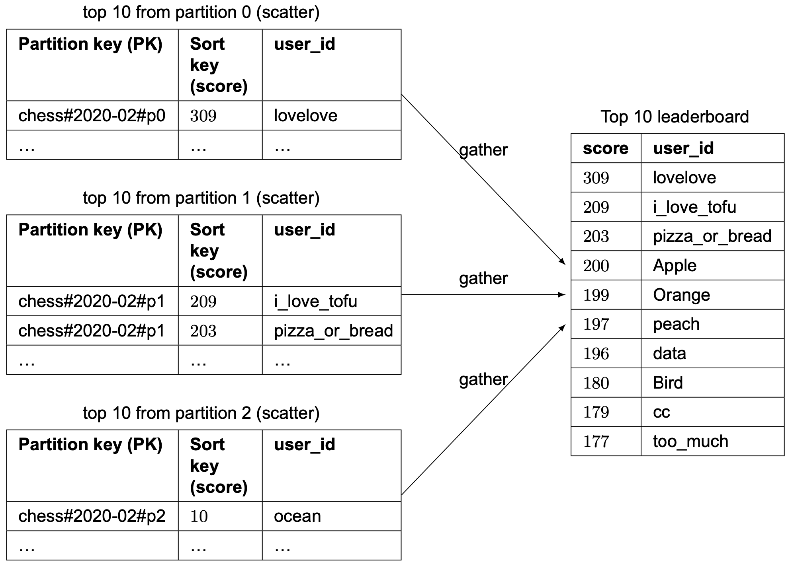

*Figure 25: Scatter-gather*

How do we decide on the number of partitions? This might require some careful benchmarking. More partitions decrease the load on each partition but add complexity, as we need to scatter across more partitions to build the final leaderboard. By employing benchmarking, we can see the trade-off more clearly.

However, similar to the Redis partition solution mentioned earlier, this approach doesn't provide a straightforward solution for determining the relative rank of a user. But it is possible to get the percentile of a user's position, which could be good enough. In real life, telling a player that they are in the top 10-20% might be better than showing the exact rank at eg.1,200,001. Therefore, if the scale is large enough that we needed to shard, we could assume that the score distributions are roughly the same across all shards. If this assumption is true, we could have a cron job that analyzes the distribution of the score for each shard, and caches that result.

The result would look something like this:

```
10th percentile = score < 100
20th percentile = score < 500
...
90th percentile = score < 6500
```

Then we could quickly return a user's relative ranking (say 90th percentile).

## Step 4 - Wrap Up

In this chapter, we have created a solution for building a real-time game leaderboard with the scale of millions of DAU. We explored the straightforward solution of using a MySQL database and rejected that approach because it does not scale to millions of users. We then designed the leaderboard using Redis sorted sets. We also looked into scaling the solution to 500 million DAU, by leveraging sharding across different Redis caches. We also proposed an alternative NoSQL solution.

In the event you have some extra time at the end of the interview, you can cover a few more topics:

**Faster retrieval and breaking tie**

A Redis Hash provides a map between string fields and values. We could leverage a hash for 2 use cases:

- To store a map of the user id to the user object that we can display on the leaderboard. This allows for faster retrieval than having to go to the database to fetch the user object.
- In the case of two players having the same scores, we could rank the users based on who received that score first. When we increment the score of the user, we can also store a map of the user id to the timestamp of the most recently won game. In the case of a tie, the user with the older timestamp ranks higher.

**System failure recovery**

The Redis cluster can potentially experience a large-scale failure. Given the design above, we could create a script that leverages the fact that the MySQL database records an entry with a timestamp each time a user won a game. We could iterate through all of the entries for each user, and call ZINCRBY once per entry, per user. This would allow us to recreate the leaderboard offline if necessary, in case of a large-scale outage.

Congratulations on getting this far! Now give yourself a pat on the back. Good job!

## Reference Material

[1] Redis Sorted Set source code: https://github.com/redis/redis/blob/unstable/src/t_zset.c

[2] Geekbang: https://static001.geekbang.org/resource/image/46/a9/46d283cd82c987153b3fe0c76dfba8a9.jpg

[3] Building real-time Leaderboard with Redis: https://medium.com/@sandeep4.verma/building-real-time-leaderboard-with-redis-82c98aa47b9f

[4] Build a real-time gaming leaderboard with Amazon ElastiCache for Redis: https://aws.amazon.com/blogs/database/building-a-real-time-gaming-leaderboard-with-amazon-elasticache-for-redis

[5] How we created a real-time Leaderboard for a million Users: https://levelup.gitconnected.com/how-we-created-a-real-time-leaderboard-for-a-million-users-555aaa3ccf7b

[6] Leaderboards: https://redislabs.com/solutions/use-cases/leaderboards/

[7] Lambda: https://aws.amazon.com/lambda/

[8] Google Cloud Functions: https://cloud.google.com/functions

[9] Azure Functions: https://azure.microsoft.com/en-us/services/functions/

[10] Info command: https://redis.io/commands/INFO

[11] Why redis cluster only have 16384 slots: https://stackoverflow.com/questions/36203532/why-redis-cluster-only-have-16384-slots

[12] Cyclic redundancy check: https://en.wikipedia.org/wiki/Cyclic_redundancy_check

[13] Choosing your node size: https://docs.aws.amazon.com/AmazonElastiCache/latest/red-ug/nodes-select-size.html

[14] How fast is Redis?: https://redis.io/topics/benchmarks

[15] Using Global Secondary Indexes in DynamoDB: https://docs.aws.amazon.com/amazondynamodb/latest/developerguide/GSI.html.

[16] Leaderboard & Write Sharding: https://www.dynamodbguide.com/leaderboard-write-sharding/

