# 27 Payment System

In this chapter, we design a payment system. E-commerce has exploded in popularity across the world in recent years. What makes every transaction possible is a payment system running behind the scenes. A reliable, scalable, and flexible payment system is essential.

What is a payment system? According to Wikipedia, "a payment system is any system used to settle financial transactions through the transfer of monetary value. This includes the institutions, instruments, people, rules, procedures, standards, and technologies that make its exchange possible" [1].

A payment system is easy to understand on the surface but is also intimidating for many developers to work on. A small slip could potentially cause significant revenue loss and destroy credibility among users. But fear not! In this chapter, we demystify payment systems.

## Step 1 - Understand the Problem and Establish Design Scope

A payment system can mean very different things to different people. Some may think it's a digital wallet like Apple Pay or Google Pay. Others may think it's a backend system that handles payments such as PayPal or Stripe. It is very important to determine the exact requirements at the beginning of the interview. These are some questions you can ask the interviewer:

**Candidate:** What kind of payment system are we building?

**Interviewer:** Assume you are building a payment backend for an e-commerce application like Amazon.com. When a customer places an order on Amazon.com, the payment system handles everything related to money movement.

**Candidate:** What payment options are supported? Credit cards, PayPal, bank cards, etc?

**Interviewer:** The payment system should support all of these options in real life. However, in this interview, we can use credit card payment as an example.

**Candidate:** Do we handle credit card payment processing ourselves?

**Interviewer:** No, we use third-party payment processors, such as Stripe, Braintree, Square, etc.

**Candidate:** Do we store credit card data in our system?

**Interviewer:** Due to extremely high security and compliance requirements, we do not store card numbers directly in our system. We rely on third-party payment processors to handle sensitive credit card data.

**Candidate:** Is the application global? Do we need to support different currencies and international payments?

**Interviewer:** Great question. Yes, the application would be global but we assume only one currency is used in this interview.

**Candidate:** How many payment transactions per day?

**Interviewer:** 1 million transactions per day.

**Candidate:** Do we need to support the pay-out flow, which an e-commerce site like Amazon uses to pay sellers every month?

**Interviewer:** Yes, we need to support that.

**Candidate:** I think I have gathered all the requirements. Is there anything else I should pay attention to?

**Interviewer:** Yes. A payment system interacts with a lot of internal services (accounting, analytics, etc.) and external services (payment service providers). When a service fails, we may see inconsistent states among services. Therefore, we need to perform reconciliation and fix any inconsistencies. This is also a requirement.

With these questions, we get a clear picture of both the functional and non-functional requirements. In this interview, we focus on designing a payment system that supports the following.

### Functional requirements

- **Pay-in flow:** payment system receives money from customers on behalf of sellers.

- **Pay-out flow:** payment system sends money to sellers around the world.

### Non-functional requirements

- **Reliability and fault tolerance.** Failed payments need to be carefully handled.

- **A reconciliation process** between internal services (payment systems, accounting systems) and external services (payment service providers) is required. The process asynchronously verifies that the payment information across these systems is consistent.

### Back-of-the-envelope estimation

The system needs to process 1 million transactions per day, which is 1,000,000 transactions / 10^5 seconds = 10 transactions per second (TPS). 10 TPS is not a big number for a typical database, which means the focus of this system design interview is on how to correctly handle payment transactions, rather than aiming for high throughput.

## Step 2 - Propose High-Level Design and Get Buy-In

At a high level, the payment flow is broken down into two steps to reflect how money flows:

- **Pay-in flow**

- **Pay-out flow**

Take the e-commerce site, Amazon, as an example. After a buyer places an order, the money flows into Amazon's bank account, which is the pay-in flow. Although the money is in Amazon's bank account, Amazon does not own all of the money. The seller owns a substantial part of it and Amazon only works as the money custodian for a fee. Later, when the products are delivered and money is released, the balance after fees then flows from Amazon's bank account to the seller's bank account. This is the pay-out flow. The simplified pay-in and pay-out flows are shown in Figure 1.

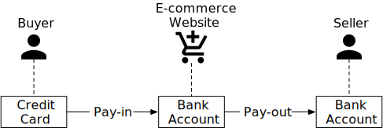

**Figure 1**

### Pay-in flow

The high-level design diagram for the pay-in flow is shown in Figure 2. Let's take a look at each component of the system.

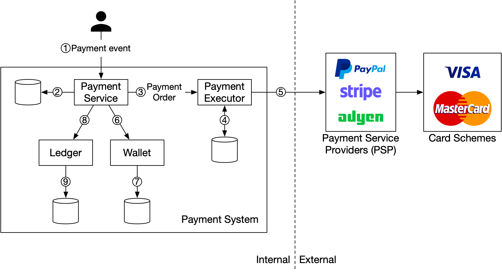

**Figure 2**

#### Payment service

The payment service accepts payment events from users and coordinates the payment process. The first thing it usually does is a risk check, assessing for compliance with regulations such as AML/CFT [2], and for evidence of criminal activity such as money laundering or financing of terrorism. The payment service only processes payments that pass this risk check. Usually, the risk check service uses a third-party provider because it is very complicated and highly specialized.

#### Payment executor

The payment executor executes a single payment order via a Payment Service Provider (PSP). A payment event may contain several payment orders.

#### Payment Service Provider (PSP)

A PSP moves money from account A to account B. In this simplified example, the PSP moves the money out of the buyer's credit card account.

#### Card schemes

Card schemes are the organizations that process credit card operations. Well known card schemes are Visa, MasterCard, Discovery, etc. The card scheme ecosystem is very complex [3].

#### Ledger

The ledger keeps a financial record of the payment transaction. For example, when a user pays the seller $1, we record it as debit $1 from a user and credit $1 to the seller. The ledger system is very important in post-payment analysis, such as calculating the total revenue of the e-commerce website or forecasting future revenue.

#### Wallet

The wallet keeps the account balance of the merchant. It may also record how much a given user has paid in total.

As shown in Figure 2, a typical pay-in flow works like this:

1. When a user clicks the "place order" button, a payment event is generated and sent to the payment service.

2. The payment service stores the payment event in the database.

3. Sometimes, a single payment event may contain several payment orders. For example, you may select products from multiple sellers in a single checkout process. If the e-commerce website splits the checkout into multiple payment orders, the payment service calls the payment executor for each payment order.

4. The payment executor stores the payment order in the database.

5. The payment executor calls an external PSP to process the credit card payment.

6. After the payment executor has successfully processed the payment, the payment service updates the wallet to record how much money a given seller has.

7. The wallet server stores the updated balance information in the database.

8. After the wallet service has successfully updated the seller's balance information, the payment service calls the ledger to update it.

9. The ledger service appends the new ledger information to the database.

### APIs for payment service

We use the RESTful API design convention for the payment service.

#### POST /v1/payments

This endpoint executes a payment event. As mentioned above, a single payment event may contain multiple payment orders. The request parameters are listed below:

| Field | Description | Type |
|-------|-------------|------|
| buyer_info | The information of the buyer | json |
| checkout_id | A globally unique ID for this checkout | string |
| credit_card_info | This could be encrypted credit card information or a payment token. The value is PSP-specific. | json |
| payment_orders | A list of the payment orders | list |

**Table 1 API request parameters (execute a payment event)**

The payment_orders look like this:

| Field | Description | Type |
|-------|-------------|------|
| seller_account | Which seller will receive the money | string |
| amount | The transaction amount for the order | string |
| currency | The currency for the order | string (ISO 4217 [4]) |
| payment_order_id | A globally unique ID for this payment | string |

**Table 2 payment_orders**

Note that the payment_order_id is globally unique. When the payment executor sends a payment request to a third-party PSP, the payment_order_id is used by the PSP as the deduplication ID, also called the idempotency key.

You may have noticed that the data type of the "amount" field is "string," rather than "double". Double is not a good choice because:

- Different protocols, software, and hardware may support different numeric precisions in serialization and deserialization. This difference might cause unintended rounding errors.

- The number could be extremely big (for example, Japan's GDP is around 5x10^14 yen for the calendar year 2020), or extremely small (for example, a satoshi of Bitcoin is 10^-8).

It is recommended to keep numbers in string format during transmission and storage. They are only parsed to numbers when used for display or calculation.

#### GET /v1/payments/{:id}

This endpoint returns the execution status of a single payment order based on payment_order_id.

The payment API mentioned above is similar to the API of some well-known PSPs. If you are interested in a more comprehensive view of payment APIs, check out Stripe's API documentation [5].

### The data model for payment service

We need two tables for the payment service: payment event and payment order. When we select a storage solution for a payment system, performance is usually not the most important factor. Instead, we focus on the following:

- **Proven stability.** Whether the storage system has been used by other big financial firms for many years (for example more than 5 years) with positive feedback.

- **The richness of supporting tools,** such as monitoring and investigation tools.

- **Maturity of the database administrator (DBA) job market.** Whether we can recruit experienced DBAs is a very important factor to consider.

Usually, we prefer a traditional relational database with ACID transaction support over NoSQL/NewSQL.

The payment event table contains detailed payment event information. This is what it looks like:

| Name | Type |
|------|------|
| checkout_id | string PK |
| buyer_info | string |
| seller_info | string |
| credit_card_info | depends on the card provider |
| is_payment_done | boolean |

**Table 3 Payment event**

The payment order table stores the execution status of each payment order. This is what it looks like:

| Name | Type |
|------|------|
| payment_order_id | String PK |
| buyer_account | string |
| amount | string |
| currency | string |
| checkout_id | string FK |
| payment_order_status | string |
| ledger_updated | boolean |
| wallet_updated | boolean |

**Table 4 Payment order**

Before we dive into the tables, let's take a look at some background information.

The checkout_id is the foreign key. A single checkout creates a payment event that may contain several payment orders.

When we call a third-party PSP to deduct money from the buyer's credit card, the money is not directly transferred to the seller. Instead, the money is transferred to the e-commerce website's bank account. This process is called pay-in. When the pay-out condition is satisfied, such as when the products are delivered, the seller initiates a pay-out. Only then is the money transferred from the e-commerce website's bank account to the seller's bank account. Therefore, during the pay-in flow, we only need the buyer's card information, not the seller's bank account information.

In the payment order table (Table 4), payment_order_status is an enumerated type (enum) that keeps the execution status of the payment order. Execution status includes NOT_STARTED, EXECUTING, SUCCESS, FAILED. The update logic is:

- The initial status of payment_order_status is NOT_STARTED.

- When the payment service sends the payment order to the payment executor, the payment_order_status is EXECUTING.

- The payment service updates the payment_order_status to SUCCESS or FAILED depending on the response of the payment executor.

- Once the payment_order_status is SUCCESS, the payment service calls the wallet service to update the seller balance and update the wallet_updated field to TRUE. Here we simplify the design by assuming wallet updates always succeed.

- Once it is done, the next step for the payment service is to call the ledger service to update the ledger database by updating the ledger_updated field to TRUE.

- When all payment orders under the same checkout_id are processed successfully, the payment service updates the is_payment_done to TRUE in the payment event table. A scheduled job usually runs at a fixed interval to monitor the status of the in-flight payment orders. It sends an alert when a payment order does not finish within a threshold so that engineers can investigate it.

### Double-entry ledger system

There is a very important design principle in the ledger system: the double-entry principle (also called double-entry accounting/bookkeeping [6]). Double-entry system is fundamental to any payment system and is key to accurate bookkeeping. It records every payment transaction into two separate ledger accounts with the same amount. One account is debited and the other is credited with the same amount (Table 5).

| Account | Debit | Credit |
|---------|-------|--------|
| buyer | $1 | |
| seller | | $1 |

**Table 5 Double-entry system**

The double-entry system states that the sum of all the transaction entries must be 0. One cent lost means someone else gains a cent. It provides end-to-end traceability and ensures consistency throughout the payment cycle. To find out more about implementing the double-entry system, see Square's engineering blog about immutable double-entry accounting database service [7].

### Hosted payment page

Most companies prefer not to store credit card information internally because if they do, they have to deal with complex regulations such as Payment Card Industry Data Security Standard (PCI DSS) [8] in the United States. To avoid handling credit card information, companies use hosted credit card pages provided by PSPs. For websites, it is a widget or an iframe, while for mobile applications, it may be a pre-built page from the payment SDK. Figure 3 illustrates an example of the checkout experience with PayPal integration. The key point here is that the PSP provides a hosted payment page that captures the customer card information directly, rather than relying on our payment service.

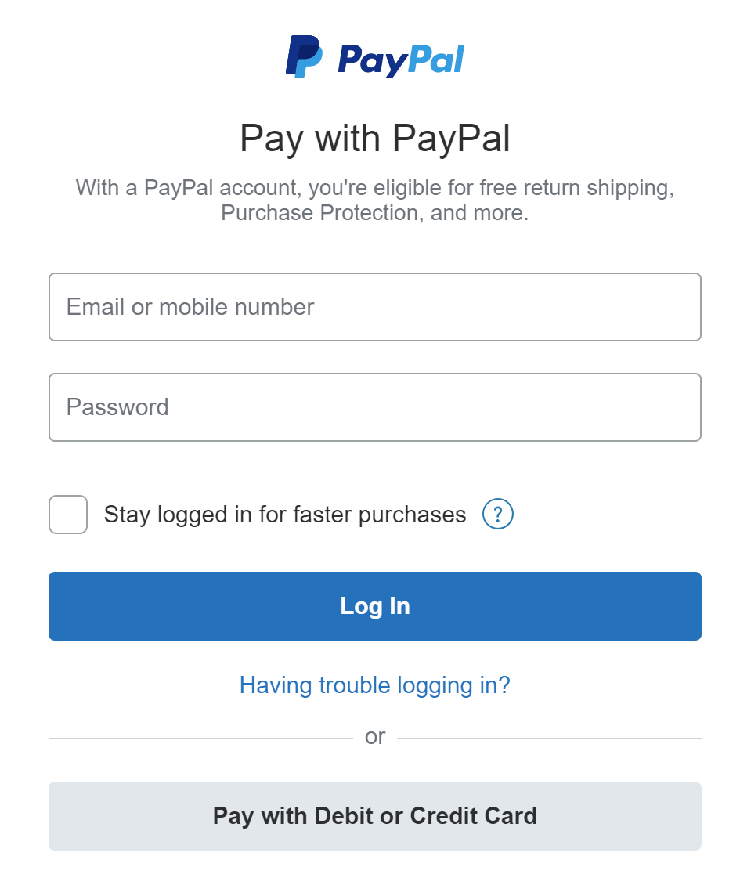

**Figure 3**

### Pay-out flow

The components of the pay-out flow are very similar to the pay-in flow. One difference is that instead of using PSP to move money from the buyer's credit card to the e-commerce website's bank account, the pay-out flow uses a third-party pay-out provider to move money from the e-commerce website's bank account to the seller's bank account.

Usually, the payment system uses third-party account payable providers like Tipalti [9] to handle pay-outs. There are a lot of bookkeeping and regulatory requirements with pay-outs as well.

## Step 3 - Design Deep Dive

In this section, we focus on making the system faster, more robust, and secure. In a distributed system, errors and failures are not only inevitable but common. For example, what happens if a customer pressed the "pay" button multiple times? Will they be charged multiple times? How do we handle payment failures caused by poor network connections? In this section, we dive deep into several key topics.

- PSP integration

- Reconciliation

- Handling payment processing delays

- Communication among internal services

- Handling failed payments

- Exact-once delivery

- Consistency

- Security

### PSP integration

If the payment system can directly connect to banks or card schemes such as Visa or MasterCard, payment can be made without a PSP. These direct connections are uncommon and highly specialized. They are usually reserved for really large companies that can justify such an investment. For most companies, the payment system integrates with a PSP instead, in one of two ways:

1. If a company can safely store sensitive payment information and chooses to do so, PSP can be integrated using API. The company is responsible for developing the payment web pages, collecting and storing sensitive payment information. PSP is responsible for connecting to banks or card schemes.

2. If a company chooses not to store sensitive payment information due to complex regulations and security concerns, PSP provides a hosted payment page to collect card payment details and securely store them in PSP. This is the approach most companies take.

We use Figure 4 to explain how the hosted payment page works in detail.

**Figure 4**

We omitted the payment executor, ledger, and wallet in Figure 4 for simplicity. The payment service orchestrates the whole payment process.

1. The user clicks the "checkout" button in the client browser. The client calls the payment service with the payment order information.

2. After receiving the payment order information, the payment service sends a payment registration request to the PSP. This registration request contains payment information, such as the amount, currency, expiration date of the payment request, and the redirect URL. Because a payment order should be registered only once, there is a UUID field to ensure the exactly-once registration. This UUID is also called nonce [10]. Usually, this UUID is the ID of the payment order.

3. The PSP returns a token back to the payment service. A token is a UUID on the PSP side that uniquely identifies the payment registration. We can examine the payment registration and the payment execution status later using this token.

4. The payment service stores the token in the database before calling the PSP-hosted payment page.

5. Once the token is persisted, the client displays a PSP-hosted payment page. Mobile applications usually use the PSP's SDK integration for this functionality. Here we use Stripe's web integration as an example (Figure 5). Stripe provides a JavaScript library that displays the payment UI, collects sensitive payment information, and calls the PSP directly to complete the payment. Sensitive payment information is collected by Stripe. It never reaches our payment system. The hosted payment page usually needs two pieces of information:

   - The token we received in step 4. The PSP's javascript code uses the token to retrieve detailed information about the payment request from the PSP's backend. One important piece of information is how much money to collect.

   - Another important piece of information is the redirect URL. This is the web page URL that is called when the payment is complete. When the PSP's JavaScript finishes the payment, it redirects the browser to the redirect URL. Usually, the redirect URL is an e-commerce web page that shows the status of the checkout. Note that the redirect URL is different from the webhook [11] URL in step 9.

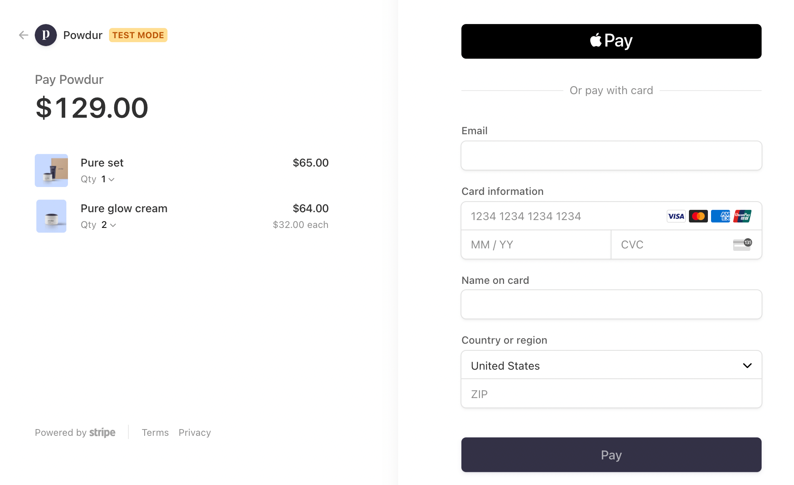

**Figure 5**

6. The user fills in the payment details on the PSP's web page, such as the credit card number, holder's name, expiration date, etc, then clicks the pay button. The PSP starts the payment processing.

7. The PSP returns the payment status.

8. The web page is now redirected to the redirect URL. The payment status that is received in step 7 is typically appended to the URL. For example, the full redirect URL could be [12]: https://your-company.com/?tokenID=JIOUIQ123NSF&payResult=X324FSa

9. Asynchronously, the PSP calls the payment service with the payment status via a webhook. The webhook is an URL on the payment system side that was registered with the PSP during the initial setup with the PSP. When the payment system receives payment events through the webhook, it extracts the payment status and updates the payment_order_status field in the Payment Order database table.

So far, we explained the happy path of the hosted payment page. In reality, the network connection could be unreliable and all 9 steps above could fail. Is there any systematic way to handle failure cases? The answer is reconciliation.

### Reconciliation

When system components communicate asynchronously, there is no guarantee that a message will be delivered, or a response will be returned. This is very common in the payment business, which often uses asynchronous communication to increase system performance. External systems, such as PSPs or banks, prefer asynchronous communication as well. So how can we ensure correctness in this case?

The answer is reconciliation. This is a practice that periodically compares the states among related services in order to verify that they are in agreement. It is usually the last line of defense in the payment system.

Every night the PSP or banks send a settlement file to their clients. The settlement file contains the balance of the bank account, together with all the transactions that took place on this bank account during the day. The reconciliation system parses the settlement file and compares the details with the ledger system. Figure 6 below shows where the reconciliation process fits in the system.

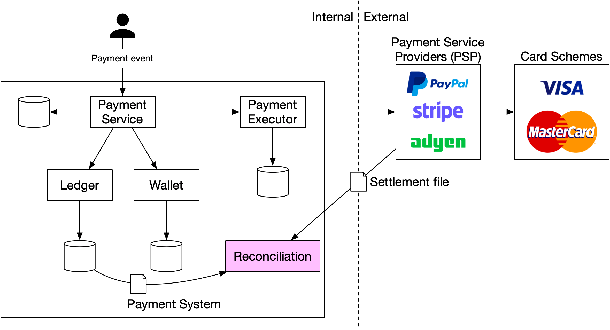

**Figure 6**

Reconciliation is also used to verify that the payment system is internally consistent. For example, the states in the ledger and wallet might diverge and we could use the reconciliation system to detect any discrepancy.

To fix mismatches found during reconciliation, we usually rely on the finance team to perform manual adjustments. The mismatches and adjustments are usually classified into three categories:

1. **The mismatch is classifiable and the adjustment can be automated.** In this case, we know the cause of the mismatch, how to fix it, and it is cost-effective to write a program to automate the adjustment. Engineers can automate both the mismatch classification and adjustment.

2. **The mismatch is classifiable, but we are unable to automate the adjustment.** In this case, we know the cause of the mismatch and how to fix it, but the cost of writing an auto adjustment program is too high. The mismatch is put into a job queue and the finance team fixes the mismatch manually.

3. **The mismatch is unclassifiable.** In this case, we do not know how the mismatch happens. The mismatch is put into a special job queue. The finance team investigates it manually.

### Handling payment processing delays

As discussed previously, an end-to-end payment request flows through many components and involves both internal and external parties. While in most cases a payment request would complete in seconds, there are situations where a payment request would stall and sometimes take hours or days before it is completed or rejected. Here are some examples where a payment request could take longer than usual:

- The PSP deems a payment request high risk and requires a human to review it.

- A credit card requires extra protection like 3D Secure Authentication [13] which requires extra details from a card holder to verify a purchase.

The payment service must be able to handle these payment requests that take a long time to process. If the buy page is hosted by an external PSP, which is quite common these days, the PSP would handle these long-running payment requests in the following ways:

1. The PSP would return a pending status to our client. Our client would display that to the user. Our client would also provide a page for the customer to check the current payment status.

2. The PSP tracks the pending payment on our behalf, and notifies the payment service of any status update via the webhook the payment service registered with the PSP.

3. When the payment request is finally completed, the PSP calls the registered webhook mentioned above. The payment service updates its internal system and completes the shipment to the customer.

Alternatively, instead of updating the payment service via a webhook, some PSP would put the burden on the payment service to poll the PSP for status updates on any pending payment requests.

### Communication among internal services

There are two types of communication patterns that internal services use to communicate: synchronous vs asynchronous. Both are explained below.

#### Synchronous communication

Synchronous communication like HTTP works well for small-scale systems, but its shortcomings become obvious as the scale increases. It creates a long request and response cycle that depends on many services. The drawbacks of this approach are:

- **Low performance.** If any one of the services in the chain doesn't perform well, the whole system is impacted.

- **Poor failure isolation.** If PSPs or any other services fail, the client will no longer receive a response.

- **Tight coupling.** The request sender needs to know the recipient.

- **Hard to scale.** Without using a queue to act as a buffer, it's not easy to scale the system to support a sudden increase in traffic.

#### Asynchronous communication

Asynchronous communication can be divided into two categories:

- **Single receiver:** each request (message) is processed by one receiver or service. It's usually implemented via a shared message queue. The message queue can have multiple subscribers, but once a message is processed, it gets removed from the queue. Let's take a look at a concrete example. In Figure 7, service A and service B both subscribe to a shared message queue. When m1 and m2 are consumed by service A and service B respectively, both messages are removed from the queue as shown in Figure 8.

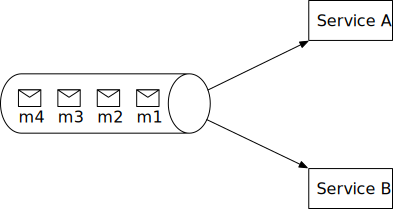

**Figure 7**

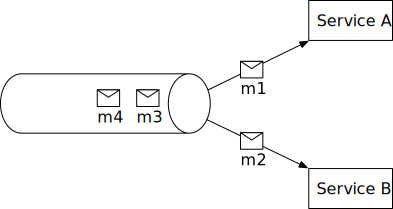

**Figure 8**

- **Multiple receivers:** each request (message) is processed by multiple receivers or services. Kafka works well here. When consumers receive messages, they are not removed from Kafka. The same message can be processed by different services. This model maps well to the payment system, as the same request might trigger multiple side effects such as sending push notifications, updating financial reporting, analytics, etc. An example is illustrated in Figure 9. Payment events are published to Kafka and consumed by different services such as the payment system, analytics service, and billing service.

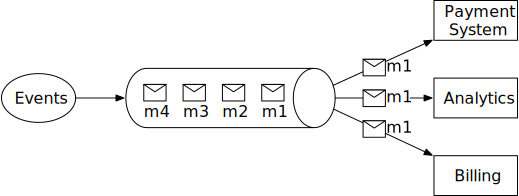

**Figure 9**

Generally speaking, synchronous communication is simpler in design, but it doesn't allow services to be autonomous. As the dependency graph grows, the overall performance suffers. Asynchronous communication trades design simplicity and consistency for scalability and failure resilience. For a large-scale payment system with complex business logic and a large number of third-party dependencies, asynchronous communication is a better choice.

### Handling failed payments

Every payment system has to handle failed transactions. Reliability and fault tolerance are key requirements. We review some of the techniques for tackling those challenges.

#### Tracking payment state

Having a definitive payment state at any stage of the payment cycle is crucial. Whenever a failure happens, we can determine the current state of a payment transaction and decide whether a retry or refund is needed. The payment state can be persisted in an append-only database table.

#### Retry queue and dead letter queue

To gracefully handle failures, we utilize the retry queue and dead letter queue, as shown in Figure 10.

- **Retry queue:** retryable errors such as transient errors are routed to a retry queue.

- **Dead letter queue [14]:** if a message fails repeatedly, it eventually lands in the dead letter queue. A dead letter queue is useful for debugging and isolating problematic messages for inspection to determine why they were not processed successfully.

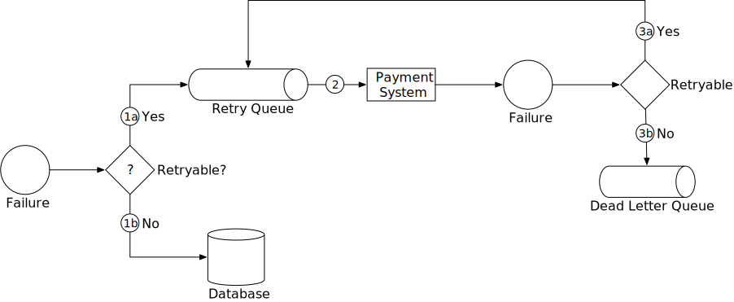

**Figure 10**

1. Check whether the failure is retryable.

   1a. Retryable failures are routed to a retry queue.

   1b. For non-retryable failures such as invalid input, errors are stored in a database.

2. The payment system consumes events from the retry queue and retries failed payment transactions.

3. If the payment transaction fails again:

   3a. If the retry count doesn't exceed the threshold, the event is routed to the retry queue.

   3b. If the retry count exceeds the threshold, the event is put in the dead letter queue. Those failed events might need to be investigated.

If you are interested in a real-world example of using those queues, take a look at Uber's payment system that utilizes Kafka to meet the reliability and fault-tolerance requirements [16].

### Exactly-once delivery

One of the most serious problems a payment system can have is to double charge a customer. It is important to guarantee in our design that the payment system executes a payment order exactly-once [16].

At first glance, exactly-once delivery seems very hard to tackle, but if we divide the problem into two parts, it is much easier to solve. Mathematically, an operation is executed exactly-once if:

- It is executed at-least-once.

- At the same time, it is executed at-most-once.

We will explain how to implement at-least-once using retry, and at-most-once using idempotency check.

#### Retry

Occasionally, we need to retry a payment transaction due to network errors or timeout. Retry provides the at-least-once guarantee. For example, as shown in Figure 11, where the client tries to make a $10 payment, but the payment request keeps failing due to a poor network connection. In this example, the network eventually recovered and the request succeeded at the fourth attempt.

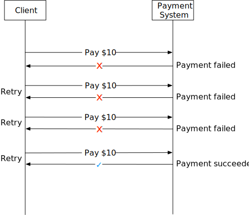

**Figure 11**

Deciding the appropriate time intervals between retries is important. Here are a few common retry strategies.

- **Immediate retry:** client immediately resends a request.

- **Fixed intervals:** wait a fixed amount of time between the time of the failed payment and a new retry attempt.

- **Incremental intervals:** client waits for a short time for the first retry, and then incrementally increases the time for subsequent retries.

- **Exponential backoff [17]:** double the waiting time between retries after each failed retry. For example, when a request fails for the first time, we retry after 1 second; if it fails a second time, we wait 2 seconds before the next retry; if it fails a third time, we wait 4 seconds before another retry.

- **Cancel:** the client can cancel the request. This is a common practice when the failure is permanent or repeated requests are unlikely to be successful.

Determining the appropriate retry strategy is difficult. There is no "one size fits all" solution. As a general guideline, use exponential backoff if the network issue is unlikely to be resolved in a short amount of time. Overly aggressive retry strategies waste computing resources and can cause service overload. A good practice is to provide an error code with a Retry-After header.

A potential problem of retrying is double payments. Let us take a look at two scenarios.

- **Scenario 1:** The payment system integrates with PSP using a hosted payment page, and the client clicks the pay button twice.

- **Scenario 2:** The payment is successfully processed by the PSP, but the response fails to reach our payment system due to network errors. The user clicks the "pay" button again or the client retries the payment.

In order to avoid double payment, the payment has to be executed at-most-once. This at-most-once guarantee is also called idempotency.

#### Idempotency

Idempotency is key to ensuring the at-most-once guarantee. According to Wikipedia, "idempotence is the property of certain operations in mathematics and computer science whereby they can be applied multiple times without changing the result beyond the initial application" [18]. From an API standpoint, idempotency means clients can make the same call repeatedly and produce the same result.

For communication between clients (web and mobile applications) and servers, an idempotency key is usually a unique value that is generated by the client and expires after a certain period of time. A UUID is commonly used as an idempotency key and it is recommended by many tech companies such as Stripe [19] and PayPal [20]. To perform an idempotent payment request, an idempotency key is added to the HTTP header: `<idempotency-key: key_value>`.

Now that we understand the basics of idempotency, let's take a look at how it helps to solve the double payment issues mentioned above.

**Scenario 1: what if a customer clicks the "pay" button quickly twice?**

In Figure 12, when a user clicks "pay," an idempotency key is sent to the payment system as part of the HTTP request. In an e-commerce website, the idempotency key is usually the ID of the shopping cart right before the checkout.

For the second request, it's treated as a retry because the payment system has already seen the idempotency key. When we include a previously specified idempotency key in the request header, the payment system returns the latest status of the previous request.

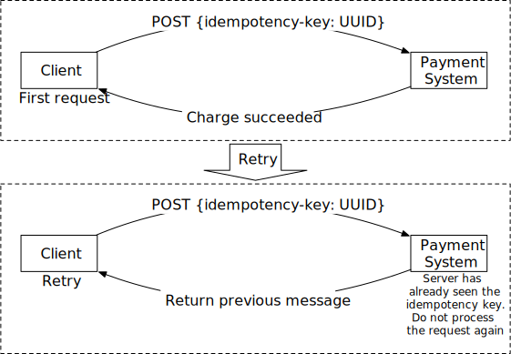

**Figure 12**

If multiple concurrent requests are detected with the same idempotency key, only one request is processed and the others receive the "429 Too Many Requests" status code.

To support idempotency, we can use the database's unique key constraint. For example, the primary key of the database table is served as the idempotency key. Here is how it works:

1. When the payment system receives a payment, it tries to insert a row into the database table.

2. A successful insertion means we have not seen this payment request before.

3. If the insertion fails because the same primary key already exists, it means we have seen this payment request before. The second request will not be processed.

**Scenario 2: The payment is successfully processed by the PSP, but the response fails to reach our payment system due to network errors. Then the user clicks the "pay" again.**

As shown in Figure 4 (step 2 and step 3), the payment service sends the PSP a nonce and the PSP returns a corresponding token. The nonce uniquely represents the payment order, and the token uniquely maps to the nonce. Therefore, the token uniquely maps to the payment order.

When the user clicks the "pay" button again, the payment order is the same, so the token sent to the PSP is the same. Because the token is used as the idempotency key on the PSP side, it is able to identify the double payment and return the status of the previous execution.

### Consistency

Several stateful services are called in a payment execution:

- The payment service keeps payment-related data such as nonce, token, payment order, execution status, etc.

- The ledger keeps all accounting data.

- The wallet keeps the account balance of the merchant.

- The PSP keeps the payment execution status.

- Data might be replicated among different database replicas to increase reliability.

In a distributed environment, the communication between any two services can fail, causing data inconsistency. Let's take a look at some techniques to resolve data inconsistency in a payment system.

- To maintain data consistency between internal services, ensuring exactly-once processing is very important.

- To maintain data consistency between the internal service and external service (PSP), we usually rely on idempotency and reconciliation. If the external service supports idempotency, we should use the same idempotency key for payment retry operations. Even if an external service supports idempotent API, reconciliation is still needed because we shouldn't assume the external system is always right.

- If data is replicated, replication lag could cause inconsistent data between the primary database and the replicas. There are generally two options to solve this:

  - Serve both reads and writes from the primary database only. This approach is easy to set up, but the obvious drawback is scalability. Replicas are used to ensure data reliability, but they don't serve any traffic, which wastes resources.

  - Ensure all replicas are always in-sync. We could use consensus algorithms such as Paxos [21] and Raft [22], or use consensus-based distributed databases such as YugabyteDB [23] or CockroachDB [24].

### Payment security

Payment security is very important. In the final part of this system design, we briefly cover a few techniques for combating cyberattacks and card thefts.

| Problem | Solution |
|---------|----------|
| Request/response eavesdropping | Use HTTPS |
| Data tampering | Enforce encryption and integrity monitoring |
| Man-in-the-middle attack | Use SSL with certificate pinning |
| Data loss | Database replication across multiple regions and take snapshots of data |
| Distributed denial-of-service attack (DDoS) | Rate limiting and firewall [25] |
| Card theft | Tokenization. Instead of using real card numbers, tokens are stored and used for payment |
| PCI compliance | PCI DSS is an information security standard for organizations that handle branded credit cards |
| Fraud | Address verification, card verification value (CVV), user behavior analysis, etc. [26] [27] |

**Table 6 Payment security**

## Step 4 - Wrap Up

In this chapter, we investigated the pay-in flow and pay-out flow. We went into great depth about retry, idempotency, and consistency. Payment error handling and security are also covered at the end of the chapter.

A payment system is extremely complex. Even though we have covered many topics, there are still more worth mentioning. The following is a representative but not an exhaustive list of relevant topics.

- **Monitoring.** Monitoring key metrics is a critical part of any modern application. With extensive monitoring, we can answer questions like "What is the average acceptance rate for a specific payment method?", "What is the CPU usage of our servers?", etc. We can create and display those metrics on a dashboard.

- **Alerting.** When something abnormal occurs, it is important to alert on-call developers so they respond promptly.

- **Debugging tools.** "Why does a payment fail?" is a common question. To make debugging easier for engineers and for customer support, it is important to develop tools that allow staff to review the transaction status, processing server history, PSP records, etc. of a payment transaction.

- **Currency exchange.** Currency exchange is an important consideration when designing a payment system for an international user base.

- **Geography.** Different regions might have completely different sets of payment methods.

- **Cash payment.** Cash payment is very common in India, Brazil, and some other countries. Uber [28] and Airbnb [29] wrote detailed engineering blogs about how they handled cash-based payment.

- **Google/Apple pay integration.** Please read [30] if interested.

Congratulations on getting this far! Now give yourself a pat on the back. Good job!

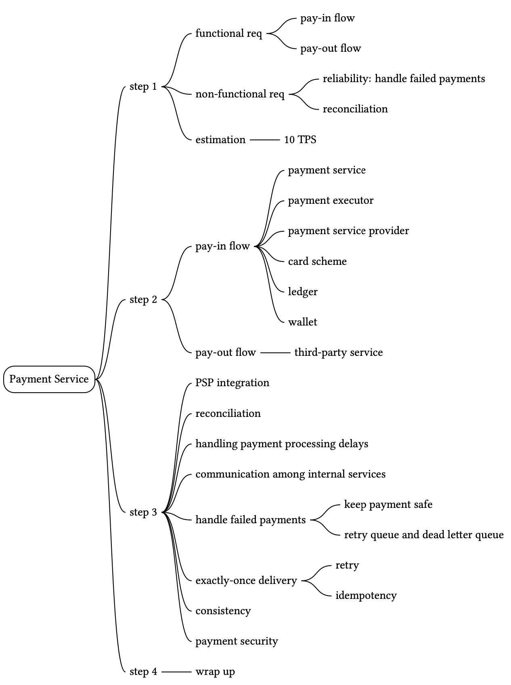

## Reference Materials

[1] Payment system: https://en.wikipedia.org/wiki/Payment_system

[2] AML/CFT: https://en.wikipedia.org/wiki/Money_laundering

[3] Card scheme: https://en.wikipedia.org/wiki/Card_scheme

[4] ISO 4217: https://en.wikipedia.org/wiki/ISO_4217

[5] Stripe API Reference: https://stripe.com/docs/api

[6] Double-entry bookkeeping: https://en.wikipedia.org/wiki/Double-entry_bookkeeping

[7] Books, an immutable double-entry accounting database service: https://developer.squareup.com/blog/books-an-immutable-double-entry-accounting-database-service/

[8] Payment Card Industry Data Security Standard: https://en.wikipedia.org/wiki/Payment_Card_Industry_Data_Security_Standard

[9] Tipalti: https://tipalti.com/

[10] Nonce: https://en.wikipedia.org/wiki/Cryptographic_nonce

[11] Webhooks: https://stripe.com/docs/webhooks

[12] Customize your success page: https://stripe.com/docs/payments/checkout/custom-success-page

[13] 3D Secure: https://en.wikipedia.org/wiki/3-D_Secure

[14] Kafka Connect Deep Dive – Error Handling and Dead Letter Queues: https://www.confluent.io/blog/kafka-connect-deep-dive-error-handling-dead-letter-queues/

[15] Reliable Processing in a Streaming Payment System: https://www.youtube.com/watch?v=5TD8m7w1xE0&list=PLLEUtp5eGr7Dz3fWGUpiSiG3d_WgJe-KJ

[16] Chain Services with Exactly-Once Guarantees: https://www.confluent.io/blog/chain-services-exactly-guarantees/

[17] Exponential backoff: https://en.wikipedia.org/wiki/Exponential_backoff

[18] Idempotence: https://en.wikipedia.org/wiki/Idempotence

[19] Stripe idempotent requests: https://stripe.com/docs/api/idempotent_requests

[20] Idempotency: https://developer.paypal.com/docs/platforms/develop/idempotency/

[21] Paxos: https://en.wikipedia.org/wiki/Paxos_(computer_science)

[22] Raft: https://raft.github.io/

[23] YugabyteDB: https://www.yugabyte.com/

[24] Cockroachdb: https://www.cockroachlabs.com/

[25] What is DDoS attack: https://www.cloudflare.com/learning/ddos/what-is-a-ddos-attack/

[26] How Payment Gateways Can Detect and Prevent Online Fraud: https://www.chargebee.com/blog/optimize-online-billing-stop-online-fraud/

[27] Advanced Technologies for Detecting and Preventing Fraud at Uber: https://www.uber.com/en-PK/blog/project-radar-intelligent-early-fraud-detection/

[28] Re-Architecting Cash and Digital Wallet Payments for India with Uber Engineering: https://eng.uber.com/india-payments/

[29] Scaling Airbnb's Payment Platform: https://medium.com/airbnb-engineering/scaling-airbnbs-payment-platform-43ebfc99b324

[30] Payments Integration at Uber: A Case Study: https://www.youtube.com/watch?v=yooCE5B0SRA

