# 29 Stock Exchange

In this chapter, we design an electronic stock exchange system.

The basic function of an exchange is to facilitate the matching of buyers and sellers efficiently. This fundamental function has not changed over time. Before the rise of computing, people exchanged tangible goods by bartering and shouting at each other to get matched. Today, orders are processed silently by supercomputers, and people trade not only for the exchange of products, but also for speculation and arbitrage. Technology has greatly changed the landscape of trading and exponentially boosted electronic market trading volume.

When it comes to stock exchanges, most people think about major market players like The New York Stock Exchange (NYSE) or Nasdaq, which have existed for over fifty years. In fact, there are many other types of exchange. Some focus on vertical segmentation of the financial industry and place special focus on technology [1], while others have an emphasis on fairness [2]. Before diving into the design, it is important to check with the interviewer about the scale and the important characteristics of the exchange in question.

Just to get a taste of the kind of problem we are dealing with; NYSE is trading billions of matches per day [3], and HKEX about 200 billion shares per day [4]. Figure 1 shows the big exchanges in the "trillion-dollar club" by market capitalization.

![Figure 1 Largest stock exchanges (Source: [5])](images/29-stock-exchange/figure1-largest-stock-exchanges.png)

**Figure 1**

## Step 1 - Understand the Problem and Establish Design scope

A modern exchange is a complicated system with stringent requirements on latency, throughput, and robustness. Before we start, let's ask the interviewer a few questions to clarify the requirements.

**Candidate:** Which securities are we going to trade? Stocks, options, or futures?

**Interviewer:** For simplicity, only stocks.

**Candidate:** Which types of order operations are supported: placing a new order, canceling an order, or replacing an order? Do we need to support limit order, market order, or conditional order?

**Interviewer:** We need to support the following: placing a new order and canceling an order. For the order type, we only need to consider the limit order.

**Candidate:** Does the system need to support after-hours trading?

**Interviewer:** No, we just need to support the normal trading hours.

**Candidate:** Could you describe the basic functions of the exchange? And the scale of the exchange, such as how many users, how many symbols, and how many orders?

**Interviewer:** A client can place new limit orders or cancel them, and receive matched trades in real-time. A client can view the real-time order book (the list of buy and sell orders). The exchange needs to support at least tens of thousands of users trading at the same time, and it needs to support at least 100 symbols. For the trading volume, we should support billions of orders per day. Also, the exchange is a regulated facility, so we need to make sure it runs risk checks.

**Candidate:** Could you please elaborate on risk checks?

**Interviewer:** Let's just do simple risk checks. For example, a user can only trade a maximum of 1 million shares of Apple stock in one day.

**Candidate:** I noticed you didn't mention user wallet management. Is it something we also need to consider?

**Interviewer:** Good catch! We need to make sure users have sufficient funds when they place orders. If an order is waiting in the order book to be filled, the funds required for the order need to be withheld to prevent overspending.

### Non-functional requirements

After checking with the interviewer for the functional requirements, we should determine the non-functional requirements. In fact, requirements like "at least 100 symbols" and "tens of thousands of users" tell us that the interviewer wants us to design a small-to-medium scale exchange. On top of this, we should make sure the design can be extended to support more symbols and users. Many interviewers focus on extensibility as an area for follow-up questions.

Here is a list of non-functional requirements:

- **Availability.** At least 99.99%. Availability is crucial for exchanges. Downtime, even seconds, can harm reputation.

- **Fault tolerance.** Fault tolerance and a fast recovery mechanism are needed to limit the impact of a production incident.

- **Latency.** The round-trip latency should be at the millisecond level, with a particular focus on the 99th percentile latency. The round trip latency is measured from the moment a market order enters the exchange to the point where the market order returns as a filled execution. A persistently high 99th percentile latency causes a terrible user experience for a small number of users.

- **Security.** The exchange should have an account management system. For legal compliance, the exchange performs a KYC (Know Your Client) check to verify a user's identity before a new account is opened. For public resources, such as web pages containing market data, we should prevent distributed denial-of-service (DDoS) [6] attacks.

### Back-of-the-envelope estimation

Let's do some simple back-of-the-envelope calculations to understand the scale of the system:

- 100 symbols

- 1 billion orders per day

- NYSE Stock Exchange is open Monday through Friday from 9:30 am to 4:00 pm Eastern Time. That's 6.5 hours in total.

- **QPS:** 1 billion / 6.5 / 3600 = ~43,000

- **Peak QPS:** 5 * QPS = 215,000. The trading volume is significantly higher when the market first opens in the morning and before it closes in the afternoon.

## Step 2 - Propose High-Level Design and Get Buy-In

Before we dive into the high-level design, let's briefly discuss some basic concepts and terminology that are helpful for designing an exchange.

### Business Knowledge 101

#### Broker

Most retail clients trade with an exchange via a broker. Some brokers whom you might be familiar with include Charles Schwab, Robinhood, Etrade, Fidelity, etc. These brokers provide a friendly user interface for retail users to place trades and view market data.

#### Institutional client

Institutional clients trade in large volumes using specialized trading software. Different institutional clients operate with different requirements. For example, pension funds aim for a stable income. They trade infrequently, but when they do trade, the volume is large. They need features like order splitting to minimize the market impact [7] of their sizable orders. Some hedge funds specialize in market making and earn income via commission rebates. They need low latency trading abilities, so obviously they cannot simply view market data on a web page or a mobile app, as retail clients do.

#### Limit order

A limit order is a buy or sell order with a fixed price. It might not find a match immediately, or it might just be partially matched.

#### Market order

A market order doesn't specify a price. It is executed at the prevailing market price immediately. A market order sacrifices cost in order to guarantee execution. It is useful in certain fast-moving market conditions.

#### Market data levels

The US stock market has three tiers of price quotes: L1 (level 1), L2, and L3. L1 market data contains the best bid price, ask price, and quantities (Figure 2). Bid price refers to the highest price a buyer is willing to pay for a stock. Ask price refers to the lowest price a seller is willing to sell the stock.

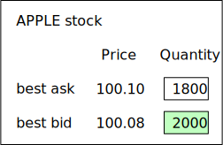

**Figure 2**

L2 includes more price levels than L1 (Figure 3).

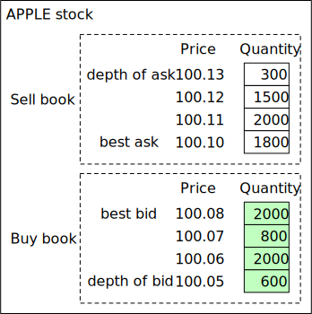

**Figure 3**

L3 shows price levels and the queued quantity at each price level (Figure 4).

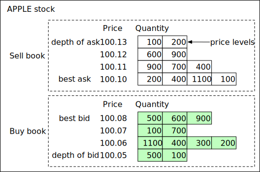

**Figure 4**

#### Candlestick chart

A candlestick chart represents the stock price for a certain period of time. A typical candlestick looks like this (Figure 5). A candlestick shows the market's open, close, high, and low price for a time interval. The common time intervals are one-minute, five-minute, one-hour, one-day, one-week, and one-month.

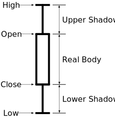

**Figure 5**

#### FIX

FIX protocol [8], which stands for Financial Information eXchange protocol, was created in 1991. It is a vendor-neutral communications protocol for exchanging securities transaction information. See below for an example of a securities transaction encoded in FIX.

```
8=FIX.4.2 | 9=176 | 35=8 | 49=PHLX | 56=PERS | 52=20071123-05:30:00.000 | 11=ATOMNOCCC9990900 | 20=3 | 150=E | 39=E | 55=MSFT | 167=CS | 54=1 | 38=15 | 40=2 | 44=15 | 58=PHLX EQUITY TESTING | 59=0 | 47=C | 32=0 | 31=0 | 151=15 | 14=0 | 6=0 | 10=128 |
```

**Sample FIX [8]**

### High-level design

Now that we have some basic understanding of the key concepts, let's take a look at the high-level design, as shown in Figure 6.

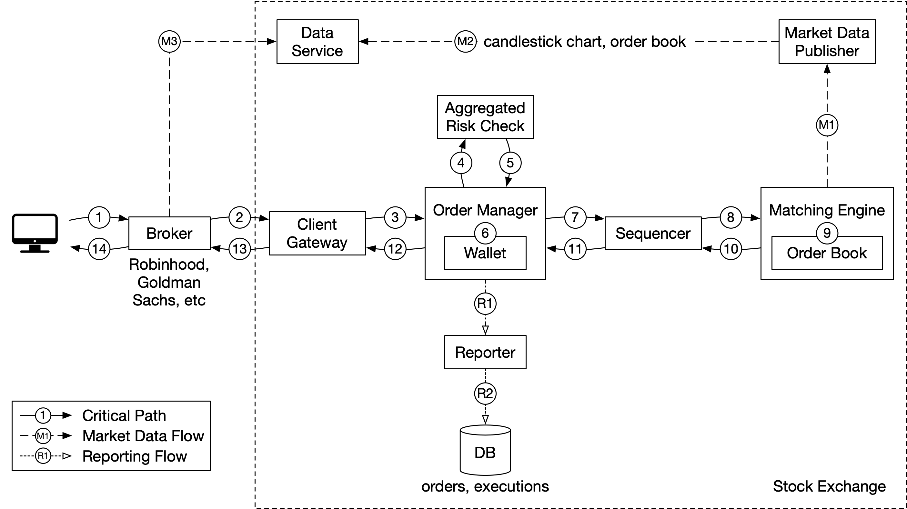

**Figure 6**

Let's trace the life of an order through various components in the diagram to see how the pieces fit together.

First, we follow the order through the trading flow. This is the critical path with strict latency requirements. Everything has to happen fast in the flow:

**Step 1:** A client places an order via the broker's web or mobile app.

**Step 2:** The broker sends the order to the exchange.

**Step 3:** The order enters the exchange through the client gateway. The client gateway performs basic gatekeeping functions such as input validation, rate limiting, authentication, normalization, etc. The client gateway then forwards the order to the order manager.

**Step 4 - 5:** The order manager performs risk checks based on rules set by the risk manager.

**Step 6:** After passing risk checks, the order manager verifies there are sufficient funds in the wallet for the order.

**Step 7 - 9:** The order is sent to the matching engine. When a match is found, the matching engine emits two executions (also called fills), with one each for the buy and sell sides. To guarantee that matching results are deterministic when replayed, both orders and executions are sequenced in the sequencer (more on the sequencer later).

**Step 10 - 14:** The executions are returned to the client.

Next, we follow the market data flow and trace the order executions from the matching engine to the broker via the data service.

**Step M1:** The matching engine generates a stream of executions (fills) as matches are made. The stream is sent to the market data publisher.

**Step M2:** The market data publisher constructs the candlestick charts and the order books as market data from the stream of executions and orders. It then sends market data to the data service.

**Step M3:** The market data is saved to specialized storage for real-time analytics. The brokers connect to the data service to obtain timely market data. Brokers relay market data to their clients.

Lastly, we examine the reporter flow.

**Step R1 - R2 (reporting flow):** The reporter collects all the necessary reporting fields (e.g. client_id, price, quantity, order_type, filled_quantity, remaining_quantity) from orders and executions, and writes the consolidated records to the database.

Note that the trading flow (steps 1 to 14) is on the critical path, while the market data flow and reporting flow are not. They have different latency requirements.

Now let's examine each of the three flows in more detail.

### Trading flow

The trading flow is on the critical path of the exchange. Everything must happen fast. The heart of the trading flow is the matching engine. Let's go over that first.

#### Matching engine

The matching engine is also called the cross engine. Here are the primary responsibilities of the matching engine:

- Maintain the order book for each symbol. An order book is a list of buy and sell orders for a symbol. We explain the construction of an order book in the Data models section later.

- Match buy and sell orders. A match results in two executions (fills), with one each for the buy and sell sides. The matching function must be fast and accurate.

- Distribute the execution stream as market data.

A highly available matching engine implementation must be able to produce matches in a deterministic order. That is, given a known sequence of orders as an input, the matching engine must produce the same sequence of executions (fills) as an output when the sequence is replayed. This determinism is a foundation of high availability which we will discuss at length in the deep dive section.

#### Sequencer

The sequencer is the key component that makes the matching engine deterministic. It stamps every incoming order with a sequence ID before it is processed by the matching engine. It also stamps every pair of executions (fills) completed by the matching engine with sequence IDs. In other words, the sequencer has an inbound and an outbound instance, with each maintaining its own sequences. The sequence generated by each sequencer must be sequential numbers, so that any missing numbers can be easily detected. See Figure 7 for details.

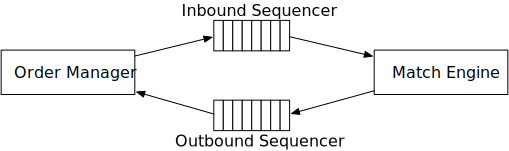

**Figure 7**

The incoming orders and outgoing executions are stamped with sequence IDs for these reasons:

- Timeliness and fairness

- Fast recovery / replay

- Exactly-once guarantee

The sequencer does not only generate sequence IDs. It also functions as a message queue. There is one to send messages (incoming orders) to the matching engine, and another one to send messages (executions) back to the order manager. It is also an event store for the orders and executions. It is similar to having two Kafka event streams connected to the matching engine, one for incoming orders and the other for outgoing executions. In fact, we could have used Kafka if its latency was lower and more predictable. We discuss how the sequencer is implemented in a low-latency exchange environment in the deep dive section.

#### Order manager

The order manager receives orders on one end and receives executions on the other. It manages the orders' states. Let's look at it closely.

The order manager receives inbound orders from the client gateway and performs the following:

- It sends the order for risk checks. Our requirements for risk checking are simple. For example, we verify that a user's trade volume is below $1M a day.

- It checks the order against the user's wallet and verifies that there are sufficient funds to cover the trade. The wallet was discussed at length in the "Digital Wallet" chapter. Refer to that chapter for an implementation that would work in the exchange.

- It sends the order to the sequencer where the order is stamped with a sequence ID. The sequenced order is then processed by the matching engine. There are many attributes in a new order, but there is no need to send all the attributes to the matching engine. To reduce the size of the message in data transmission, the order manager only sends the necessary attributes.

On the other end, the order manager receives executions from the matching engine via the sequencer. The order manager returns the executions for the filled orders to the brokers via the client gateway.

The order manager should be fast, efficient, and accurate. It maintains the current states for the orders. In fact, the challenge of managing the various state transitions is the major source of complexity for the order manager. There can be tens of thousands of cases involved in a real exchange system. Event sourcing [9] is perfect for the design of an order manager. We discuss an event sourcing design in the deep dive section.

#### Client gateway

The client gateway is the gatekeeper for the exchange. It receives orders placed by clients and routes them to the order manager. The gateway provides the following functions as shown in Figure 8.

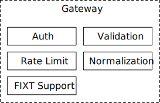

**Figure 8**

The client gateway is on the critical path and is latency-sensitive. It should stay lightweight. It passes orders to the correct destinations as quickly as possible. The functions above, while critical, must be completed as quickly as possible. It is a design trade-off to decide what functionality to put in the client gateway, and what to leave out. As a general guideline, we should leave complicated functions to the matching engine and risk check.

There are different types of client gateways for retail and institutional clients. The main considerations are latency, transaction volume, and security requirements. For instance, institutions like the market makers provide a large portion of liquidity for the exchange. They require very low latency. Figure 9 shows different client gateway connections to an exchange. An extreme example is the colocation (colo) engine. It is the trading engine software running on some servers rented by the broker in the exchange's data center. The latency is literally the time it takes for light to travel from the colocated server to the exchange server [10].

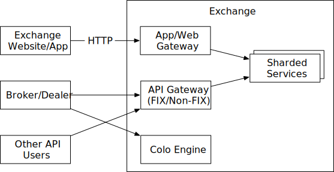

**Figure 9**

### Market data flow

The market data publisher (MDP) receives executions (fills) from the matching engine and builds the order books and candlestick charts from the stream of executions. The order books and candlestick charts, which we discuss in the Data Models section later, are collectively called market data. The market data is sent to the data service where they are made available to subscribers. Figure 10 shows an implementation of MDP and how it fits with the other components in the market data flow.

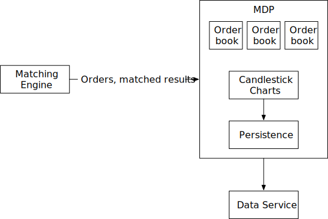

**Figure 10**

### Reporting flow

One essential part of the exchange is reporting. The reporter is not on the trading critical path, but it is a critical part of the system. It provides trading history, tax reporting, compliance reporting, settlements, etc. Efficiency and latency are critical for the trading flow, but the reporter is less sensitive to latency. Accuracy and compliance are key factors for the reporter.

It is common practice to piece attributes together from both incoming orders and outgoing executions. An incoming new order only contains order details, and outgoing execution usually only contains order ID, price, quantity, and execution status. The reporter merges the attributes from both sources for the reports. Figure 11 shows how the components in the report flow fit together.

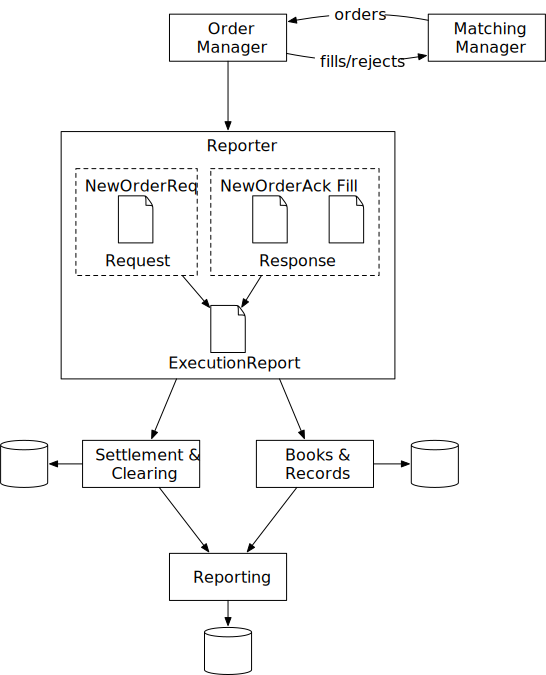

**Figure 11**

A sharp reader might notice that the section order of "Step 2 - Propose High-Level Design and Get Buy-In" looks a little different than other chapters. In this chapter, the API design and data models sections come after the high-level design. The sections are arranged this way because these other sections require some concepts that were introduced in the high-level design.

### API Design

Now that we understand the high-level design, let's take a look at the API design.

Clients interact with the stock exchange via the brokers to place orders, view executions, view market data, download historical data for analysis, etc. We use the RESTful conventions for the API below to specify the interface between the brokers and the client gateway. Refer to the "Data models" section for the resources mentioned below.

Note that the REST API might not satisfy the latency requirements of institutional clients like hedge funds. The specialized software built for these institutions likely uses a different protocol, but no matter what it is, the basic functionality mentioned below needs to be supported.

#### Order

**POST /v1/order**

This endpoint places an order. It requires authentication.

**Parameters**

- symbol: the stock symbol. String
- side: buy or sell. String
- price: the price of the limit order. Long
- orderType: limit or market (note we only support limit orders in our design). String
- quantity: the quantity of the order. Long

**Response**

Body:

- id: the ID of the order. Long
- creationTime: the system creation time of the order. Long
- filledQuantity: the quantity that has been successfully executed. Long
- remainingQuantity: the quantity still to be executed. Long
- status: new/canceled/filled. String
- rest of the attributes are the same as the input parameters

Code:

- 200: successful
- 40x: parameter error/access denied/unauthorized
- 500: server error

#### Execution

**GET /execution?symbol={:symbol}&orderId={:orderId}&startTime={:startTime}&endTime={:endTime}**

This endpoint queries execution info. It requires authentication.

**Parameters**

- symbol: the stock symbol. String
- orderId: the ID of the order. Optional. String
- startTime: query start time in epoch [11]. Long
- endTime: query end time in epoch. Long

**Response**

Body:

- executions: array with each execution in scope (see attributes below). Array
  - id: the ID of the execution. Long
  - orderId: the ID of the order. Long
  - symbol: the stock symbol. String
  - side: buy or sell. String
  - price: the price of the execution. Long
  - orderType: limit or market. String
  - quantity: the filled quantity. Long

Code:

- 200: successful
- 40x: parameter error/not found/access denied/unauthorized
- 500: server error

#### Order book

**GET /marketdata/orderBook/L2?symbol={:symbol}&depth={:depth}**

This endpoint queries L2 order book information for a symbol with designated depth.

**Parameters**

- symbol: the stock symbol. String
- depth: order book depth per side. Int

**Response**

Body:

- bids: array with price and size. Array
- asks: array with price and size. Array

Code:

- 200: successful
- 40x: parameter error/not found/access denied/unauthorized
- 500: server error

#### Historical prices (candlestick charts)

**GET /marketdata/candles?symbol={:symbol}&resolution={:resolution}&startTime={:startTime}&endTime={:endTime}**

This endpoint queries candlestick chart data (see candlestick chart in data models section) for a symbol given a time range and resolution.

**Parameters**

- symbol: the stock symbol. String
- resolution: window length of the candlestick chart in seconds. Long
- startTime: start time of the window in epoch. Long
- endTime: end time of the window in epoch. Long

**Response**

Body:

- candles: array with each candlestick data (attributes listed below). Array
  - open: open price of each candlestick. Double
  - close: close price of each candlestick. Double
  - high: high price of each candlestick. Double
  - low: low price of each candlestick. Double

Code:

- 200: successful
- 40x: parameter error/not found/access denied/unauthorized
- 500: server error

### Data models

There are three main types of data in the stock exchange. Let's explore them one by one.

- Product, order, and execution

- Order book

- Candlestick chart

#### Product, order, execution

A product describes the attributes of a traded symbol, like product type, trading symbol, UI display symbol, settlement currency, lot size, tick size, etc. This data doesn't change frequently. It is primarily used for UI display. The data can be stored in any database and is highly cacheable.

An order represents the inbound instruction for a buy or sell order. An execution represents the outbound matched result. An execution is also called a fill. Not every order has an execution. The output of the matching engine contains two executions, representing the buy and sell sides of a matched order.

See Figure 12 for the logical model diagram that shows the relationships between the three entities. Note it is not a database schema.

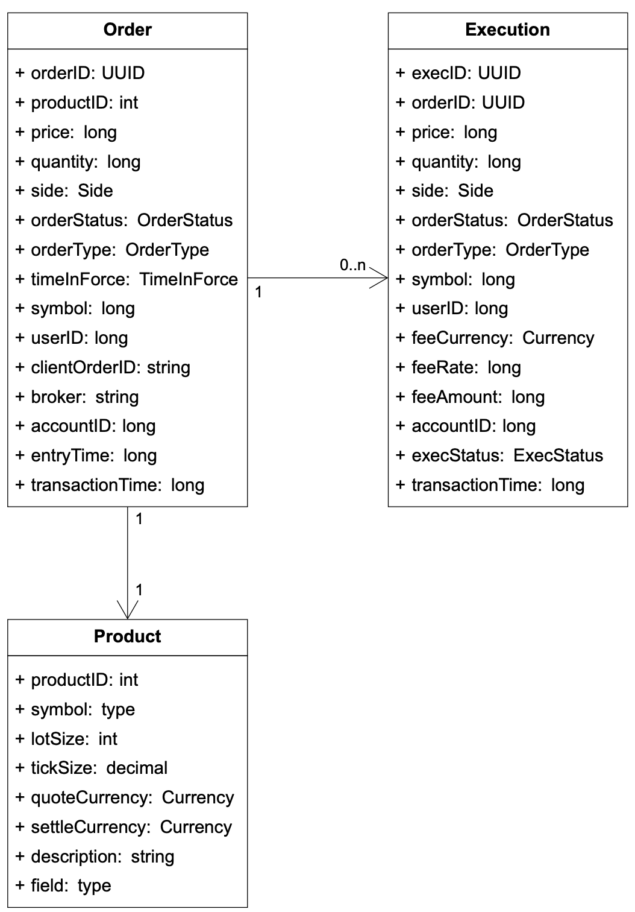

**Figure 12**

Orders and executions are the most important data in the exchange. We encounter them in all three flows mentioned in the high-level design, in slightly different forms.

In the critical trading path, orders and executions are not stored in a database. To achieve high performance, this path executes trades in memory and leverages hard disk or shared memory to persist and share orders and executions. Specifically, orders and executions are stored in the sequencer for fast recovery, and data is archived after the market closes. We discuss an efficient implementation of the sequencer in the deep dive section.

The reporter writes orders and executions to the database for reporting use cases like reconciliation and tax reporting.

Executions are forwarded to the market data processor to reconstruct the order book and candlestick chart data. We discuss these data types next.

#### Order book

An order book is a list of buy and sell orders for a specific security or financial instrument, organized by price level [12] [13]. It is a key data structure in the matching engine for fast order matching. An efficient data structure for an order book must satisfy these requirements:

- Constant lookup time. Operation includes: getting volume at a price level or between price levels.

- Fast add/cancel/execute operations, preferably O(1) time complexity. Operations include: placing a new order, canceling an order, and matching an order.

- Fast update. Operation: replacing an order.

- Query best bid/ask.

- Iterate through price levels.

Let's walk through an example order execution against an order book, as illustrated in Figure 13.

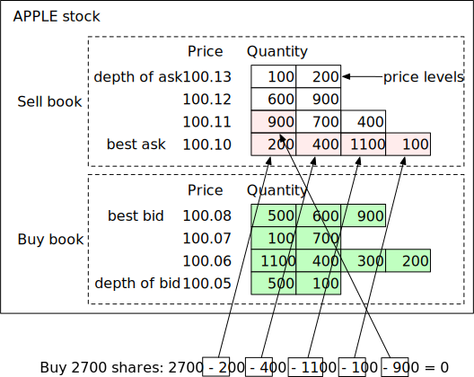

**Figure 13**

In the example above, there is a large market buy order for 2700 shares of Apple. The buy order matches all the sell orders in the best ask queue and the first sell order in the 100.11 price queue. After fulfilling this large order, the bid/ask spread widens, and the price increases by one level (best ask is 100.11 now).

The following code snippet shows an implementation of the order book.

```java
class PriceLevel{
    private Price limitPrice;
    private long totalVolume;
    private List<Order> orders;
}
class Book<Side> {
    private Side side;
    private Map<Price, PriceLevel> limitMap;
}
class OrderBook {
    private Book<Buy> buyBook;
    private Book<Sell> sellBook;
    private PriceLevel bestBid;
    private PriceLevel bestOffer;
    private Map<OrderID, Order> orderMap;
}
```

Does the code meet all the design requirements stated above? For example, when adding/canceling a limit order, is the time complexity O(1)? The answer is no since we are using a plain list here (*private List<Order> orders*). To have a more efficient order book, change the data structure of "orders" to a doubly-linked list so that the deletion type of operation (cancel and match) is also O(1). Let's review how we achieve O(1) time complexity for these operations:

- Placing a new order means adding a new Order to the tail of the PriceLevel. This is O(1) time complexity for a doubly-linked list.

- Matching an order means deleting an Order from the head of the PriceLevel. This is O(1) time complexity for a doubly-linked list.

- Canceling an order means deleting an Order from the OrderBook. We leverage the helper data structure Map<OrderID, Order> orderMap in the OrderBook to find the Order to cancel in O(1) time. Once the order is found, if the "orders" list was a singly-linked list, the code would have to traverse the entire list to locate the previous pointer in order to delete the order. That would have taken O(n) time. Since the list is now doubly-linked, the order itself has a pointer to the previous order, which allows the code to delete the order without traversing the entire order list.

Figure 14 explains how these three operations work.

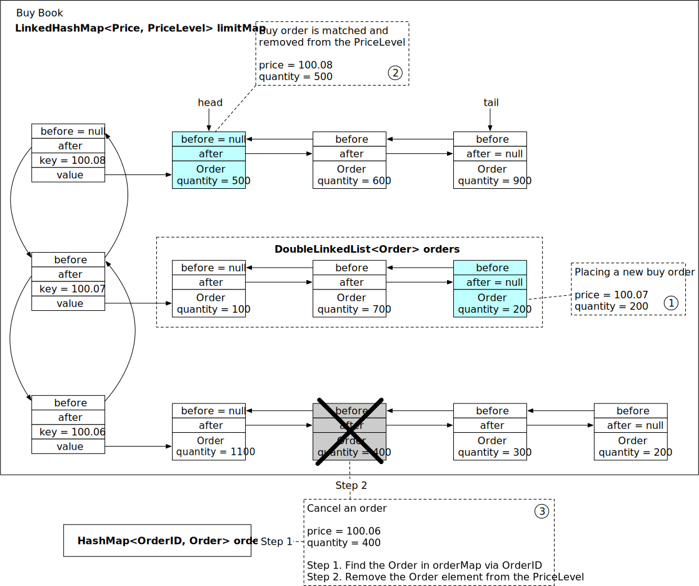

**Figure 14**

See the reference material for more details [14].

It is worth noting that the order book data structure is also heavily used in the market data processor to reconstruct the L1, L2, and L3 data from the streams of executions generated by the matching engine.

#### Candlestick chart

Candlestick chart is another key data structure (alongside order book) in the market data processor to produce market data.

We model this with a Candlestick class and a CandlestickChart class. When the interval for the candlestick has elapsed, a new Candlestick class is instantiated for the next interval and added to the linked list in the CandleStickChart instance.

```java
class Candlestick {
    private long openPrice;
    private long closePrice;
    private long highPrice;
    private long lowPrice;
    private long volume;
    private long timestamp;
    private int interval;
}
class CandlestickChart {
    private LinkedList<Candlestick> sticks;
}
```

Tracking price history in candlestick charts for many symbols at many time intervals consumes a lot of memory. How can we optimize it? Here are two ways:

- Use pre-allocated ring buffers to hold sticks to reduce the number of new object allocations.

- Limit the number of sticks in the memory and persist the rest to disk.

We will examine the optimizations in the "Market data publisher" section in deep dive.

The market data is usually persisted in an in-memory columnar database (for example, KDB [15]) for real-time analytics. After the market is closed, data is persisted in a historical database.

## Step 3 - Design Deep Dive

Now that we understand how an exchange works at a high level, let's investigate how a modern exchange has evolved to become what it is today. What does a modern exchange look like? The answer might surprise a lot of readers. Some large exchanges run almost everything on a single gigantic server. While it might sound extreme, we can learn many good lessons from it.

Let's dive in.

### Performance

As discussed in the non-functional requirements, latency is very important for an exchange. Not only does the average latency need to be low, but the overall latency must also be stable. A good measure for the level of stability is the 99th percentile latency.

Latency can be broken down into its components as shown in the formula below:

```
Latency = ∑executionTimeAlongCriticalPath
```

There are two ways to reduce latency:

1. Decrease the number of tasks on the critical path.

2. Shorten the time spent on each task:
   - By reducing or eliminating network and disk usage
   - By reducing execution time for each task

Let's review the first point. As shown in the high-level design, the critical trading path includes the following:

```
gateway -> order manager -> sequencer -> matching engine
```

The critical path only contains the necessary components, even logging is removed from the critical path to achieve low latency.

Now let's look at the second point. In the high-level design, the components on the critical path run on individual servers connected over the network. The round trip network latency is about 500 microseconds. When there are multiple components all communicating over the network on the critical path, the total network latency adds up to single-digit milliseconds. In addition, the sequencer is an event store that persists events to disk. Even assuming an efficient design that leverages the performance advantage of sequential writes, the latency of disk access still measures in tens of milliseconds. To learn more about network and disk access latency, see "Latency Numbers Every Programmer Should Know" [16].

Accounting for both network and disk access latency, the total end-to-end latency adds up to tens of milliseconds. While this number was respectable in the early days of the exchange, it is no longer sufficient as exchanges compete for ultra-low latency.

To stay ahead of the competition, exchanges over time evolve their design to reduce the end-to-end latency on the critical path to tens of microseconds, primarily by exploring options to reduce or eliminate network and disk access latency. A time-tested design eliminates the network hops by putting everything on the same server. When all components are on the same server, they can communicate via mmap [17] as an event store (more on this later).

Figure 15 shows a low-latency design with all the components on a single server:

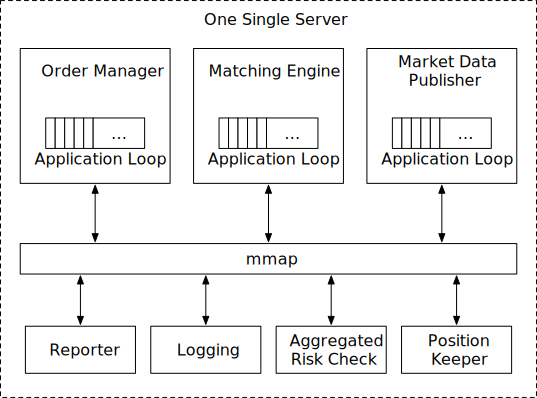

**Figure 15**

There are a few interesting design decisions that are worth a closer look at.

Let's first focus on the application loops in the diagram above. An application loop is an interesting concept. It keeps polling for tasks to execute in a while loop and is the primary task execution mechanism. To meet the strict latency budget, only the most mission-critical tasks should be processed by the application loop. Its goal is to reduce the execution time for each component and to guarantee a highly predictable execution time (i.e., a low 99th percentile latency). Each box in the diagram represents a component. A component is a process on the server. To maximize CPU efficiency, each application loop (think of it as the main processing loop) is single-threaded, and the thread is pinned to a fixed CPU core. Using the order manager as an example, it looks like the following diagram (Figure 16).

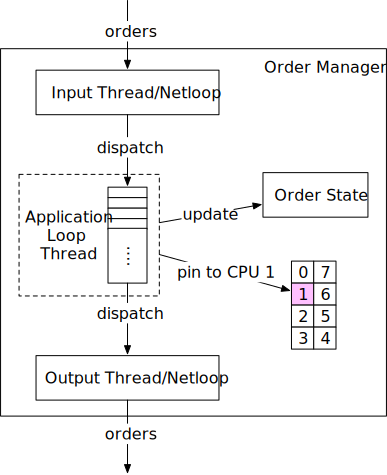

**Figure 16**

In this diagram, the application loop for the order manager is pinned to CPU 1. The benefits of pinning the application loop to the CPU are substantial:

- **No context switch [18].** CPU 1 is fully allocated to the order manager's application loop.

- **No locks and therefore no lock contention**, since there is only one thread that updates states.

Both of these contribute to a low 99th percentile latency.

The tradeoff of CPU pinning is that it makes coding more complicated. Engineers need to carefully analyze the time each task takes to keep it from occupying the application loop thread for too long, as it can potentially block subsequent tasks.

Next, let's focus our attention on the long rectangle labeled "mmap" at the center of Figure 15. "mmap" refers to a POSIX-compliant UNIX system call named `mmap(2)` that maps a file into the memory of a process.

`mmap(2)` provides a mechanism for high-performance sharing of memory between processes. The performance advantage is compounded when the backing file is in `/dev/shm`. `/dev/shm` is a memory-backed file system. When `mmap(2)` is done over a file in `/dev/shm`, the access to the shared memory does not result in any disk access at all.

Modern exchanges take advantage of this to eliminate as much disk access from the critical path as possible. `mmap(2)` is used in the server to implement a message bus over which the components on the critical path communicate. The communication pathway has no network or disk access, and sending a message on this mmap message bus takes sub-microsecond. By leveraging mmap to build an event store, coupled with the event sourcing design paradigm which we will discuss next, modern exchanges can build low-latency microservices inside a server.

### Event sourcing

We discussed event sourcing in the "Digital Wallet" chapter. Refer to that chapter for an in-depth review of event sourcing.

The concept of event sourcing is not hard to understand. In a traditional application, states are persisted in a database. When something goes wrong, it is hard to trace the source of the issue. The database only keeps the current states, and there are no records of the events that have led to the current states.

In event sourcing, instead of storing the current states, it keeps an immutable log of all state-changing events. These events are the golden source of truth. See Figure 17 for a comparison.

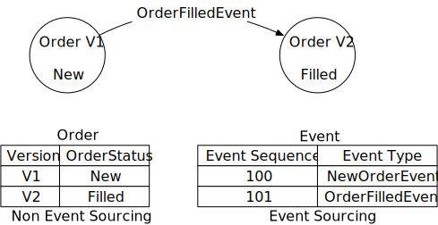

**Figure 17**

On the left is a classic database schema. It keeps track of the order status for an order, but it does not contain any information about how an order arrives at the current state. On the right is the event sourcing counterpart. It tracks all the events that change the order status, and it can recover order states by replaying all the events in sequence.

Figure 18 shows an event sourcing design using the mmap event store as a message bus. This looks very much like the Pub-Sub model in Kafka. In fact, if there is no strict latency requirement, Kafka could be used.

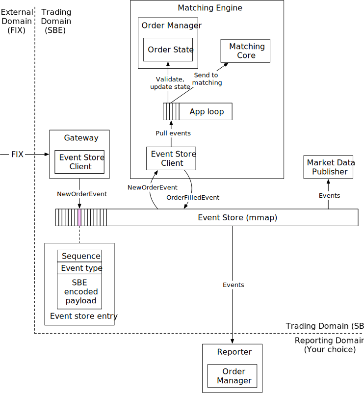

**Figure 18**

In the diagram, the external domain communicates with the trading domain using FIX that we introduced in the Business Knowledge 101 section.

- The gateway transforms FIX to "FIX over Simple Binary Encoding" (SBE) for fast and compact encoding and sends each order as a NewOrderEvent via the Event Store Client in a pre-defined format (see event store entry in the diagram).

- The order manager (embedded in the matching engine) receives the NewOrderEvent from the event store, validates it, and adds it to its internal order states. The order is then sent to the matching core.

- If the order gets matched, an OrderFilledEvent is generated and sent to the event store.

- Other components such as the market data processor and the reporter subscribe to the event store and process those events accordingly.

This design follows the high-level design closely, but there are some adjustments to make it work more efficiently in the event sourcing paradigm.

The first difference is the order manager. The order manager becomes a reusable library that is embedded in different components. It makes sense for this design because the states of the orders are important for multiple components. Having a centralized order manager for other components to update or query the order states would hurt latency, especially if those components are not on the critical trading path, as is the case for the reporter in the diagram. Although each component maintains the order states by itself, with event sourcing the states are guaranteed to be identical and replayable.

Another key difference is that the sequencer is nowhere to be seen. What happened to it?

With the event sourcing design, we have one single event store for all messages. Note that the event store entry contains a "sequence" field. This field is injected by the sequencer.

There is only one sequencer for each event store. It is a bad practice to have multiple sequencers, as they will fight for the right to write to the event store. In a busy system like an exchange, a lot of time would be wasted on lock contention. Therefore, the sequencer is a single writer which sequences the events before sending them to the event store. Unlike the sequencer in the high-level design which also functions as a message store, the sequencer here only does one simple thing and is super fast. Figure 19 shows a design for the sequencer in a memory-map (MMap) environment.

The sequencer pulls events from the ring buffer that is local to each component. For each event, it stamps a sequence ID on the event and sends it to the event store. We can have backup sequencers for high availability in case the primary sequencer goes down.

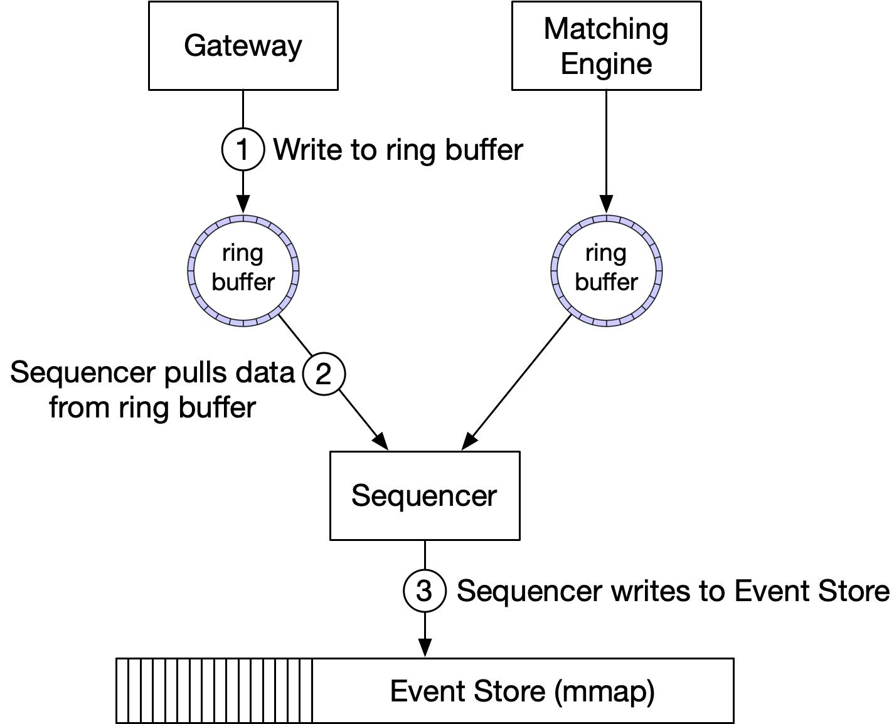

**Figure 19**

### High availability

For high availability, our design aims for 4 nines (99.99%). This means the exchange can only have 8.64 seconds of downtime per day. It requires almost immediate recovery if a service goes down.

To achieve high availability, consider the following:

First, identify single-point-of-failures in the exchange architecture. For example, the failure of the matching engine could be a disaster for the exchange. Therefore, we set up redundant instances alongside the primary instance.

Second, detection of failure and the decision to failover to the backup instance should be fast.

For stateless services such as the client gateway, they could easily be horizontally scaled by adding more servers. For stateful components, such as the order manager and matching engine, we need to be able to copy state data across replicas.

Figure 20 shows an example of how to copy data. The hot matching engine works as the primary instance, and the warm engine receives and processes the exact same events but does not send any event out onto the event store. When the primary goes down, the warm instance can immediately take over as the primary and send out events. When the warm secondary instance goes down, upon restart, it can always recover all the states from the event store. Event sourcing is a great fit for the exchange architecture. The inherent determinism makes state recovery easy and accurate.

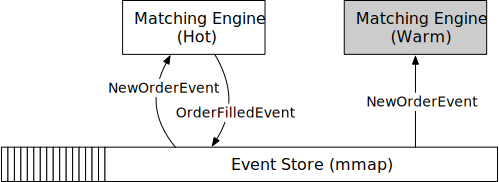

**Figure 20**

We need to design a mechanism to detect potential problems in the primary. Besides normal monitoring of hardware and processes, we can also send heartbeats from the matching engine. If a heartbeat is not received in time, the matching engine might be experiencing problems.

The problem with this hot-warm design is that it only works within the boundary of a single server. To achieve high availability, we have to extend this concept across multiple machines or even across data centers. In this setting, an entire server is either hot or warm, and the entire event store is replicated from the hot server to all warm replicas. Replicating the entire event store across machines takes time. We could use reliable UDP [19] to efficiently broadcast the event messages to all warm servers. Refer to the design of Aeron [20] for an example.

In the next section, we discuss an improvement to the hot-warm design to achieve high availability.

### Fault tolerance

The hot-warm design above is relatively simple. It works reasonably well, but what happens if the warm instances go down as well? This is a low probability but catastrophic event, so we should prepare for it.

This is a problem large tech companies face. They tackle it by replicating core data to data centers in multiple cities. It mitigates the risk of a natural disaster such as an earthquake or a large-scale power outage. To make the system fault-tolerant, we have to answer many questions:

- If the primary instance goes down, how and when do we decide to failover to the backup instance?

- How do we choose the leader among backup instances?

- What is the recovery time needed (RTO - Recovery Time Objective)?

- What functionalities need to be recovered (RPO - Recovery Point Objective)? Can our system operate under degraded conditions?

Let's answer these questions one by one.

First, we have to understand what "down" really means. This is not as straightforward as it seems. Consider these situations.

- The system might send out false alarms, which cause unnecessary failovers.

- Bugs in the code might cause the primary instance to go down. The same bug could bring down the backup instance after the failover. When all backup instances are knocked out by the bug, the system is no longer available.

These are tough problems to solve. Here are some suggestions. When we first release a new system, we might need to perform failovers manually. Only when we gather enough signals and operational experience and gain more confidence in the system do we automate the failure detection process. Chaos engineering [21] is a good practice to surface edge cases and gain operational experience faster.

Once the decision to failover is correctly made, how do we decide which server takes over? Fortunately, this is a well-understood problem. There are many battle-tested leader-election algorithms. We use Raft [22] as an example.

Figure 21 shows a Raft cluster with five servers with their own event stores. The current leader sends data to all the other instances (followers). The minimum number of votes required to perform an operation in Raft is (N/2 + 1), where N is the number of members in the cluster. In this example, the minimum is 3.

The following diagram (Figure 21) shows the followers receiving new events from the leader over RPC. The events are saved to the follower's own mmap event store.

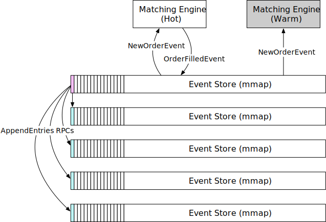

**Figure 21**

Let's briefly examine the leader election process. The leader sends heartbeat messages (AppendEnties with no content as shown in Figure 21) to its followers. If a follower has not received heartbeat messages for a period of time, it triggers an election timeout that initiates a new election. The first follower that reaches election timeout becomes a candidate, and it asks the rest of the followers to vote (RequestVote). If the first follower receives a majority of votes, it becomes the new leader. If the first follower has a lower term value than the new node, it cannot be the leader. If multiple followers become candidates at the same time, it is called a "split vote". In this case, the election times out, and a new election is initiated. See Figure 22 for the explanation of "term." Time is divided into arbitrary intervals in Raft to represent normal operation and election.

![Figure 22 Raft terms (Source: [23])](images/29-stock-exchange/figure22-raft-terms.svg)

**Figure 22**

Next, let's take a look at recovery time. Recovery Time Objective (RTO) refers to the amount of time an application can be down without causing significant damage to the business. For a stock exchange, we need to achieve a second-level RTO, which definitely requires automatic failover of services. To do this, we categorize services based on priority and define a degradation strategy to maintain a minimum service level.

Finally, we need to figure out the tolerance for data loss. Recovery Point Objective (RPO) refers to the amount of data that can be lost before significant harm is done to the business, i.e. the loss tolerance. In practice, this means backing up data frequently. For a stock exchange, data loss is not acceptable, so RPO is near zero. With Raft, we have many copies of the data. it guarantees that state consensus is achieved among cluster nodes. If the current leader crashes, the new leader should be able to function immediately.

### Matching algorithms

Let's take a slight detour and dive into the matching algorithms. The pseudo-code below explains how matching works at a high level.

```java
Context handleOrder(OrderBook orderBook, OrderEvent orderEvent) {
    if (orderEvent.getSequenceId() != nextSequence) {
        return Error(OUT_OF_ORDER, nextSequence);
    }

    if (!validateOrder(symbol, price, quantity)) {
        return ERROR(INVALID_ORDER, orderEvent);
    }

    Order order = createOrderFromEvent(orderEvent);
    switch (msgType):
        case NEW:
            return handleNew(orderBook, order);
        case CANCEL:
            return handleCancel(orderBook, order);
        default:
            return ERROR(INVALID_MSG_TYPE, msgType);

}

Context handleNew(OrderBook orderBook, Order order) {
    if (BUY.equals(order.side)) {
        return match(orderBook.sellBook, order);
    } else {
        return match(orderBook.buyBook, order);
    }
}

Context handleCancel(OrderBook orderBook, Order order) {
    if (!orderBook.orderMap.contains(order.orderId)) {
        return ERROR(CANNOT_CANCEL_ALREADY_MATCHED, order);
    }
    removeOrder(order);
    setOrderStatus(order, CANCELED);
    return SUCCESS(CANCEL_SUCCESS, order);
}

Context match(OrderBook book, Order order) {
    Quantity leavesQuantity = order.quantity - order.matchedQuantity;
    Iterator<Order> limitIter = book.limitMap.get(order.price).orders;
    while (limitIter.hasNext() && leavesQuantity > 0) {
        Quantity matched = min(limitIter.next.quantity, order.quantity);
        order.matchedQuantity += matched;
        leavesQuantity = order.quantity - order.matchedQuantity;
        remove(limitIter.next);
        generateMatchedFill();
    }
    return SUCCESS(MATCH_SUCCESS, order);
}
```

The pseudocode uses the FIFO (First In First Out) matching algorithm. The order that comes in first at a certain price level gets matched first, and the last one gets matched last.

There are many matching algorithms. These algorithms are commonly used in futures trading. For example, a FIFO with LMM (Lead Market Maker) algorithm allocates a certain quantity to the LMM based on a predefined ratio ahead of the FIFO queue, which the LMM firm negotiates with the exchange for the privilege. See more matching algorithms on the CME website [24]. The matching algorithms are used in many other scenarios. A typical one is a dark pool [25].

### Determinism

There is both functional determinism and latency determinism. We have covered functional determinism in previous sections. The design choices we make, such as sequencer and event sourcing, guarantee that if the events are replayed in the same order, the results will be the same.

With functional determinism, the actual time when the event happens does not matter most of the time. What matters is the order of the events. In Figure 23, event timestamps from discrete uneven dots in the time dimension are converted to continuous dots, and the time spent on replay/recovery can be greatly reduced.

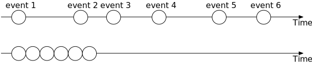

**Figure 23**

Latency determinism means having almost the same latency through the system for each trade. This is key to the business. There is a mathematical way to measure this: the 99th percentile latency, or even more strictly, the 99.99th percentile latency. We can leverage HdrHistogram [26] to calculate latency. If the 99th percentile latency is low, the exchange offers stable performance across almost all the trades.

It is important to investigate large latency fluctuations. For example, in Java, safe points are often the cause. The HotSpot JVM [27] Stop-the-World garbage collection is a well-known example.

This concludes our deep dive on the critical trading path. In the remainder of this chapter, we take a closer look at some of the more interesting aspects of other parts of the exchange.

### Market data publisher optimizations

As we can see from the matching algorithm, the L3 order book data gives us a better view of the market. We can get free one-day candlestick data from Google Finance, but it is expensive to get the more detailed L2/L3 order book data. Many hedge funds record the data themselves via the exchange real-time API to build their own candlestick charts and other charts for technical analysis.

The market data publisher (MDP) receives matched results from the matching engine and rebuilds the order book and candlestick charts based on that. It then publishes the data to the subscribers.

The order book rebuild is similar to the pseudocode mentioned in the matching algorithms section above. MDP is a service with many levels. For example, a retail client can only view 5 levels of L2 data by default and needs to pay extra to get 10 levels. MDP's memory cannot expand forever, so we need to have an upper limit on the candlesticks. Refer to the data models section for a review of the candlestick charts. The design of the MDP is in Figure 24.

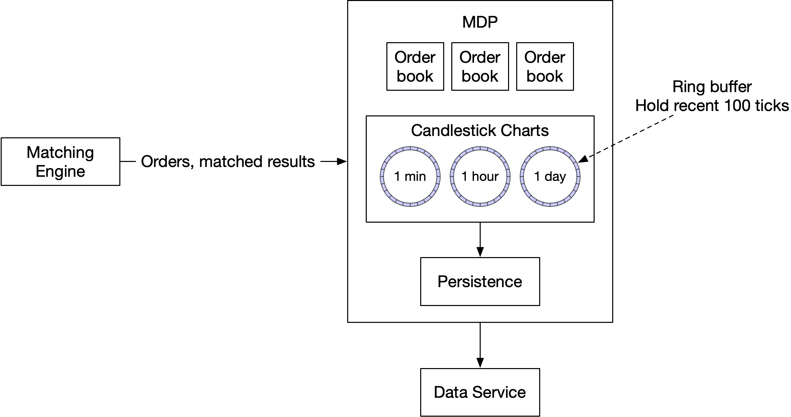

**Figure 24**

This design utilizes ring buffers. A ring buffer, also called a circular buffer, is a fixed-size queue with the head connected to the tail. A producer continuously produces data and one or more consumers pull data off it. The space in a ring buffer is pre-allocated. There is no object creation or deallocation necessary. The data structure is also lock-free. There are other techniques to make the data structure even more efficient. For example, padding ensures that the ring buffer's sequence number is never in a cache line with anything else. Refer to [28] for more detail.

#### Distribution fairness of market data

In stock trading, having lower latency than others is like having an oracle that can see the future. For a regulated exchange, it is important to guarantee that all the receivers of market data get that data at the same time. Why is this important? For example, the MDP holds a list of data subscribers, and the order of the subscribers is decided by the order in which they connect to the publisher, with the first one always receiving data first. Guess what happens, then? Smart clients will fight to be the first on the list when the market opens.

There are some ways to mitigate this. Multicast using reliable UDP is a good solution to broadcast updates to many participants at once. The MDP could also assign a random order when the subscriber connects to it. We look at multicast in more detail.

#### Multicast

Data can be transported over the internet by three different types of protocols. Let's take a quick look.

- **Unicast:** from one source to one destination.

- **Broadcast:** from one source to an entire subnetwork.

- **Multicast:** from one source to a set of hosts that can be on different subnetworks.

Multicast is a commonly-used protocol in exchange design. By configuring several receivers in the same multicast group, they will in theory receive data at the same time. However, UDP is an unreliable protocol and the datagram might not reach all the receivers. There are solutions to handle retransmission [29].

#### Colocation

While we are on the subject of fairness, it is a fact that a lot of exchanges offer colocation services, which put hedge funds or brokers' servers in the same data center as the exchange. The latency in placing an order to the matching engine is essentially proportional to the length of the cable. Colocation does not break the notion of fairness. It can be considered as a paid-for VIP service.

### Network security

An exchange usually provides some public interfaces and a DDoS attack is a real challenge. Here are a few techniques to combat DDoS:

- Isolate public services and data from private services, so DDoS attacks don't impact the most important clients. In case the same data is served, we can have multiple read-only copies to isolate problems.

- Use a caching layer to store data that is infrequently updated. With good caching, most queries won't hit databases.

- Harden URLs against DDoS attacks. For example, with an URL like https://my.website.com/data?from=123&to=456, an attacker can easily generate many different requests by changing the query string. Instead, URLs like this work better: https://my.website.com/data/recent. It can also be cached at the CDN layer.

- An effective safelist/blocklist mechanism is needed. Many network gateway products provide this type of functionality.

- Rate limiting is frequently used to defend against DDoS attacks.

## Wrap Up

After reading this chapter, you may come to the conclusion that an ideal deployment model for a big exchange is to put everything on a single gigantic server or even one single process. Indeed, this is exactly how some exchanges are designed!

With the recent development of the cryptocurrency industry, many crypto exchanges use cloud infrastructure to deploy their services [30]. Some decentralized finance projects are based on the notion of AMM (Automatic Market Making) and don't even need an order book.

The convenience provided by the cloud ecosystem changes some of the designs and lowers the threshold for entering the industry. This will surely inject innovative energy into the financial world.

Congratulations on getting this far! Now give yourself a pat on the back. Good job!

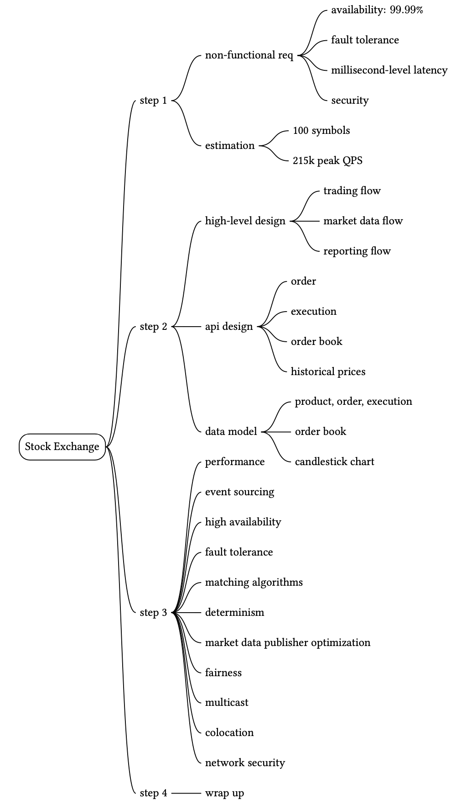

## Reference materials

[1] LMAX exchange was famous for its open-source Disruptor: https://www.lmax.com/exchange

[2] IEX attracts investors by "playing fair", also is the "Flash Boys Exchange": https://en.wikipedia.org/wiki/IEX

[3] NYSE matched volume: https://www.nyse.com/markets/us-equity-volumes

[4] HKEX daily trading volume: https://www.hkex.com.hk/Market-Data/Statistics/Consolidated-Reports/Securities-Statistics-Archive/Trading_Value_Volume_And_Number_Of_Deals?sc_lang=en#select1=0

[5] All of the World's Stock Exchanges by Size: http://money.visualcapitalist.com/all-of-the-worlds-stock-exchanges-by-size/

[6] Denial of service attack: https://en.wikipedia.org/wiki/Denial-of-service_attack

[7] Market impact: https://en.wikipedia.org/wiki/Market_impact

[8] Fix trading: https://www.fixtrading.org/

[9] Event Sourcing: https://martinfowler.com/eaaDev/EventSourcing.html

[10] CME Co-Location and Data Center Services: https://www.cmegroup.com/trading/colocation/co-location-services.html

[11] Epoch: https://www.epoch101.com/

[12] Order book: https://www.investopedia.com/terms/o/order-book.asp

[13] Order book: https://en.wikipedia.org/wiki/Order_book

[14] How to Build a Fast Limit Order Book: https://bit.ly/3ngMtEO

[15] Developing with kdb+ and the q language: https://code.kx.com/q/

[16] Latency Numbers Every Programmer Should Know: https://gist.github.com/jboner/2841832

[17] mmap: https://en.wikipedia.org/wiki/Memory_map

[18] Context switch: https://bit.ly/3pva7A6

[19] Reliable User Datagram Protocol: https://en.wikipedia.org/wiki/Reliable_User_Datagram_Protocol

[20] Aeron: https://github.com/real-logic/aeron/wiki/Design-Overview

[21] Chaos engineering: https://en.wikipedia.org/wiki/Chaos_engineering

[22] Raft: https://raft.github.io/

[23] Designing for Understandability: the Raft Consensus Algorithm: https://raft.github.io/slides/uiuc2016.pdf

[24] Supported Matching Algorithms: https://bit.ly/3aYoCEo

[25] Dark pool: https://www.investopedia.com/terms/d/dark-pool.asp

[26] HdrHistogram: A High Dynamic Range Histogram: http://hdrhistogram.org/

[27] HotSpot (virtual machine): https://en.wikipedia.org/wiki/HotSpot_(virtual_machine)

[28] Cache line padding: https://bit.ly/3lZTFWz

[29] NACK-Oriented Reliable Multicast: https://en.wikipedia.org/wiki/NACK-Oriented_Reliable_Multicast

[30] AWS Coinbase Case Study: https://aws.amazon.com/solutions/case-studies/coinbase/

